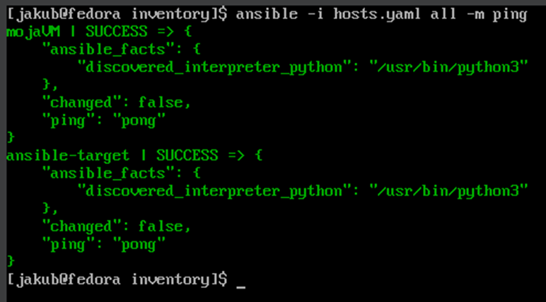
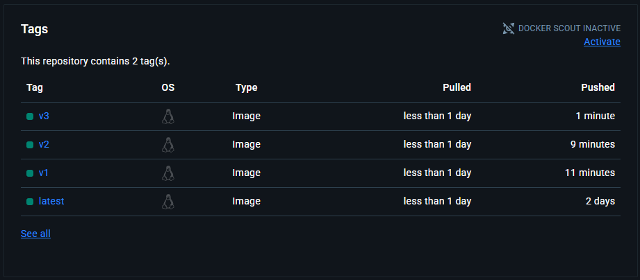
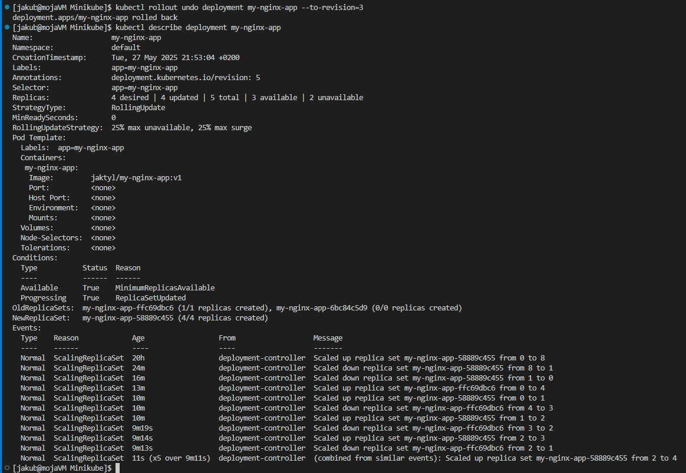

Jakub Tyliński, Grupa 8, 416081

**Pliki odpowiedzi dla wdrożeń nienadzorowanych**

Zajęcia rozpoczołem od skopiowania z swojej głównej VM pliku odpowiedzi w ścieżce /root/anaconda-ks.cfg

Plik anaconda-ks.cfg to tzw. plik odpowiedzi (kickstart) generowany automatycznie przez instalator Anaconda, używany w systemach m.in takich jak Fedora czy Rocky Linux.
Plik ten stanowi zapis wszystkich kroków i ustawień, które zostały użyte podczas ręcznej instalacji systemu.

Plik anaconda-ks.cfg:

```
# Generated by Anaconda 41.35
# Generated by pykickstart v3.58
#version=DEVEL

# Keyboard layouts
keyboard --vckeymap=us --xlayouts='us'
# System language
lang en_US.UTF-8

%packages
@^custom-environment

%end

# Run the Setup Agent on first boot
firstboot --enable

# Generated using Blivet version 3.11.0
ignoredisk --only-use=sda
autopart
# Partition clearing information
clearpart --none --initlabel

# System timezone
timezone Europe/Warsaw --utc

#Root password
rootpw --lock
user --groups=wheel --name=jakub --password=$y$j9T$I6s3wKK62BwkaIO0o2RjfMBN$hR7PFNmvVQP1Bj6/N2vww6JWXedsg1sodywI81u89p. --iscrypted --gecos="Jakub"
```

Plik został skopiowany na hosta, a następnie wystawiony w łatwy sposób na porcie 8080:


W trakcie instalacji trzeba było nacisnąć klawisz e, aby wejść do menu GRUB, następnie dodać opcję "inst.ks=" z linkiem do pliku na wystawionym porcie. Plik ten został pobrany i posłużył do wykonania instalacji w trybie nienadzorowanym.


Początek prawidłowej instalacji:


Następnym krokiem było zmodyfikowanie pierwotnego pliku o doinstalowanie Dockera oraz narzędzi takich jak curl i wget. Dodatkowo włącza usługę Dockera na starcie (systemctl enable docker), tworzy usługę systemd, która uruchamia Twój kontener jaktyl/cjson-deploy oraz ustawia ją jako automatycznie uruchamianą po starcie systemu. 

Tak zmodyfikowany plik anaconda-ks.cfg tym razem przesłałem na swoje repozytorium na Githubie. Klikająć na opcję RAW pliku, skopiowałem link, a nastęonie w menu GRUB ustawiłem link do opcji "inst.ks" 


Dalsza instalacja przebiegała w sposób standardowy do poprzedniej:


Zmodyfikowany plik anaconda-ks.cfg:

```
# Generated by Anaconda 41.35
#version=DEVEL

keyboard --vckeymap=us --xlayouts='us'
lang en_US.UTF-8
timezone Europe/Warsaw --utc
rootpw --lock
user --groups=wheel --name=jakub --password=$y$j9T$I6s3wKK62BwkaIO0o2RjfMBN$hR7PFNmvVQP1Bj6/N2vww6JWXedsg1sodywI81u89p. --iscrypted --gecos="Jakub"

ignoredisk --only-use=sda
autopart
clearpart --none --initlabel

firstboot --enable

%packages
@^custom-environment
wget
curl
docker
%end

%post --log=/root/post-install.log

systemctl enable docker

cat > /etc/systemd/system/cjson-deploy.service <<EOF
[Unit]
Description=Run cjson-deploy container
After=network.target docker.service
Requires=docker.service

[Service]
Restart=always
ExecStart=/usr/bin/docker run --rm jaktyl/cjson-deploy
ExecStop=/usr/bin/docker stop cjson-deploy

[Install]
WantedBy=multi-user.target
EOF

systemctl enable cjson-deploy.service

%end
```

**Automatyzacja i zdalne wykonywanie poleceń za pomocą Ansible**

Zajęcia poświecone narzędziu jakim jest Ansible rozpoczołem od przygotowania drugiej VM na tym samym obrazie co moja maszyna główna. Aby obie VM-ki się widziały dodałem kartę sieciową - sieć NAT z utworzoną wcześniej siecią NAT z zakresem IP 10.2.0.X/24. W celu uniknięcią problemów na na nowej VM-ce zmieniłem przypisany adres automatycznie adres IP. W przeciwnym wypadku dwie VM-ki w tej samej sieci miały by dokładnie ten sam adres - 10.2.0.15!


Dalej zainstalowałem na nowej VM oprogramowanie tar oraz serwer OpenSSH:


Następnie na maszynie głównej (mojaVM) dodałem dedykowanego użytkownika ansible. Nadałem mu od razu prawa sudo, co będzie przydatne przy uruchamianiu playbooków:


Dalej zrobiłem migawkę utworzonej maszyny:


Na maszynie głównej zainstalowałem oprogramowanie Ansible:


Dalej wygenerowałem na maszynie głównej parę kluczy i przekazałem na maszynę ansible-taregt klucz publiczny w celu łączenia się po ssh bez konieczności podawania hasła


Ustawieniłem nazwy komputerów z wykorzystaniem hostnamectl:


W pliku etc/hosts dodałem adresy IP z nazwą DNS co umożliwiło łączenie się po nazwie


Dalej stworzyłem plik inventory, w którym zdefiniowałem hosty, na których Ansible będzie reazlizował zdefiniowane później taski. W pliku inventory znalazły się dwie sekcje:
Orchestrators - gdzie umieszczamy hosty z których puszczamy ansiblowe playbooki, a więc w sekcji tej umieściłem moją główną maszynę - mojaVM
Endpoints - tutaj zwyczajowo ląduje reszta hostów, a wiec w sekcji tej umieściłem ansible-target

```
---
Orchestrators:
  hosts:
    mojaVM:
      ansible_connection: local

Endpoints:
  hosts:
    ansible-target:
      ansible_hosts: 10.0.2.4
      ansible_user: ansible
```

Definicja ansible-connection: local pozwoliła w łatwy wsposób wskazać, że dany playbook ma zostać wykonany dokładnie na tej maszynie, na której został uruchomiony

W dalszej części wysłałem ping do wszystkich maszyn w sposób inline:



**Playbooki**

1. Playbook wysyłający żądanie ping do wszystkich maszyn

```
---
- name: Endpoint management
  hosts: Endpoints, Orchestrators
  become: true
  tasks:
    - name: Ping request
      ping:
```


2. Playbook kopiujacy plik inventory na maszynę ansible-target

```
---
- name: Endpoint management
  hosts: Endpoints
  become: true
  tasks:
    - name: Coping inventory file
      copy:
        src: /home/jakub/MDO2025_INO/ITE/GCL08/JT416081/Sprawozdanie_3/Ansible/inventory/hosts.yaml
        dest: /tmp/hosts.yaml
        owner: ansible
        group: ansible
        mode: "0644"
```


Jak widać przy drugim puszczeniu tego samego playbook task "Coping inventory file" zostaje pominięty ze wzgledu na fakt, że plik ten został już skopiowany do danej lokalizacji podczas pierwszego uruchomienia

3. Playbook aktualizujący pakiety

```
---
- name: Endpoint management
  hosts: Endpoints
  become: true
  tasks:
    - name: Package update
      dnf:
        name: "*"
        state: latest
        update_only: yes
```


4. Playbook restartujący usługi sshd oraz rngd

```
---
- name: Endpoint management
  hosts: Endpoints
  become: true
  tasks:
    - name: Restart ssh
      service:
        name: sshd
        state: restarted
     
    - name: Restart RNG
      service:
        name: rngd
        state: restarted
```


Próba uruchomienia tego samego playbooka, ale podczas wyłączenia na ansible-target serwera SSH. 


Próba oczywiście zakończona niepowedzeniem, ze wzgledu na fakt, iż Ansible łączy się z hostami właśnie z ssh

**Playbook z artefkatem**

Pracę rozpoczołem od wygenerowania struktury roli za pomocą ansible-galaxy:


Przygotowany plik roles/deploy-cjson/tasks/main.yaml:

```
---
# tasks file for deploy-cjson
- name: "Add Docker CE repository"
  get_url:
    url: https://download.docker.com/linux/fedora/docker-ce.repo
    dest: /etc/yum.repos.d/docker-ce.repo 

- name: "Install Docker (Docker CE)"
  dnf:
    name: docker-ce
    state: present

- name: "Start and enable Docker service"
  service:
    name: docker
    state: started
    enabled: true

- name: "Install Python3 pip and libraries required by Ansible docker modules"
  dnf:
    name:
      - python3-pip
    state: present

- name: "Install required Python modules"
  pip:
    name:
      - packaging
      - docker
      - requests

- name: "Pull application container image (custom image from Docker Hub)"
  docker_image:
    name: "{{ dockerhub_image }}"
    source: pull

- name: "Run your application container"
  docker_container:
    name: "{{ container_name }}"
    image: "{{ dockerhub_image }}"
    state: started

- name: "Check if container is running"
  command: docker ps -a
  register: container_list

- name: "Display running containers"
  debug:
    var: container_list.stdout_lines

- name: "Stop and remove the aplication cointainer"
  docker_container:
    name: "{{ container_name }}"
    state: absent
```

Krótki opis poszczególnych tasków:

1. "Add Docker CE repository"
Dodaje repozytorium Dockera CE do systemu (dla Fedory), aby umożliwić instalację najnowszej wersji Dockera z oficjalnego źródła.

2. "Install Docker (Docker CE)"
Instaluje pakiet docker-ce za pomocą menedżera pakietów DNF.

3. "Start and enable Docker service"
Zapewnia, że usługa Docker jest uruchomiona i będzie uruchamiana automatycznie przy starcie systemu.

4. "Install Python3 pip and libraries required by Ansible docker modules"
Instaluje python3-pip, który jest potrzebny do instalacji bibliotek Python wymaganych przez moduły Dockera w Ansible (docker, requests, itd.).

5. "Install required Python modules"
Instaluje biblioteki Python (docker, requests, opcjonalnie packaging) za pomocą pip. Te biblioteki są niezbędne do dalszych operacji na kontenerach z poziomu Ansible.

6. "Pull application container image"
Pobiera wskazany obraz kontenera z Docker Hub, zdefiniowany w zmiennej {{ dockerhub_image }}.

7. "Run your application container"
Tworzy i uruchamia kontener na podstawie pobranego obrazu. Nazwa kontenera i obraz są zdefiniowane przez zmienne ({{ container_name }} i {{ dockerhub_image }}).

8. "Check if container is running"
Wykonuje polecenie docker ps, aby sprawdzić listę uruchomionych kontenerów. Wynik zapisywany jest do zmiennej container_list.

9. "Display running containers"
Wypisuje na ekranie zawartość zmiennej container_list.stdout_lines, czyli listę działających kontenerów.

Plik roles/deploy-cjson/vars/main.yaml:

```
---
# vars file for deploy-cjson
dockerhub_image: jaktyl/cjson-deploy
container_name: cjson_app
```

Przygotowany playbook deploy-cjson.yaml:

```
---
- name: Deploy cjson 
  hosts: Endpoints
  become: true
  roles:
    - deploy-cjson
```

Sposób uruchamiania playbooka (z poziomu folderu Ansible):

```
ansible-playbook -i inventory/hosts.yaml deploy-cjson.yaml

i -> wskazanie pliku inventory
```

Wynik działania playbooka:


**Wdrażanie na zarządzalne kontenery: Kubernetes (1)**

Instalacja klastra Kubernetes:

1. Proces instalacji zgodnie z oficjalną dokumentacją minikube rozpoczołem od pobrania najnowszej wersji pliku binarnego za pomocą:

```
curl -LO https://github.com/kubernetes/minikube/releases/latest/download/minikube-linux-amd64
```

2. W dalszej części wykonałem komendę: 

```
sudo install minikube-linux-amd64 /usr/local/bin/minikube && rm minikube-linux-amd64
```

Komenda ta instaluje minikube jako globalną komendę minikube oraz czyści plik tymczasowy

3. Następnie za pomocą komendy "minikube start" uruchamiłem lokalny klaster Kubernetes:


4. Dalej ustawiłem alias powłoki, który sprawia, że od teraz za każdym razem gdy tylko wykonam komendę "kubectl..."  faktycznie zostanie wykonana komenda "minikube kubectl..."


5. Na samym końcu uruchomiłem dashboard i przetestowałem łączność:


Analiza posiadanego kontenera:

W tej części nieużyłem wcześniej przygotowanego obrazu "cjson-deploy" ze względu fakt, że biblioteka ta służy do parsowania JSON-a, a nie jest to aplikacja webowa – sama w sobie nie dostarcza interfejsu HTTP, więc nie będzie bezpośrednio nadawała się jako serwis do uruchomienia w Kubernetesie

Zdecydowałem się z skorzystać z obrazu NGINXa z zmodyfikowaną zawartością pliku HTML. W celu stworzenia obrazu z nową konfiguracją przygotowałem własny plik:

Dockerfile:

```
FROM nginx:alpine
COPY index.html /usr/share/nginx/html/index.html
```

index.html:

```
<!DOCTYPE html>
<html lang="en">
<head>
    <meta charset="UTF-8">
    <title>Jakubowy NGINX</title>
</head>
<body>
    <h1>Hello from Jakubowy NGINX! </h1>
</body>
</html>
```

Budowanie własnego obrazu:


Lokalne przetestowanie, czy kontener działa prawidłowo:


Deploy aplikacji do Minikube:

Uruchomienie poda z przygotowanym obrazem za pomocą polecenia:

```
kubectl run my-nginx-app-pod --image=jaktyl/my-nginx-app:latest --port=80 --labels app=my-nginx-app-pod

kubectl run – tworzy pojedynczy pod (nie deployment)

my-nginx-app-pod – nazwa poda

--image=jaktyl/my-nginx-app:latest – obraz Dockera, który ma zostać uruchomiony

--port=80 – informacyjnie deklaruje port (nie tworzy serwisu)

--labels app=my-nginx-app-pod – przypisuje etykietę do poda (można ją potem wykorzystać do selektorów w serwisach)
```


Dalej przygotowany pod zostaw wystawiony na porcie 8080 za pomocą komendy:

```
kubectl port-forward pod/my-nginx-app-pod 8080:80

kubectl port-forward – przekierowuje port z lokalnego komputera do portu w podzie 

pod/my-nginx-app-pod – wskazuje konkretny pod

8080:80 – oznacza, że port 8080 na lokalnej maszynie jest kierowany  do portu 80 w podzie
```


Pod z aplikacją wystawiony prawidłowo na zewnątrz:


Przekucie wdrożenia manualnego w plik wdrożenia:

Na sam początek stworzyłem deployment na bazie wcześniejszego poda:


Skopiowanie zawartości deploymentu do pliku .yaml oraz usunięcie go:


Przygotowany plik deployment.yaml:
```
apiVersion: apps/v1
kind: Deployment
metadata:
  name: my-nginx-app
  labels:
    app: my-nginx-app
spec:
  replicas: 4
  revisionHistoryLimit: 10
  selector:
    matchLabels:
      app: my-nginx-app
  strategy:
    type: RollingUpdate
    rollingUpdate:
      maxSurge: 25%
      maxUnavailable: 25%
  template:
    metadata:
      labels:
        app: my-nginx-app
    spec:
      containers:
      - name: my-nginx-app
        image: jaktyl/my-nginx-app:v3
        imagePullPolicy: Always
        resources: {}
        terminationMessagePath: /dev/termination-log
        terminationMessagePolicy: File
      dnsPolicy: ClusterFirst
      restartPolicy: Always
      schedulerName: default-scheduler
      securityContext: {}
      terminationGracePeriodSeconds: 30
```

Utworzenie nowego wdrożenia na bazie definkcji w pliku deployment.yaml za pomocą komendy:

```
kubectl apply -f deployment.yaml
```


Sprawdzenie statusu wdrożenia:


Sprawdzenie, czy posiadam cztery działające repliki po ręcznej modyfikacji pliku deployment.yaml:


Dalej został stworzony plik service.yaml, który zawierał definicję serwisu, czyli usługi w Kubernetes, która odpowiada za udostępnianie dostępu do podów

Plik service.yaml:

```
apiVersion: v1
kind: Service
metadata:
  name: my-nginx-app-service
spec:
  type: NodePort
  selector:
    app: my-nginx-app
  ports:
  - port: 80
    targetPort: 80
```

Utworzenie serwisu za pomocą komendy:

```
kubectl apply -f service.yaml
```


Wystawiona aplikacja:


Screen z minikube dashboard:


**Wdrażanie na zarządzalne kontenery: Kubernetes (2)**

Na potrzebny tych zajęć przygotowałem dwa nowe obrazy z własną konfiguracją NGINXa. W tym celu jak poprzednio wykorzystałem dedykowane pliki Dockerfile wraz z własnym plikiem index.html

Nowa wersja (v2): 

Dockerfile:

```
FROM nginx:alpine
COPY index.html /usr/share/nginx/html/index.html
```

index.html:

```
<!DOCTYPE html>
<html lang="en">
<head>
    <meta charset="UTF-8">
    <title>Jakubowy NGINX wersja 2</title>
</head>
<body>
    <h1>Hello from Jakubowy NGINX w wersji 2</h1>
</body>
</html>
```

Wadliwa wersja (v3): 

Dockerfile:

```
FROM nginx:alpine
CMD ["sh", "-c", "exit 1"]
```

index.html:

```
<!DOCTYPE html>
<html lang="en">
<head>
    <meta charset="UTF-8">
    <title>Jakubowy NGINX wersja 3</title>
</head>
<body>
    <h1>Hello from Jakubowy NGINX w wersji 3</h1>
</body>
</html>
```

Zbudowanie obrazu v2:


Wysłanie na DockerHub nowy oraz stary obraz:


Zbudowanie trzeciej (wadliwej) wersji mojego obrazu:


Wypnięcie na DockerHub:


Wszystkie wersje razem:



Uruchomienie deploymentu z pierwszą wersją obrazu oraz 3 replikami:


Aktualizacja pliku yaml i zwiększenie liczby replik do 8:


Aktualizacja pliku yaml i zmiejszenie liczby replik do 1:


Aktualizacja pliku yaml i zmiejszenie liczby replik do 0:


Utworzenenie kolojnego deploymentu z nowym obrazem (wersja v2):


Deployment z starym obrazem (wersja v1):


Deployment z wadliwą wersją obrazu (v3): 


Wyświetlenie histori zmian deploymentu oraz uzyskanie szczegółów o danej rewizji:


Przykładowe cofnięcie się do jednej z rewizji za pomocą poelecenia "kubectl rollout undo":



Warto zwrócić uwagę w tym miejscu, że historia zmian replik nie zostaje zapisywana w historii rolloutów. Polecenie "kubectl rollout history" pokazuje tylko zmiany szablonu podów (spec.template) – czyli na przykład: image, env, ports, labels itd...

Przygotowany skrypt verify_deployment.sh weryfikujący czy dany deployment został wdrożony w czasie mniejszym bądź równym 60 sekundom:

```
#!/bin/bash

DEPLOYMENT_NAME=$1
TIMEOUT=60

kubectl rollout status deployment "$DEPLOYMENT_NAME" --timeout=${TIMEOUT}s

if [ $? -eq 0 ]; then
  echo "Deployment $DEPLOYMENT_NAME finished within $TIMEOUT seconds"
  exit 0
else
  echo "Deployment $DEPLOYMENT_NAME not finished within $TIMEOUT seconds"
  exit 1
fi
```

Sprawdzenie deploymentu z wersją obrazu v1:


Sprawdzenie deploymentu z wersją obrazu v2:


Strategie wdrożeń:

W tej części zajęć przygotowałem sobie 3 osobne pliki deployment.yaml definiujące wdrożenia z strategiami: Recreate, Rolling Update, Canary Deployment workload

Stworzone nowe deploymenty:


Wnioski:
- Recreate usuwa wszystkie stare pody zanim stworzy nowe, co powoduje chwilowy brak dostępności.
- Rolling Update stopniowo podmienia pody, utrzymując dostępność aplikacji przez cały czas. 
- Canary Deployment pozwala uruchomić nową wersję obok starej (np. tylko 1 pod z nowym obrazem), dzięki czemu można ją bezpiecznie przetestować przed pełnym wdrożeniem.