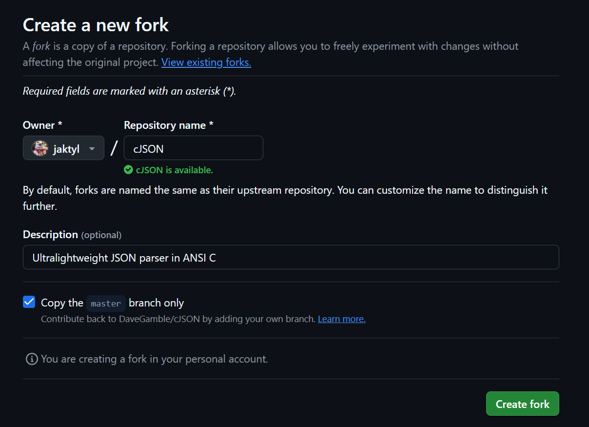
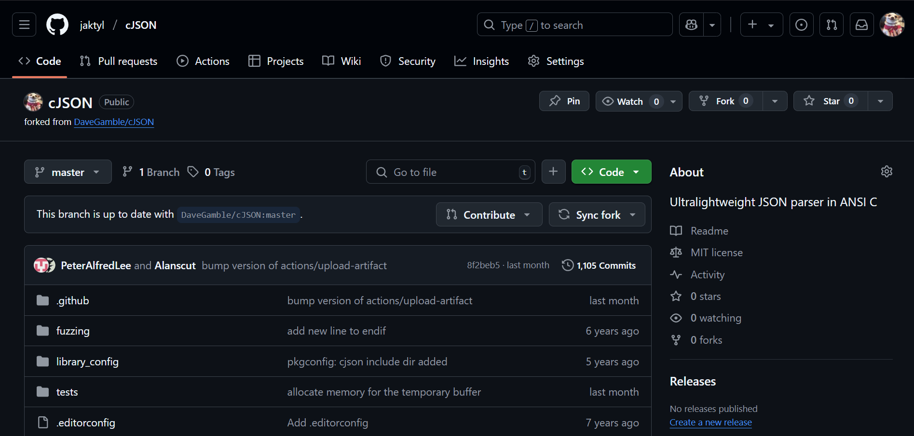
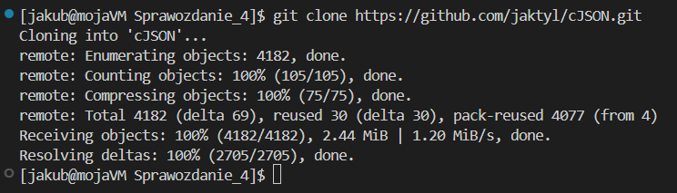
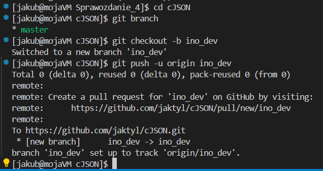
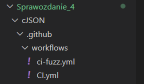
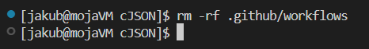
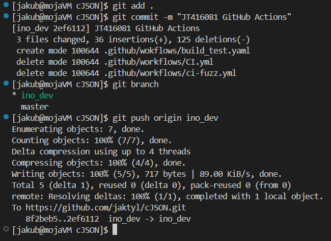
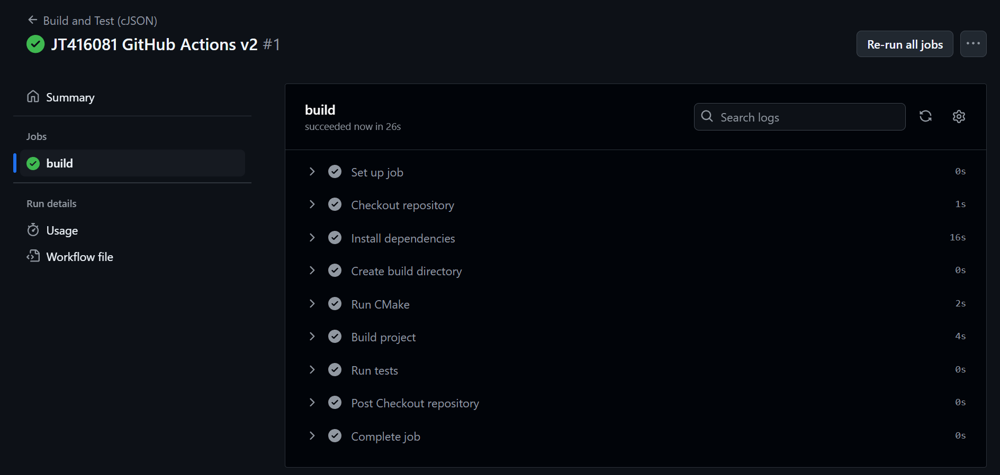
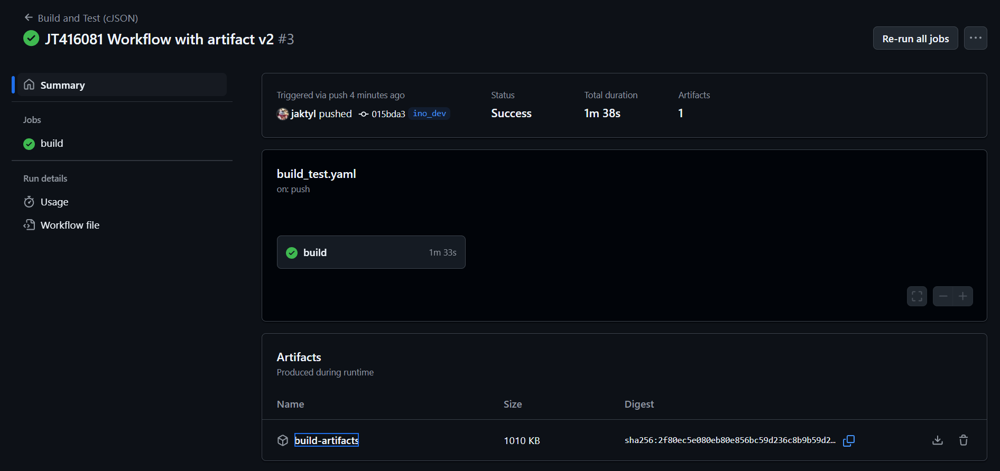
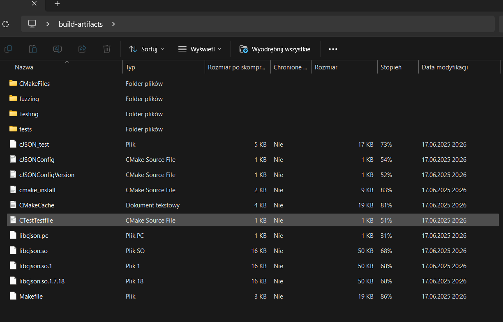

Jakub Tyliński, Grupa 8, 416081

**GitHub Actions**

GitHub Actions to narzędzie wbudowane w platformę GitHub, służące do automatyzacji procesów związanych z projektem. Umożliwia tworzenie tzw. workflowów, czyli zautomatyzowanych sekwencji zadań, które mogą uruchamiać się m.in. po dokonaniu zmian w kodzie cyklicznie lub ręcznie.

Typowe zastosowania GitHub Actions obejmują: budowanie oprogramowania, uruchamianie testów, analizę jakości kodu oraz wdrażanie aplikacji (CI/CD). Workflow definiowany jest w pliku YAML, umieszczonym w katalogu .github/workflows/.

Ważnym elementem GitHub Actions są Triggery. Trigger to mechanizm, który określa kiedy workflow ma się automatycznie uruchomić. Dzięki triggerom możliwe jest powiązanie wykonywania akcji z konkretnymi zdarzeniami w repozytorium, np. zmianą kodu, otwarciem pull requesta czy zaplanowanym czasem.

Przykłady triggerów:

- push - uruchamia workflow po wykonaniu git push, czyli po wypchnięciu zmian do repozytorium
- pull_request - akcja uruchamia się, gdy ktoś utworzy lub zaktualizuje pull request

1. Swoją pracę rozpoczołem od zrobienia forka repozytorium cJSON. Z repozytorium tego korzystałem również podczas zajęć poswięconych Jenkinsowi.

Fork (rozgałęzienie) to kopia istniejącego repozytorium GitHub, którą tworzy się na swoim własnym koncie. Dzięki temu można swobodnie pracować nad kodem innego projektu bez wpływu na oryginalne repozytorium





2. Dalszym etapem było skolonowanie rezpozytorium:



3. Kolejnym etapem było stworzenie nowego brancha "ino_dev" i wypchnięcie go:



4. W repozytorium cJSON znajdowały się dwa przygotowane workflowy:



5. Usunięcie znalezionych workflow'ów (niestety nie potrzebnie razem z folderem "workflows" ):



6. Stworzenie własnego workflow:

```
name: Build and Test (cJSON)

on:
  push:
    branches:
      - ino_dev
  pull_request:
    branches:
      - ino_dev
  workflow_dispatch:

jobs:
  build:
    runs-on: ubuntu-latest

    steps:
      - name: Checkout repository
        uses: actions/checkout@v4

      - name: Install dependencies
        run: sudo apt-get update && sudo apt-get install -y cmake make gcc

      - name: Create build directory
        run: mkdir build

      - name: Run CMake
        working-directory: ./build
        run: cmake ..

      - name: Build project
        working-directory: ./build
        run: make

      - name: Run tests
        working-directory: ./build
        run: ctest --output-on-failure
```

Workflow ten automatyzuje budowanie i testowanie biblioteki cJSON. Zostaje uruchomiony w trzech przypadkach:

- po wypchnięciu zmian na brancha ino_dev
- po utworzeniu pull requesta na ino_dev
- przy ręcznym uruchomieniu 

Sekcja jobs definiuje następujące zadania do wykonania:

- pobieranie kodu źródłowego z repozytorium
- instalacja wymaganych narzędzi: cmake, make, gcc
- stworzenie katalogu "build", w którym będą wykonywane kolejne operacje
- konfiguracja projeku przy użyciu CMake
- kompilacja projektu poleceniem make 
- uruchomienie testów jednostkowych z wykorzystaniem ctest

7. Wykonanie commita na brancha ino_dev:



8. Workflow Build and Test (cJSON) wykonał się w całości z sukcesem, co oznacza, że wszystkie kroki (steps) zostały wykonane poprawnie, natomiast testy jednostkowe nie wykryły błędów:



(Inna nazwa commmita ze względu na literówke w nazwie folder workflows)

9. W dalszej części do mojego workflow'u dodałem funkcjonalność zapisywania tzw. artefaktów. 

Artefakt to dowolny plik lub zestaw plików, które są generowane podczas wykonywania workflowa i które GitHub zachowuje jako pliki do pobrania. W moim przypadku po zakończeniu budowania i testowania, artefakt zawiera wszystkie pliki wygenerowane m.in.: cJSON_test libcjson.so, Makefile, CTestTestfile.cmake itd.

Przygotowany workflow:

```
name: Build and Test (cJSON)

on:
  push:
    branches:
      - ino_dev
  pull_request:
    branches:
      - ino_dev
  workflow_dispatch:

jobs:
  build:
    runs-on: ubuntu-latest

    steps:
      - name: Checkout repository
        uses: actions/checkout@v4

      - name: Install dependencies
        run: sudo apt-get update && sudo apt-get install -y cmake make gcc

      - name: Create build directory
        run: mkdir build

      - name: Run CMake
        working-directory: ./build
        run: cmake ..

      - name: Build project
        working-directory: ./build
        run: make

      - name: Run tests
        working-directory: ./build
        run: ctest --output-on-failure

      - name: Show build output
        run: ls -R build

      - name: Upload all build output
        uses: actions/upload-artifact@v4
        with:
          name: build-artifacts
          path: build/**
```

Workflow zakończony sukcesem:



10. Wygenerowany artefakt:



Wnioski:

- GitHub Actions umożliwia szybkie i intuicyjne tworzenie zautomatyzowanych workflowów CI/CD bez konieczności dodatkowej konfiguracji serwera
- Integracja z GitHubem oraz obsługa triggerów pozwala na natychmiastowe reagowanie na zmiany w repozytorium, co usprawnia proces testowania i budowania projektu
- Dodanie artefaktów oraz uruchamianie testów w ramach workflowa potwierdziło poprawność działania projektu i stanowi dobrą podstawę do dalszego rozwoju automatyzacji