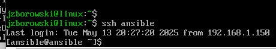

# Ansible

## Start

Przygotowanie drugiej VM z systemem Fedora41 (jest to ten sam obraz co moja pierwsza VM). 


Następnie stworzyłem sieć NAT aby obie VM-ki się widziały.


Następnie na nowej  VM-ce zainstalowałem tar oraz openssh-server


Potem na maszynie głównej dodałem użytkownika ansible z prawami SUDO co będzie przydatne później w trakcie uruchamia playbooka.


Dalej utworzyłem migawkę


Na maszynie głównej zainstalowałem Ansible


Później wygenerowałem parę kluczy rsa i przekazałem je drugiej maszynie ansible po to by móc się łączyć przez ssh bez konieczności podawania hasła


Dalej ustawiłem nazwy VM-ek używając komendy hostnamectl


Dalszym krokiem aby móc łączyć się po samej nazwie było doadnie IP VM-ki do pliku etc/hosts


Skopiowałem wcześniej utworzone klucze do Ansible


Dzięki tym krokom mogłem dostać się przez ssh do vmki drugiej ansible :) 



Następnie utworzyłem plik hosts, w którym określiłem hosty, na jakich Ansible będzie wykonywał zadania. Plik ten zawiera dwie główne sekcje: Orchestrators, do której przypisałem główną maszynę – main, z której uruchamiane będą playbooki Ansible, oraz Endpoints, gdzie znalazły się pozostałe hosty docelowe, w tym przypadku ansible.

```bash
all:
  children:
    orchestrators:
      hosts:
        localhost:
          ansible_connection: local

    endpoints:
      hosts:
        ansible:
          ansible_host: 10.2.0.5
          ansible_user: ansible
          ansible_python_interpreter: /usr/bin/python3
          ansible_become_pass: "************"
        
```

Dodałem tutaj 

```bash
          ansible_python_interpreter: /usr/bin/python3
           ansible_become_pass: "************"
```

Aby umożliwić maszynie ansible wykonywać polecenia z uprawnieniami administratora i aby wskazać na jakiej wersji pythona zdalna maszyna ma uruchamiać moduły (miałe bez tej linijki błędy lecz robie sprawozdanie po czasie i zapomniałem z czym były związane ...)

Potem uruchomiłem hosts.yaml


Następnie stworzyłem playbook, który:
-wysyła żadanie ping do wszystkich maszyn
-kopiuje plik hosts na maszynę docelową
-restartuje usługę sshd i rngd

```bash
---
- name: Zarządzanie maszyną końcową (endpoints)
  hosts: endpoints
  become: true
  gather_facts: true
  tasks:
    - name: Sprawdzane połaczenia (ping)
      ansible.builtin.ping:

    - name: Kopiowanie pliku hosts na maszynę docelową
      ansible.builtin.copy:
        src: /home/jzborowski/lab1/MDO2025_INO/ITE/GCL08/JZ415998/Sprawko3original/ANSIBLE/hosts.yaml
        dest: /tmp/hosts.yaml
        owner: ansible
        group: ansible
        mode: '0644'

    -  name: Restart usługi sshd
       ansible.builtin.service:
         name: sshd
         state: restarted

    -  name: Restart usługi rngd
       ansible.builtin.service:
         name: rngd
         state: restarted
```
Efekt:


Nie mam screena z drugiega puszczenia ale wtedy kopiowanie było pominięte (plik został już skopiowany przy pierwszym uruchomieniu)

Następnie zatrzymałem sshd


I odpaliłem playbook jeszcze raz, co z oczywistych względów się nie powiodło - łączność z hostami odbywa się przez ssh a jego nie było.


Po wykonaniu kroków z playbookiem zabrałem się za playbook z artefaktem 

Zacząłem od jego utworzenia:


*Do stworzenia plików yaml użyłem AI*

Plik w tasks/main

```bash
---
# tasks file for cjson
- name: "Adding Docker repo"
  get_url:
    url: https://download.docker.com/linux/fedora/docker-ce.repo
    dest: /etc/yum.repos.d/docker-ce.repo

- name: "Installing Docker"
  dnf:
    name: docker-ce
    state: present

- name: "Startin Docker service"
  service:
    name: docker
    state: started
    enabled: true

- name: "Installing Python3 required by ansible docker modules"
  dnf:
    name:
      - python3-pip
    state: present

- name: "Installing Python modules"
  pip:
    name:
      - packing
      - docker
      - requests

- name: "Pulling app container image"
  docker_image:
    name: "{{ container_name }}"
    image: "{{ dockerhub_image }}"
    state: started

- name: "Checking if containar is running"
  command: docker ps -a
  register: container_list

- name: "Displaying containers"
  debug:
    var: container_list.stdout_lines

- name: "Stopping and removing app container"
  docker_container:
    name: "{{ container_name }}"
    state: absent

```

Plik w vars/main

```bash
---
# vars file for cjson
dockerhub_image: zboro02/cjson-deploy
container_name: cjson_app


```


Plik cjson-deploy

```bash
---
- name: Deploy cjson
  hosts: endpoints
  become: true
  roles:
    - cjson

```

Następnie uruchomiłem playbook <- wszystko przebiegło pomyślnie


# Pliki odpowiedzi dla wdrożeń nienadzorowanych

Ćwiczenie rozpocząłem od instalacji systemu Fedora 41 na nowej VM z pliku ISO Fedora_server_netinst-x86.

Po instalacji musiałem wyciągnąć plik anaconda znajdujacy się w /root/anaconda-ks.cfg

Zrobiłem to za pomocą SSH poprzez FileZilla.

Umieściłem go na repo na Github, z którego potem realizowałem nienadzorowane instalacje.

Jeszcze przed instalacją w ekranie wyboru systemu należało wcisnąć e żeby przejść do GRUBA.

Następnie w ścieżce po quiet należało podać ścieżkę do pliku raw anaconda na repo na Github

Dla mnie była ona taka:
inst.ks=https://raw.githubusercontent.com/InzynieriaOprogramowaniaAGH/MDO2025_INO/JZ415998v2/ITE/GCL08/JZ415998/Sprawko3original/anaconda-ks.cfg


Plik anaconda wyglądał wtedy tak:

```bash
#version=DEVEL
text
keyboard --xlayouts='pl'
lang pl_PL.UTF-8

network --bootproto=dhcp --device=link --activate
network --hostname=fedora-pipeline-vm  

url --mirrorlist=http://mirrors.fedoraproject.org/mirrorlist?repo=fedora-41&arch=x86_64 
repo --name=updates --mirrorlist=http://mirrors.fedoraproject.org/mirrorlist?repo=updates-released-f41&arch=x86_64 

rootpw --plaintext TwojeSuperSilneHasloRoota  

timezone Europe/Warsaw --isUtc

bootloader --location=mbr --boot-drive=sda 

clearpart --all --initlabel 

autopart --type=lvm

reboot 

%packages
@^minimal-environment 
@core
wget
curl
git
%end

%post --log=/root/ks-post.log
echo "Kickstart post-installation script started"

echo "Kickstart post-installation script finished"
%end
```

Przeprowadziłem instalację, wszystko przebiegło pomyślnie, system się zainstalował.


Potem rozszerzyłem plik o repozytoria i potrzebne programowanie do uruchomienia zbudowanego projektu - nginx

Nowa anaconda wygląda tak:

```bash
%packages
@^minimal-environment 
@core
wget
curl
git
dnf-plugins-core
%end

%post --log=/root/ks-post.log
echo "Kickstart post-installation script started"

echo "Installing Docker CE..."
dnf config-manager --add-repo https://download.docker.com/linux/fedora/docker-ce.repo
dnf install -y docker-ce docker-ce-cli containerd.io docker-buildx-plugin docker-compose-plugin

echo "Enabling Docker service..."
systemctl enable docker.service

echo "Creating Nginx Docker container startup service..."
cat << EOF > /etc/systemd/system/run-nginx-container.service
[Unit]
Description=Run Nginx Docker Container on First Boot
Wants=network-online.target docker.service
After=network-online.target docker.service

ConditionPathExists=!/opt/nginx-container-started.flag

[Service]
Type=oneshot
RemainAfterExit=yes

ExecStartPre=/bin/sh -c 'count=0; until docker info >/dev/null 2>&1; do if [ "$count" -ge 12 ]; then echo "Docker did not start after 60s"; exit 1; fi; echo "Waiting for Docker daemon..."; sleep 5; count=$((count+1)); done'

ExecStart=/usr/bin/docker pull nginx:latest

ExecStart=/usr/bin/docker run --name nginx-server -d -p 80:80 --restart unless-stopped nginx:latest

ExecStartPost=/usr/bin/touch /opt/nginx-container-started.flag

[Install]
WantedBy=multi-user.target
EOF

systemctl enable run-nginx-container.service

echo "Kickstart post-installation script finished"
%end

reboot
```
Zadbałem o automatyczne ponowne uruchomienie na końcu instalacji <- reboot


Krótki opis działania:

Ten skrypt Kickstart instaluje minimalny system operacyjny z podstawowymi narzędziami (wget, curl, git, dnf-plugins-core), a następnie w fazie post-instalacyjnej konfiguruje środowisko Docker. Dodaje repozytorium Dockera, instaluje Docker CE wraz z dodatkowymi komponentami, a następnie włącza usługę Dockera. Dodatkowo tworzy jednostkę systemd o nazwie run-nginx-container.service, która przy pierwszym uruchomieniu systemu czeka na dostępność demona Dockera, pobiera obraz nginx:latest i uruchamia kontener Nginx nasłuchujący na porcie 80 z polityką automatycznego restartu.

Ponowiłem instalację dla nowej anacondy, zalogowałem się.

Sprawdziłem, czy Docker działa

```bash
sudo systemctl status docker
```

Efekt -> active

Potem sprawdziłem stan usługi

```bash
sudo systemctl status run-nginx-container.service
```

Następnie sprawdziłem, czy kontener nginx działa komendą

```bash
sudo docker ps
```
I test końcowy, po wpisaniu adresu IP maszyny w przeglądarce otrzymujemy domyślną powitalną stronę Nginx - Welcome to Nginx


# Kubernetes - 1


Zacząłem od aktualizacji systemu

```bash
sudo dnf update -y
```

Zainstalowałem potrzebne narzędzia

``` bash
sudo dnf install -y curl git conntrack-tools
```

Instalacja Dockera pod Minikube. *Fedora domyślnie używa Podmana*

```bash
sudo dnf install -y moby-engine docker-compose 
sudo systemctl enable --now docker
sudo usermod -aG docker $USER
```

Pobrałem Minikube
```bash
curl -LO https://storage.googleapis.com/minikube/releases/latest/minikube-linux-amd64
```


Instalacja Minikube i usunięcie pliku

```bash
sudo install minikube-linux-amd64 /usr/local/bin/minikube
rm minikube-linux-amd64
```

Poziom bezpieczeństwa instalacji:

- Pobieram Minikube bezpośrednio z storage.googleapis.com, które jest oficjalnym repozytorium udostępnianym przez projekt Kubernetes. Jest to zaufane źródło.

- Dla pełnego bezpieczeństwa mógłbym pobrać sumę kontrolną SHA256 dla pliku i zweryfikować ją. (np. curl -LO https://storage.googleapis.com/minikube/releases/latest/minikube-linux-amd64.sha256 a następnie sha256sum -c minikube-linux-amd64.sha256). W praktyce dla szybkiej instalacji często się to pomija, ufając HTTPS i oficjalnemu źródłu.

- Komenda sudo install umieszcza plik wykonywalny w /usr/local/bin/, co jest standardową lokalizacją dla oprogramowania instalowanego przez użytkownika, dostępnego dla wszystkich użytkowników systemu. Sam Minikube, gdy jest uruchamiany, działa z uprawnieniami użytkownika, który go uruchamia, chyba że specyficzne operacje (jak konfiguracja sterownika VM) wymagają sudo.

Zaoptrzyłem się w polecenie kubectl

```bash

minikube kubectl --

```

Stworzyłem alias 


Uruchomiłem Kubernetes ze sterownikiem Docker

```bash
minikube start --driver=docker
```


Minikube status


Działający kontener / worker


Wykaz podstawowych podó działajacych w klastrze


Nie mitygowałem problemów wynikających z wymagań sprzętowych ponieważ takowych nie miałem

Minikube domyślnie stara się być oszczędny, ale ma pewne minimalne wymagania:
- CPU: Zalecane 2+, Minikube domyślnie przydzieli 2.
- Pamięć RAM: Zalecane 2GB+, Minikube domyślnie przydzieli ok. 2GB (może być więcej w zależności od wersji).
- Miejsce na dysku: Zalecane 20GB+ wolnego miejsca.

Uruchomienie dashboardu Kubernetesa


Dashboard w przeglądarce


Utworzyłem katalog dla projektu i pliku HTML

```bash
mkdir ~/my-k8s-app
cd ~/my-k8s-app
mkdir html
echo "<h1>Witaj w mojej aplikacji na Kubernetes</h1> <p>Działa w Minikube na Fedorze 41</p>" > html/index.html
```

Stworzyłem tam Dockerfile o treści:

```bash
FROM nginx:alpine
RUN rm -rf /usr/share/nginx/html/*
COPY ./html/ /usr/share/nginx/html/
EXPOSE 80
CMD ["nginx", "-g", "daemon off;"]
```

Zbudowałem obraz oczywiście będąc ciagle w katalogu

```bash
docker build -t my-custom-nginx:v1 .
```


Sprawdziłem, czy kontener działa lokalnie - poza Kubernetesem


Sprawdziłem, czy działa i jak wyświetla się w przeglądarce

```bash
curl localhost:8080
```


Sprawdzenie czy kontener działa czy może zakończył pracę


Załadowałem lokalny obraz Docker do Minikube

```bash
minikube image load my-custom-nginx:v1
```


Uruchomiłem kontener jako deployment

```bash
minikubectl run my-nginx-deployment --image=my-custom-nginx:v1 --port=80 --labels app=my-nginx-app
```

Pod działa via kubectl


Pod działa via dashboard


Przekierowałem port 

```bash
minikubectl port-forward pod/my-nginx-deployment-5bcf779c4c-abcde 8081:80
```

Przekierowanie działa:

```bash
curl localhost:8081
```


Wyeksportowałem deployment do pliku yaml

```bash
minikubectl get deployment my-nginx-deployment -o yaml > ~/my-k8s-app/my-nginx-deployment.yaml
```

Zawierał on wiele pól, które nie były potrzebne więc usunąłem je i stworzyłem plik:

```bash
apiVersion: apps/v1
kind: Deployment
metadata:
  labels:
    app: my-nginx-app 
  name: my-nginx-deployment
spec:
  replicas: 1 
  selector:
    matchLabels:
      app: my-nginx-app 
  template:
    metadata:
      labels:
        app: my-nginx-app 
    spec:
      containers:
      - image: my-custom-nginx:v1
        name: my-custom-nginx-container 
        ports:
        - containerPort: 80

```


Wdrożyłem aplikację za pomocą kubectl apply


🌵 Upewnij się, że posiadasz wdrożenie zapisane jako plik

Tak, plik ~/my-k8s-app/my-nginx-deployment.yaml jest naszym zapisanym wdrożeniem.

Wzbogaciłem deploment o 4 repliki

Zmiana replicas: 4 # Zmienione z 1 na 4

Wdrożenie ponownie za pomocą kubectl apply i sprawdzenie statusu kubectl rollout status


Sprawdzenie liczby podów

```bash
minikubectl get pods -l app=my-nginx-app
```

Utworzyłem serwis za pomocą expose

```bash
minikubectl expose deployment my-nginx-deployment --type=NodePort --port=80 --target-port=80 --name=my-nginx-service
```


Wykonałem ręczne przekirowanie portu do serwisu

```bash
minikubectl port-forward service/my-nginx-service 8082:80
```
I odpaliłem w przeglądarce

```bash
curl localhost:8082
```

Działa


# Kubernetes 2

Powtórnie działam na nginx

Przygotowałem 2 nowe obrazy html_v1 i html_v2

```bash
mkdir html_v1
echo "<h1>Witaj w Nginx v1!</h1> <p>To jest wersja 1 mojej aplikacji.</p>" > html_v1/index.html
mkdir html_v2
echo "<h1>Witaj w Nginx v2!</h1> <p>To jest NOWSZA wersja 2 mojej aplikacji.</p>" > html_v2/index.html
```


Stworzyłem dockerfile.nginx dla v1 i v2

```bash
FROM nginx:alpine
ARG HTML_DIR=html_default
RUN rm -rf /usr/share/nginx/html/*
COPY ./${HTML_DIR}/ /usr/share/nginx/html/
EXPOSE 80
CMD ["nginx", "-g", "daemon off;"]
```

Następnie zalogowałem sie do Dockerhub a potem zbudowałem i wypchnąłem v1 i v2

```bash
docker build -t YOUR_DOCKERHUB_USERNAME/my-custom-nginx:v1 --build-arg HTML_DIR=html_v1 -f Dockerfile.nginx .
docker push YOUR_DOCKERHUB_USERNAME/my-custom-nginx:v1

docker build -t YOUR_DOCKERHUB_USERNAME/my-custom-nginx:v2 --build-arg HTML_DIR=html_v2 -f Dockerfile.nginx .
docker push YOUR_DOCKERHUB_USERNAME/my-custom-nginx:v2

```


Przygotowałem trzeci wadliwy obraz:

Dockerfile.broken

```bash
FROM alpine:latest
CMD ["/bin/false"]
```

Zbudowałem go i wypchnąłem

```bash
docker build -t YOUR_DOCKERHUB_USERNAME/my-custom-nginx:v3-broken -f Dockerfile.broken .
docker push YOUR_DOCKERHUB_USERNAME/my-custom-nginx:v3-broken
```


Obrazy znalazły się na Dockerhub


Stworzyłem plik do deploymentu my-nginx-deployment2.yaml

```bash
apiVersion: apps/v1
kind: Deployment
metadata:
  name: my-nginx-deployment2
  labels:
    app: my-nginx-app
spec:
  replicas: 4
  selector:
    matchLabels:
      app: my-nginx-app
  template:
    metadata:
      labels:
        app: my-nginx-app
    spec:
      containers:
      - name: my-custom-nginx-container
        image: my-custom-nginx:v1
        ports:
        - containerPort: 80

```

Potem go skonfigurowałem dla obrazu v1

```bash
minikubectl apply -f ~/my-k8s-app/my-nginx-deployment2.yaml
minikubectl rollout status deployment/my-nginx-deployment2
minikubectl get pods -l app=my-nginx-app
```


Zwiększyłem ilość replik do 8 replicas: 4 -> 8

I skonfigurowałem ponownie


Potem do 1 repliki


Potem do 0 replik


Wszystkie Pody powinny zostać usunięte. Deployment nadal istnieje, ale nie zarządza żadnymi Podami.

Później ponownie wróciłem do 4 replik

Zastosowałem nową wersję obrazu czyli dla obrazu v2

```bash
minikubectl apply -f ~/my-k8s-app/my-nginx-deployment2.yaml
minikubectl rollout status deployment/my-nginx-deployment2

```


Powrtót do starszej wersji obrazu v1

```bash
minikubectl apply -f ~/my-k8s-app/my-nginx-deployment2.yaml
minikubectl rollout status deployment/my-nginx-deployment2
```


Potem zastosowałem wadliwy obraz v3

Standardowo podmieniłem my-nginx-deployment.yaml na v3

```bash
minikubectl apply -f ~/my-nginx-deployment2.yaml
```

Odpaliłem rollout status i ...

```bash
minikubectl rollout status deployment/my-nginx-deployment2 --watch 
minikubectl get pods -l app=my-nginx-app -w

```
... i otrzymałem CrashLoopBackOff, nie czekałem na skończenie się Rollout mogło to zająć długo lub się zawiesić, wiec po niedługim czasie użyłem ctr+C


Następnie przeszedłem do przywracania poprzednich wersji za pomocą poleceń:

kubectl rollout history <- pokazuje listę rewizji
kubectl rollout undo <- pozwala wycofać się do poprzedniej działającej wersji

```bash
minikubectl rollout history deployment/my-nginx-deployment2

```
Użylismy tego aby cofnąć się przed wadliwą wersje 


Potem stworzyłem skrypt weryfikujący, czy wdrożenie "zdążyło" się wdrożyć (60 sekund) w pliku check_deployment.sh

*Do tego wykorzystałem AI*

```bash

#!/bin/bash

DEPLOYMENT_NAME="my-nginx-deployment2"
NAMESPACE="default" 
TIMEOUT_SECONDS=60

echo "Sprawdzanie statusu wdrożenia $DEPLOYMENT_NAME w przestrzeni nazw $NAMESPACE..."


if minikube kubectl rollout status deployment/$DEPLOYMENT_NAME -n $NAMESPACE --timeout=${TIMEOUT_SECONDS}s; then
  echo "Wdrożenie $DEPLOYMENT_NAME zakończone pomyślnie."

  
  DESIRED_REPLICAS=$(minikube kubectl get deployment/$DEPLOYMENT_NAME -n $NAMESPACE -o jsonpath='{.spec.replicas}')
  READY_REPLICAS=$(minikube kubectl get deployment/$DEPLOYMENT_NAME -n $NAMESPACE -o jsonpath='{.status.readyReplicas}')

  if [[ "$DESIRED_REPLICAS" == "$READY_REPLICAS" && "$READY_REPLICAS" -gt "0" ]]; then
    echo "Wszystkie $READY_REPLICAS repliki są gotowe."
    exit 0
  elif [[ "$DESIRED_REPLICAS" == "0" && "$READY_REPLICAS" == "" || "$READY_REPLICAS" == "0" ]]; then
    echo "Wdrożenie przeskalowane do 0 replik, co jest zgodne z oczekiwaniami."
    exit 0
  else
    echo "Błąd: Liczba gotowych replik ($READY_REPLICAS) nie zgadza się z pożądaną ($DESIRED_REPLICAS) lub jest zerowa."
    exit 1
  fi
else
  echo "Błąd: Wdrożenie $DEPLOYMENT_NAME nie zakończyło się pomyślnie w ciągu $TIMEOUT_SECONDS sekund."
  
  minikube kubectl get pods -n $NAMESPACE -l app=my-nginx-app
  exit 1
fi
```

Nadałem uprawnienia do wykonywania i uruchomiłem

```bash
chmod +x ~/my-k8s-app/check_deployment.sh
~/my-k8s-app/check_deployment.sh
```
Skrypt sprawdzi status wdrożenia. Jeśli wdrożenie używa wadliwego obrazu, skrypt powinien zgłosić błąd po upływie timeoutu.

## Strategie wdrożenia

Przywróciłem deployment do wersji stabilnej aby mieć bazę do testowania strategii

- 4 repliki
- RollingUpdate
- rollingUpdate:
    maxSurge: 25%
    maxUnavailable: 25%


Uruchomiłem

```bash

minikubectl apply -f ~/my-k8s-app/my-nginx-deployment2.yaml
minikubectl rollout status deployment/my-nginx-deployment2

```

Modyfikacja dla strategii recreate, zmieniamy type na Recreate 


Zastosowanie

```bash
minikubectl apply -f ~/my-k8s-app/my-nginx-deployment2.yaml

```


Obserwacja: Wszystkie stare Pody (z v2) zostaną natychmiast zakończone. Dopiero po ich zniknięciu zaczną być tworzone nowe Pody (z v1). Powoduje to chwilowy przestój aplikacji.

Teraz testujemy Rolling Update z parametrami maxUnavailable > 1, maxSurge > 20%


Zastosowanie

```bash
minikubectl apply -f ~/my-k8s-app/my-nginx-deployment2.yaml
minikubectl rollout status deployment/my-nginx-deployment2 --watch
```
Obserwacja: Kubernetes będzie stopniowo wymieniał Pody. Najpierw może utworzyć do 2 nowych Podów (maxSurge: 2), a następnie zacznie usuwać stare, upewniając się, że nie więcej niż 1 Pod jest niedostępny (maxUnavailable: 1). Aktualizacja odbywa się bez przestoju.

## Strategia Canary Deploment 

Canary jest bardziej złożone i zwykle wymaga dwóch Deploymentów lub narzędzi do zarządzania ruchem (np. Istio, Flagger). Zrobiłem uproszczoną wersję z dwoma Deploymentami i jednym Serwisem.

Przygotowałem plik my-nginx-deployment-stable.yaml

```bash
apiVersion: apps/v1
kind: Deployment
metadata:
  name: my-nginx-stable
spec:
  replicas: 3
  selector:
    matchLabels:
      app: my-nginx-app 
      version: v1       
  template:
    metadata:
      labels:
        app: my-nginx-app 
        version: v1
    spec:
      containers:
      - name: nginx-stable-container
        image: YOUR_DOCKERHUB_USERNAME/my-custom-nginx:v1
        ports:
        - containerPort: 80
        imagePullPolicy: Always
```

Usunąłem stary deployment i zastosowałem nowy Stable

```bash
minikubectl delete deployment my-nginx-deployment2 --ignore-not-found=true
minikubectl apply -f ~/my-k8s-app/my-nginx-deployment-stable.yaml
minikubectl rollout status deployment/my-nginx-stable
```

Przygotowałem plik dla Canary Deployment ten drugi my-nginx-deployment-canary.yaml

```bash
apiVersion: apps/v1
kind: Deployment
metadata:
  name: my-nginx-canary
spec:
  replicas: 1
  selector:
    matchLabels:
      app: my-nginx-app 
      version: v2       
  template:
    metadata:
      labels:
        app: my-nginx-app 
        version: v2
    spec:
      containers:
      - name: nginx-canary-container
        image: YOUR_DOCKERHUB_USERNAME/my-custom-nginx:v2
        ports:
        - containerPort: 80
        imagePullPolicy: Always
```

Zastosowałem Canary Deployment

```bash
minikubectl apply -f ~/my-k8s-app/my-nginx-deployment-canary.yaml
minikubectl rollout status deployment/my-nginx-canary
```

Utworzyłem serwis my-nginx-service, który selekcjonuje Pody na podstawie etykiety app: my-nginx-app.

```bash
apiVersion: v1
kind: Service
metadata:
  name: my-nginx-service
spec:
  selector:
    app: my-nginx-app 
  ports:
    - protocol: TCP
      port: 80        
      targetPort: 80  
  type: NodePort      

```

Zastosowałem serwis

```bash
minikubectl apply -f ~/my-k8s-app/my-nginx-service.yaml
```

I na koniec przetestowałem wszystko

```bash
minikube service my-nginx-service
```

25% ruchu trafia do wersji Canary

Obserwacja: Canary deployment pozwala na skierowanie niewielkiej części ruchu produkcyjnego do nowej wersji aplikacji. Jeśli wersja canary działa poprawnie, można stopniowo zwiększać liczbę jej replik (i zmniejszać repliki wersji stabilnej), aż cała produkcja przejdzie na nową wersję. Jeśli są problemy, wersję canary można szybko wycofać, minimalizując wpływ na użytkowników.

Serwis zapewnia pojedynczy punkt dostępu do wielu replik Podów, rozkładając między nimi ruch (load balancing). Jest to niezbędne dla aplikacji z wieloma replikami.