# Sprawozdanie 1

# Tytuł: Wprowadzenie, Git, Gałęzie, SSH

## Cel ćwiczeń: Praktyczne zapoznanie się z systemem kontroli wersji Git oraz mechanizmami autoryzacji za pomocą kluczy SSH i tokenów dostępu.

### Instalacja środowiska wykonawczego - Virtual Box + Fedora Server Edition

Ćwiczenia rozpoczęliśmy od instalacji Virtual Box. W nim należało zainstalować system Fedora bez GUI. Dla naszych potrzeb należało przydzielić minimum 2Gb
RAM. Dysk natomiast powinień mieć wielkość 36Gb przy dynamicznej alokacji. Po wykonaniu tych kroków naszą ostatnia czynnością przed rozpoczęciem instalacji systytemu
było założenie kont odpowiednio dla root i użytkownika. Po zainstalowaniu systemu przeszliśmy do instalacji SSH i SFTP za pomocą komend:

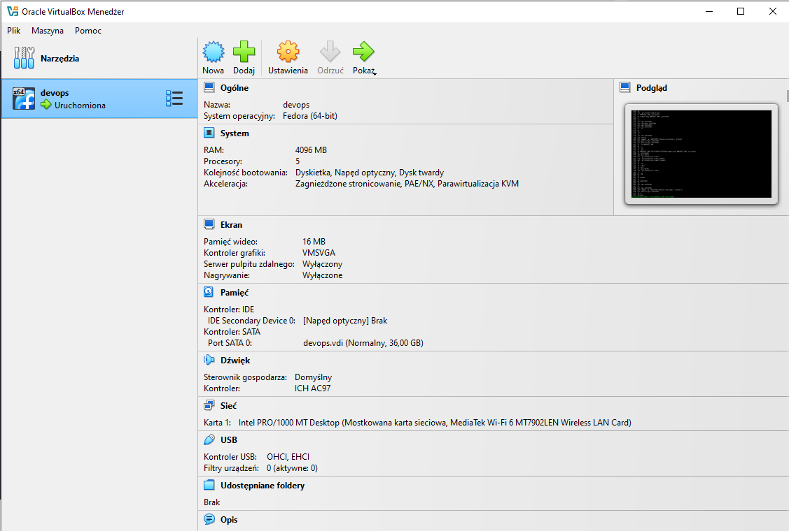

``` bash
-sudo dnf install -y openssh-server
-sudo systemctl enable --now sshd
```

Następnym krokie, była weryfikacja połączenia za pomocą SSH, w tym celu należało użyć komendy:

```bash
-ip a
```

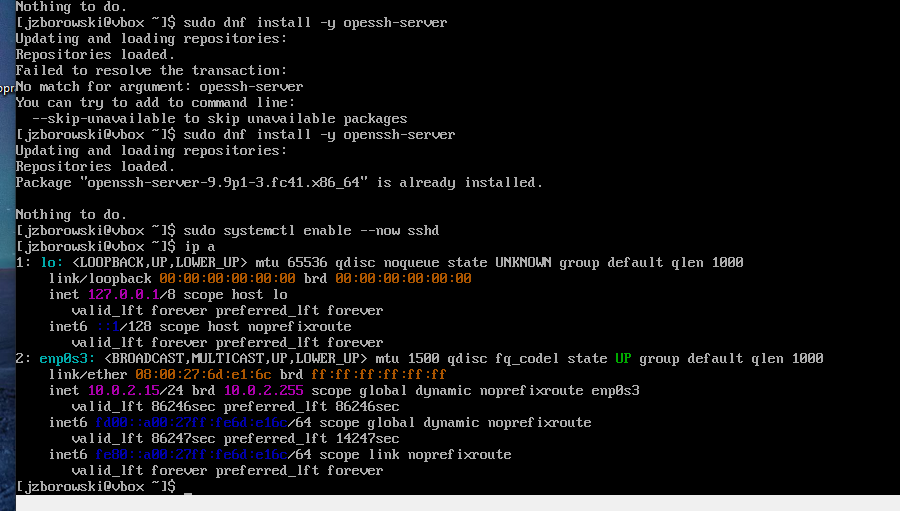

Aby odczytać adres IPv4, który za pomocą cmd / putty umożliwiał zewnętrzne połączenie z VM. W CMD należało wpisać "ssh ...nazwa użytkownika...@...ip...".
Po poprawnym połączeniu otrzymaliśmy ...


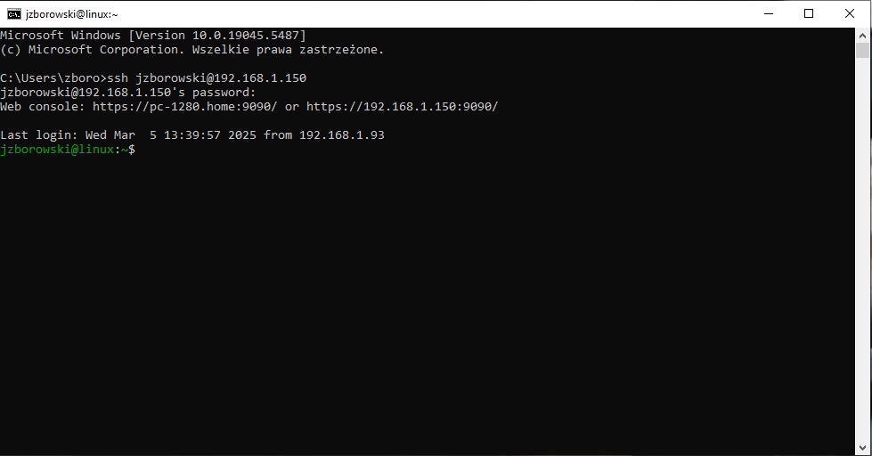

Następnie za pomocą komendy "sftp ...nazwa użytkownika...@...ip..." łączliśmy sie z VM za pomocą SFTP.

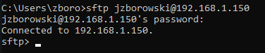

Oraz łączliśmy się również za pomocą SFTP poprzez program FileZilla

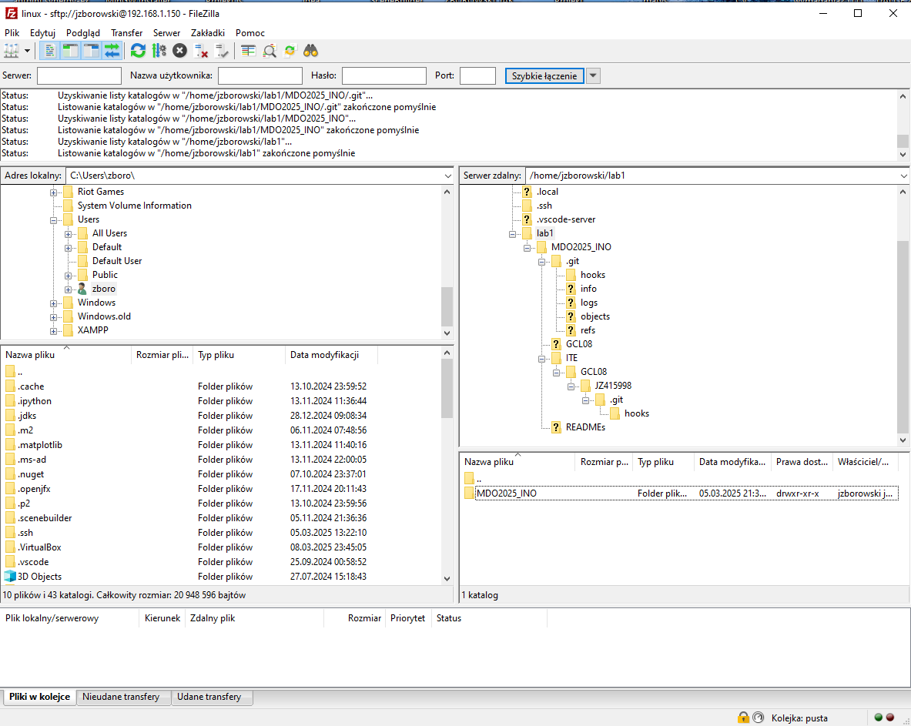

Po dokładnej weryfikacji połączeń przeszliśmy do połączenia się z Visual Studio Code za pomocą rozszerzenia Remote SSH, dzięki tej czynności posiadamy
łatwiejszy dostęp do plików VM oraz do szybszej i prostszej kontroli nad nimi.


Po wykonaniu uprzednich kroków rozpocząłem wykonywaie głównej części ćwiczenia

### 1. Instalacja Git i konfiguracja SSH

#### Instalacja Git
Zainstalowałem klienta Git za pomocą następującego polecenia:
```bash
sudo dnf install git -y
```
Sprawdziłem poprawność instalacji:
```bash
git --version
```
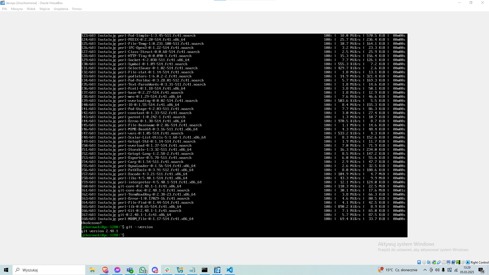

#### Generowanie kluczy SSH
Wygenerowałem dwa klucze SSH:
```bash
ssh-keygen -t ed25519 -C "mój_email@example.com"

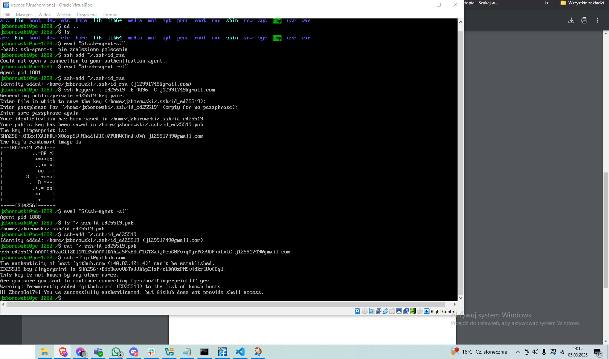

ssh-keygen -t ecdsa -C "mój_email@example.com"
```
Klucz ecdsa został zabezpieczony hasłem.

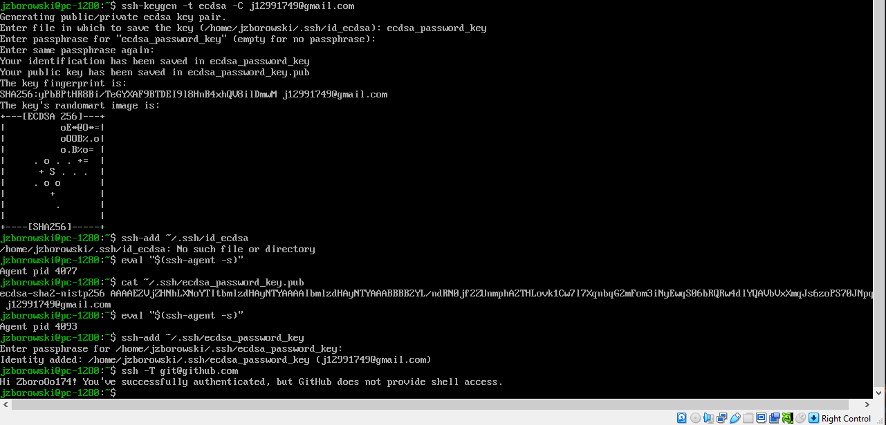

### 2. Klonowanie repozytorium

#### Klonowanie repozytorium za pomocą HTTPS i SSH 
```bash
git clone https://github.com/nazwa/repozytorium.git

```
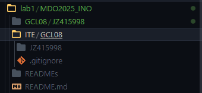

#### Klonowanie repozytorium za pomocą SSH
Dodałem klucz SSH do agenta:
```bash
eval "$(ssh-agent -s)"
ssh-add ~/.ssh/id_ed25519
```
Następnie sklonowałem repozytorium:
```bash
git clone git@github.com:nazwa/repozytorium.git
```

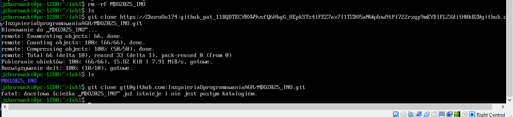

### 3. Konfiguracja 2FA
Skonfigurowałem uwierzytelnianie dwuskładnikowe na GitHubie, zgodnie z dokumentacją.

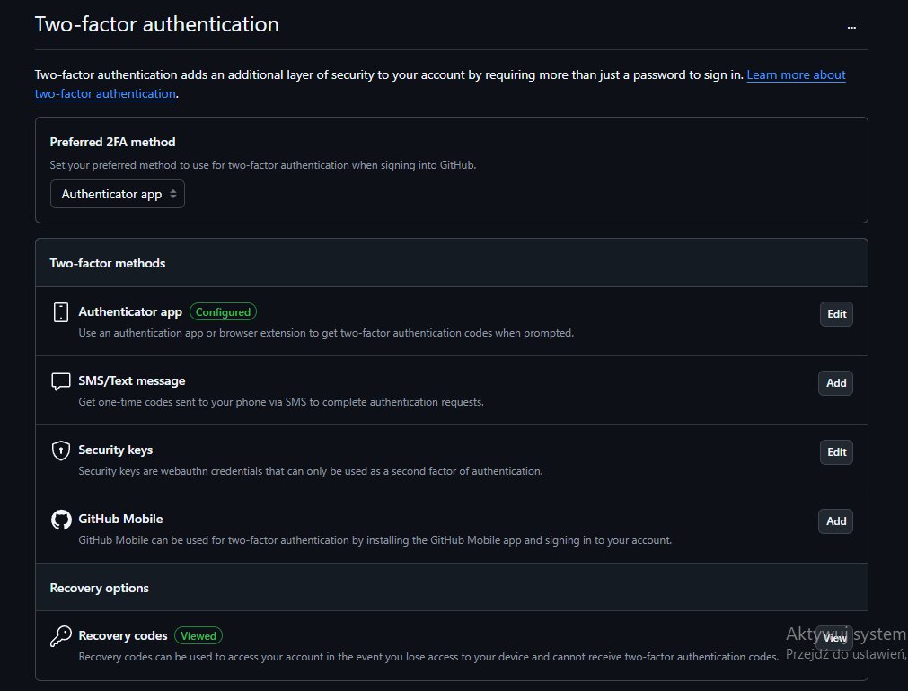

### 4. Praca z gałęziami Git

#### Przełączanie na odpowiednie gałęzie
```bash
git checkout main
git checkout grupa
```

#### Tworzenie nowej gałęzi
```bash
git checkout -b INICJAŁY_NRINDEKSU
```

### 5. Tworzenie katalogu i sprawozdania
Utworzyłem katalog:
```bash
mkdir grupa/INICJAŁY_NRINDEKSU
```

Dodałem plik sprawozdania:
```bash
touch grupa/INICJAŁY_NRINDEKSU/README.md
```

### 6. Git Hook - weryfikacja commit message

Treść pliku `pre-commit`:
```bash
#!/bin/sh
commit_msg_file=$1
expected_prefix="INICJAŁY_NRINDEKSU"
if ! grep -q "^$expected_prefix" "$commit_msg_file"; then
    echo "Commit message musi zaczynać się od $expected_prefix"
    exit 1
fi
```


Skrypt został umieszczony w katalogu `.git/hooks/` i nadano mu prawa do wykonywania:
```bash
chmod +x .git/hooks/pre-commit
```
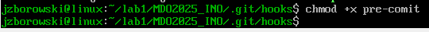

### 7. Dodanie i wysłanie zmian
```bash
git add .
git commit -m "INICJAŁY_NRINDEKSU: Dodano sprawozdanie"
git push origin INICJAŁY_NRINDEKSU
```
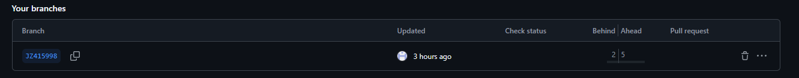

### 8. Próba wciągnięcia zmian do gałęzi grupowej
```bash
git checkout grupa
git merge INICJAŁY_NRINDEKSU
git push origin grupa
```

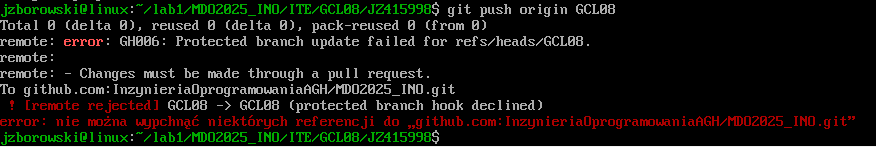

Dzięki wykonanym wyżej krokom możemy działać na grupowym repozytorium pushując i pullując zmiany!