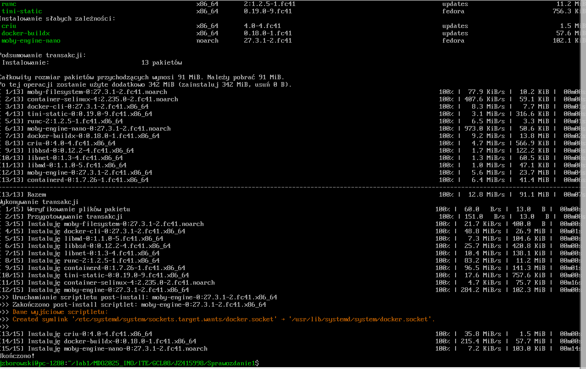
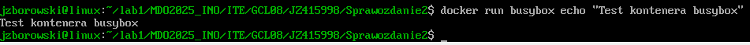

# Sprawozdanie: Instalacja i konfiguracja Dockera na Fedorze

## 1. Instalacja Dockera

Docker został zainstalowany z oficjalnego repozytorium dystrybucji Fedora.

```bash
sudo dnf install docker -y
```


Po instalacji włączono i uruchomiono Dockera:

```bash
sudo systemctl start docker
sudo systemctl enable --now docker
```

Po ponownym zalogowaniu sprawdzono wersję:

```bash
docker --version
docker info
```


## 2. Rejestracja w Docker Hub i wyszukiwanie obrazów

Zarejestrowano konto w [Docker Hub](https://hub.docker.com/). Następnie sprawdzono dostępne obrazy:

```bash
docker search ubuntu
docker search fedora
docker search mysql
```

Zalogowano się do Docker Hub:

```bash
docker login
```


## 3. Pobranie obrazów Dockera

Pobrano wymagane obrazy:

```bash
docker pull hello-world
docker pull busybox
docker pull ubuntu
docker pull fedora
docker pull mysql
```

Sprawdzono pobrane obrazy:

```bash
docker images
```


## 4. Uruchomienie kontenera z obrazu busybox

```bash
docker run busybox echo "Test kontenera busybox"
```


Efekt: wyświetlenie komunikatu `Test kontenera busybox`.

## 5. Połączenie interaktywne i sprawdzenie wersji

```bash
docker run -it busybox sh
```


Wewnątrz kontenera sprawdzono wersję:

```bash
busybox --help
exit
```

## 6. Uruchomienie systemu w kontenerze


Dla Fedory:
```bash
docker run -it fedora bash
```

Sprawdzenie PID 1:
```bash
ps aux
```


## 7. Wyświetlenie procesów Dockera na hoście

```bash
ps aux | grep docker
docker ps -a
```


## 8. Aktualizacja pakietów w kontenerze

Dla Fedory:
```bash
dnf update -y
```

## 9. Stworzenie i budowa Dockerfile

Stworzono plik `Dockerfile`:

```dockerfile
FROM fedora:39
RUN dnf update -y && dnf install -y git
RUN git clone https://github.com/InzynieriaOprogramowaniaAGH/MDO2025_INO.git  
CMD ["bash"]
```

Zbudowano obraz:
```bash
docker build -t moj_obraz .
```


## 10. Uruchomienie i sprawdzenie repozytorium

```bash
docker run -it moj-obraz
```


Wewnątrz kontenera sprawdzono zawartość katalogu:
```bash
ls -la
```


## 11. Sprawdzenie uruchomionych kontenerów i ich usunięcie

```bash
docker ps -a
docker rm $(docker ps -aq)
```


## 12. Usunięcie obrazów Dockera

```bash
docker rmi $(docker images -q)
```


## 13. Dodanie pliku Dockerfile do repozytorium

```bash
git add Sprawozdanie2
git commit -m "Wykonane ćwiczenie i sprawozdanie2"
git push origin main
```