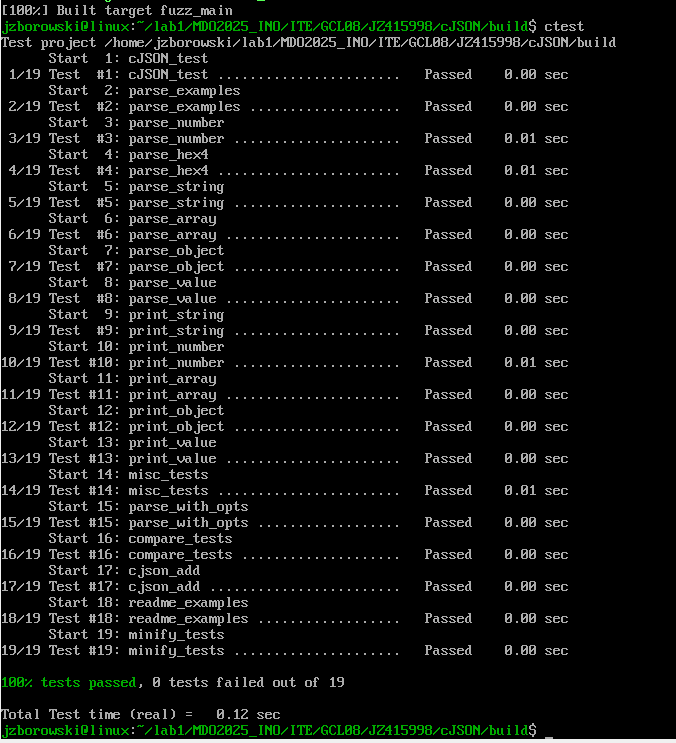
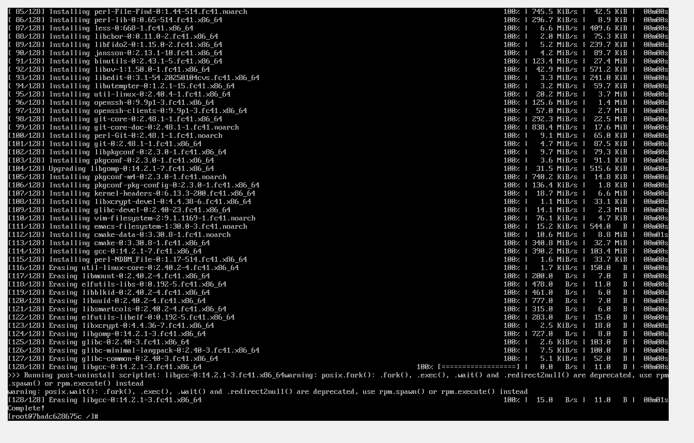
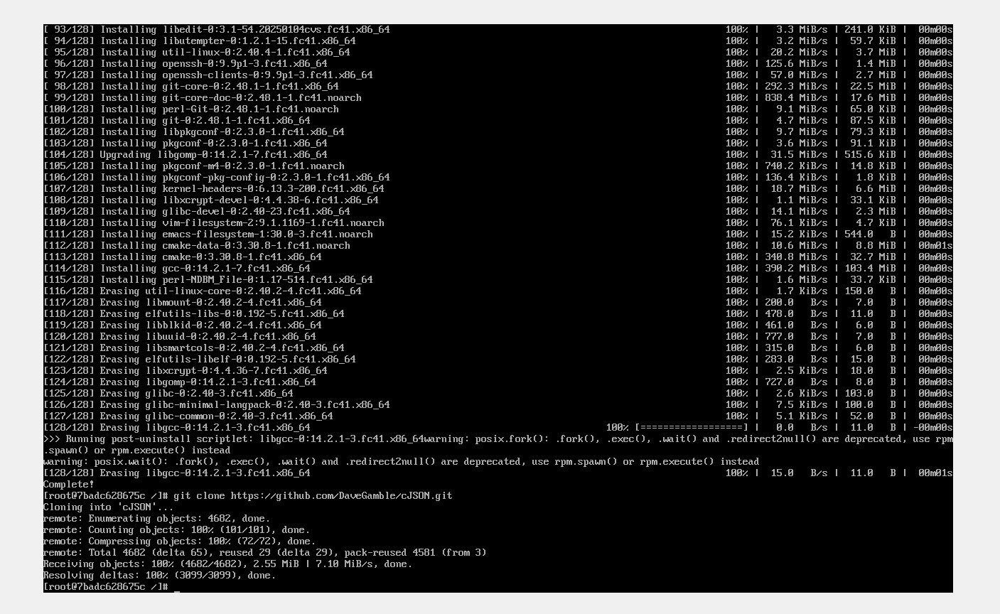
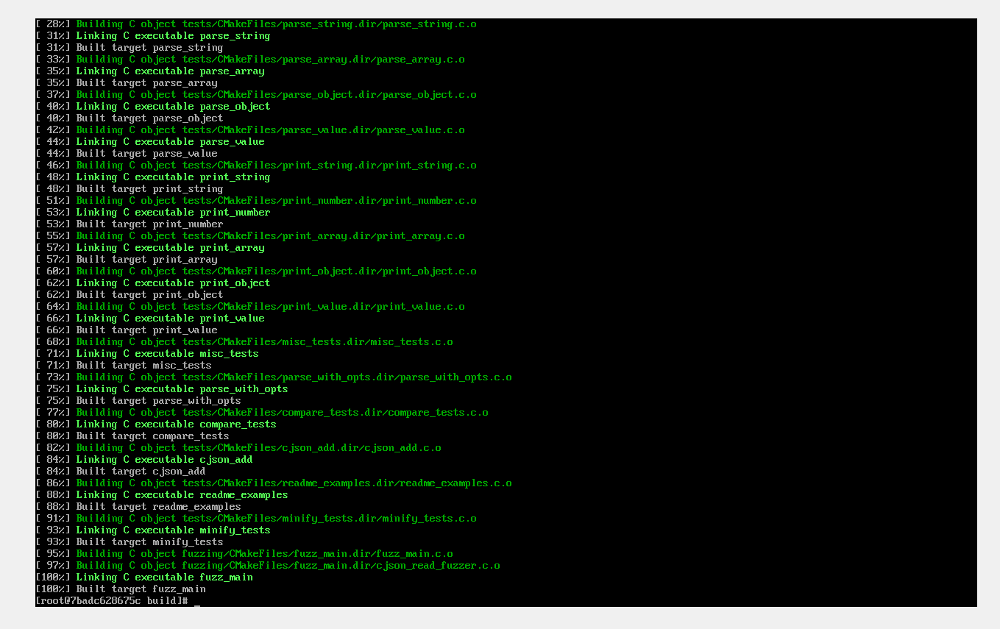
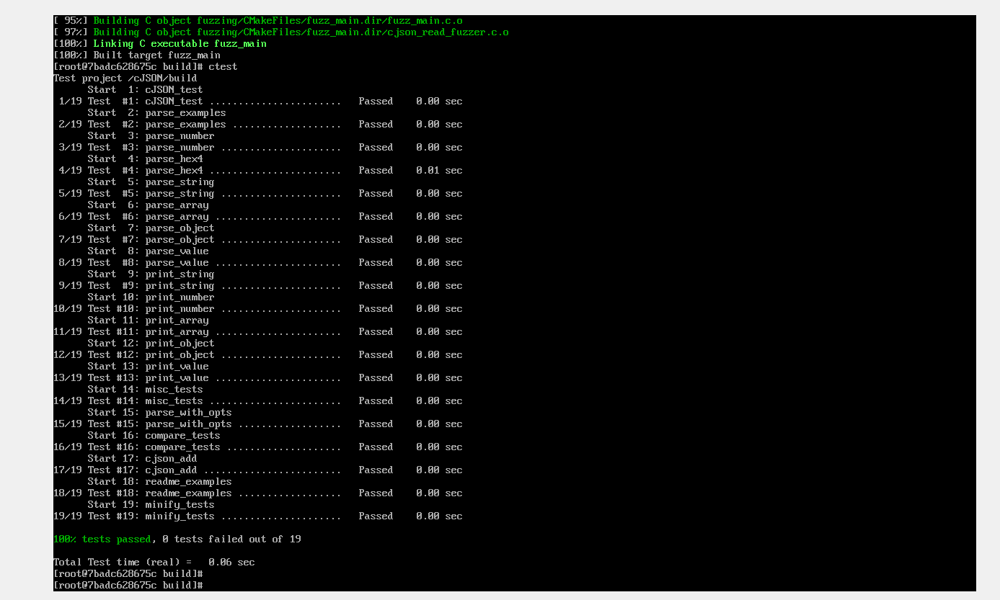
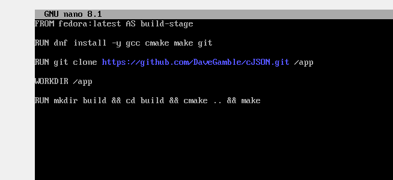
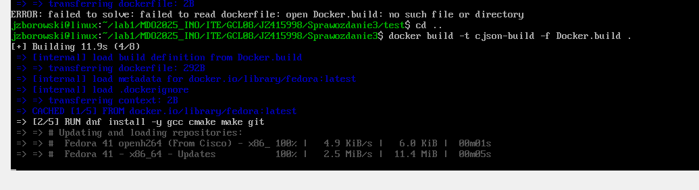
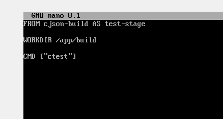
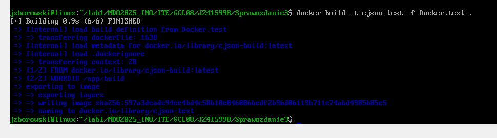
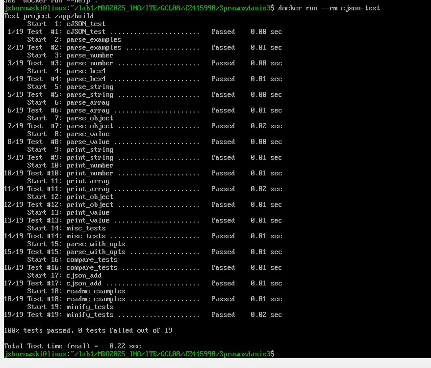

# Sprawozdanie1 - Budowanie i testowanie aplikacji w kontenerze

## 1. Wybór oprogramowania

Wybrane repozytorium: [Nazwa repozytorium]
- Licencja: GNU General Public License
- System budowania: Makefile
- Zawiera testy jednostkowe z raportami końcowymi.

Repozytorium zostało sklonowane za pomocą polecenia:
```bash
 git clone https://github.com/ololuki/Nonograms
```

## 2. Budowanie programu lokalnie

### 2.1 Instalacja zależności

Przed uruchomieniem budowania zainstalowano wymagane pakiety:
```bash
 sudo dnf install -y gcc make cmake
```

Przechodzimy do folderu cJSON, w którym tworzymy folder build:
```bash
    cd cJSON && mkdir build && cd build
```

### 2.2 Uruchomienie procesu build

```bash
 cmake ..
 make
```

### 2.3 Uruchomienie testów jednostkowych

```bash
 ctest
```



## 3. Przeprowadzenie buildu w kontenerze

### 3.1 Uruchomienie kontenera interaktywnego

```bash
 docker run -it --name cjson-kontener fedora bash
```

### 3.2 Instalacja zależności w kontenerze

```bash
 apt update && apt install -y gcc make cmake git 
```


### 3.3 Sklonowanie repozytorium w kontenerze

```bash
 git clone https://github.com/DaveGamble/cJSON.git && cd cJSON  
```


### 3.4 Budowanie aplikacji w kontenerze

```bash
 mkdir build && cd build  
 cmake ..  
 make 
```


### 3.5 Uruchomienie testów w kontenerze

```bash
 ctest
```


## 4. Dockerfile

### 4.1 Dockerfile dla procesu budowania

```dockerfile
FROM fedora:latest AS build-stage

RUN dnf install -y gcc make cmake git

RUN git clone https://github.com/DaveGamble/cJSON/git /app

WORKDIR /app

RUN mkdir build && cd build && cmake .. && make
```


Budowanie obrazu:
```bash
 docker build -t cjosn-build -f Docker.build .
```

### 4.2 Dockerfile dla testowania

```dockerfile
FROM cjson-build AS test-stage
WORKDIR /app/build
CMD ["ctest"]
```


Budowanie i uruchamianie kontenera testowego:
```bash
 docker build -t cjson-test -f Docker.test .
 docker run --rm cjson-test
```



## 5. Podsumowanie

W ramach ćwiczenia:
- Sklonowano repozytorium,
- Uruchomiono proces budowania i testowania lokalnie,
- Powtórzono proces w kontenerze,
- Stworzono dwa Dockerfile automatyzujące budowanie i testowanie,
- Zweryfikowano poprawność działania kontenerów.