# Dodatkowa terminologia w konteneryzacji, instancja Jenkins

## Utworzenie woluminów odpowiednio wejściowe i wyjściowego

``` bash
docker volume create wejscie
docker volume create wyjscie
```

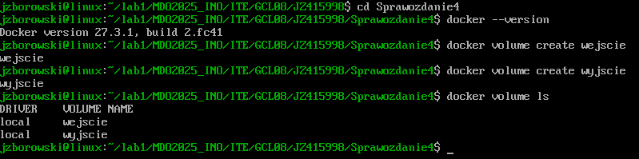


## Utworzenie kontenera bazowego oraz instalacja zależności BEZ gita i wyjscie

```bash
docker run -it --name fedora -v wejscie::/mnt/wejscie/nowy -v wyjscie:/mnt/wyjscie fedora:latest /bin/bash

dnf update && dnf install -y gcc cmake make 
exit
```

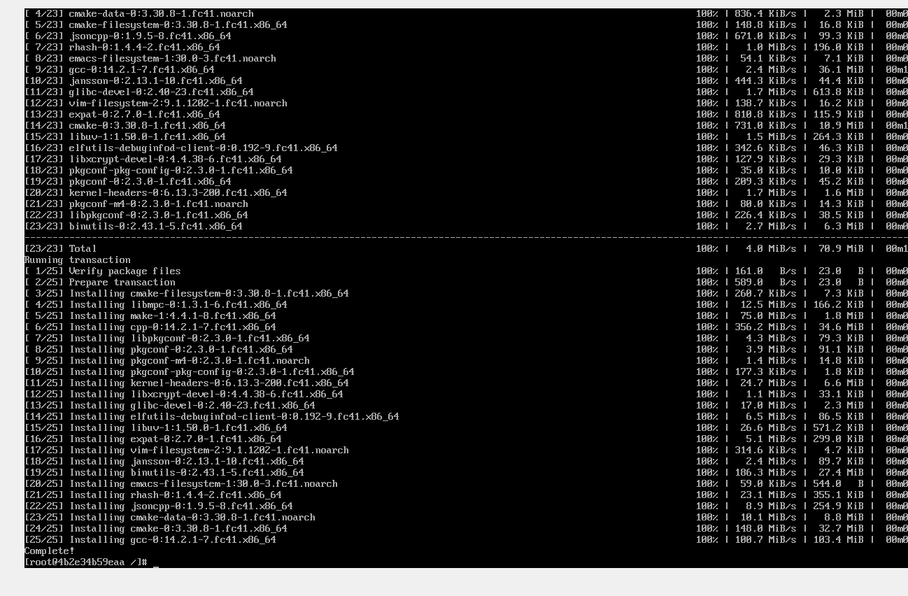

## Klonowanie repozytorium na wolumin wejsciowy

```bash
sudo git clone https://github.com/DaveGamble/cJSON.git $(docker volume inspect --format '{{ .Mountpoint }}' wejscie)
```
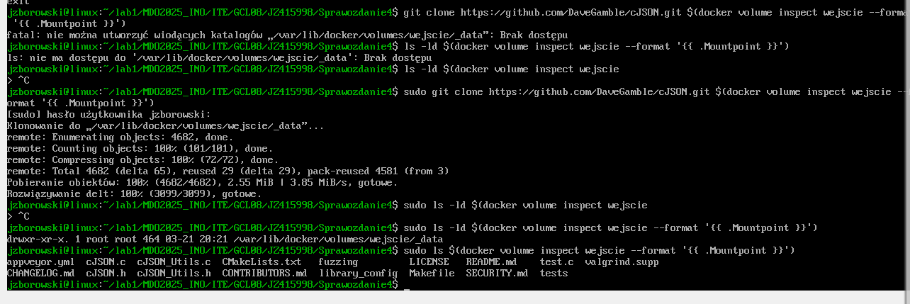

## Build i kopia pliku

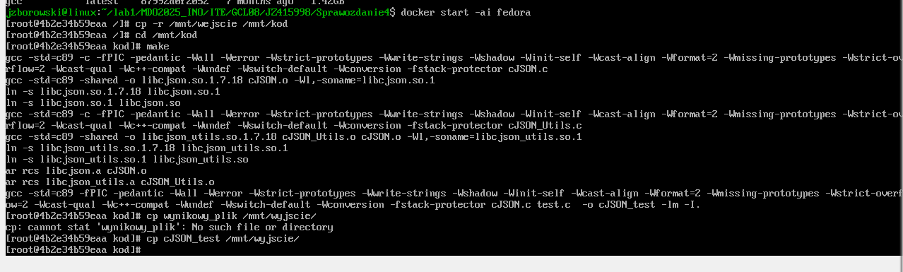

## Zapisany plik na woluminie wyjściowym

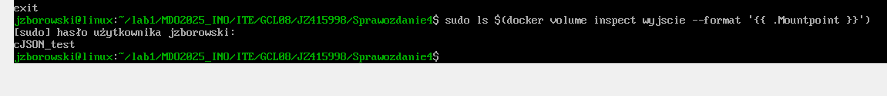

## Czynność tę można również wykonać w kontenerze z zainstalowanym gitem za pomocą komend:

```bash
docker run -it --name bazowy_git -v wejscie:/mnt/wejscie \ fedora:latest /bin/bash -c 

apt update && apt install -y git && git clone https://github.com/example/repo.git /mnt/wejscie
```

Te same operacje można przeprowadzić przy użyciu docker build oraz pliku Dockerfile, bez potrzeby ręcznego uruchamiania kontenerów.

Instrukcja RUN --mount pozwala na tymczasowe montowanie katalogów podczas procesu budowania obrazu.

# Eksponowanie portu

## Instalacja iperf3 na hoście 

```bash
sudo dnf install -y iperf3
```
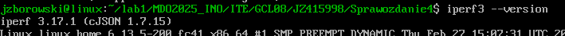

## Włączanie kontenerów i instalacja w nich iperf3

```bash
docker run --rm --tty -i --name f1 fedora bash
docker run --rm --tty -i --name f2 fedora bash
```

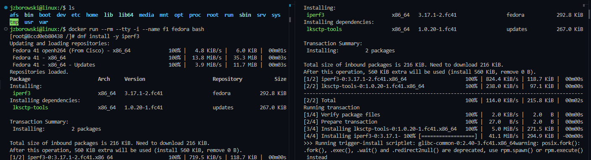

## Komunikacja między kontenerami

Serwer
```bash
iperf3 -s 
```
Klient
```bash
iperf -c 172.17.0.03
```

Próba pokaza błędu - brak utworzonej sieci

```bash
iperf3 -c f1
```

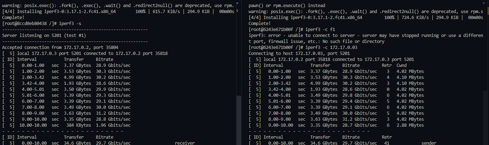

## Tworzenie własnej sieci

```bash
docker network create moja-siec
```

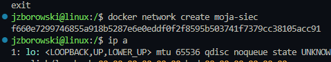

## Utworzenie kontenerów w utworzonej sieci 

```bash
docker run --rm --tty -i --network=moja-siec --name f1 fedora bash
docker run --rm --tty -i --network=moja-siec --name f2 fedora bash
```

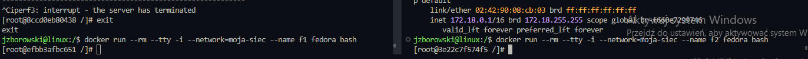

Dzięki temu, możmey łączyć kontenery po nazwie 

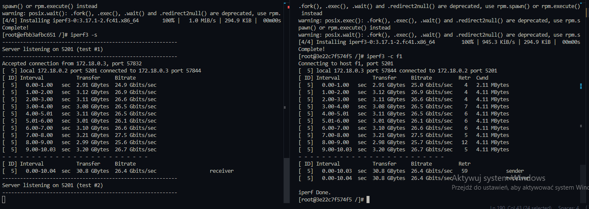


## Łączenie z serwerem spoza hosta

Aby umożliwić dostęp z zewnętrznych urządzeń, skonfigurowałem WSL, co pozwoliło na przypisanie adresu IP w tej samej sieci lokalnej, w której działa host maszyny wirtualnej. Dodatkowo, należy uruchomić kontener serwera z mapowaniem portu 5201 (kontener) na port 5201 maszyny wirtualnej.

```bash
docker run -it --tty -i --network=my-siec -p 5201:5201 --name f1 fedora bash
iperf3 -c 192.168.1.150
```
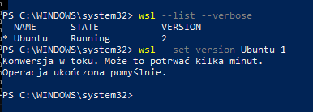
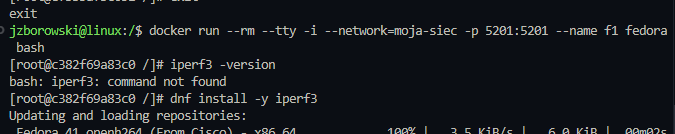

## Łączenie spoza hosta

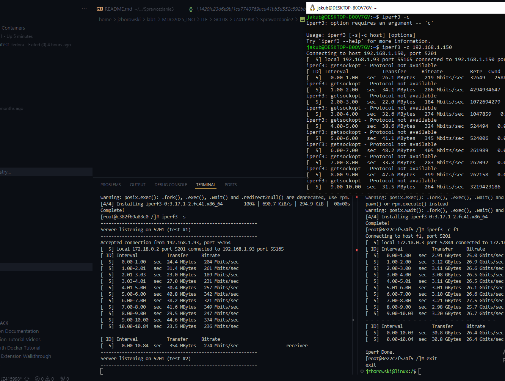
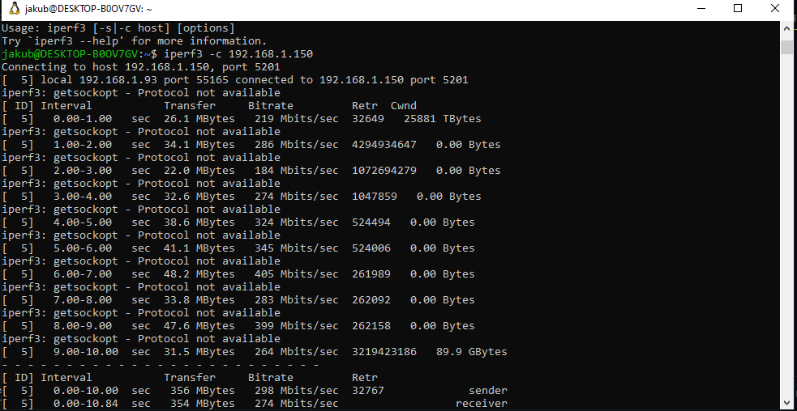

# Instalacja skonteneryzowanej wersji Jenkins z pomocnikiem DIND i inicjalizacja

## Stworzenie sieci o nazwie jenkins
```bash
docker network create jenkins
```
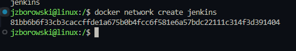

## Uruchomienie kontenera Docker z obrazem docker:dind, który pozwala na uruchomienie dockera wewnątrz kontenera

```bash
docker run --name jenkins-docker --rm --detach --privileged --network jenkins --network-alias docker --env DOCKER_TLS_CERTDIR=/certs --volume jenkins-docker-certs:/certs/client --volume jenkins-data:/var/jenkins_home --publish 2376:2376 docker:dind
```

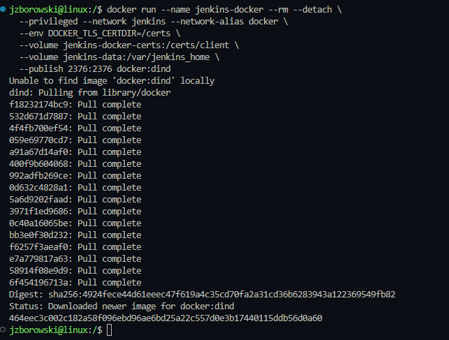

##  Uruchomienie kontenera Jenkins, który jest skonfigurowany do korzystania z Dockera wewnątrz kontenera (Docker-in-Docker, DIND)

```bash
docker run --name jenkins --rm --detach \
  --network jenkins \
  --env DOCKER_HOST=tcp://docker:2376 \
  --env DOCKER_CERT_PATH=/certs/client \
  --env DOCKER_TLS_VERIFY=1 \
  --volume jenkins-data:/var/jenkins_home \
  --volume jenkins-docker-certs:/certs/client:ro \
  --publish 8080:8080 \
  --publish 50000:50000 \
  jenkins/jenkins:lts
```

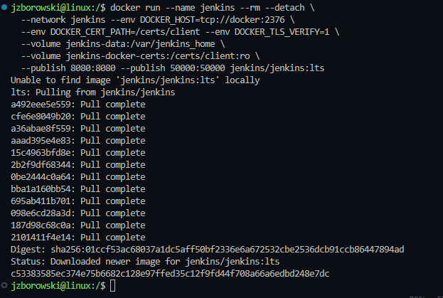

## Wykazanie działających kontenerów

```bash
docker ps
```
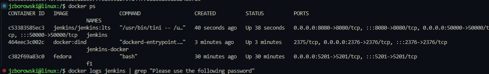


## Rozczytanie hasła admina do Jenkinsa

```bash
docker logs jenkins | grep "Please use the following password"
```

## Łączenie się lokalnie z Jenkinsem w przeglądarce http://<IP_SERWERA>:8080

## Odblokowanie Jenkinsa

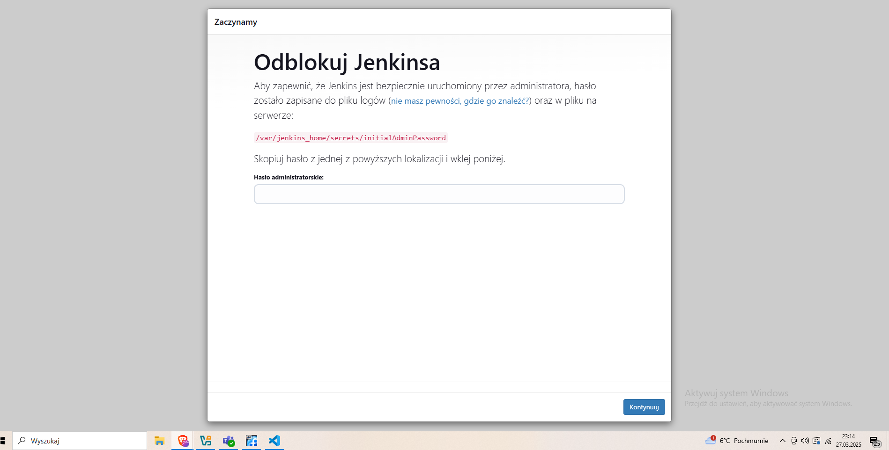

## Instalacja wtyczek

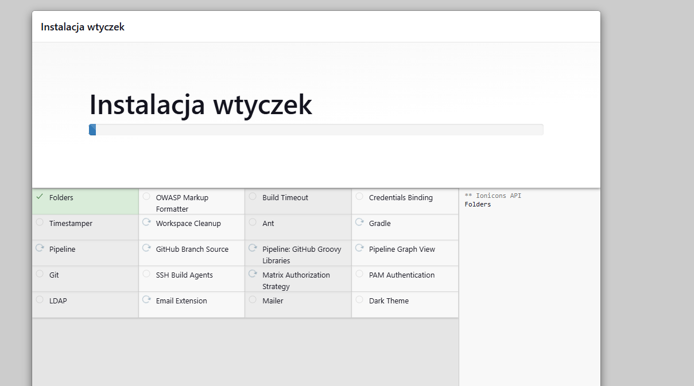

## Jenkins zainstalowany i gotowy!

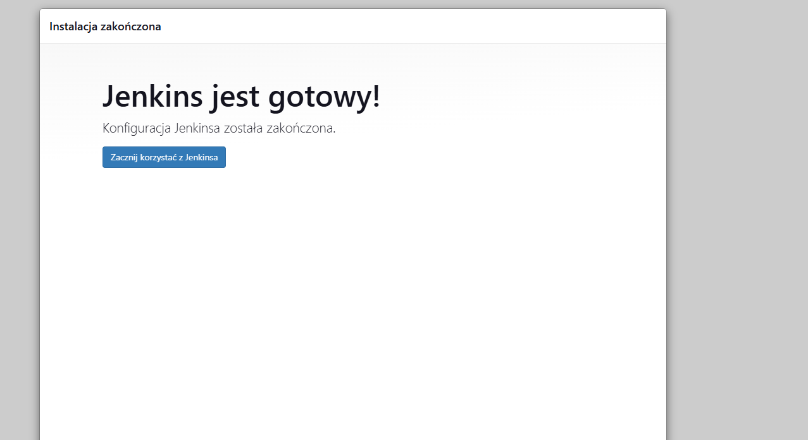