# Deploy wybranego projektu cJSON

## Stworzenie sieci pod deploy

``` bash

docker network create fajna-siec

```

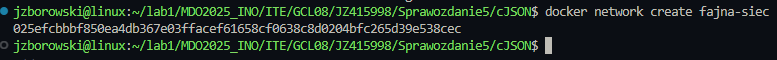

Z powodu mojego przeoczenia we wpisywaniu następnych komend stworzyłem nową sieć 

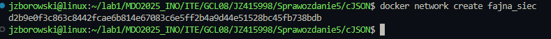

## Stworzenie dockerfile do buildowania projektu

```bash
FROM ubuntu:latest

RUN apt-get update && \
    apt-get install -y git cmake build-essential

RUN git clone https://github.com/DaveGamble/cJSON.git
WORKDIR /cJSON
RUN mkdir build && cd build && cmake .. && make

```
## Uruchomienie buildu projektu

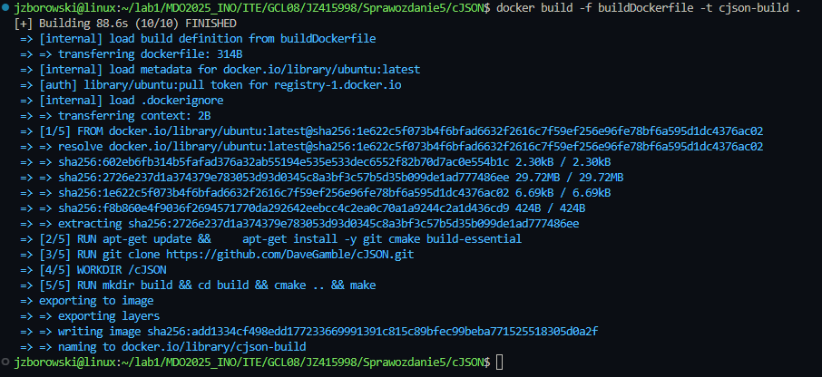

## Stworzenie dockerfile do wykonania testów 

Polecenie stworzone z pomocą ChataGPT

```bash
FROM cjson-build
WORKDIR /cJSON/build
ENTRYPOINT ["ctest"]
CMD ["--verbose"]
```

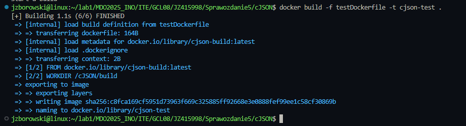

## Kontener tymczasowy oraz kopia cJSON.c i cJSON.h

```bash

docker create --name kontener-tymczas cjson-build

docker cp kontener-tymczas:/cJSON/cJSON.c ./

docker cp kontener-tymczas:/cJSON/cJSON.h ./

```

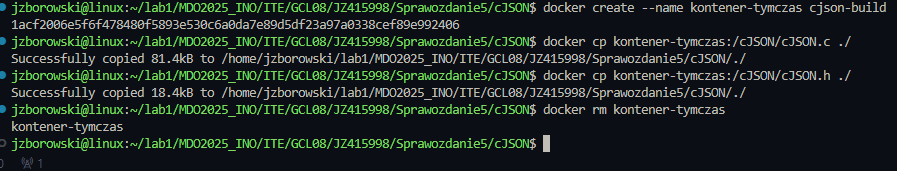

## Uruchomienie deploya we wcześniej utworzonej sieci

Kod deploy

```bash
FROM alpine:latest
WORKDIR /app
COPY cJSON.h .
COPY cJSON.h .
```

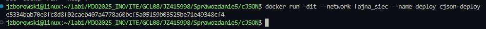

## Wykaz działających procesów 

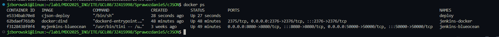


## Wykonanie tzw. Smoke testu czyli szybkiego testu weryfikującego najważniejsze funkcje aplikacji po wdrożeniu deploya. Bardzo przydatny test, gdy smoke test failuje nie ma sensu uruchamiać bardziej złożonych testów

Kod programu do testów

Kod tworzy strukturę JSON, następuje serializacja do tekstu, parsuje tekst z powrotem do obiektu, wydobywa i waliduje dane oraz zarządza pamięci.

Do jego budowy wykorzystałem ChatGPT

```bash
#include "cJSON.h"
#include <stdio.h>
#include <stdlib.h>

int main() {
    // Tworzenie głównego obiektu JSON
    cJSON *root = cJSON_CreateObject();

    // Dodanie stringa i liczby
    cJSON_AddStringToObject(root, "status", "ok");
    cJSON_AddNumberToObject(root, "code", 200);

    // Tworzenie tablicy
    cJSON *array = cJSON_CreateArray();
    cJSON_AddItemToArray(array, cJSON_CreateString("apple"));
    cJSON_AddItemToArray(array, cJSON_CreateString("banana"));
    cJSON_AddItemToArray(array, cJSON_CreateString("cherry"));

    // Dodanie tablicy do głównego obiektu
    cJSON_AddItemToObject(root, "fruits", array);

    // Konwersja obiektu do tekstu i wypisanie
    char *json_text = cJSON_Print(root);
    if (json_text) {
        printf("Serialized JSON:\n%s\n\n", json_text);
    }

    // Parsowanie z powrotem do obiektu
    cJSON *parsed = cJSON_Parse(json_text);
    if (!parsed) {
        fprintf(stderr, "Failed to parse JSON\n");
        free(json_text);
        cJSON_Delete(root);
        return 1;
    }

    // Wydobywanie elementów
    const cJSON *status = cJSON_GetObjectItem(parsed, "status");
    const cJSON *code = cJSON_GetObjectItem(parsed, "code");
    const cJSON *fruits = cJSON_GetObjectItem(parsed, "fruits");

    printf("Parsed data:\n");
    if (cJSON_IsString(status)) {
        printf("status: %s\n", status->valuestring);
    }
    if (cJSON_IsNumber(code)) {
        printf("code: %d\n", code->valueint);
    }
    if (cJSON_IsArray(fruits)) {
        printf("fruits:\n");
        cJSON *fruit = NULL;
        cJSON_ArrayForEach(fruit, fruits) {
            if (cJSON_IsString(fruit)) {
                printf(" - %s\n", fruit->valuestring);
            }
        }
    }

    // Sprzątanie
    free(json_text);
    cJSON_Delete(root);
    cJSON_Delete(parsed);
    return 0;
}
```

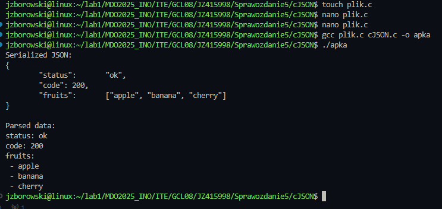

Program wykonał się poprawnie - wszystko działa zgodnie z oczekiwaniami

## Dystrybucja na DockerHub

Próba pusha bez prefiksu kończyła się błędem, więc dodałem tag <- przy rozwiązywaniu tej zagwozdki pomógł mi ChatGPT

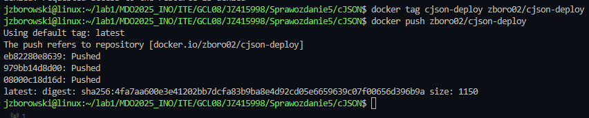

## Stworzenie credentials (danych uwierzytelniających)

Dla bezpieczeństwa logowania do zewnętrznych usług. Zamiast hardcodować login/hasło w skrypcie (co jest ryzykowne), Jenkins przechowuje je zaszyfrowane jako credentials.
Dzięki temu Pipeline może wypychać obrazy bez ręcznego logowania.


Na screenie podałem błędny username, potem się zorientowałem. Wywołało to potem błędy przy wykonywaniu pipeline i trochę zabawy przy szukaniu rozwiązania.
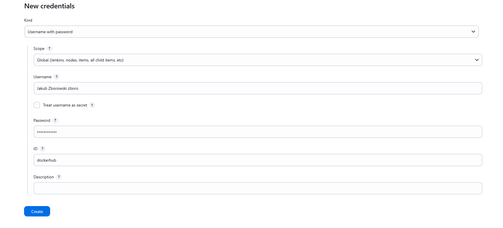


## Konfiguracja pipelinu script from SCM - pipeline jest pobierany bezpośrednio z repo z githuba, automatyzacja procesu


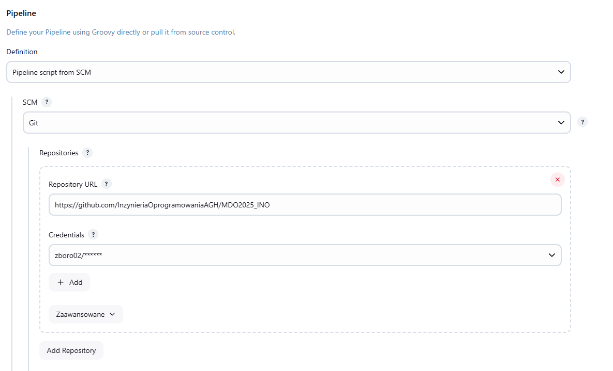
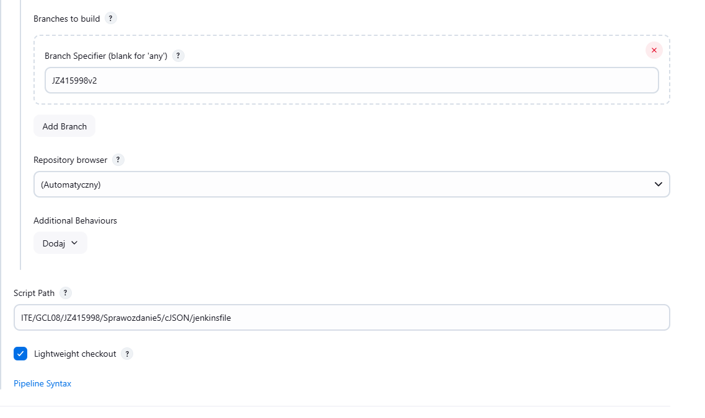

## Utworzenie pliku jenkinsfile

```bash
pipeline {
    agent any

    environment {
        IMAGE_BUILD = 'cjson-build'
        IMAGE_TEST = 'cjson-test'
        IMAGE_DEPLOY = 'cjson-deploy'
        DOCKERHUB_REPO = 'zboro02/cjson-deploy' 
        ZIP_BASE = 'cjson'
        VERSION = "v${BUILD_NUMBER}"
        IMAGE_TAG = "zboro02/cjson-deploy:v${BUILD_NUMBER}" 
    }

    stages {
        stage('Clone') {
            steps {
                git branch: 'JZ415998v2', url: 'https://github.com/InzynieriaOprogramowaniaAGH/MDO2025_INO'
                sh 'pwd'
                sh 'ls -la'

            }
        }

        stage('Clean') {
            steps {
                dir('ITE/GCL08/JZ415998/Sprawozdanie5/cJSON') {
                    sh '''
                        docker container ls -a -q | xargs -r docker rm -f
                        docker volume ls -q | xargs -r docker volume rm -f
                        docker network ls -q --filter type=custom | xargs -r docker network rm -f
                        docker builder prune --all --force
                        docker images -q | sort -u | grep -vE '^(gcc:14|alpine:latest)$' | xargs -r docker rmi -f
                    '''
                }
            }
        }

        stage('Build') {
            steps {
                dir('ITE/GCL08/JZ415998/Sprawozdanie5/cJSON') {
                    sh 'docker build -f buildDockerfile -t $IMAGE_BUILD .'
                }
            }
        }

        stage('Test') {
            steps {
                dir('ITE/GCL08/JZ415998/Sprawozdanie5/cJSON') {
                    sh 'docker build -f testDockerfile -t $IMAGE_TEST .'
                    sh 'docker run --rm $IMAGE_TEST > test-${VERSION}.log'
                    archiveArtifacts artifacts: "test-${VERSION}.log", onlyIfSuccessful: true
                }
            }
        }

        stage('Deploy') {
            steps {
                dir('ITE/GCL08/JZ415998/Sprawozdanie5/cJSON') {
                    sh '''
                        docker create --name kontener-tymczas $IMAGE_BUILD
                        docker cp kontener-tymczas:/cJSON/cJSON.c ./cJSON.c
                        docker cp kontener-tymczas:/cJSON/cJSON.h ./cJSON.h
                        docker rm kontener-tymczas
                        docker build -f deployDockerfile -t $IMAGE_DEPLOY:$VERSION .
                    '''
                }
            }
        }

        stage('SmokeTest') {
            steps {
                dir('ITE/GCL08/JZ415998/Sprawozdanie5/cJSON') {
                    sh '''
                        docker network create fajnasiec || true
                        docker run -dit --network fajnasiec --name deploy $IMAGE_DEPLOY:$VERSION
                        sleep 3
                        docker run --rm --network fajnasiec -v $PWD:/apka -w /apka gcc:14 bash -c "gcc -o apka plik.c cJSON.c && ./apka"
                        docker stop deploy
                        docker rm deploy
                        docker network rm fajnasiec
                    '''
                }
            }
        }

        stage('Publish') {
            steps {
                dir('ITE/GCL08/JZ415998/Sprawozdanie5/cJSON') {
                    withCredentials([usernamePassword(credentialsId: 'dockerhub', usernameVariable: 'DOCKER_USER', passwordVariable: 'DOCKER_PASS')]) {
                        sh '''
                            docker run --rm -v $(pwd):/apka -w /apka alpine sh -c "apk add --no-cache zip && zip -r ${ZIP_BASE}-${VERSION}.zip cJSON.c cJSON.h"
                            echo "$DOCKER_PASS" | docker login -u "$DOCKER_USER" --password-stdin
                            docker tag $IMAGE_DEPLOY:$VERSION $IMAGE_TAG
                            docker push $IMAGE_TAG
                        '''
                        archiveArtifacts artifacts: "${ZIP_BASE}-${VERSION}.zip", onlyIfSuccessful: true
                    }
                }
            }
        }
    }
}
```

Co tu się dzieje? 

    Pobiera kod z określonej gałęzi repozytorium Git

    Czyści środowisko - usuwa stare kontenery, obrazy i wolumeny Dockera

    Buduje obraz Dockera z kodem źródłowym

    Testuje aplikację i zapisuje wyniki

    Przygotowuje do wdrożenia - kopiuje potrzebne pliki i buduje finalny obraz

    Wykonuje szybki test (smoke test) sprawdzający podstawową funkcjonalność

    Publikuje wynik - archiwizuje kod i wypycha obraz Dockera do Docker Hub

Każde wykonanie pipeline'a tworzy nową wersję (oznaczoną numerem builda) i zapewnia, że kod jest poprawnie skompilowany, przetestowany i gotowy do użycia.

## I wreszcie uruchomienie pipeline - zakończone sukcesem

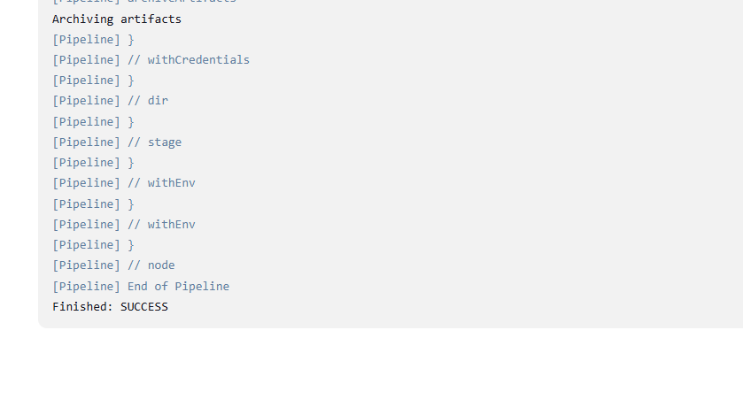