# Pipeline, Jenkins, izolacja etapów

## Utworzenie instancji Jenkins

W celu utworzenia instancji skorzystałem z dokumentacji https://www.jenkins.io/doc/book/installing/docker/
Tworzenie rozpocząłem od utworzenia sieci Jenkins

```bash
docker network create jenkins
```

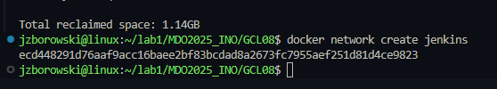

Następnie uruchomiłem DIND (docker in docker) w kontenerze

```bash
docker run \
  --name jenkins-docker \
  --rm \
  --detach \
  --privileged \
  --network jenkins \
  --network-alias docker \
  --env DOCKER_TLS_CERTDIR=/certs \
  --volume jenkins-docker-certs:/certs/client \
  --volume jenkins-data:/var/jenkins_home \
  --publish 2376:2376 \
  docker:dind \
  --storage-driver overlay2
  ```

  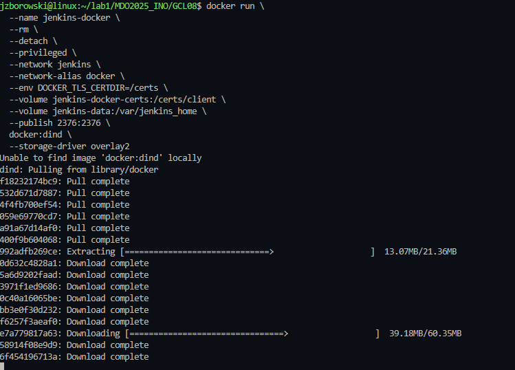

  Później stworzyłem Dockerfile w celu zbudowania kontenera Blueocean.
  Poniżej mój dockerfile

  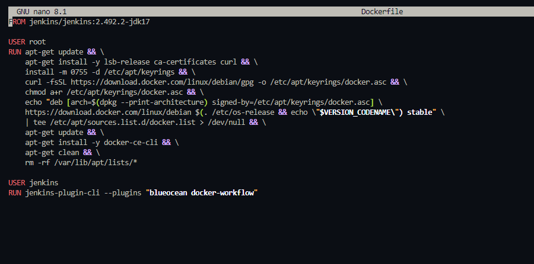

  Budowa obrazu za pomocą ww. dockerfile

  ```bash
  docker build -t myjenkins-blueocean -f Dockerfile .
  ```
  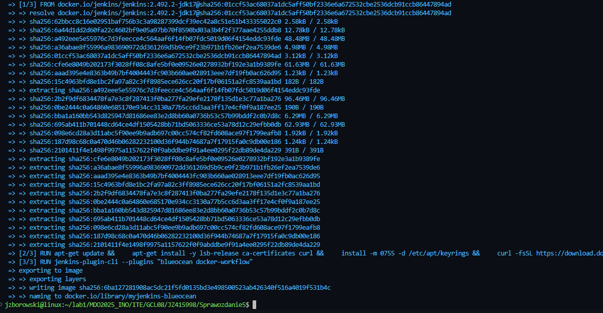
 
    I ostatnia rzecz, czyli uruchomienie jenkins:blueocean w kontenerze

```bash
docker run \
  --name jenkins-blueocean \
  --restart=on-failure \
  --detach \
  --network jenkins \
  --env DOCKER_HOST=tcp://docker:2376 \
  --env DOCKER_CERT_PATH=/certs/client \
  --env DOCKER_TLS_VERIFY=1 \
  --publish 8080:8080 \
  --publish 50000:50000 \
  --volume jenkins-data:/var/jenkins_home \
  --volume jenkins-docker-certs:/certs/client:ro \
  myjenkins-blueocean
  ```

  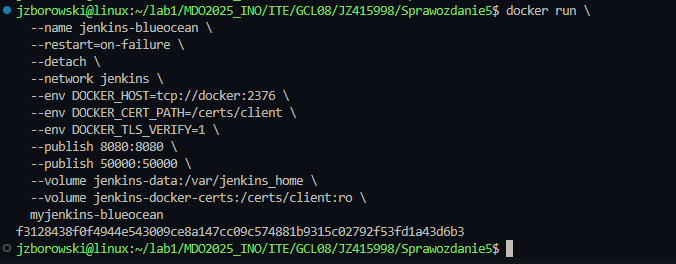

  Po wykonaniu wszystkich kroków przeszedłem na stronę logowania Jenkins na port http://localhost:8080/ ( na poprzednich zajeciach konfigurowałem Jenkins, instalowałem wtyczki itp)

  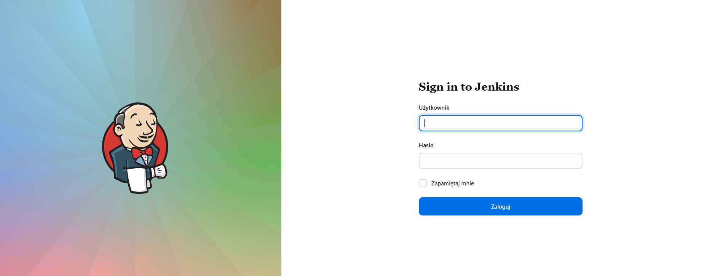
    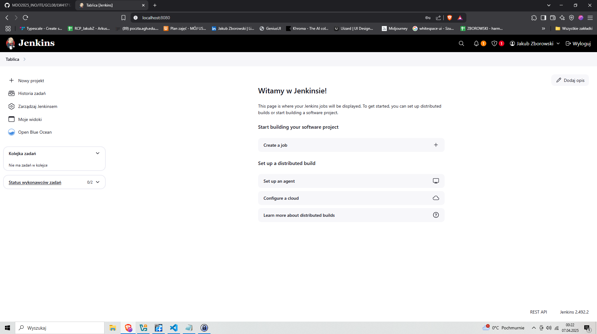
  ## Zadanie wstępne: uruchomienie

Stworzyłem pierwszy projekt, wybrałem projekt ogólny i powłokę, w którą wpisałem -uname. Po uruchomienie otrzymałem informację wyjściową komendy.

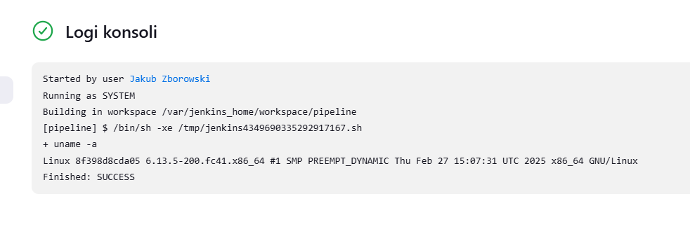

Kolejny projekt - sprawdzenie, czy aktualna godzinaj jest parzysta, czy też nie. Zasada tworzenia projektu jest identyczna.

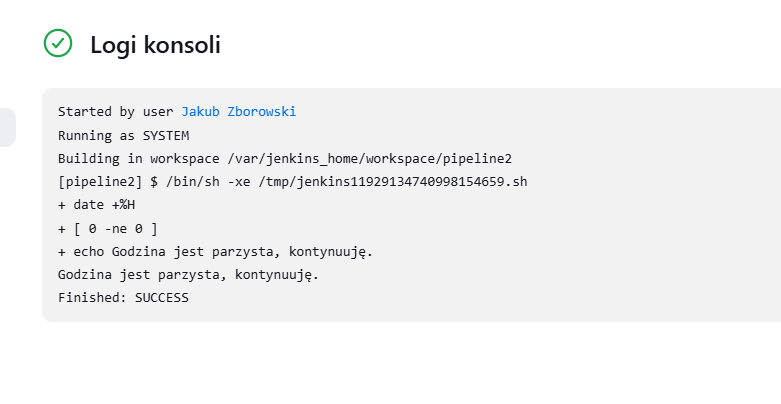

Ostatni projekt - zpullowanie docker ubuntu wewnątrz dind

```bash
docker pull ubuntu
```

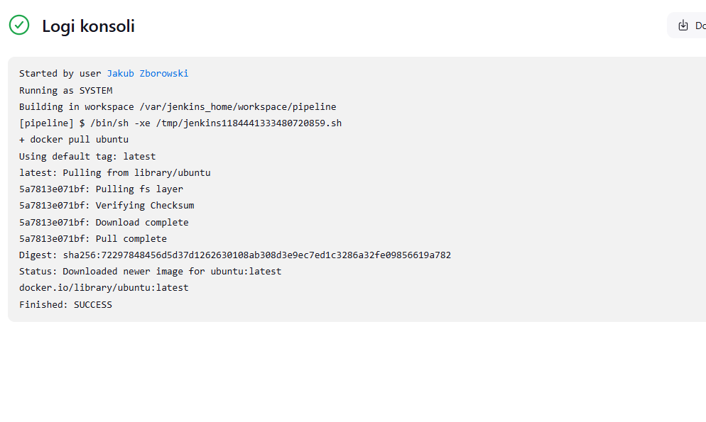

## Zadanie wstępne: obiekt typu pipeline

Teraz przyszła pora na stworzenie obiektu pipeline, tym razem, wybieramy (w trakcie tworzenia) projekt typu pipeline NIE OGÓLNY.

Wewnątrz projektu pipeline tworzymy skrypt, który będzie odpowiedzialny za klonowanie repo przedmiotowego oraz za buildowanie projektu DaveGamble za pomocą Dockerfile z jednego z pierwszych zajęć.

Dla zwiększenia bezpieczeństwa całego procesu czyszczę utworzone pliki i buduje nowy obraz

Skrypt:

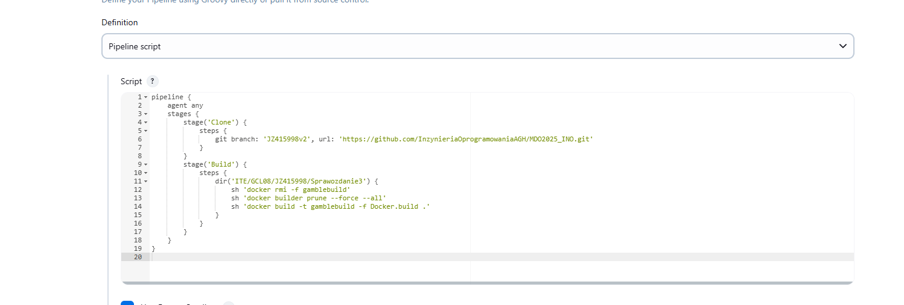

Następnie urochmiłem projekt i czekałem aż cały proces się zakończy - szczęśliwie powodzeniem

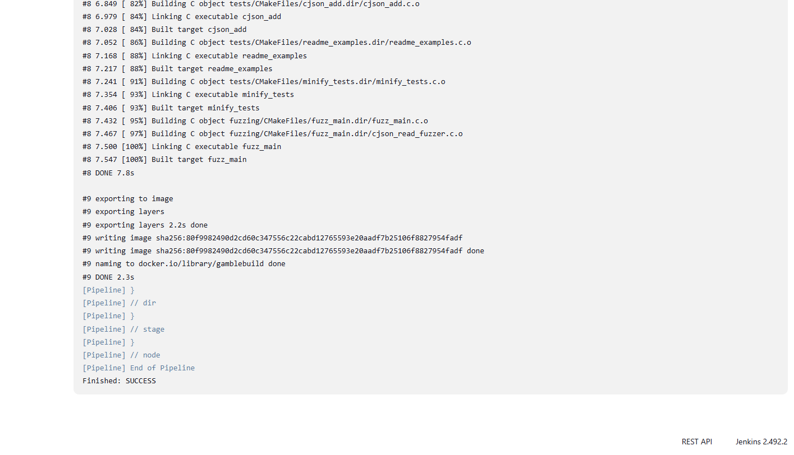

Wykonałem pipeline drugi raz (nie wiedziałe, co wrzucić więc wrzucam czasy wykonania obu uruchomień)

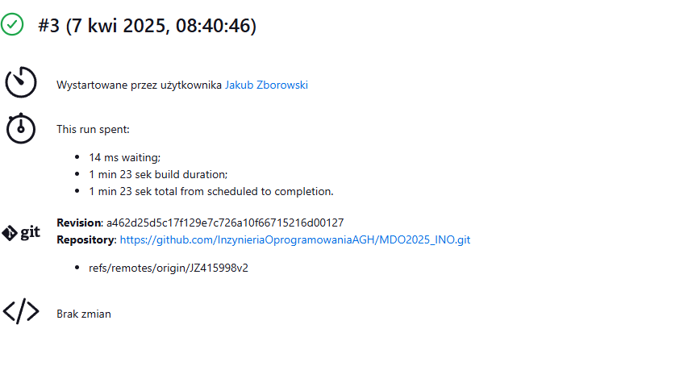
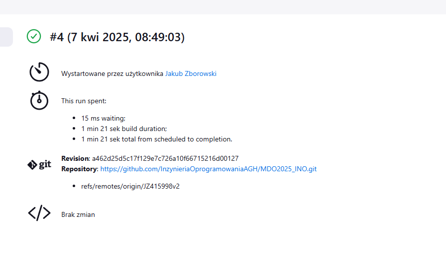

Patrząc na czas, są podobne. Wniosek: oba pipeliny wykonały tyle samo operacji <- taką samą pracę