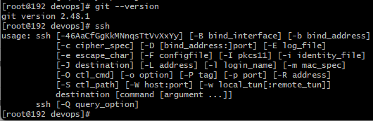
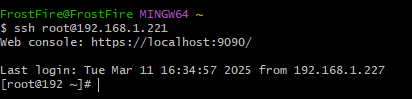
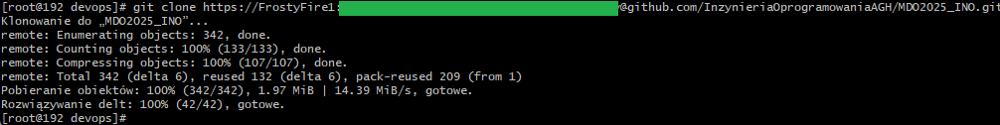
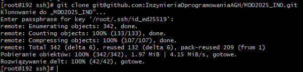
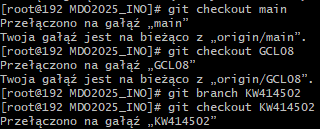
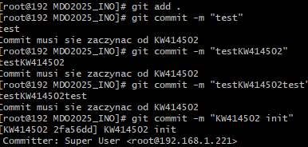

### Autor: Kamil Wielgomas, 414502, gr. 8


#### Wykonanie:
1. Sprawdziłem, czy `git` oraz klient `ssh` został pomyślnie zainstalowany razem z obrazem Fedora Server

a następnie połączyłem się z maszyną wirtualną za pomocą klienta ssh na komputerze osobistym.

I sklonowalem repozytorium za pomocą https i tokenu



2. Stworzyłem klucz ssh za pomocą komendy `ssh-keygen -t ed25519`, a następnie dodałem go jako metodę dostępu do swojego githuba i sklonowałem repozytorium przez ssh

3. Przełączyłem się na gałąź main, a następnie na gałąź GCL08 i sttworzyłem gałąź o nazwie `KW414502`

4. Stworzyłem katalog o nazwie `KW414502` w `ITE/GCL08` i napisałem git hooka, który sprawdza, czy commit zaczyna się od `KW414502`
```bash
MSG=$1
if ! grep -qE "^KW414502" "$MSG";then
    cat "$MSG"
    echo "Commit musi sie zaczynac od KW414502"
    exit 1
fi
```
Żeby hook zaczął działac dałem mu uprawnienia do wykonywania poprzez `chmod +x`


