### Autor: Kamil Wielgomas, 414502, gr. 8
### Lab1


#### Wykonanie:
1. Sprawdziłem, czy `git` oraz klient `ssh` został pomyślnie zainstalowany razem z obrazem Fedora Server
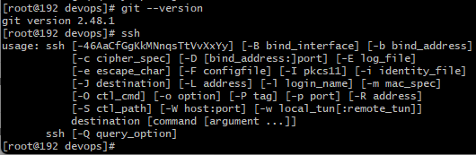
a następnie połączyłem się z maszyną wirtualną za pomocą klienta ssh na komputerze osobistym.

I sklonowalem repozytorium za pomocą https i tokenu
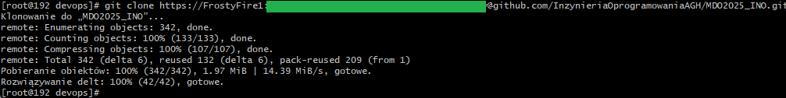


2. Stworzyłem klucz ssh za pomocą komendy `ssh-keygen -t ed25519`, a następnie dodałem go jako metodę dostępu do swojego githuba i sklonowałem repozytorium przez ssh
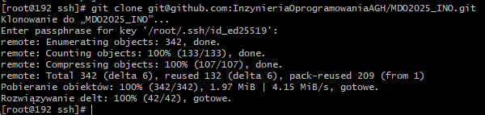
3. Przełączyłem się na gałąź main, a następnie na gałąź GCL08 i sttworzyłem gałąź o nazwie `KW414502`
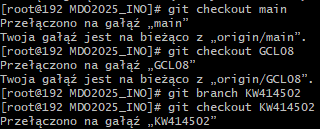
4. Stworzyłem katalog o nazwie `KW414502` w `ITE/GCL08` i napisałem git hooka, który sprawdza, czy commit zaczyna się od `KW414502`
```bash
MSG=$1
if ! grep -qE "^KW414502" "$MSG";then
    cat "$MSG"
    echo "Commit musi sie zaczynac od KW414502"
    exit 1
fi
```
Żeby hook zaczął działac dałem mu uprawnienia do wykonywania poprzez `chmod +x`
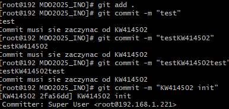


### Lab2


#### Wykonanie:
1. Pobrałem obrazy `hello-world`, `busybox` i `ubuntu` z docker huba za pomocą komendy `docker pull {nazwa_obrazu}`
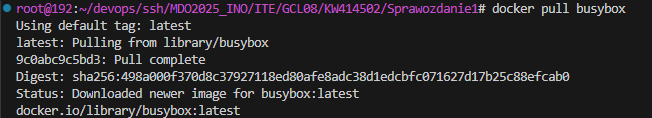

2. Uruchomiłem kontener `busybox` bez dodatkowych argumentów, co poskutkowało natychmiastowym zamknięciem kontenera
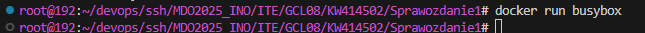
Następnie połączyłem się w trybie interaktywnym i wywołałem numer wersji komendą `uname -a`
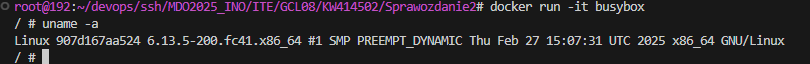

3. Uruchomiłem kontener `ubuntu` w trybie interaktywnym i:
- zaprezentowałem procesy poprzez `ps aux`
- zaktualizowałem pakiety przez `apt update`
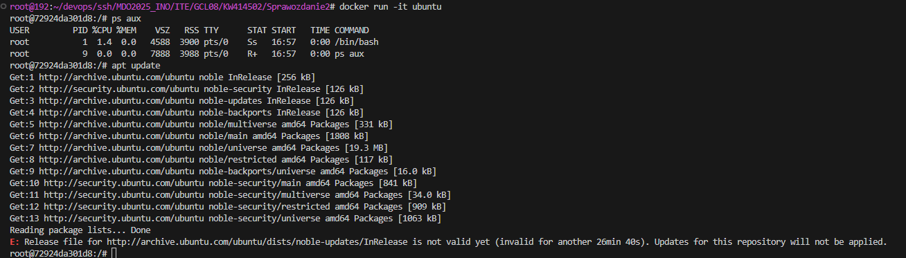

4. Stowrzyłem Dockerfile o następującej treści:
```docker
FROM ubuntu:latest

RUN apt-get update && apt-get install -y git

RUN git clone https://github.com/InzynieriaOprogramowaniaAGH/MDO2025_INO.git
```
Zbudowałem obraz za pomocą `docker build --no-cache -t lab2:1.0 .`
I zweryfikowałem jego działanie przez `docker run -it lab2:1.0`

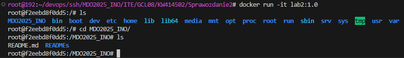
5. Przy użyciu `docker ps -a` sprawdziłem, czy istnieją nieużywane kontenery
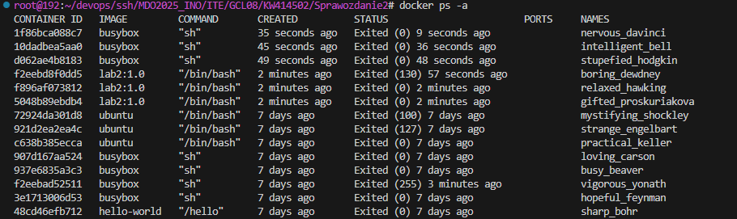
I wyczyściłem wszystko używając `docker system prune`
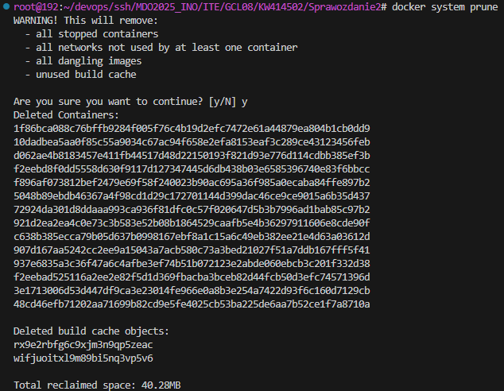

### Lab 3

1. Uruchomiłem kontener fedora:42, sklonowałem repozytorium irssi i zainstalowałem potrzebne pakiety do zbudowania aplikacji:
- git 
- meson 
- ninja 
- gcc 
- glib2-devel 
- openssl-devel 
- utf8proc-devel 
- ncurses-devel
- perl

Po zainstalowaniu pakietów zbudowałem irssi komendami `meson Build` oraz `ninja -C Build`, a następnie uruchomiłem testy poprzez `ninja -C Build test`
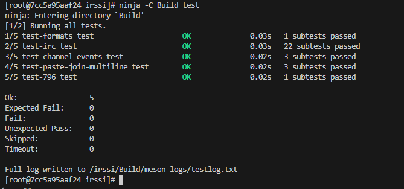

2. W celu automatyzacji procesu stworzyłem Dockerfile, który wykonunje wszystko aż do zbudowaina irssi:
```
FROM fedora:42
RUN dnf install -y git \
    meson \
    ninja \
    gcc \
    glib2-devel \
    openssl-devel \
    utf8proc-devel \
    ncurses-devel \
    perl
RUN git clone https://github.com/irssi/irssi
WORKDIR /irssi
RUN meson Build
RUN ninja -C Build
```
oraz osobny Dockerfile, który uruchamia testy:
```
FROM irssibld
RUN ninja -C Build test
```

3. Uruchomienie kontenerów
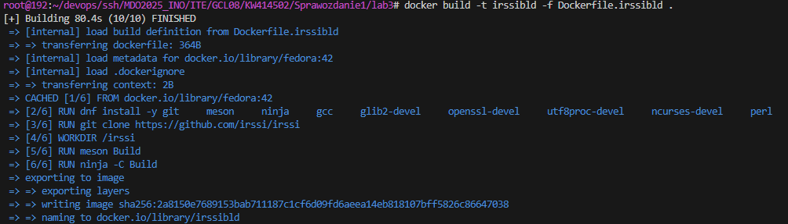
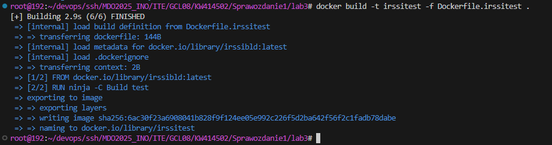

### Lab 4

#### Część 1
1. Stworzyłem woluminy wejściowe i wyjściowe korzystając z `docker volume create`
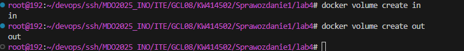
2. Skopiowałem Dockerfile z poprzednich laboratoriów i usunąłem z niego instalację gita
```
FROM fedora:42
RUN dnf install -y \
    meson \
    ninja \
    gcc \
    glib2-devel \
    openssl-devel \
    utf8proc-devel \
    ncurses-devel \
    perl
WORKDIR /irssi
CMD ["/bin/bash"]
```
Za pomocą `docker run -it -v in:/mnt/in -v out:/mnt/out irssinogit` podpiąłem woluminy do stworzonego kontenera.

3. Zbudowałem kontener, a repozytorium irssi sklonowałem na wolumin wejściowy `in`
wykorzystując świeży kontener fedora:42 
- `docker run it -v in:/mnt/in fedora:42` 
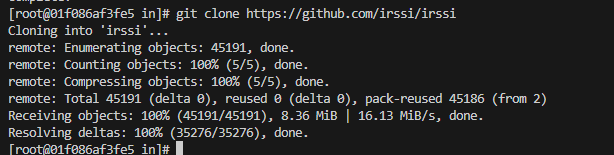
Zbudowałem aplikację
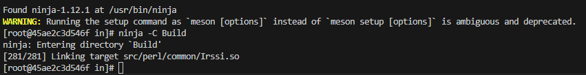
I skopiowałem powstałe pliki na wolumin `out`
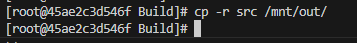
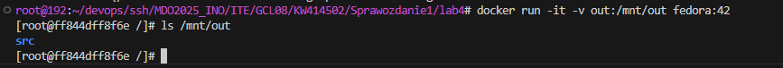

4. Powyższe kroki można zrobić w Dockerfile'u z wykorzystaniem `RUN --mount`
```
FROM fedora:42
RUN dnf install -y \
    meson \
    ninja \
    gcc \
    glib2-devel \
    openssl-devel \
    utf8proc-devel \
    ncurses-devel \
    perl
RUN --mount=type=cache,target=/git_cache git clone https://github.com/irssi/irssi
WORKDIR /irssi
RUN meson Build
RUN ninja -C Build 
RUN mkdir -p /output && cp -r Build /output
CMD ["/bin/bash"]
```

#### Część 2
1. Pobrałem obraz iperf3
Uruchomiłem kontener i połączyłem się z nim z innego kontenera
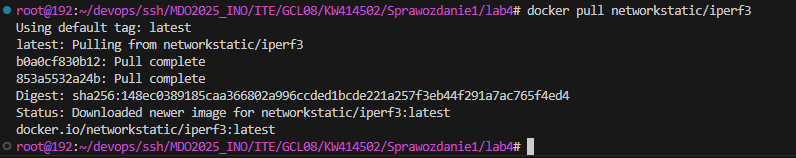
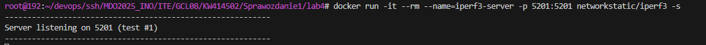
W celu uzyskania adresu IP serwera użyłem komendy `docker inspect --format "{{ .NetworkSettings.IPAddress}}" iperf3`
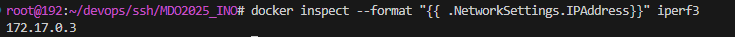
Połączenie:
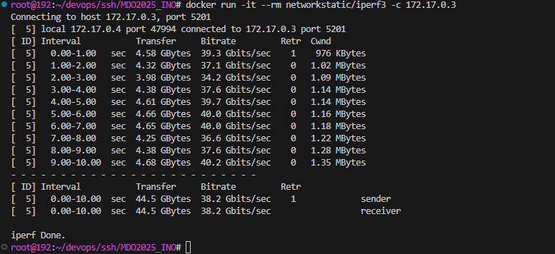
Serwer:
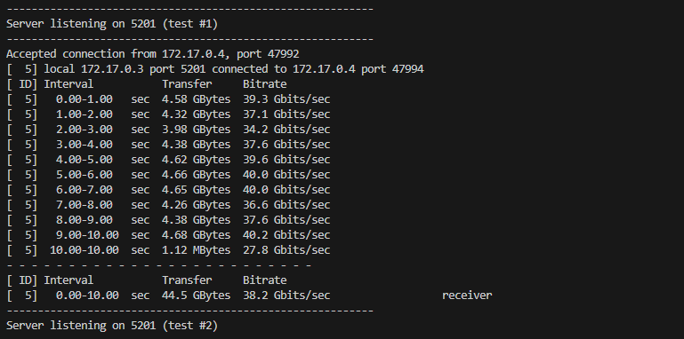

Czynność powtórzyłem z wykorzystaniem sieci mostkowej
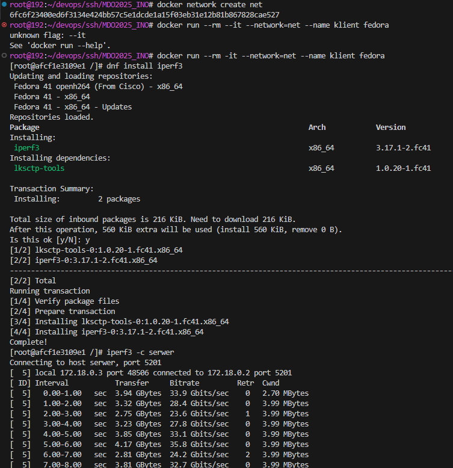
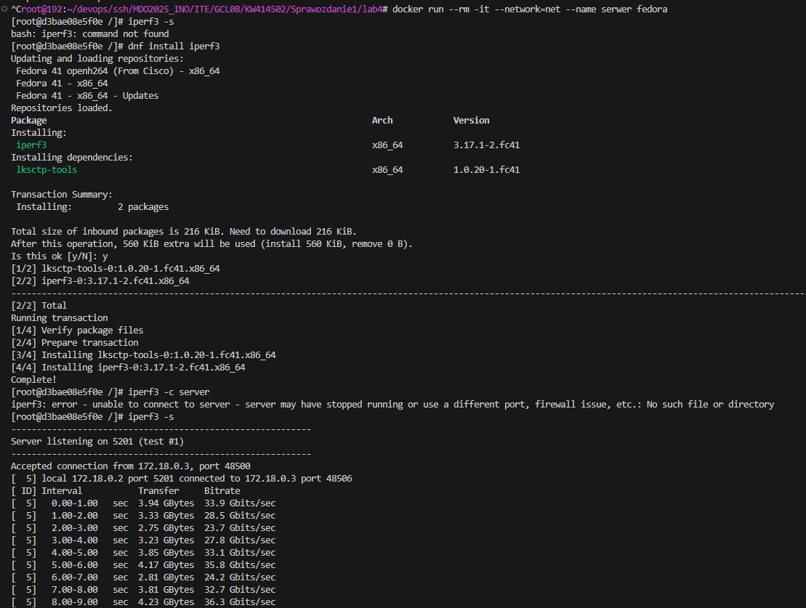

#### Część 3

1. Uruchomiłem kontener jenkins zgodnie z dokumentacją
