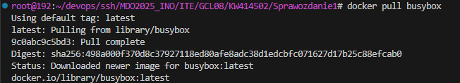
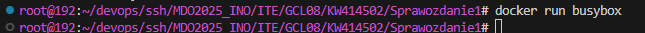
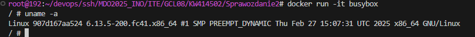
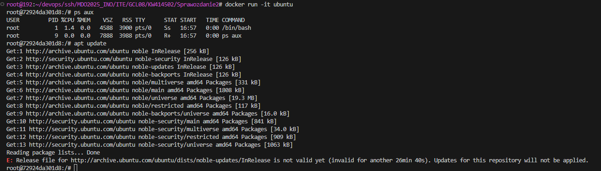
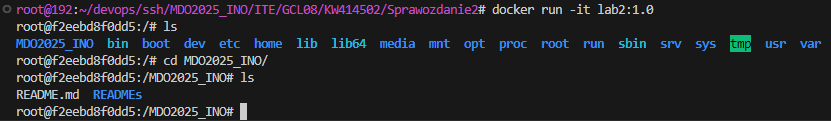
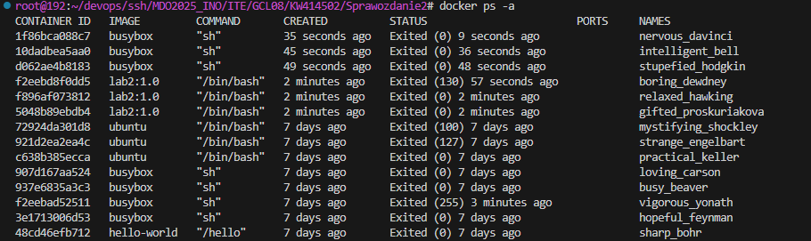
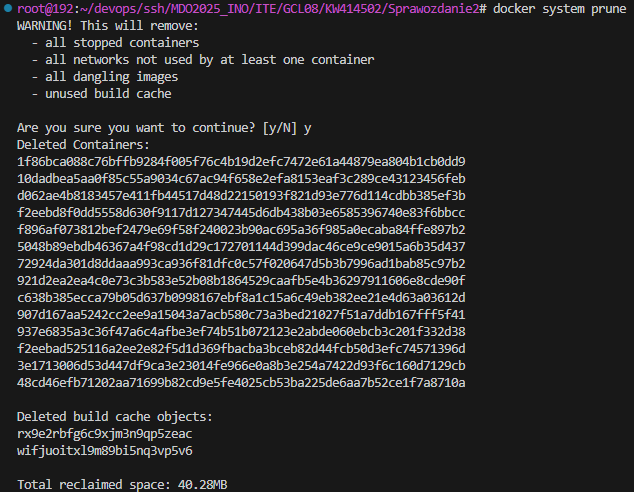

### Autor: Kamil Wielgomas, 414502, gr. 8


#### Wykonanie:
1. Pobrałem obrazy `hello-world`, `busybox` i `ubuntu` z docker huba za pomocą komendy `docker pull {nazwa_obrazu}`


2. Uruchomiłem kontener `busybox` bez dodatkowych argumentów, co poskutkowało natychmiastowym zamknięciem kontenera

Następnie połączyłem się w trybie interaktywnym i wywołałem numer wersji komendą `uname -a`


3. Uruchomiłem kontener `ubuntu` w trybie interaktywnym i:
- zaprezentowałem procesy poprzez `ps aux`
- zaktualizowałem pakiety przez `apt update`


4. Stowrzyłem Dockerfile o następującej treści:
```docker
FROM ubuntu:latest

RUN apt-get update && apt-get install -y git

RUN git clone https://github.com/InzynieriaOprogramowaniaAGH/MDO2025_INO.git
```
Zbudowałem obraz za pomocą `docker build --no-cache -t lab2:1.0 .`
I zweryfikowałem jego działanie przez `docker run -it lab2:1.0`


5. Przy użyciu `docker ps -a` sprawdziłem, czy istnieją nieużywane kontenery

I wyczyściłem wszystko używając `docker system prune`


