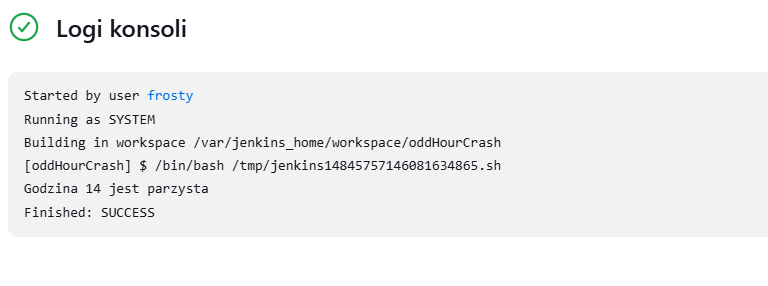
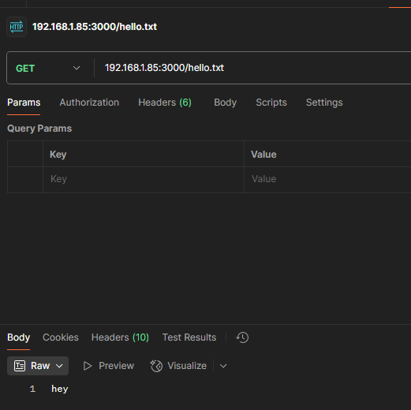
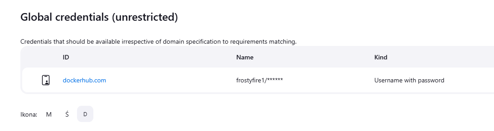
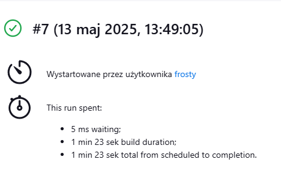
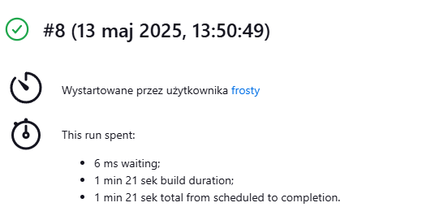

# Kamil Wielgomas DevOps Sprawozdanie 2
## Lab5, 6 i 7.

### 1. Zadania wstępne

### Wyswietl uname
Na początku stworzyłem nowy projekt ogólny o nazwie uname.

W zakładce Kroki budowania dodałem krok "Uruchom powłokę", do której wpisałem
```sh
#!/bin/bash

uname -a
```
Po zapisaniu konfiguracji uruchomiłem projekt i sprawdziłem logi konsoli w celu weryfikacji poprawności działania.


### Wyświetl błąd, gdy godzina jest nieparzysta
Tak jak w poprzednim kroku stworzony został projekt ogólny o nazwie oddHourCrash
W kroku "Uruchom powłokę" został wpisany następujący skrypt:
```bash
#!/bin/bash

hour=$(date +%-H)

if (( hour % 2 != 0 )); then
    echo "Błąd: godzina $hour jest nieparzysta"
    exit 1
else
    echo "Godzina $hour jest parzysta"
    exit 0
fi
```
W celu weryfikacji projekt uruchomiłem o godzinie nieparzystej:

Oraz o godzinie parzystej:


### Pobierz kontener ubuntu
Projekt został stworzony tak jak poprzednie dwa, jednak tym razem w kroku "Uruchom powłokę" znajduje się:
```sh
#!/bin/bash

uname -a
docker images
docker pull ubuntu
docker images
```
W celu weryfikacji sprawdziłem logi konsoli:


## Pipeline
Stworzyłem nowy projekt typu pipeline o nazwie irssiDocker

W zakładce pipeline znajduje się poniższy skrypt:
```Dockerfile
pipeline {
    agent any

    stages {
        stage('Clone Repository') {
            steps {
                git branch: 'KW414502', url: 'https://github.com/InzynieriaOprogramowaniaAGH/MDO2025_INO.git'
            }
        }
        stage('Clean Docker and Build Irssi'){
            steps{
                dir('ITE/GCL08/KW414502/Sprawozdanie1/lab3'){
                    sh 'docker system prune -af && docker image prune -af && docker system prune -af --volumes && docker system df'
                    sh 'docker build -t irssibld -f ./Dockerfile.irssibld .'
            } 
            }

        }
    }
}

```
Stworzony zgodnie z dokumentacją jenkins: https://www.jenkins.io/doc/book/pipeline/
Pipeline klonuje repozytorium, a następnie czyści dockera i buduje obraz irssi korzystając z dockerfile'a stworzonego podczas wcześniejszych laboratoriów.

W celu weryfikacji pipeline należy uruchomić wielokrotnie, żeby się upewnić, że poprzednie uruchomienia nie wpływają na obecne.

### Uruchomienie 1

### Uruchomienie 2


Jak można zauważyć, pierwsze uruchomienie nie wpłynęło na drugie, więc skrypt został napisany poprawnie.

### Pipeline - Docker: Express.js (Build->Test->Deploy->Publish)
#### Build
Na tym etapie stworzyłem dockerfile, który buduje obraz express.js
```Docker
FROM node:20
WORKDIR /app
RUN git clone https://github.com/expressjs/express.git
WORKDIR /app/express
RUN npm install
```
Obraz zbudowałem poprzez `docker build -f Dockerfile.express -t express-js-build .`

#### Test
Na podstawie obrazu stworzonego w poprzednim kroku stworzyłem dockerfile odpowiedzialny za uruchamianie testów
```Docker
FROM express-build-img

WORKDIR /app/express

RUN npm test
```
Zbudowanie obrazu: `docker build -f Dockerfile.expressTest -t express-js-test .`

#### Deploy
Na podstawie obrazu express-js-build stworzyłem dockerfile, który będzie wypuszczony na sieć. Repozytorium expressjs posiada wiele przykładów, więc zdecydowałem się na examples/static-files. W celu zmniejszenia rozmiaru obrazu wykorzystałem wersję slim nodejs
```Dockerfile
FROM node:20-slim

COPY --from=express-build-img /app/express /app

WORKDIR /app

CMD ["node", "examples/static-files"]
```
Tworzenie obrazu: `docker build -f Dockerfile.expressDeploy -t express-js-deploy .`


### Sprawdzenie poprawności działania
W tym celu stworzyłem nową sieć

Uruchomiłem w niej finalny kontener

Sprawdziłem logi, żeby zweryfikować, że kontener działa

Ponieważ przykład to API na stronie znajduje się tylko:

Więc żeby zweryfikować, czy API działa poprawnie wykorzystałem aplikację postman


#### Publish
Zbudowałem obraz deploy i oznaczyłem jego wersję jako latest

Po zalogowaniu się do dockera za pomocą `docker login` zpushowałem obraz na dockerhub


### Pipeline - Jenkins
Aby jenkins mógł modyfikować mojego dockerhuba wprowadziłem do niego swoje dane logowania

Do zautomatyzowania powyższego procesu stworzyłem następujący pipeline:
```
pipeline {
    agent any

    environment {
        APP_DIR = 'ITE/GCL08/KW414502/Sprawozdanie2/lab67'
        LOGIN_CREDS = credentials('dockercreds')
    }

    stages {
        stage('Clone Repository') {
            steps {
                git branch: 'KW414502', url: 'https://github.com/InzynieriaOprogramowaniaAGH/MDO2025_INO.git'
            }
        }

        stage('Clean up docker') {
            steps {
                dir("${APP_DIR}") {
                    sh 'docker kill express-js'
                    sh 'docker rmi -f express-js-build || true'
                    sh 'docker rmi -f express-js-test || true'
                    sh 'docker rmi -f frostyfire1/express-js-deploy:latest || true'
                    sh 'docker builder prune --force --all || true'
                    sh 'docker network rm express-js -f || true'
                    sh 'docker rm -f express-js-deploy || true'
                }
            }
        }

        stage('Build express-js container') {
            steps {
                dir("${APP_DIR}") {
                    sh 'docker build -f Dockerfile.express -t express-js-build .'
                }
            }
        }

        stage('Build and run test container') {
            steps {
                dir("${APP_DIR}") {
                    sh 'docker build -f Dockerfile.expressTest -t express-js-test .'
                }
            }
        }
        
        stage('Build deployable container') {
            steps {
                dir("${APP_DIR}") {
                    sh 'docker build -f Dockerfile.expressDeploy -t frostyfire1/express-js-deploy:latest .'
                }
            }
        }

        stage('Smoke Test deployable container before publishing') {
            steps {
                dir("${APP_DIR}") {
                    sh '''
                        docker network create express-js || true
                        docker run -d --rm --network express-js --name express-js -p 3000:3000 frostyfire1/express-js-deploy:latest
                        docker run --rm --network express-js curlimages/curl curl -s --max-time 5 express-js:3000
                    '''
                }
            }
        }

        stage('Publish Container') {
            steps {
                script {
                    sh "echo ${LOGIN_CREDS_PSW} | docker login -u ${LOGIN_CREDS_USR} --password-stdin"
                    docker.withRegistry('https://registry.hub.docker.com', 'dockercreds') {
                        docker.image("frostyfire1/express-js-deploy:latest").push()
                    }
                }
            }
        }
    }
}
```
Komendy, przy których jest dopisane `|| true` mogą wyjść z błędem, jednak nie powinno to mieć wpływu na działalnośc pipeline'u.
#### Pipeline run #1

#### Pipeline run #2

