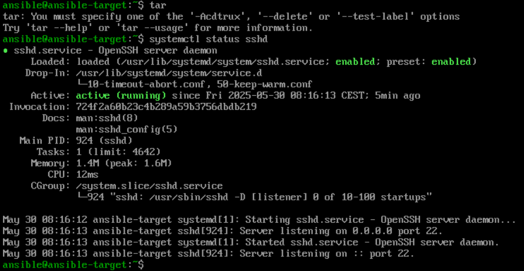
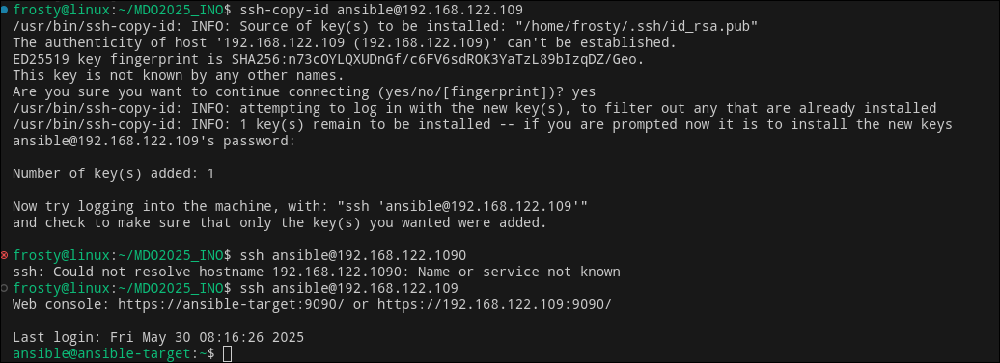
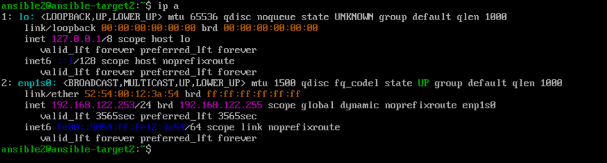
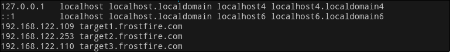
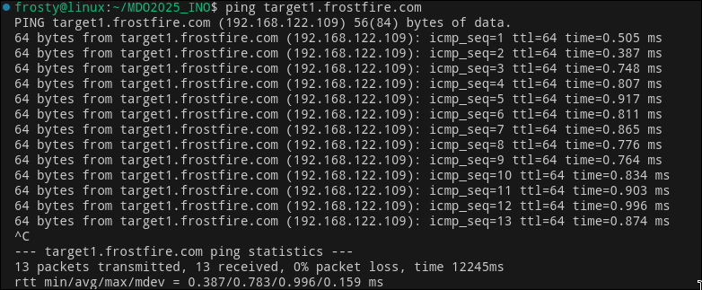
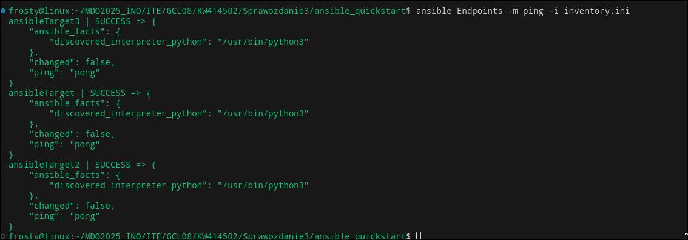
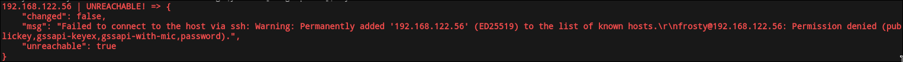
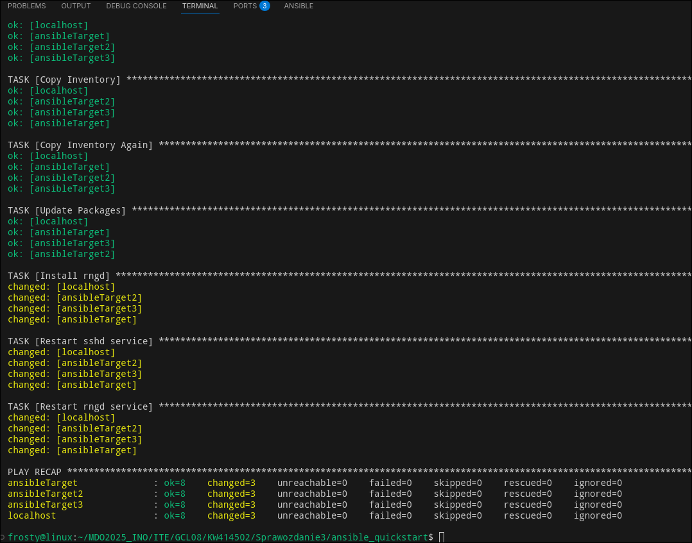
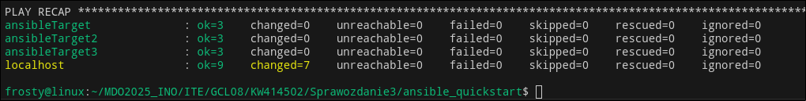

## Kamil Wielgomas ITE8 Sprawozdanie 3
### Lab 8
#### Przygotowanie
Do wykonania tych ćwiczeń laboratoryjnych stworzyłem nową maszynę wirtualną fedora41-server. Ustawiłem jej hostname na ansible-target oraz stworzyłem użytkownika ansible

Upewniłem się, że na maszynie znajduje się `tar` oraz `sshd`

I wymieniłem klucze pomiędzy tą maszyną a maszyną główną, na której zostało zainstalowane oprogramowanie ansible.

#### Inwentaryzacja
Stworzyłem dwie dodatkowe maszyny wirtualne: `ansible-target2` i `ansible-target3` i wymieniłem między nimi a maszyną główną klucz ssh


Zmodyfikowałem plik `/etc/hosts` tak, aby dało się połączyć z nowymi maszynami przez zadaną im nazwę


A następnie stworzyłem plik inwentaryzacji `ansible_quickstart/inventory.ini`
```
[Orchestrators]
localhost ansible_connection=local

[Endpoints]
ansibleTarget ansible_host=target1.frostfire.com ansible_user=ansible 
ansibleTarget2 ansible_host=target2.frostfire.com ansible_user=ansible2 
ansibleTarget3 ansible_host=target3.frostfire.com ansible_user=ansible3
```
I wysłałem żądanie `ping` do wszystkich maszyn



#### Zdalne wywoływanie procedur
Stworzyłem `playbook.yaml` o następującej treści:
```yaml
- name: Zdalne wywoływanie procedur
  hosts: all
  become: true
  tasks:
  - name: Ping
    ansible.builtin.ping:

  - name: Copy Inventory
    ansible.builtin.copy:
      src: ./inventory.ini
      dest: ./inventory.ini
  - name: Copy Inventory Again
    ansible.builtin.copy:
      src: ./inventory.ini
      dest: ./inventory.ini

  - name: Update Packages
    ansible.builtin.dnf:
      name: "*"
      state: latest
  - name: Install rngd
    ansible.builtin.dnf:
      name: rngd
      state: latest

  - name: Restart sshd service
    ansible.builtin.service:
      name: sshd
      state: restarted

  - name: Restart rngd service
    ansible.builtin.service:
      name: rngd
      state: restarted
```
I uruchomiłem go poprzez`ansible-playbook -i inventory.ini playbook.yaml --ask-become-pass`

Uwaga: Podczas pierwszego uruchomienia playbooka zadania `Copy Inventory` oraz `Update Packages` wykazywały stan `changed` dla wszystkich maszyn poza `localhost`
#### Zarządzanie stworzonym artefaktem
`playbook2.yaml`
```yaml
- name: Konfiguracja Dockera
  hosts: Orchestrators
  become: true
  tasks:
    - name: "Create docker network: ansible"
      ansible.builtin.docker_network:
        name: ansible
        driver: bridge
    - name: "Create base image"
      ansible.builtin.docker_image:
        name: express-js-build
        source: build
        build:
          path: /home/frosty/MDO2025_INO/ITE/GCL08/KW414502/Sprawozdanie2/lab67/
          dockerfile: Dockerfile.express
    - name: "Create test image"
      ansible.builtin.docker_image:
        name: express-js-test
        source: build
        build:
          path: /home/frosty/MDO2025_INO/ITE/GCL08/KW414502/Sprawozdanie2/lab67/
          dockerfile: Dockerfile.expressTest
    - name: "Create deploy image"
      ansible.builtin.docker_image:
        name: express-js-deploy
        source: build
        build:
          path: /home/frosty/MDO2025_INO/ITE/GCL08/KW414502/Sprawozdanie2/lab67/
          dockerfile: Dockerfile.expressDeploy
    - name: "Pull frostyfire1/express-js-deploy:latest"
      ansible.builtin.docker_image:
        name: frostyfire1/express-js-deploy
        tag: latest
        source: pull
    - name: Start deploy container
      ansible.builtin.docker_container:
        name: express-js
        image: express-js-deploy
        state: started
        ports: "3000:3000"


- name: Zarządzanie stworzonym artefaktem
  hosts: Endpoints
  become: true
  tasks:
  - name: Ensure latest docker is installed
    ansible.builtin.dnf:
      name: docker
      state: latest
  - name: Test host container
    ansible.builtin.uri:
      url: http://192.168.122.56:3000/hello.txt
      method: GET
- name: Zakończenie pracy kontenera
  hosts: Orchestrators
  become: true
  tasks:
    - name: Stop container
      ansible.builtin.docker_container:
        name: express-js-deploy
        state: stopped
```
Wynik uruchomienia


