## Kamil Wielgomas ITE8 Sprawozdanie 3
### Lab 8
#### Przygotowanie
Do wykonania tych ćwiczeń laboratoryjnych stworzyłem nową maszynę wirtualną fedora41-server. Ustawiłem jej hostname na ansible-target oraz stworzyłem użytkownika ansible
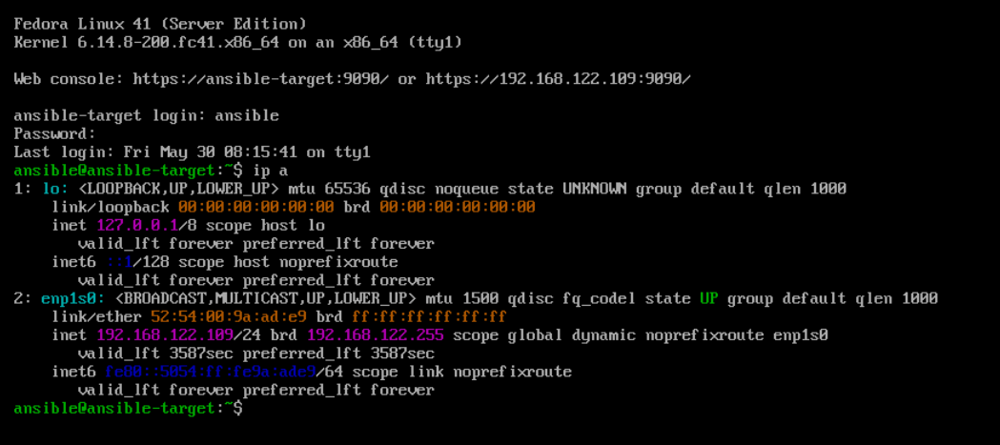
Upewniłem się, że na maszynie znajduje się `tar` oraz `sshd`

I wymieniłem klucze pomiędzy tą maszyną a maszyną główną, na której zostało zainstalowane oprogramowanie ansible.

#### Inwentaryzacja
Stworzyłem dwie dodatkowe maszyny wirtualne: `ansible-target2` i `ansible-target3` i wymieniłem między nimi a maszyną główną klucz ssh

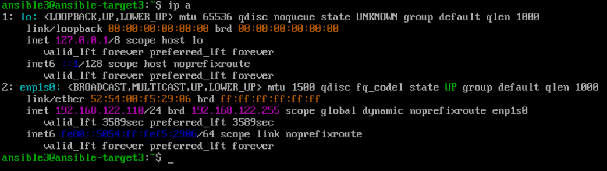
Zmodyfikowałem plik `/etc/hosts` tak, aby dało się połączyć z nowymi maszynami przez zadaną im nazwę


A następnie stworzyłem plik inwentaryzacji `ansible_quickstart/inventory.ini`
```
[Orchestrators]
localhost ansible_connection=local

[Endpoints]
ansibleTarget ansible_host=target1.frostfire.com ansible_user=ansible 
ansibleTarget2 ansible_host=target2.frostfire.com ansible_user=ansible2 
ansibleTarget3 ansible_host=target3.frostfire.com ansible_user=ansible3
```
I wysłałem żądanie `ping` do wszystkich maszyn


#### Zdalne wywoływanie procedur
Stworzyłem `playbook.yaml` o następującej treści:
```yaml
- name: Zdalne wywoływanie procedur
  hosts: all
  become: true
  tasks:
  - name: Ping
    ansible.builtin.ping:

  - name: Copy Inventory
    ansible.builtin.copy:
      src: ./inventory.ini
      dest: ./inventory.ini
  - name: Copy Inventory Again
    ansible.builtin.copy:
      src: ./inventory.ini
      dest: ./inventory.ini

  - name: Update Packages
    ansible.builtin.dnf:
      name: "*"
      state: latest
  - name: Install rngd
    ansible.builtin.dnf:
      name: rngd
      state: latest

  - name: Restart sshd service
    ansible.builtin.service:
      name: sshd
      state: restarted

  - name: Restart rngd service
    ansible.builtin.service:
      name: rngd
      state: restarted
```
I uruchomiłem go poprzez`ansible-playbook -i inventory.ini playbook.yaml --ask-become-pass`

Uwaga: Podczas pierwszego uruchomienia playbooka zadania `Copy Inventory` oraz `Update Packages` wykazywały stan `changed` dla wszystkich maszyn poza `localhost`
#### Zarządzanie stworzonym artefaktem
`playbook2.yaml`
```yaml
- name: Konfiguracja Dockera
  hosts: Orchestrators
  become: true
  tasks:
    - name: "Create docker network: ansible"
      ansible.builtin.docker_network:
        name: ansible
        driver: bridge
    - name: "Create base image"
      ansible.builtin.docker_image:
        name: express-js-build
        source: build
        build:
          path: /home/frosty/MDO2025_INO/ITE/GCL08/KW414502/Sprawozdanie2/lab67/
          dockerfile: Dockerfile.express
    - name: "Create test image"
      ansible.builtin.docker_image:
        name: express-js-test
        source: build
        build:
          path: /home/frosty/MDO2025_INO/ITE/GCL08/KW414502/Sprawozdanie2/lab67/
          dockerfile: Dockerfile.expressTest
    - name: "Create deploy image"
      ansible.builtin.docker_image:
        name: express-js-deploy
        source: build
        build:
          path: /home/frosty/MDO2025_INO/ITE/GCL08/KW414502/Sprawozdanie2/lab67/
          dockerfile: Dockerfile.expressDeploy
    - name: "Pull frostyfire1/express-js-deploy:latest"
      ansible.builtin.docker_image:
        name: frostyfire1/express-js-deploy
        tag: latest
        source: pull
    - name: Start deploy container
      ansible.builtin.docker_container:
        name: express-js
        image: express-js-deploy
        state: started
        ports: "3000:3000"


- name: Zarządzanie stworzonym artefaktem
  hosts: Endpoints
  become: true
  tasks:
  - name: Ensure latest docker is installed
    ansible.builtin.dnf:
      name: docker
      state: latest
  - name: Test host container
    ansible.builtin.uri:
      url: http://192.168.122.56:3000/hello.txt
      method: GET
- name: Zakończenie pracy kontenera
  hosts: Orchestrators
  become: true
  tasks:
    - name: Stop container
      ansible.builtin.docker_container:
        name: express-js-deploy
        state: stopped
```
Wynik uruchomienia


### Lab 9
Zainstalowałem system fedora 41 server i po instalacji pobrałem plik odpowiedzi /root/anaconda-ks.cfg
```
# Generated by Anaconda 41.35
# Generated by pykickstart v3.58
#version=DEVEL

# Keyboard layouts
keyboard --vckeymap=us --xlayouts='us'
# System language
lang en_US.UTF-8

# Network information
network  --bootproto=dhcp --device=enp1s0 --ipv6=auto --activate
network  --hostname=random-hostname

%packages
@^server-product-environment

%end

# Run the Setup Agent on first boot
firstboot --enable

# Generated using Blivet version 3.11.0
ignoredisk --only-use=vda
autopart
# Partition clearing information
clearpart --none --initlabel

# System timezone
timezone Europe/Warsaw --utc

# Root password
rootpw --iscrypted $y$j9T$L/A3hqF5oBy8XuZjP2ZoN1zG$.94S.ze0Hmztkhqdwug.7iucjJYvn8jOldQRYLnzOo6
user --groups=wheel --name=frosty --password=$y$j9T$O6ax/zqeHRaT3PAS2VXsR1La$dqrDV7JaIEpYqwSiVOE.nw93NOKg3JpxZPq4OZ2GiH2 --iscrypted --gecos="frosty"
```

Modyfikacja tego pliku polegała na dodaniu
```
repo --name=docker-ce-stable --baseurl=https://download.docker.com/linux/fedora/41/x86_64/stable --install 
```
przed sekcją `%packages`, dodaniu `docker` do sekcji `%packages` oraz dodaniu sekcji `%post` na koniec pliku
```
%post
systemctl enable docker
%end
```

Ponieważ mój menedżer maszyn wirtualnych to `kvm+qemu` musiałem skorzystać z `virt-install` do instalacji nienadzorowanej.
Użyta komenda
```
virt-install \
  --name fedora-unattended-install \
  --ram 4096 \
  --vcpus 2 \
  --disk size=20,path=/var/lib/libvirt/images/unattended-fedora.qcow2,format=qcow2 \
  --os-variant fedora41 \
  --virt-type=kvm \
  --location /home/frostyfire1/Downloads/Fedora-Server-netinst-x86_64-41-1.4.iso \
  --initrd-inject=/home/frostyfire1/Studia/Semestr6/Devops/frosty-ks.cfg \
  --extra-args="inst.ks=file:/frosty-ks.cfg console=ttyS0" \
  --graphics none \
  --noautoconsole
```
 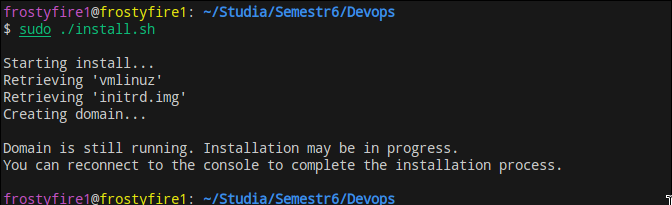
 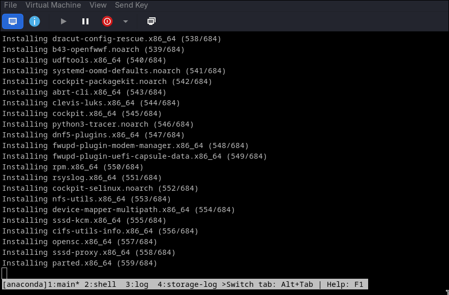
 Weryfikacja, że maszyna działa tak jak należy (logowanie, sprawdzenie serwisu docker)
 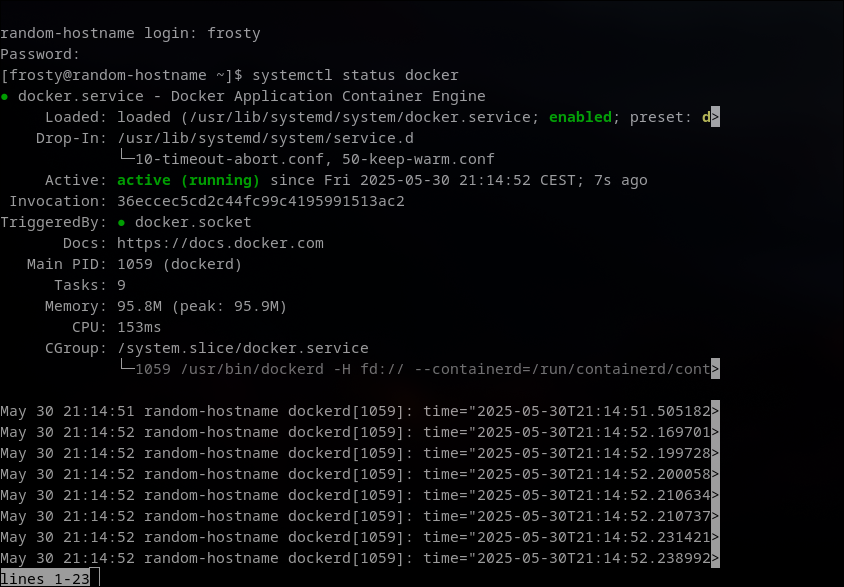

### Lab 10
Weryfikacja działalności minikube
 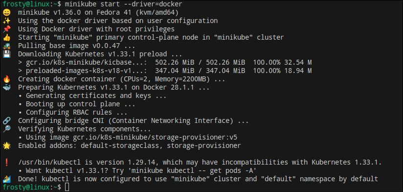
 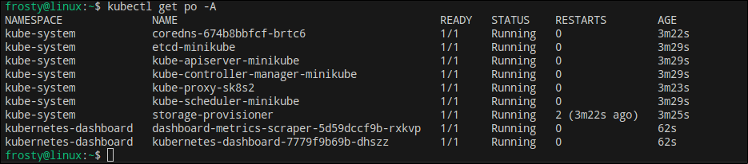
Żeby udostępnić dashboard poza maszynę należy przekierować port 8001
 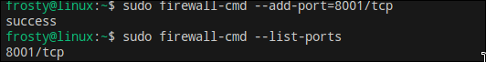
 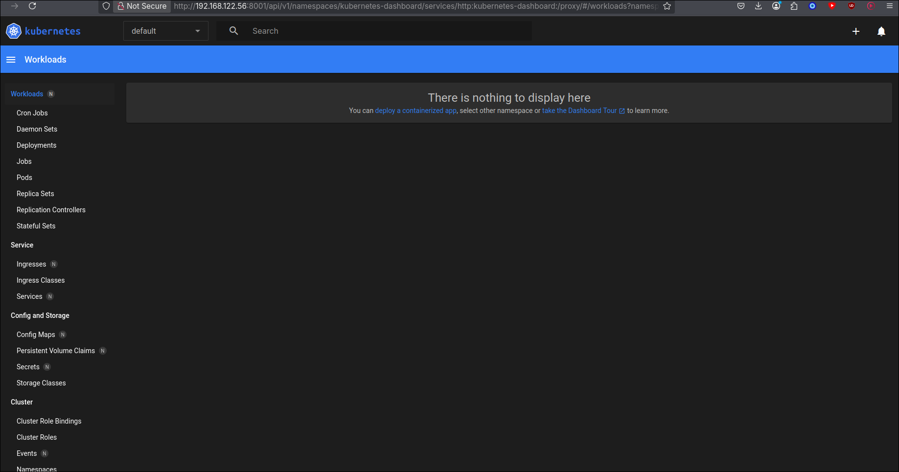
Weryfikacja pracy kontenera
 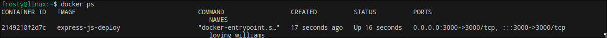
 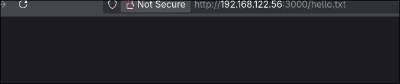
Stworzenie poda przez minikube poleceniem `minikube kubectl run -- expressjs --image=frostyfire1/express-js-deploy --port=3000 --labels app=expresspod`
 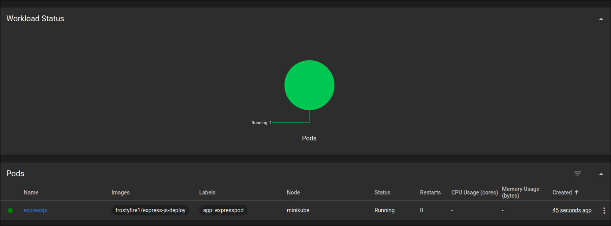
Żeby zweryfikować, że pod działa należy przekierować port poprzez kubectl
`kubectl port-forward pod/expressjs 3000:3000&`
 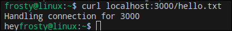
Stworzenie wdrożenia 
```yaml
apiVersion: apps/v1
kind: Deployment
metadata:
  name: expressjs
  labels:
    app: expresspod
spec:
  replicas: 4
  selector:
    matchLabels:
      app: expresspod
  template:
    metadata:
      labels:
        app: expresspod
    spec:
      containers:
      - name: expresspod
        image: frostyfire1/express-js-deploy
        ports:
        - containerPort: 3000
          targetPort: 3000
          nodePort: 30080
```
 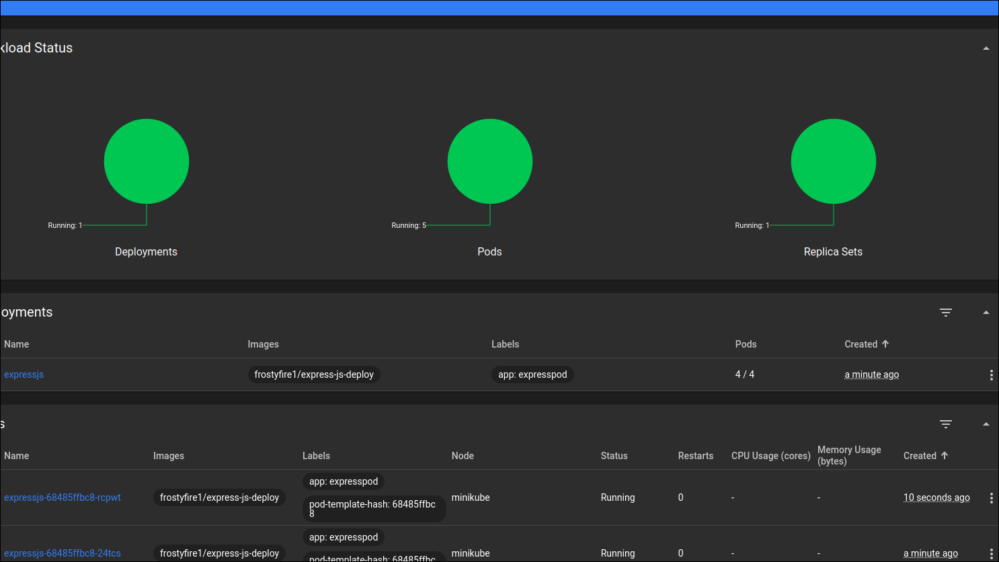
### Lab 11 (nginx)
Do relizacji tych laboratoriów należało pryzgotować trzy obrazy: Dwa z widocznymi zmianami oraz jeden, który zawsze nie działa.
Obraz 1
```docker
FROM nginx:stable
RUN echo '<h1>NGINX GOOD_V1</h1>' > /usr/share/nginx/html/index.ht
```
Obraz 2
```docker
FROM nginx:stable
RUN echo '<h1>NGINX SUPER SPINMATRON-2777</h1>' > /usr/share/nginx/html/index.html
```
Obraz 3
```docker
FROM nginx:stable
RUN rm -rf /etc/nginx
```
Usunięcie aplikacji na pewno spowoduje, że nie będzie działać.
Przygotowane obrazy na dockerhubie
 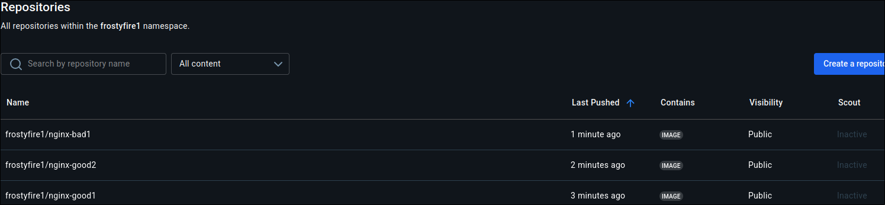
`deployment.yaml`
```yaml
apiVersion: apps/v1
kind: Deployment
metadata:
  name: super-nginx-kocham
spec:
  replicas: 4
  selector:
    matchLabels:
      app: super-nginx
  strategy:
    type: Recreate
  template:
    metadata:
      labels:
        app: super-nginx
        version: "3000"
    spec:
      containers:
      - name: nginx
        image: frostyfire1/nginx-good1:latest
        ports:
        - containerPort: 80
```
LoadBalancer `portService.yaml`
```yaml
apiVersion: v1
kind: Service
metadata:
  name: super-nginx-loadbalancer
spec:
  type: LoadBalancer
  selector:
    app: super-nginx
  ports:
    - protocol: TCP
      port: 80
      targetPort: 80
      nodePort: 30081
```
Skalowanie wdrożenia
4 repliki
 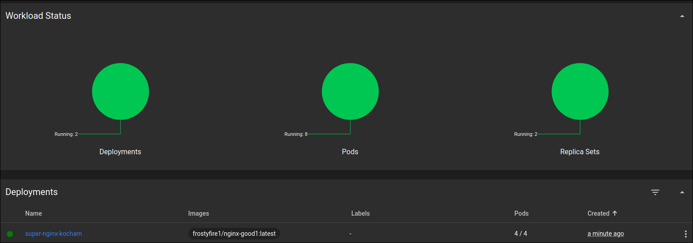

8 replik
 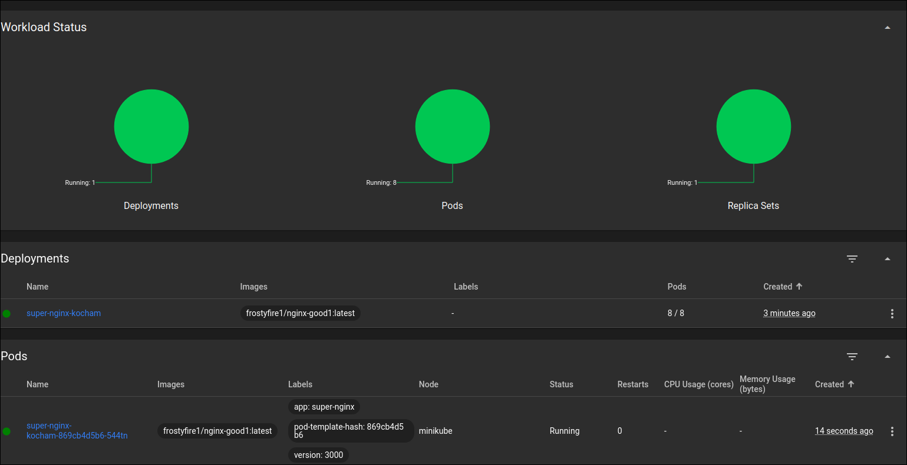

1 replika
 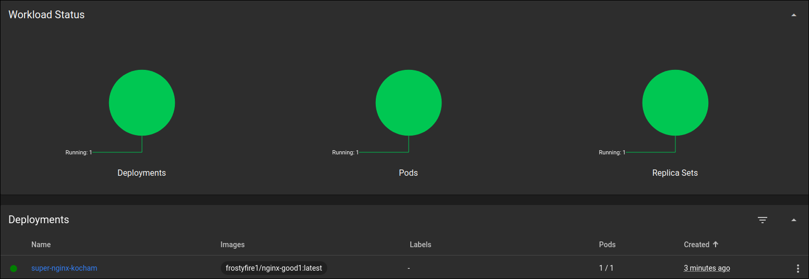

0 replik
 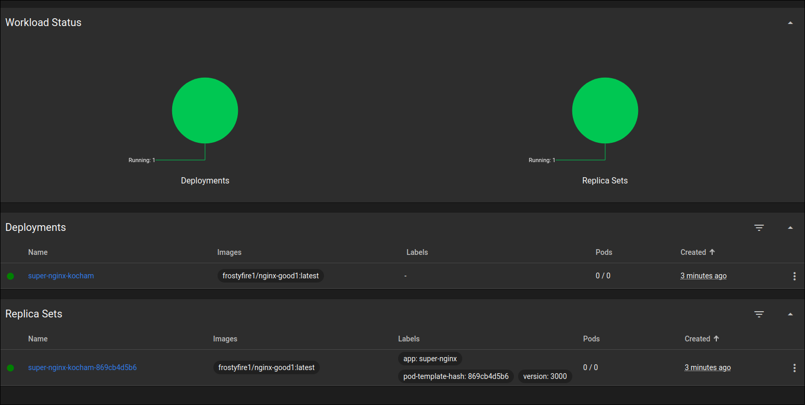

10 replik
 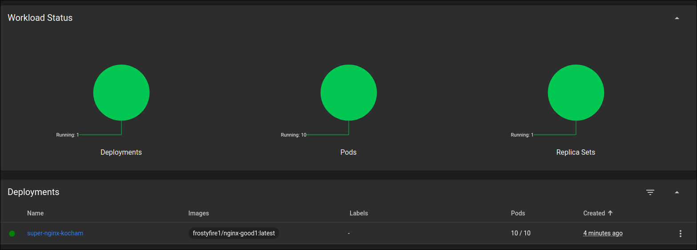

Druga wersja obrazu
Uwaga: Po zaaplikowaniu tego wdrożenia stary Replica Set pozostał aktwyny z 0/0 podami
 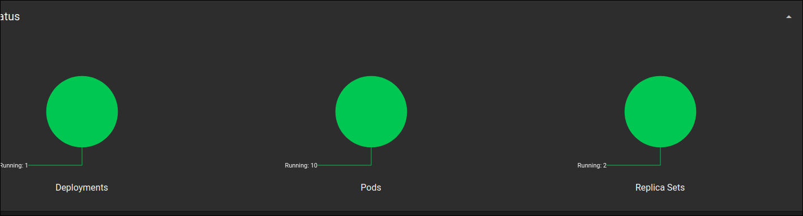

Pierwsza wersja obrazu
 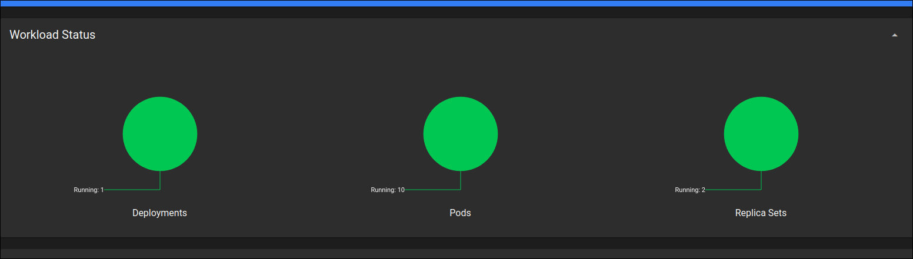

Zła wersja obrazu
 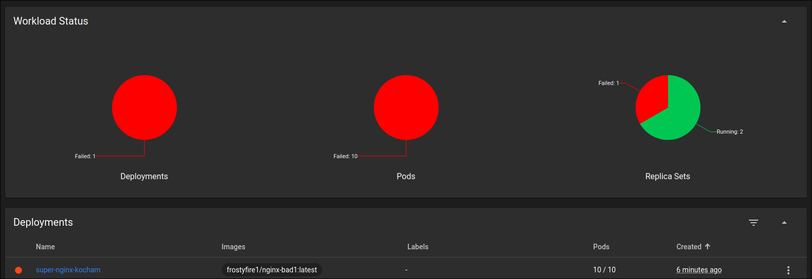
Historia wdrożeń
 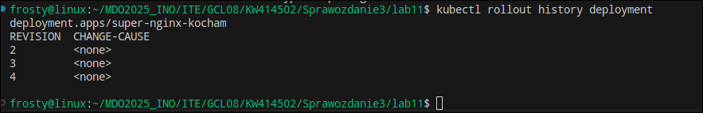
Przywrócenie poprzedniego wdrożenia
 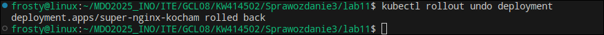
 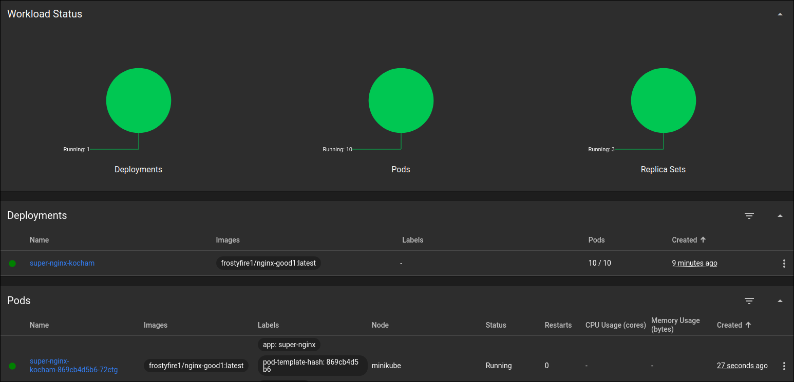
 
Skrypt weryfikujący wdrożenie
```bash
#!/bin/bash

# Setup
DEPLOYMENT_NAME="super-nginx-kocham"
NAMESPACE="default"
SERVICE_NAME="super-nginx-loadbalancer"
EXPECTED_PORT=80
TIMEOUT_SECONDS=60

start_time=$(date +%s)

# Verify that the deployment even exists
echo "Checking deployment '$DEPLOYMENT_NAME'..."
if ! kubectl get deployment "$DEPLOYMENT_NAME" -n "$NAMESPACE" >/dev/null 2>&1; then
  echo "Deployment '$DEPLOYMENT_NAME' not found in namespace '$NAMESPACE'."
  exit 1
fi

# Wait for deployment (max 1 minute)
echo "Waiting for deployment to become ready (timeout: ${TIMEOUT_SECONDS}s)..."
while true; do
  if kubectl rollout status deployment "$DEPLOYMENT_NAME" -n "$NAMESPACE" --timeout=5s >/dev/null 2>&1; then
    break
  fi
  now=$(date +%s)
  elapsed=$(( now - start_time ))
  if (( elapsed > TIMEOUT_SECONDS )); then
    echo "Deployment did not become ready within $TIMEOUT_SECONDS seconds."
    exit 1
  fi
  sleep 2
done

# Check the load balancer
echo "Checking service '$SERVICE_NAME'..."
SERVICE_INFO=$(kubectl get svc "$SERVICE_NAME" -n "$NAMESPACE" -o json 2>/dev/null)
if [[ $? -ne 0 ]]; then
  echo "Service '$SERVICE_NAME' not found."
  exit 1
fi

# Extract service IP and port
SERVICE_IP=$(echo "$SERVICE_INFO" | jq -r '.status.loadBalancer.ingress[0].ip // .spec.clusterIP')
PORT=$(echo "$SERVICE_INFO" | jq -r '.spec.ports[0].port')

echo "Service is accessible at $SERVICE_IP:$PORT"

# Check endpoints
ENDPOINTS=$(kubectl get endpoints "$SERVICE_NAME" -n "$NAMESPACE" -o json | jq -r '.subsets[].addresses[].ip' 2>/dev/null)

if [[ -z "$ENDPOINTS" ]]; then
  echo "No endpoints found for service '$SERVICE_NAME'."
  exit 1
fi

echo "Found endpoints: $ENDPOINTS"

# HTTP check
echo "Checking HTTP response from service..."
RESPONSE=$(curl -s --max-time 5 "http://$SERVICE_IP:$PORT")
if [[ $? -ne 0 ]]; then
  echo "Failed to get HTTP response from service."
  exit 1
fi

echo "Service responded:"
echo "$RESPONSE"

echo "Deployment '$DEPLOYMENT_NAME' verified successfully."
```
Weryfikacja po zmianie deploymentu z 10 na 6 replik oraz wersji 2 na 1
 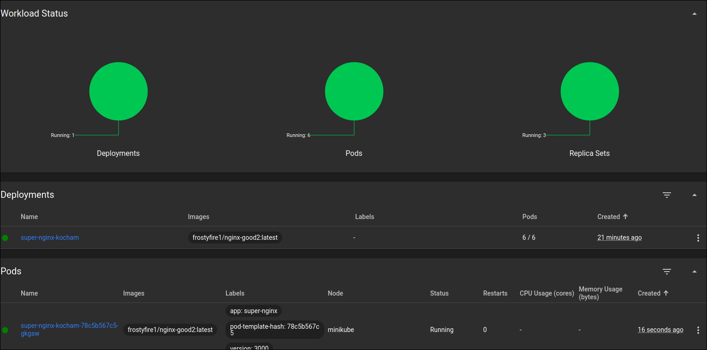
 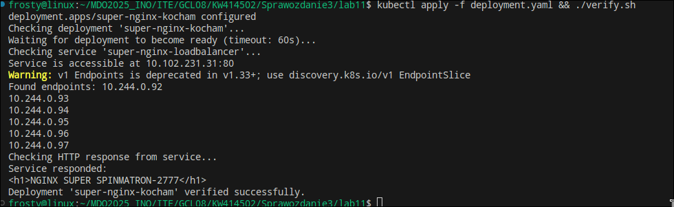
