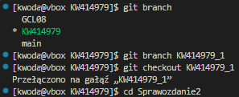
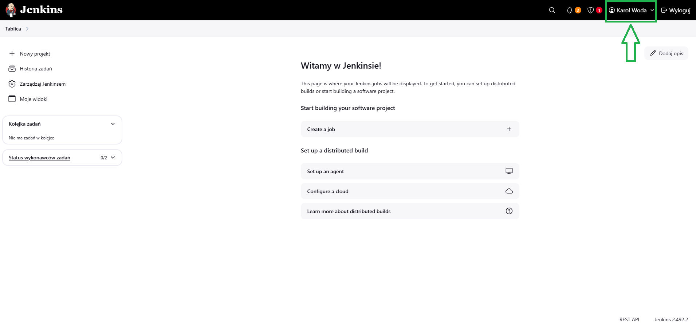
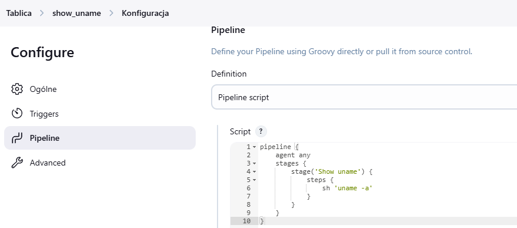
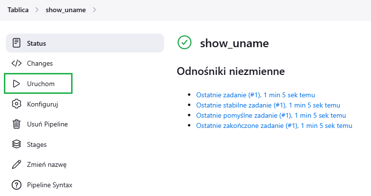
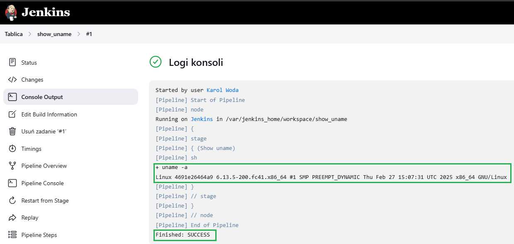

#### Autor:
Imię i nazwisko: Karol Woda\
Nr albumu: 414979\
Wydział: WIMiIP AGH\
Kierunek: ITE\
Rocznik: 2024/2025\
Grupa laboratoryjna: 8 

# Sprawozdanie 2
## Przygotowanie
1. Utworzyłem nowego brancha (`git branch`) od poprzedniego i nazwałem go `KW414979_1`, następnie przełączyłem się używając `git checkout`. Dodałem nowy folder wewnątrz mojego folderu `KW414979` o nazwie `Sprawozdanie2`

    

2. Konfigurację Jenkinsa zgodną z [dokumentacją](https://www.jenkins.io/doc/book/installing/docker/) dokonałem w ramach 4 labolatorium, co udokumentowałem w poprzednim sprawozdaniu.
3. Uruchomiłem ponownie `docker:dind`, gdyż został on wyłączony przez nieoczekiwane zakończenie działania sprzętu komputerowego.

        docker run \
          --name jenkins-docker \
          --rm \
          --detach \
          --privileged \
          --network jenkins \
          --network-alias docker \
          --env DOCKER_TLS_CERTDIR=/certs \
          --volume jenkins-docker-certs:/certs/client \
          --volume jenkins-data:/var/jenkins_home \
          --publish 2376:2376 \
          docker:dind \
          --storage-driver overlay2

4. Otworzyłem `http://localhost:8080/`, zalogowałem się wykorzystując hasło znalezione w logach, którego nie pokazuję z powodów bezpieczeństwa (komenda: `docker logs jenkins-blueocean`). Utworzyłem nowe konto administratora, wybrałem domyślne wtyczki. Wyśwetlony został panel główny z wiadomością powitalną.

    

## Zadanie wstępne: uruchomienie
1. W panelu głównym `Jenkinsa` wybrałem opcję `Nowy projekt` a następnie wybrałem typ `pipeline` i nazwałem `show_uname`. Następnie napisałem pipeline wyświetlający `uname`:

    
  
    *  Treść:

            pipeline {
                agent any
                stages {
                    stage('Show uname') {
                        steps {
                            sh 'uname -a'
                        }
                    }
                }
            }

2. Uruchomiłem `show_uname` a następnie sprawdziłęm działanie w logach

    \
    