#### Autor:
Imię i nazwisko: Karol Woda\
Nr albumu: 414979\
Wydział: WIMiIP AGH\
Kierunek: ITE\
Rocznik: 2024/2025\
Grupa laboratoryjna: 8 

# Sprawozdanie 2
## Przygotowanie
1. Utworzyłem nowego brancha (`git branch`) od poprzedniego i nazwałem go `KW414979_1`, następnie przełączyłem się używając `git checkout`. Dodałem nowy folder wewnątrz mojego folderu `KW414979` o nazwie `Sprawozdanie2`

    

2. Konfigurację Jenkinsa zgodną z [dokumentacją](https://www.jenkins.io/doc/book/installing/docker/) dokonałem w ramach 4 labolatorium, co udokumentowałem w poprzednim sprawozdaniu.
3. Uruchomiłem ponownie `docker:dind`, gdyż został on wyłączony przez nieoczekiwane zakończenie działania sprzętu komputerowego.

        docker run \
          --name jenkins-docker \
          --rm \
          --detach \
          --privileged \
          --network jenkins \
          --network-alias docker \
          --env DOCKER_TLS_CERTDIR=/certs \
          --volume jenkins-docker-certs:/certs/client \
          --volume jenkins-data:/var/jenkins_home \
          --publish 2376:2376 \
          docker:dind \
          --storage-driver overlay2

4. Otworzyłem `http://localhost:8080/`, zalogowałem się wykorzystując hasło znalezione w logach, którego nie pokazuję z powodów bezpieczeństwa (komenda: `docker logs jenkins-blueocean`). Utworzyłem nowe konto administratora, wybrałem domyślne wtyczki. Wyśwetlony został panel główny z wiadomością powitalną.

    

## Zadanie wstępne: uruchomienie
1. W panelu głównym `Jenkinsa` wybrałem opcję `Nowy projekt` a następnie wybrałem typ `pipeline` i nazwałem `show_uname`. Następnie napisałem pipeline wyświetlający `uname`:

    
  
    *  Treść:

            pipeline {
                agent any
                stages {
                    stage('Show uname') {
                        steps {
                            sh 'uname -a'
                        }
                    }
                }
            }

2. Uruchomiłem `show_uname` a następnie sprawdziłęm działanie w logach

    \
    

3. Analogicznie (jak w krokach 1-2) postąpiłem dla projektu zwracającego błąd gdy godzina jest nieparzysta:

    *  Treść pipeline'a `odd_hour`:

            pipeline {
                agent any

                stages {
                    stage('Sprawdzam godzinę...') {
                        steps {
                            script {
                                def godzina = new Date().format('H') as Integer
                                echo "Aktualna godzina: ${godzina}"

                                if (godzina % 2 != 0) {
                                    error("Godzina jest nieparzysta (${godzina}) — przerywam pipeline!")
                                } else {
                                    echo "Godzina jest parzysta - brak błędu."
                                }
                            }
                        }
                    }
                }
            }

    * Wynik uruchomienia:

        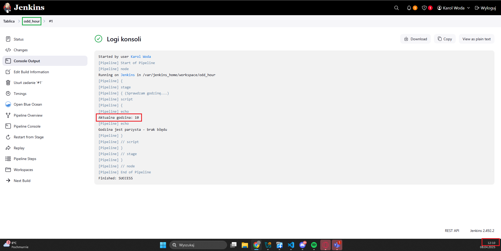

        Jak można zauważyć godzina wyświetlana jako efekt pipeline'a różni się od godziny wyświetlanej przez mój sprzęt komputerowy, jest to spowodowane tym że Jenkins działa w innej strefie czasowej, aby ustawić Polską strefę czasową można użyć:

            def godzina = new Date().format('H', TimeZone.getTimeZone('Europe/Warsaw')) as Integer
        
    * Aby sprawdzić co się stanie jak będzie nieparzysta godzina, ustawiłem strefę czasową na `America/Sao_Paulo`:

        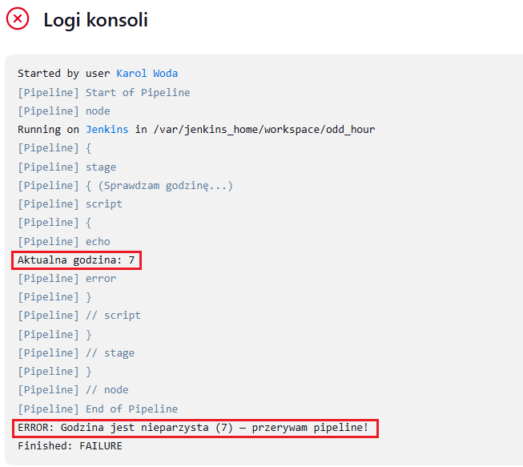

4. Analogicznie (jak w krokach 1-2) stworzyłem pipeline, który pobiera w projekcie obraz kontenera ubuntu stosując `docker pull`

    *  Treść pipeline'a `ubuntu_image`:

            pipeline {
                agent any

                stages {
                    stage('Pobierz obraz Ubuntu') {
                        steps {
                            script {
                                sh 'docker pull ubuntu:latest'
                            }
                        }
                    }
                }
            }

    * Wynik uruchomienia:

        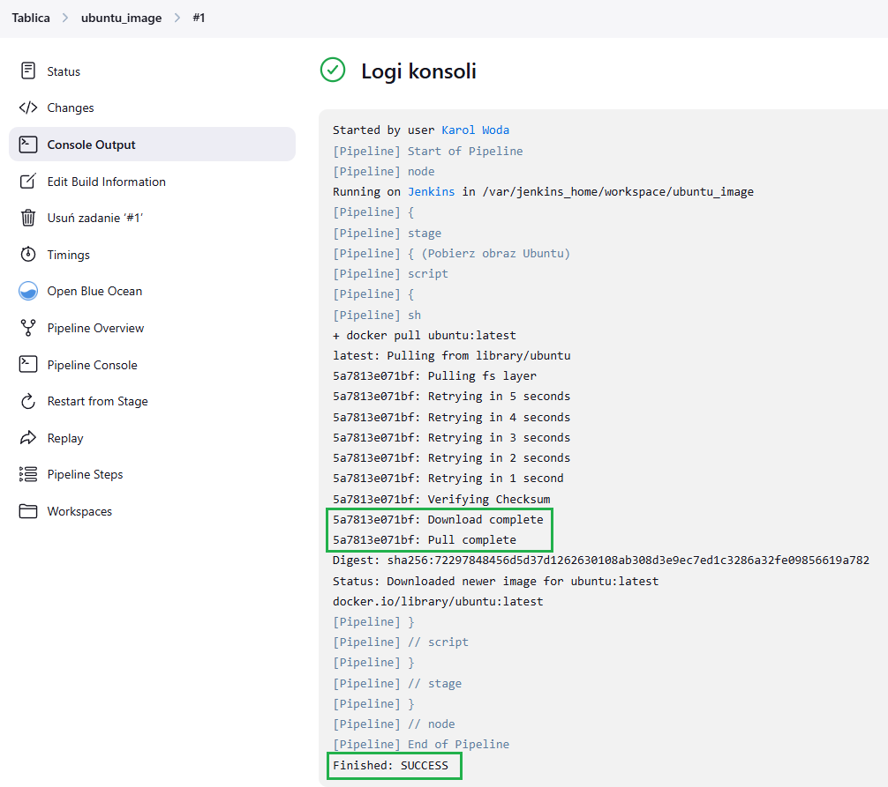
    
## Zadanie wstępne: obiekt typu pipeline
Przystąpiłem do stworzenia projektu, w którym pipeline'm sklonowałem repozytorium przedmiotowe z uwzględnieniem własnej gałęzi, następnie w kolejnym stage'u zbudowałem obraz z `Dockerfile.builder` który był odpowiedzialny za zbudowanie irssi.
* Treść pipeline'a `repo+Dockerfile`

    pipeline {
        agent any

        environment {
            REPO_URL = 'https://github.com/InzynieriaOprogramowaniaAGH/MDO2025_INO.git'
            BRANCH_NAME = 'KW414979_1'
            DOCKER_IMAGE_NAME = 'irssi_builder'
            DOCKERFILE_NAME = 'ITE/GCL08/KW414979/Sprawozdanie_1/Dockerfile.builder'
        }

        stages {
            stage('Clone repo') {
                steps {
                    git branch: "${BRANCH_NAME}",
                        url: "${REPO_URL}"
                }
            }
            stage('Build Docker Image') {
                steps {
                    script {
                        dockerImage = docker.build("${DOCKER_IMAGE_NAME}", "-f ${DOCKERFILE_NAME} .")
                    }
                }
            }
            stage('Optional') {
                steps {
                    echo "Docker image ${DOCKER_IMAGE_NAME} built successfully"
                }
            }
        }
        post {
            always {
                echo 'Pipeline finished!'
            }
        }
    }

* Klonowanie repozytorium

* Budowanie obrazu

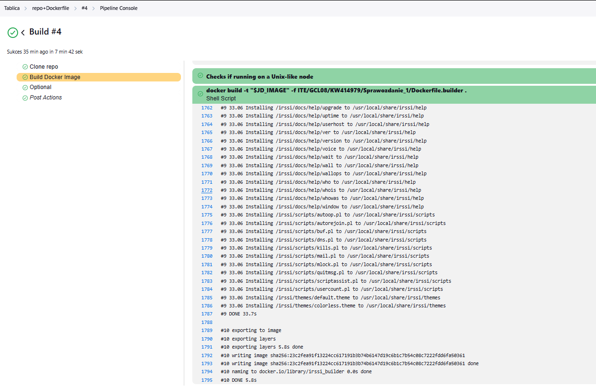

Następnie uruchomiłem pipeline'a ponownie, tym razem czas wykonania był znacząco krótszy (wcześniej: `7 min 42 sek` --> teraz: `5.2 sek`)

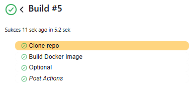

## Kompletny pipeline

Jako aplikację do wdrożenia wybrałem [bat](https://github.com/sharkdp/bat), która znajduje się na licencjach `MIT` lub `Apache-2.0`.\
`Bat` to narzędzie terminalowe stworzone w Rust, które jest ulepszoną wersją klasycznego linuksowego polecenia cat, służy do wyświetlania zawartości plików w terminalu, ale z dodatkowymi funkcjami, które czynią go znacznie bardziej czytelnym i wygodnym w codziennej pracy - oprócz tego pozwala chociażby łączyć dwa pliki w jeden wykorzystując polecenie:

    bat in.txt in2.txt > out.txt

To polecenie zostanie wykorzystane w etapie `Deploy`, w celu sprowadzenia aplikacji do konkretnego zadania.

### Build

Rozpocząłem od zbudowania `Dockerfile.builder`, którego zadaniem jest zbudowanie aplikacji - według wytycznych które znalazłem w dokumentacji `bat`:

    FROM rust:1.75-slim

    RUN apt-get update && apt-get install -y \
        git

    WORKDIR /usr/src
    RUN git clone --recursive https://github.com/sharkdp/bat
    WORKDIR /usr/src/bat
    RUN cargo install --path . --locked

W celu instalacji potrzebnych rozszerzeń i zależności nie utworzyłem osobnego `Dockerfile` gdyż jedynie do instalacji potrzebujemy `git` by sciągnąć zawartość repozytorium aplikacji. Pozostały proces buildu opiera się o podstawowe funkcjonalości dostępne w `rust`.

W `pipelinie` obraz jest budowany na podstawie powyższego `Dockerfile.builder`:

    stage('Build') {
        steps {
            script {
                dockerImage = docker.build("bat_builder", "-f ITE/GCL08/KW414979/Sprawozdanie2/Dockerfile.bat_builder .")
            }
        }
    }

Wynik:

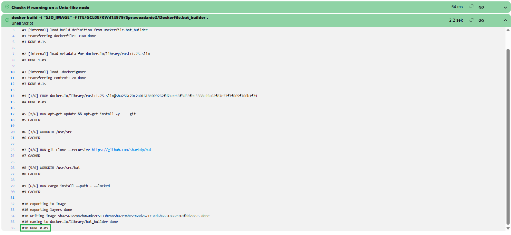

### Test

Utworzyłem `Dokerfile.tester`, który uruchamia testy dla aplikacji (wg wytycznych znalezionych w dokumentacji aplikacji):

    FROM bat_builder

    WORKDIR /usr/src/bat
    RUN cargo test

W `pipeline`:

    stage('Test') {
        steps {
            script {
                dockerImage = docker.build("bat_tester", "-f ITE/GCL08/KW414979/Sprawozdanie2/Dockerfile.bat_tester .")
            }
        }
    }

Wynik:

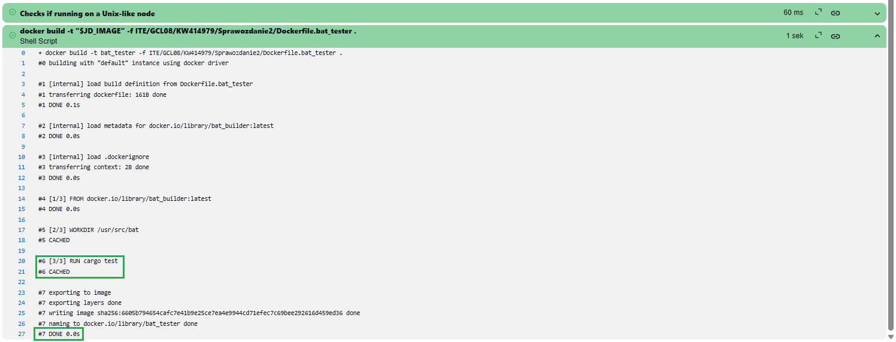

### Deploy

Utworzyłem `Dockerfile.deployer`:

    FROM rust:1.75-slim

    COPY --from=bat_builder /usr/src/bat/target/release/bat /usr/local/bin/bat
    CMD ["sh", "-c", "bat /vol/bat_in/in.txt /vol/bat_in/in2.txt > /vol/bat_out/out.txt"]

Najpierw kopiowany jest plik binarny, a następnie przy pomocy volumenów wejściowych i wyjściowych wykonywane jest początkowo wybrane polecenie łączące pliki. W tym celu stworzyłem wolumeny wejściowy i wyjściowy:

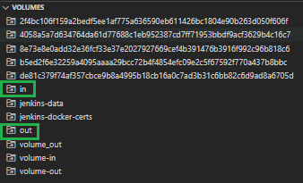

W `pipeline`:

    stage('Deploy') {
        steps {
            script {
                dockerImage = docker.build("bat_deployer", "-f ITE/GCL08/KW414979/Sprawozdanie2/Dockerfile. bat_deployer .")
                sh """
                docker run --rm \
                    -v \$(pwd)/ITE/GCL08/KW414979/Sprawozdanie2/bat_in:/vol/bat_in \
                    -v \$(pwd)/ITE/GCL08/KW414979/Sprawozdanie2/bat_out:/vol/bat_out \
                            bat_deployer
                """
            }
        }
    }

Wynik:

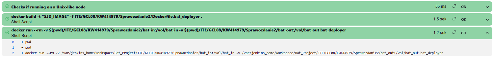

### Publish

Utworzyłem nowy `credential` w `Jenkins`, który zawiera moje dane logowania do Dockerhub:

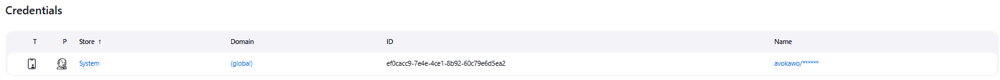

W `pipeline` zalogowałem się, otagowałem obraz a następnie pushnołem:

    stage('Publish') {
        steps {
            script {
                // Logowanie do DockerHuba
                withCredentials([usernamePassword(credentialsId: "${DOCKERHUB_CREDENTIALS}", usernameVariable: 'DOCKER_USER', passwordVariable: 'DOCKER_PASS')]){
                // Logowanie bez interpolacji
                    sh '''
                        echo $DOCKER_PASS | docker login -u $DOCKER_USER --password-stdin
                    '''
                }
                // Tagowanie obrazu
                sh "docker tag bat_deployer ${DOCKERHUB_REPO}:latest"
                // Push na DockerHuba
                sh "docker push ${DOCKERHUB_REPO}:latest"
            }
        }
    }

Wynik:

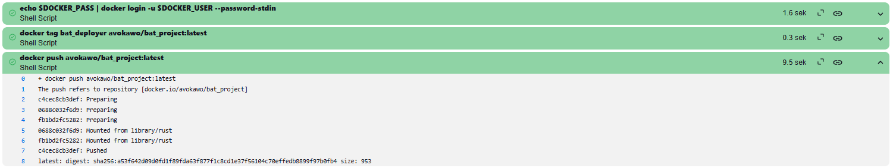

Obraz znajduje się w publicznym [repozytorium](https://hub.docker.com/repository/docker/avokawo/bat_project/general)  na `Dockerhub`:

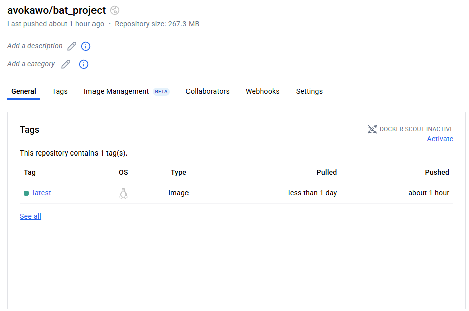

### Pełny pipeline:

Założenia:

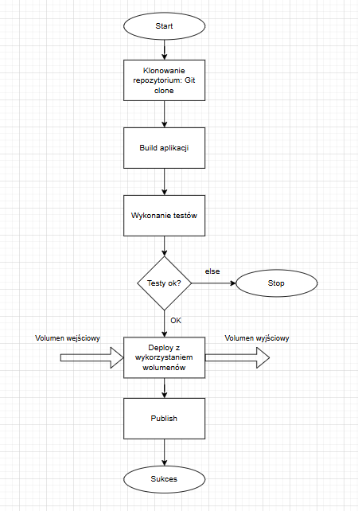

`pipeline`:

    pipeline {
        agent any

        environment {
            REPO_URL = 'https://github.com/InzynieriaOprogramowaniaAGH/MDO2025_INO.git'
            BRANCH_NAME = 'KW414979_1'
            DOCKERHUB_CREDENTIALS = 'ef0cacc9-7e4e-4ce1-8b92-60c79e6d5ea2'
            DOCKERHUB_REPO = 'avokawo/bat_project'
        }

        stages {
            stage('Clone repo') {
                steps {
                    git branch: "${BRANCH_NAME}",
                        url: "${REPO_URL}"
                }
            }
            stage('Build') {
                steps {
                    script {
                        dockerImage = docker.build("bat_builder", "-f ITE/GCL08/KW414979/Sprawozdanie2/Dockerfile.bat_builder .")
                    }
                }
            }
            stage('Test') {
                steps {
                    script {
                        dockerImage = docker.build("bat_tester", "-f ITE/GCL08/KW414979/Sprawozdanie2/Dockerfile.bat_tester .")
                    }
                }
            }
            stage('Deploy') {
                steps {
                    script {
                        dockerImage = docker.build("bat_deployer", "-f ITE/GCL08/KW414979/Sprawozdanie2/Dockerfile. bat_deployer .")
                        sh """
                        docker run --rm \
                            -v \$(pwd)/ITE/GCL08/KW414979/Sprawozdanie2/bat_in:/vol/bat_in \
                            -v \$(pwd)/ITE/GCL08/KW414979/Sprawozdanie2/bat_out:/vol/bat_out \
                            bat_deployer
                        """
                    }
                }
            }
            stage('Publish') {
                steps {
                    script {
                        // Logowanie do DockerHuba
                        withCredentials([usernamePassword(credentialsId: "${DOCKERHUB_CREDENTIALS}", usernameVariable: 'DOCKER_USER', passwordVariable: 'DOCKER_PASS')]){
                        // Logowanie bez interpolacji
                            sh '''
                                echo $DOCKER_PASS | docker login -u $DOCKER_USER --password-stdin
                            '''
                        }
                        // Tagowanie obrazu
                        sh "docker tag bat_deployer ${DOCKERHUB_REPO}:latest"
                        // Push na DockerHuba
                        sh "docker push ${DOCKERHUB_REPO}:latest"
                    }
                }
            }
        }
        post {
            always {
                echo 'Pipeline finished.'
            }
        }
    }

Wynik:

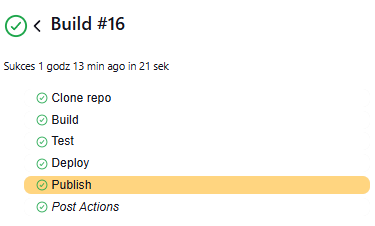