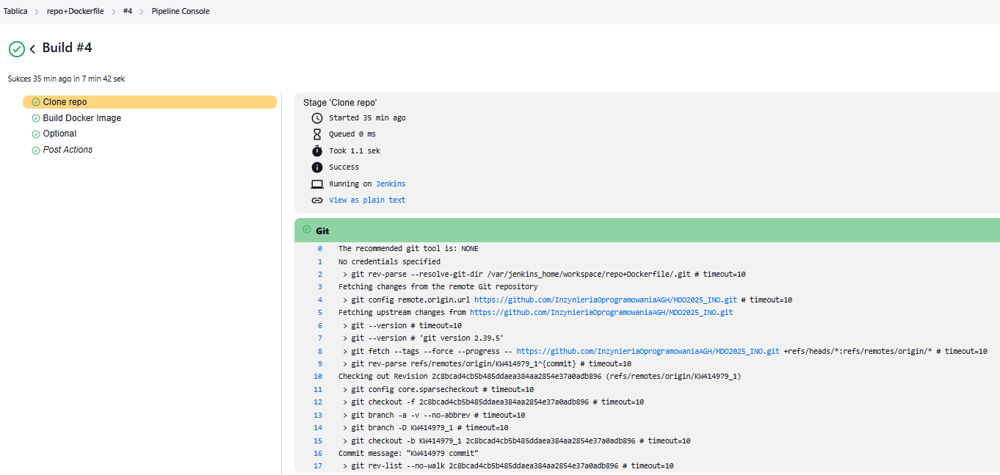

#### Autor:
Imię i nazwisko: Karol Woda\
Nr albumu: 414979\
Wydział: WIMiIP AGH\
Kierunek: ITE\
Rocznik: 2024/2025\
Grupa laboratoryjna: 8 

# Sprawozdanie 2
## Przygotowanie
1. Utworzyłem nowego brancha (`git branch`) od poprzedniego i nazwałem go `KW414979_1`, następnie przełączyłem się używając `git checkout`. Dodałem nowy folder wewnątrz mojego folderu `KW414979` o nazwie `Sprawozdanie2`

    

2. Konfigurację Jenkinsa zgodną z [dokumentacją](https://www.jenkins.io/doc/book/installing/docker/) dokonałem w ramach 4 labolatorium, co udokumentowałem w poprzednim sprawozdaniu.
3. Uruchomiłem ponownie `docker:dind`, gdyż został on wyłączony przez nieoczekiwane zakończenie działania sprzętu komputerowego.

        docker run \
          --name jenkins-docker \
          --rm \
          --detach \
          --privileged \
          --network jenkins \
          --network-alias docker \
          --env DOCKER_TLS_CERTDIR=/certs \
          --volume jenkins-docker-certs:/certs/client \
          --volume jenkins-data:/var/jenkins_home \
          --publish 2376:2376 \
          docker:dind \
          --storage-driver overlay2

4. Otworzyłem `http://localhost:8080/`, zalogowałem się wykorzystując hasło znalezione w logach, którego nie pokazuję z powodów bezpieczeństwa (komenda: `docker logs jenkins-blueocean`). Utworzyłem nowe konto administratora, wybrałem domyślne wtyczki. Wyśwetlony został panel główny z wiadomością powitalną.

    

## Zadanie wstępne: uruchomienie
1. W panelu głównym `Jenkinsa` wybrałem opcję `Nowy projekt` a następnie wybrałem typ `pipeline` i nazwałem `show_uname`. Następnie napisałem pipeline wyświetlający `uname`:

    
  
    *  Treść:

            pipeline {
                agent any
                stages {
                    stage('Show uname') {
                        steps {
                            sh 'uname -a'
                        }
                    }
                }
            }

2. Uruchomiłem `show_uname` a następnie sprawdziłęm działanie w logach

    \
    

3. Analogicznie (jak w krokach 1-2) postąpiłem dla projektu zwracającego błąd gdy godzina jest nieparzysta:

    *  Treść pipeline'a `odd_hour`:

            pipeline {
                agent any

                stages {
                    stage('Sprawdzam godzinę...') {
                        steps {
                            script {
                                def godzina = new Date().format('H') as Integer
                                echo "Aktualna godzina: ${godzina}"

                                if (godzina % 2 != 0) {
                                    error("Godzina jest nieparzysta (${godzina}) — przerywam pipeline!")
                                } else {
                                    echo "Godzina jest parzysta - brak błędu."
                                }
                            }
                        }
                    }
                }
            }

    * Wynik uruchomienia:

        

        Jak można zauważyć godzina wyświetlana jako efekt pipeline'a różni się od godziny wyświetlanej przez mój sprzęt komputerowy, jest to spowodowane tym że Jenkins działa w innej strefie czasowej, aby ustawić Polską strefę czasową można użyć:

            def godzina = new Date().format('H', TimeZone.getTimeZone('Europe/Warsaw')) as Integer
        
    * Aby sprawdzić co się stanie jak będzie nieparzysta godzina, ustawiłem strefę czasową na `America/Sao_Paulo`:

        

4. Analogicznie (jak w krokach 1-2) stworzyłem pipeline, który pobiera w projekcie obraz kontenera ubuntu stosując `docker pull`

    *  Treść pipeline'a `ubuntu_image`:

            pipeline {
                agent any

                stages {
                    stage('Pobierz obraz Ubuntu') {
                        steps {
                            script {
                                sh 'docker pull ubuntu:latest'
                            }
                        }
                    }
                }
            }

    * Wynik uruchomienia:

        
    
## Zadanie wstępne: obiekt typu pipeline
Przystąpiłem do stworzenia projektu, w którym pipeline'm sklonowałem repozytorium przedmiotowe z uwzględnieniem własnej gałęzi, następnie w kolejnym stage'u zbudowałem obraz z `Dockerfile.builder` który był odpowiedzialny za zbudowanie irssi.
* Treść pipeline'a `repo+Dockerfile`

    pipeline {
        agent any

        environment {
            REPO_URL = 'https://github.com/InzynieriaOprogramowaniaAGH/MDO2025_INO.git'
            BRANCH_NAME = 'KW414979_1'
            DOCKER_IMAGE_NAME = 'irssi_builder'
            DOCKERFILE_NAME = 'ITE/GCL08/KW414979/Sprawozdanie_1/Dockerfile.builder'
        }

        stages {
            stage('Clone repo') {
                steps {
                    git branch: "${BRANCH_NAME}",
                        url: "${REPO_URL}"
                }
            }
            stage('Build Docker Image') {
                steps {
                    script {
                        dockerImage = docker.build("${DOCKER_IMAGE_NAME}", "-f ${DOCKERFILE_NAME} .")
                    }
                }
            }
            stage('Optional') {
                steps {
                    echo "Docker image ${DOCKER_IMAGE_NAME} built successfully"
                }
            }
        }
        post {
            always {
                echo 'Pipeline finished!'
            }
        }
    }

* Klonowanie repozytorium

* Budowanie obrazu

Następnie uruchomiłem pipeline'a ponownie, tym razem czas wykonania był znacząco krótszy (wcześniej: `7 min 42 sek` --> teraz: `5.2 sek`)

