#### Autor:
Imię i nazwisko: Karol Woda\
Nr albumu: 414979\
Wydział: WIMiIP AGH\
Kierunek: ITE\
Rocznik: 2024/2025\
Grupa laboratoryjna: 8 

# Sprawozdanie 3

Utworzyłem nową gałąź i utworzyłem nowy folder `Sprawozdanie3` przeznaczony na pliki związane z tym sprawozdaniem.

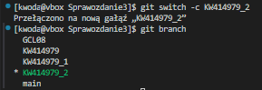

## Instalacja nienadzorowana systemu

Najpierw rozpocząłem od znalezienia pliku `anaconda-ks.cfg` wewnątrz używanego przezemnie serwera, gdyż jest on potrzebny by przeprowadzić instalację w trybie nienadzorowanym.

Plik zazwyczj znajduje się: `/root/anaconda-ks.cfg`, lecz jest on niedostępny z poziomu zwykłego użytkownika, więc konieczne było stosowanie `sudo`.

Skopiowałem plik poprzez komendę:

    sudo cp /root/anaconda-ks.cfg /home/kwoda/MDO2025_INO/ITE/GCL08/KW414979/Sprawozdanie3/

A następnie, zauważywszy że nie posiadam do niego dostępu, wykonałem:

    sudo chown kwoda:kwoda /home/kwoda/MDO2025_INO/ITE/GCL08/KW414979/Sprawozdanie3/

Wykonałem commit i push do repozytorium, początkowo bez żadnych zmian w pliku. Utworzyłem nową maszynę wirttualną w `Oracle VirtualBox` podając to ISO, które uprzednio posłużyło mi do zainstalowania obecnie wykorzystywanej maszyny wirtualnej.

## Ansible

Utworzyłem nową maszynę wirtualną i nazwałem ją `ansible-target`, podałem ISO `Fedora-Everything-netinst-x86_64-41-1.4`, system operacyjny Fedora, pamięć RAM i dysk zostawiłem bez zmian. Odpaloiłem instalację. Ustawiłem nazwę hosta na `ansible-target` 

Utworzyłem użytkownika `ansible`

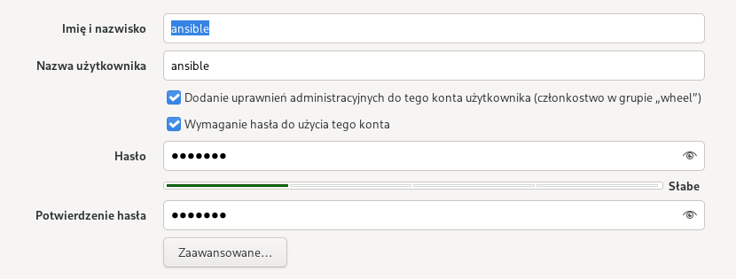

Wybrałem dysk i rozpocząłem instalację. Po zakończeniu zalogowałem się na konto `ansible`, a następnie zainstalowałem `sshd` i `tar`, a nstępnie sprawdziłem status ssh:

    sudo dnf install -y openssh-server tar
    sudo systemctl enable --now sshd
    sudo systemctl status sshd

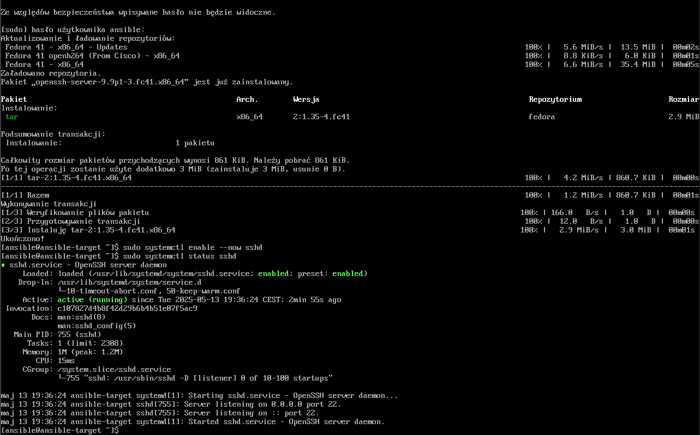

Stworzyłem migawkę nowo utworzonej maszyny. Klikając w `Virtualbox` na odpowiednią maszynę i w zakładce Migawki: Zrób.

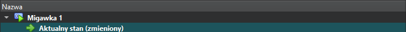

Na starej maszynie zainstalowałem `Ansible` i sprawdziłem jego wersję:

    sudo dnf install -y ansible

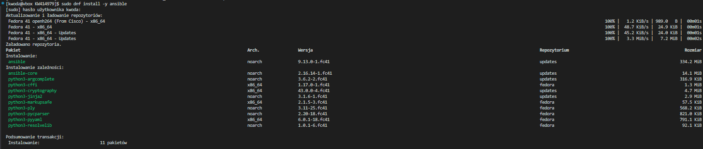

    ansible --version

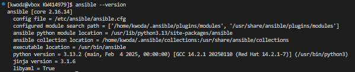

Spróbowałem nawiązać połączenie pomiędzy maszynami wirtualnymi, po wielu próbach ustalenia przyczyny niepowodzeń - udało się to. Problemem było funkcjonowanie obydu maszyn w sieci NAT co sprawiało, że obie posiadają identyczne ip. By temu zaradzić ustawiłem przekierowanie portów. W ustawieniach maszyny `ansible-target`, zakładka `Networking` -> `Przekierowanie portów` -> `+`.

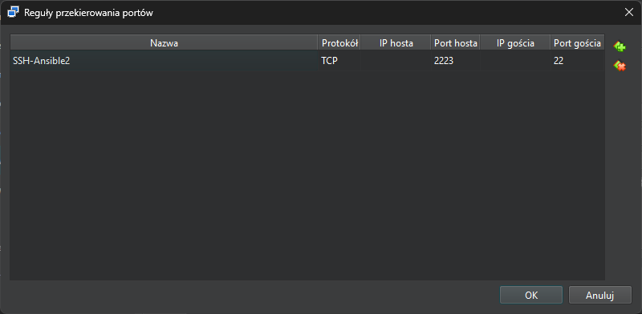

Użyłem komendy:
    
    ssh ansible@10.0.2.2 -p 2223

nawiązując połączenie:

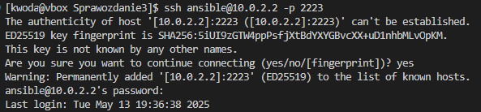

By podawanie hasła nie było konieczne, wygenerowałem klucze:

    ssh-keygen

nazwałem je `ansible_ed25519`, a następnie wymieniłem klucze pomiędzy maszynami:

    ssh-copy-id -i ~/.ssh/ansible_ed25519.pub -p 2223 ansible@10.0.2.2

Ponownie spróbowałem nawiązać połączenie:

    ssh -i ~/.ssh/ansible_ed25519 -p 2223 ansible@10.0.2.2

tym razem nie proszono mnie o podanie hasła.

## Kubernetes

### Instalacja

Rozpocząłem od zainstalowania `minikube` wg [dokumentacji](https://minikube.sigs.k8s.io/docs/start/?arch=%2Fwindows%2Fx86-64%2Fstable%2F.exe+download)

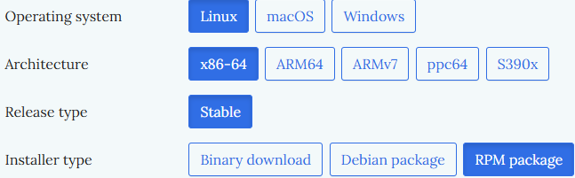

    curl -LO https://storage.googleapis.com/minikube/releases/latest/minikube-latest.x86_64.rpm
    sudo rpm -Uvh minikube-latest.x86_64.rpm

następnie:

    minikube start

co, po zmodyfikowaniu ilości procesorów maszyny wirtualnej, dało efekt:

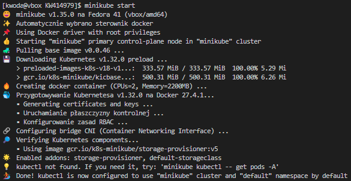

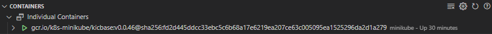

By mieć wygodny dostęp do `kubectl` ustawiłem `alias`, edytując plik `~/.bashrc`:

    nano ~/.bashrc

Na końcu pliku dodałem:

    alias kubectl="minikube kubectl --"

Następnie uzyskałem dostęp do klastra komendą:

    kubectl get po -A

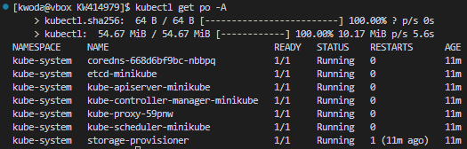

Otworzyłem dashboard:

    minikube dashboard

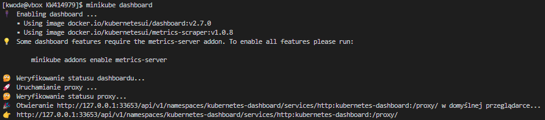

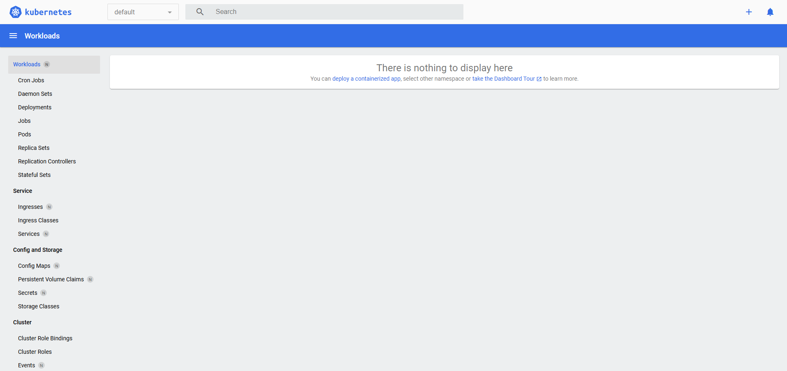

Kubernetes to system orkiestracji kontenerów, który automatyzuje wdrażanie, skalowanie i zarządzanie aplikacjami kontenerowymi. Poniżej zawarłem omówienie najważniejszych koncepcji i obiektów, które Kubernetes udostępnia jako „funkcje wyprowadzane” – czyli zasoby, które użytkownik może zadeklarować i z których Kubernetes tworzy działające jednostki.

- `Pod`

    - Pod to najmniejsza i podstawowa jednostka w Kubernetesie. Reprezentuje jeden lub więcej kontenerów, które są uruchamiane razem na tym samym hoście i dzielą ten sam:

        - adres IP,
        - przestrzeń nazw (namespace),
        - wolumeny (do współdzielonego zapisu danych).

    - W praktyce: jeśli masz mikroserwis, który składa się np. z kontenera aplikacji i kontenera z logującym agentem, możesz je uruchomić w jednym Podzie.

- `Deployment`

    - Deployment to deklaracja, która mówi Kubernetesowi, ile instancji danego Podu ma być uruchomionych, jak je aktualizować i jak przywracać je po awarii.

    - Funkcje:

        - automatyczne rollouty i rollbacki,
        - skalowanie replik (np. 5 kopii tej samej aplikacji),
        - zastępowanie starszych wersji nowymi.

    - W praktyce: definiujesz Deployment z obrazem Docker, a Kubernetes sam zarządza jego wdrożeniem i dostępnością.

- `ReplicaSet`

    - ReplicaSet to mechanizm, który zapewnia, że określona liczba replik (kopii) Podu jest zawsze uruchomiona.

    - Uwaga: zwykle nie tworzysz ReplicaSet ręcznie – jest automatycznie zarządzany przez Deployment.

- `Service`

    - Service to sposób na udostępnienie Twoich Podów innym Podom lub światu zewnętrznemu. Zapewnia:

        - trwały adres IP wewnątrz klastra,
        - mechanizm load balancingu dla Podów,
        - abstrakcję niezależną od lokalizacji Podów.

    - Rodzaje:

        - ClusterIP (domyślny) – tylko dostęp wewnętrzny,
        - NodePort – dostęp z zewnątrz przez konkretny port hosta,
        - LoadBalancer – integracja z chmurą i zewnętrzny load balancer.

- `Ingress`

    - Ingress to bardziej zaawansowany sposób ekspozycji aplikacji HTTP/S do świata zewnętrznego. Pozwala na:

        - routing oparty na ścieżkach i hostach,
        - TLS/HTTPS,
        - zarządzanie dostępem do wielu usług przez jeden punkt wejścia.

- `ConfigMap i Secret`

    - Służą do przechowywania danych konfiguracyjnych:

        - ConfigMap – nieszyfrowane dane konfiguracyjne (np. pliki .env),
        - Secret – przechowuje zaszyfrowane dane (np. hasła, klucze API).

- `Namespace`

    - Namespace pozwala na logiczne odizolowanie grup zasobów w tym samym klastrze, np. środowiska dev, test, prod.

- `Volume`

    - Trwała przestrzeń dyskowa dla Podów. Może być lokalna, z sieci (np. NFS) lub zewnętrzna (np. AWS EBS, GCP Persistent Disk).

### Uruchamianie oprogramowania

Niestey wybrana przezemnie aplikacja w ramach wcześniejszych zajęć nie nadaje się do pracy w kontenerze i nie wprowadza interfejsu funkcjonalnego, więc skorzystam z oprogramowania `nginx` dodając własną konfigurację: w tym celu najpierw utworzyłem plik konfiguracyjny `nginx.conf`:

    server {
        listen 8081;
        location / {
             return 200 '[Customowy NGINX]';
             add_header Content-Type text/plain;
            }
    }

Następnie utworzyłem plik `Dockerfile.kub`, w którym uruchamiam `nginx` i zamieniam pliki konfiguracyjne:

    FROM nginx:latest
    RUN rm /etc/nginx/conf.d/default.conf
    COPY nginx.conf /etc/nginx/conf.d/custom.conf

Zbudowałem kontener:

    docker build -t custom-nginx -f Dockerfile.kub .

A następnie uruchomiłem by sprawdzić działanie:

    docker run -p 8081:8081 custom-nginx

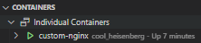

Załadowałemobraz do środowiska Minicube:

    minikube image load custom-nginx

Stworzyłem plik `custom-nginx-deployment.yml`:

    apiVersion: apps/v1
    kind: Deployment
    metadata:
      name: custom-nginx-deployment
    spec:
      replicas: 4
      selector:
        matchLabels:
          app: custom-nginx
      template:
        metadata:
          labels:
            app: custom-nginx
        spec:
          containers:
            - name: custom-nginx
              image: custom-nginx
              imagePullPolicy: IfNotPresent
              ports:
                - containerPort: 8081

następnie, który to zastosowałem:

    kubectl apply -f custom-nginx-deployment.yml

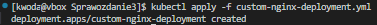

Sprawdziłem status:

    kubectl get pods
    kubectl rollout status deployment/custom-nginx-deployment

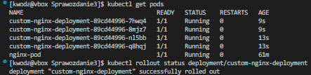

Uzyskałem IP Minikube:

    minikube ip

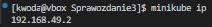

Próby otworzenia URL: `http://192.168.49.2:30081` w przeglądarce powodowały wyświetlenie komunikatu, że witryna jest nieosiągalna, po sprawdzeniu wszystkich aspektów i zweryfikowaniu przez curl działąnia, przekierowałem usługę na port lokalny:

    kubectl port-forward service/custom-nginx-service 8081:8081

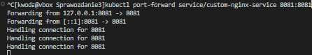

Widok z `Dashboard`:

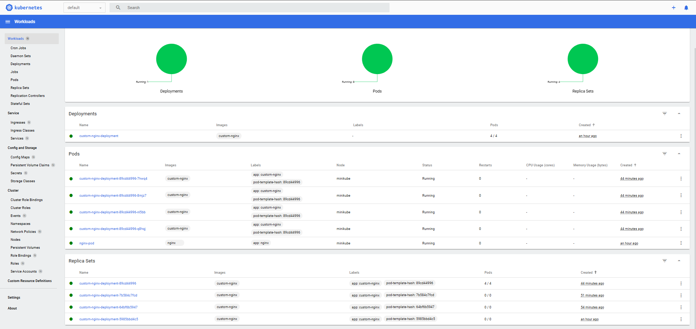

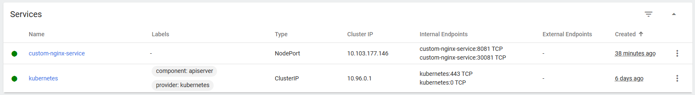

### Testowanie środowiska

Rozpocząłem od zwiększenia liczby replik z uprzednich 4 do 8 - można to zrobić edytując plik YAML bądź wykorzystując komendę:

    kubectl scale deployment custom-nginx-deployment --replicas=8

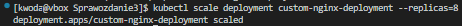

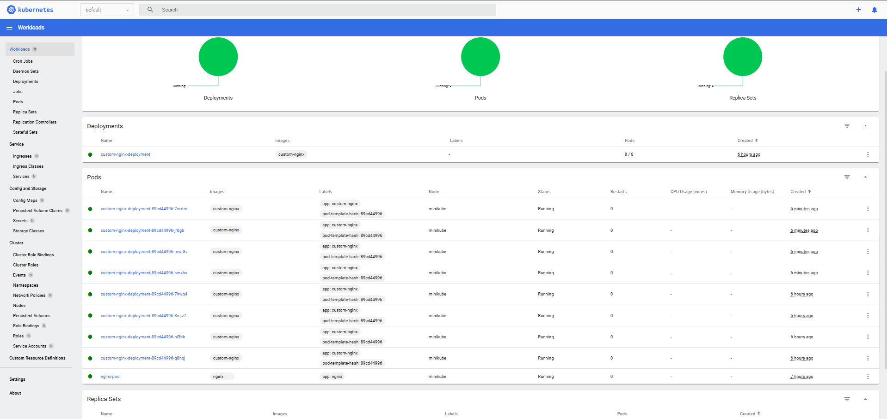

Analogicznie zmieniono ilość replik do 1:

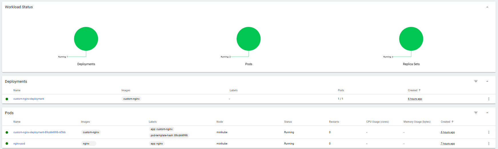

następnie do 0:

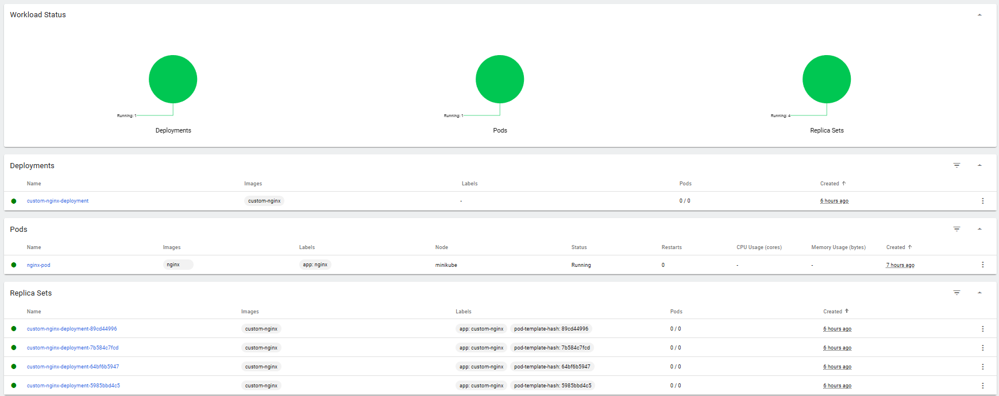

potem na powrót do 4:

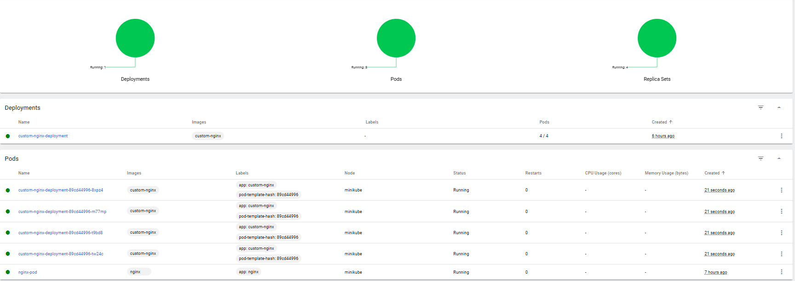

Dalej zmieniłem plik `nginx.conf` w celu utworzenia 2 działającej wersji:

    server {
        listen 8081;
        location / {
             return 200 '[NGINX v2 działa!]';
             add_header Content-Type text/plain;
            }
    }

Zbudowałem nowy obraz `custom-nginx:v2`:

    docker build -t custom-nginx:v2 -f Dockerfile.kub .

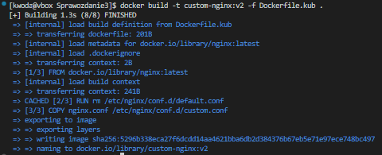

Załadowałem ten obraz do środowiska minikube:
    
    minikube image load custom-nginx:v2

Analogicznie postępowałem dla stworzenia niedziałającej wersji - z pliku `nginx.conf` usunąłem średnik w lini return, oraz zmieniłem tekst dla rozróżnienia:

    return 200 '[BROKEN NGINX]'

Zbudowałem obraz `custom-nginx:broken` i załądowałem do środowiska minikube:

    docker build -t custom-nginx:broken -f Dockerfile.kub .
    minikube image load custom-nginx:broken

Następnie sprawdziłem czy na pewno w środowisku minicube funkcjonują 3 różne obrazy:

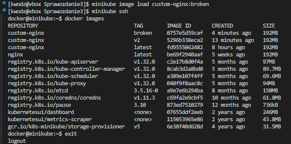

Zaktualizowałem deployment o nową wersję obrazu `custom-nginx:v2`:

    kubectl set image deployment custom-nginx-deployment custom-nginx=custom-nginx:v2

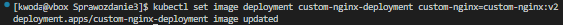

co sowodowało o zmianach które możemy zaobserwować w `Dashboard`:

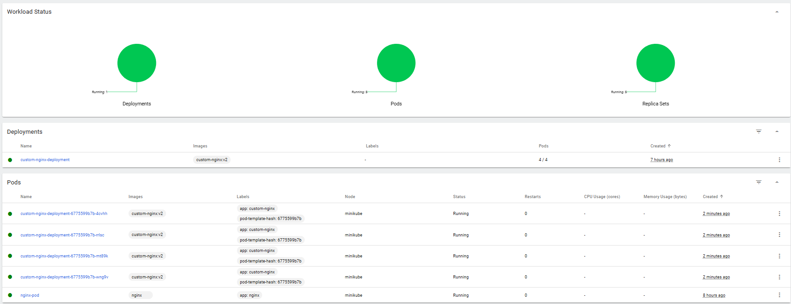

oraz:

Podobnie spróbowałem zmienić obraz na niedziałający `custom-nginx:broken`:

    kubectl set image deployment custom-nginx-deployment custom-nginx=custom-nginx:broken

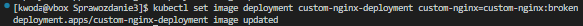

w `Dahboard` obserwujemy, że deployment przestałdziałać:

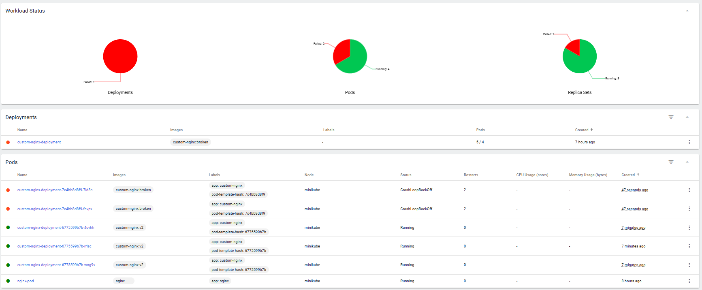

Sprawdziłem historię zmian:

    kubectl rollout history deployment custom-nginx-deployment

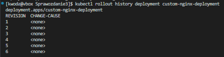

a następnie szczegóły wersji:

    kubectl rollout history deployment custom-nginx-deployment --revision=5

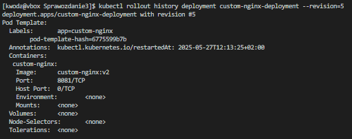

przywróciłem poprzednią wersję - można to uczynić cofając do poprzedniej wersji:

    kubectl rollout undo deployment custom-nginx-deployment

lub do konkretnej wersji:

    kubectl rollout undo deployment custom-nginx-deployment --to-revision=4

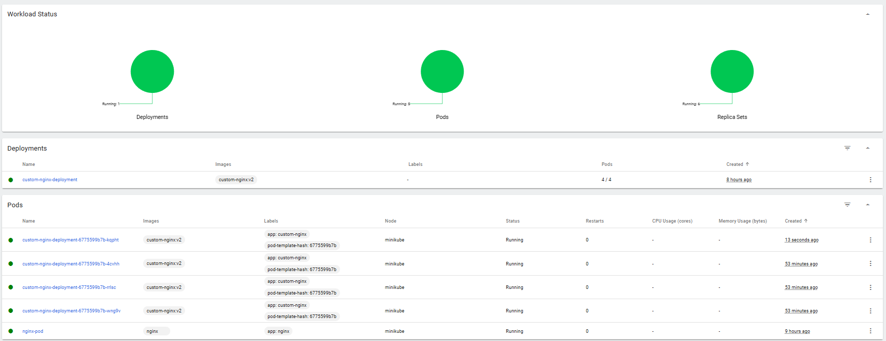

Napisałem skrypt bash `verify-deployment.sh` który weryfikuje, czy wdrożenie się powiodło w ciągu 60 sekund:

    #!/bin/bash

    DEPLOYMENT="custom-nginx-deployment"
    TIMEOUT=60

    echo "Sprawdzanie statusu wdrożenia: $DEPLOYMENT (timeout ${TIMEOUT}s)..."

    for ((i=1; i<=$TIMEOUT; i++)); do
        READY=$(minikube kubectl -- get deployment $DEPLOYMENT -o       jsonpath='{.status.readyReplicas}' 2>/dev/null)
        DESIRED=$(minikube kubectl -- get deployment $DEPLOYMENT -o     jsonpath='{.spec.replicas}' 2>/dev/null)

        echo "Sekunda $i: READY='$READY', DESIRED='$DESIRED'"

        if [[ "$READY" == "$DESIRED" && -n "$READY" ]]; then
            echo "Wdrożenie zakończone sukcesem po $i sekundach"
            exit 0
        fi

        sleep 1
    done

    echo "Timeout - wdrożenie nie zakończone po ${TIMEOUT}s"
    exit 1

Nadałem uprawnienia skryptowi:

    chmod +x verify-deployment.sh

następnie testowałem jego działanie zmieniając `yaml` i wywołując skrypt:

    ./verify-deployment.sh

Dla niedziałającego wdrożenia:

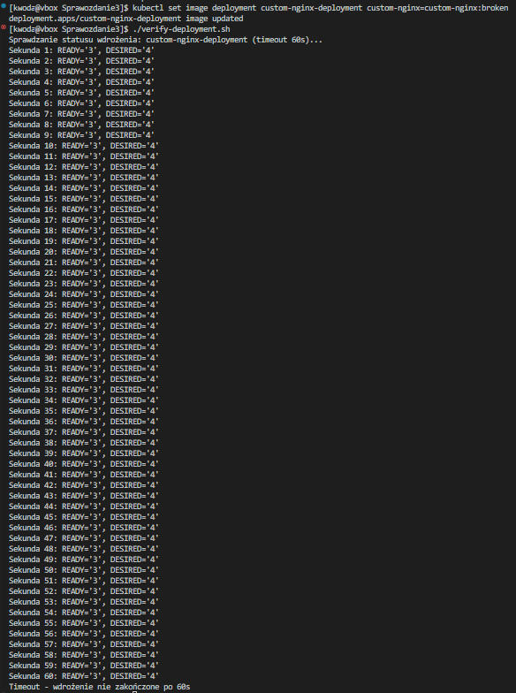

Dla działającego wdrożenia:

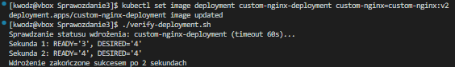

Testowałem rózne strategie wdrożeń. Najpierw w pliku `custom_nginx-deployment.yml` ustwiłem strategię na `Recreate`:

    apiVersion: apps/v1
    kind: Deployment
    metadata:
      name: custom-nginx-deployment
    spec:
      replicas: 4
      strategy:
        type: Recreate
      selector:
        matchLabels:
          app: custom-nginx
      template:
        metadata:
          labels:
            app: custom-nginx
        spec:
          containers:
            - name: custom-nginx
              image: custom-nginx
              imagePullPolicy: IfNotPresent
              ports:
                - containerPort: 8081

I wdrożyłem komendą:

    kubectl apply -f custom-nginx-deployment.yml

To spowodowało że podczas wdrażania nowej wersji aplikacji wszystkie stare pod’y były najpierw wyłączane, a dopiero potem tworzone były nowe pod’y z nową wersją. W skrócie: przerwa w działaniu aplikacji jest nieunikniona.

Zalety:

✅ Prosta implementacja.\
✅ Dobra dla aplikacji, które nie wymagają działania równoległych wersji.\
✅ Można uniknąć komplikacji związanych z równoczesnym działaniem różnych wersji.

Wady:

❌ Przerwa w dostępności aplikacji — podczas aktualizacji aplikacja może być niedostępna.\
❌ Nieodpowiednia dla aplikacji wymagających wysokiej dostępności.

Dalej wdrożyłem `Rolling Update` (z parametrami `maxUnavailable > 1`, `maxSurge > 20%`). Zmieniłem plik `custom_nginx-deployment.yml` w sekcji strategy:

    strategy:
      type: RollingUpdate
      rollingUpdate:
        maxUnavailable: 1
        maxSurge: 25%

Wdrożyłęm analogiczną komendą jak poprzedno:

    kubectl apply -f custom-nginx-deployment.yml

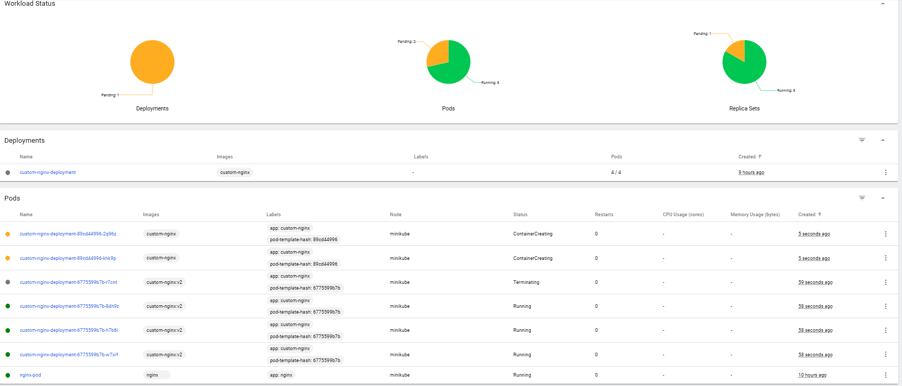

W tej strategii nowa wersja aplikacji jest wdrażana stopniowo, zastępując stare pod’y kolejnymi nowymi.

Parametry:
-maxUnavailable — ile podów może być niedostępnych podczas aktualizacji (np. 1, 25%).
-maxSurge — ile nowych podów ponad docelową liczbę może być uruchomionych tymczasowo (np. 1, 20%).
-Kubernetes dba o to, by cały czas działała minimalna liczba podów.

Zalety:

✅ Brak przerwy w działaniu — aplikacja jest dostępna podczas całej aktualizacji.\
✅ Pozwala kontrolować szybkość wdrożenia przez maxUnavailable i maxSurge.\
✅ Bezpieczniejsza dla aplikacji produkcyjnych.

Wady:

❌ Może wymagać więcej zasobów (podczas maxSurge działa więcej podów niż zwykle).\
❌ Niektóre zmiany mogą powodować błędy przy jednoczesnym działaniu starej i nowej wersji (np. jeśli aplikacja nie jest kompatybilna z równoczesnym działaniem dwóch wersji).

Teraz przyjąłem strategię `Canary Deployment workload`, utworzyłem dwa pliki `.yml`:

`custom-ngnx-stable.yml`:

    apiVersion: apps/v1
    kind: Deployment
    metadata:
      name: custom-nginx-stable
    spec:
      replicas: 4
      selector:
        matchLabels:
          app: custom-nginx
          version: stable
      template:
        metadata:
          labels:
            app: custom-nginx
            version: stable
        spec:
          containers:
            - name: custom-nginx
              image: custom-nginx
              imagePullPolicy: IfNotPresent
              ports:
                - containerPort: 8081

`custom-ngnx-canary.yml`:

    apiVersion: apps/v1
    kind: Deployment
    metadata:
      name: custom-nginx-canary
    spec:
      replicas: 1
      selector:
        matchLabels:
          app: custom-nginx
          version: canary
      template:
        metadata:
          labels:
            app: custom-nginx
            version: canary
        spec:
          containers:
            - name: custom-nginx
              image: custom-nginx:v2
              imagePullPolicy: IfNotPresent
              ports:
                - containerPort: 8081

następnie wdrożyłem używając `Service`:

    kubectl apply -f custom-nginx-stable.yml
    kubectl apply -f custom-nginx-canary.yml
    kubectl apply -f custom-nginx-service.yml

Nz zdjęciu widać Pod'y z różnymi etykietami:

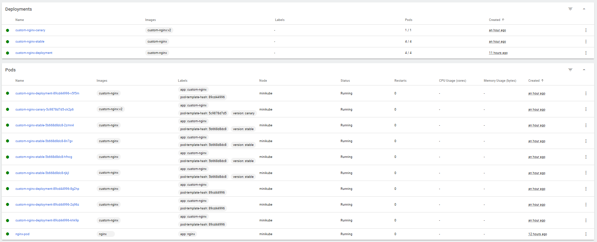

Wdrażana w tej strategii jest nowa wersja aplikacji tylko na niewielkiej części podów (np. 1-2 pods). Reszta ruchu jest obsługiwana przez starą wersję. Pozwala testować nową wersję w warunkach produkcyjnych na ograniczonym ruchu. Po potwierdzeniu stabilności, nowa wersja jest stopniowo rozszerzana (np. przez zwiększenie liczby podów).

Zalety:

✅ Minimalizuje ryzyko awarii produkcji.\
✅ Pozwala na testy na żywo i szybkie wycofanie, jeśli nowa wersja powoduje problemy.\
✅ Umożliwia testowanie nowych funkcji na małej grupie użytkowników.

Wady:

❌ Większa złożoność konfiguracji (np. wymaga zarządzania ruchem i etykietami).\
❌ Może wymagać dodatkowych narzędzi (np. service mesh typu Istio, Linkerd do routingu ruchu).\
❌ Zarządzanie dwoma wersjami może wymagać więcej zasobów.