# Sprawozdanie 1
#### Autor:
Imię i nazwisko: Karol Woda\
Nr albumu: 414979\
Wydział: WIMiIP AGH\
Kierunek: ITE\
Rocznik: 2024/2025\
Grupa laboratoryjna: gr. 8 
## Przygotowanie sprzętu:
1. Konfiguracja maszyny wirtualnej w VirtualBox (VB):\

    * Typ: Linux
    * Wersja: Fedora (64-bit)
    * RAM: 4GB
    * Pamięć dysku: 36 GB
    * Typ dysku: VDI
2. Sprawdzenie statusu SSH:\
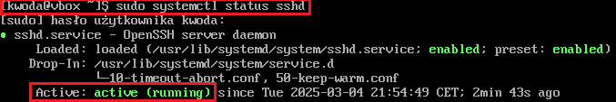
3. Otwarcie portu:\
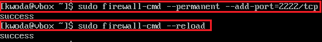
4. Instalacja systemu bez środowiska graficznego, wybranym pełnym dostępem do dysku i automatycznym partycjonowaniem. Zezwolenie na użytkownika root, utworzenie hasła root, utworzenie użytkownika: **kwoda**
5. Ustalenie reguły przekierowanie portów w VB:\
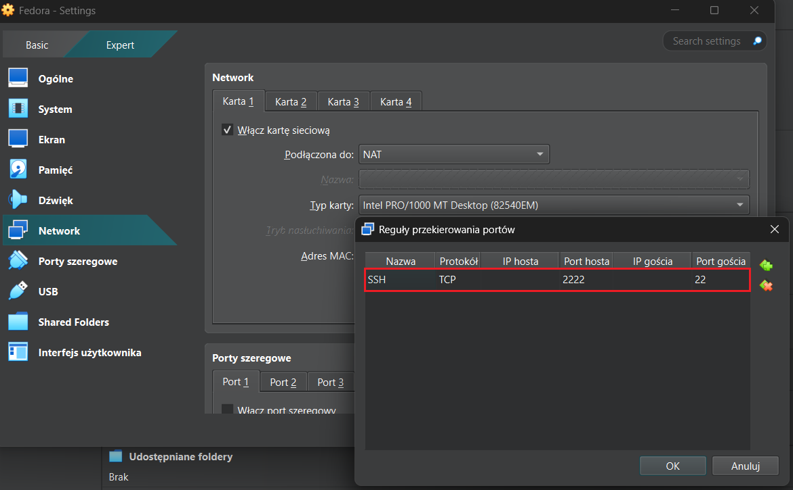
6. Łączenie się z Fedorą poprzez SSH z hosta:\
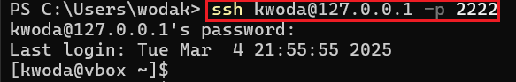
7. Konfiguracja SFTP (dla transferu plików):\
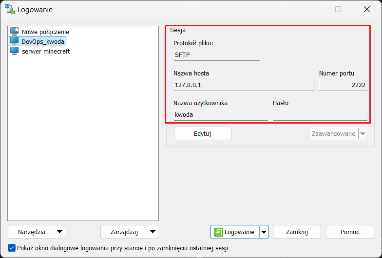\
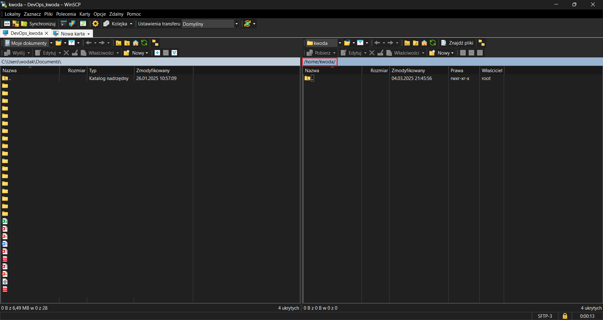
8. Konfiguracja klucza SSH i połączenia z GitHubem:\
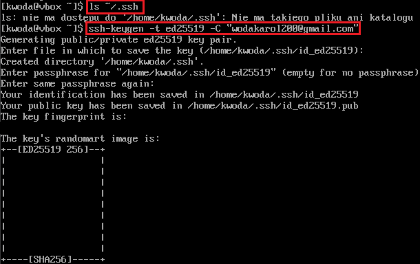\
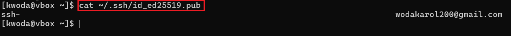\
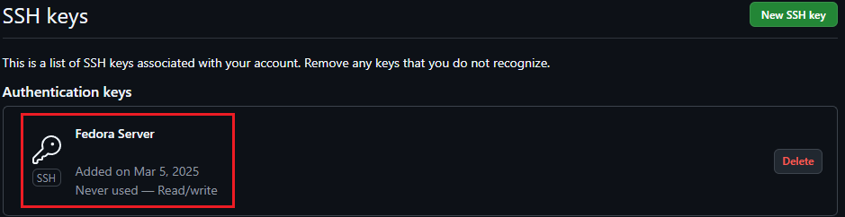
9. Testowanie połączenia z GitHubem:\
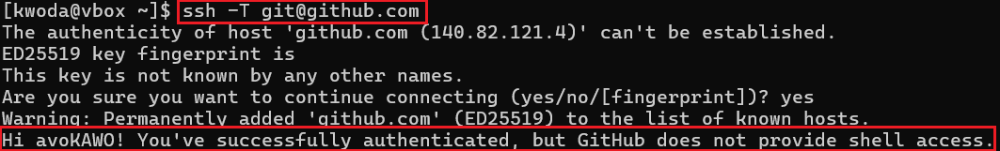
## Zajęcia 01: Wprowadzenie, Git, Gałęzie, SSH
1. Zainstalowanie klienta Git i obsługi kluczy SSH:\
\
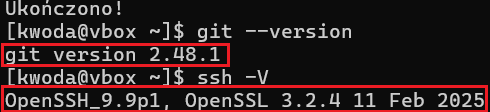
2. Sklonowanie [repozytorium przedmiotowego](https://github.com/InzynieriaOprogramowaniaAGH/MDO2025_INO) za pomocą HTTPS i [*personal access token*](https://docs.github.com/en/authentication/keeping-your-account-and-data-secure/managing-your-personal-access-tokens):\

3. Upewnienie się w kwestii dostępu do repozytorium jako uczestnik i sklonowanie go za pomocą utworzonego klucza SSH, zapoznanie się z [dokumentacją](https://docs.github.com/en/authentication/connecting-to-github-with-ssh/generating-a-new-ssh-key-and-adding-it-to-the-ssh-agent).
   - Utworzenie dwuch kluczy SSH, inne niż RSA, w tym co najmniej jednego zabezpieczonego hasłem\
   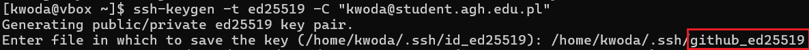\
   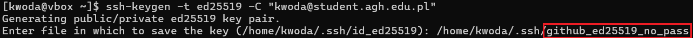
   - Skonfigurowanie klucza SSH jako metody dostępu do GitHuba\
   
   - Sklonowanie repozytorium z wykorzystaniem protokołu SSH
   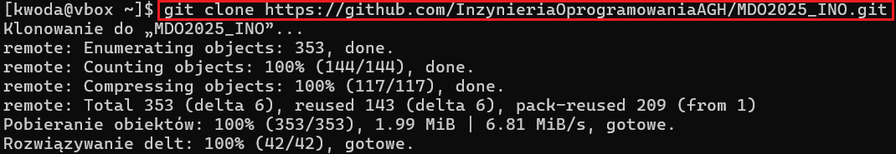
   - Skonfigurowanie 2FA
   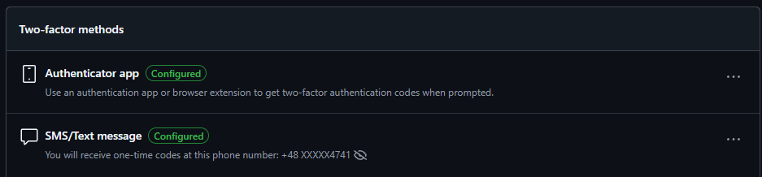
4. Przełączenie się na gałąź ```main```, a potem na gałąź swojej grupy:\
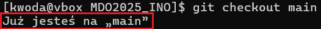\
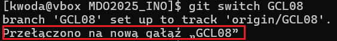
5. Utworzenie gałęzi o nazwie "inicjały & nr indeksu" np. ```KD232144```.\
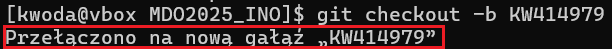
6. Rozpoczęcie pracy na nowej gałęzi
   - W katalogu właściwym dla grupy utworzenie nowego katalogu, także o nazwie "inicjały & nr indeksu" np. ```KD232144```\
   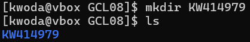
   - Napisanie [Git hooka](https://git-scm.com/book/en/v2/Customizing-Git-Git-Hooks) - skrypt weryfikujący, że każdy "commit message" zaczyna się od "inicjały & nr indexu".\
           
            #!/bin/bash
            commit_msg=$(cat "$1")
            if [[ ! $commit_msg =~ ^KW414979 ]]; then
                echo "ERROR: Każdy commit musi zaczynać się od 'KW414979'"
                exit 1
            fi

   - Dodanie tego skryptu do stworzonego wcześniej katalogu.\
   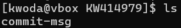
   - Skopiowanie go we właściwe miejsce, tak by uruchamiał się za każdym razem kiedy robisz commita.\
   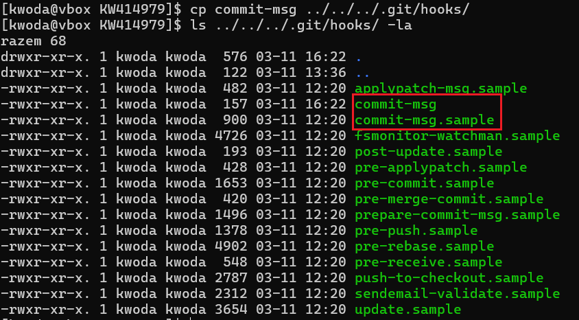
   - W katalogu dodanie pliku ze sprawozdaniem. Dodanie zrzutów ekranu (jako inline)\
   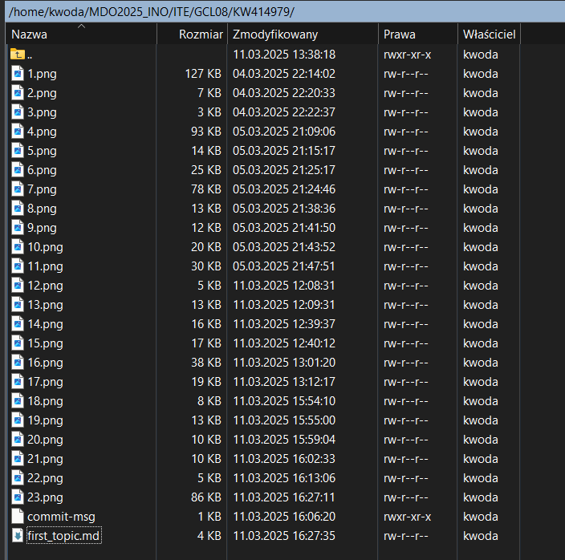
   - Wysłanie zmian do zdalnego źródła\
   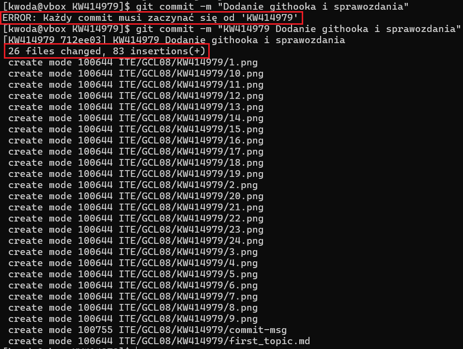
   - Spróbowanie wciągnięcia swojej gałęzi do gałęzi grupowej\
   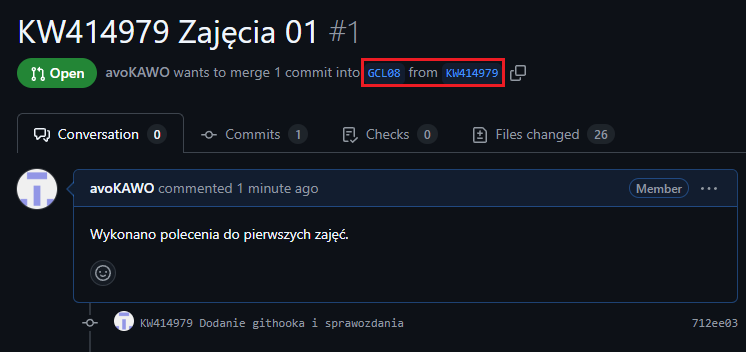
## Zajęcia 02: Git, Docker
1. Zainstaluj Docker w systemie linuksowym
   - użyj repozytorium dystrybucji, jeżeli to możliwe (zamiast Community Edition)
   - rozważ niestosowanie rozwiązania Snap (w Ubuntu)\
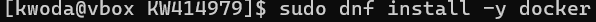
3. Zarejestruj się w [Docker Hub](https://hub.docker.com/) i zapoznaj z sugerowanymi obrazami\

4. Pobierz obrazy `hello-world`, `busybox`, `ubuntu` lub `fedora`, `mysql`\
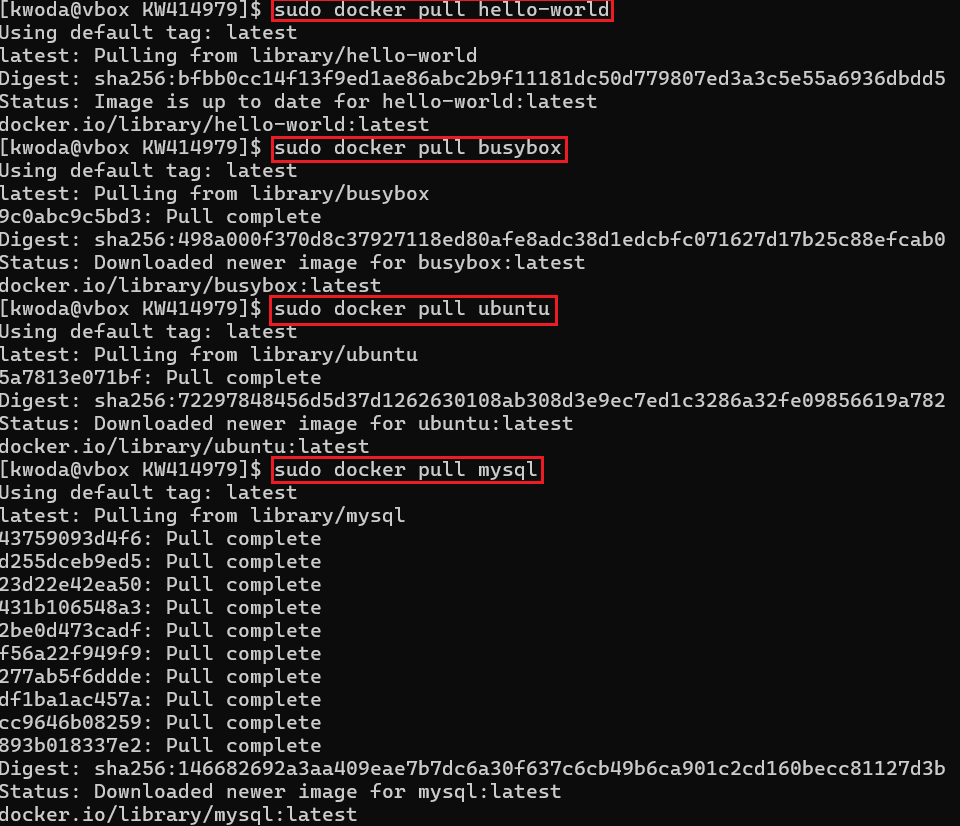\
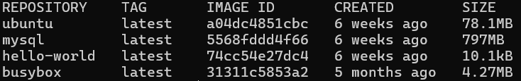
5. Uruchom kontener z obrazu `busybox`
   - Pokaż efekt uruchomienia kontenera\
   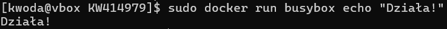
   - Podłącz się do kontenera **interaktywnie** i wywołaj numer wersji\
   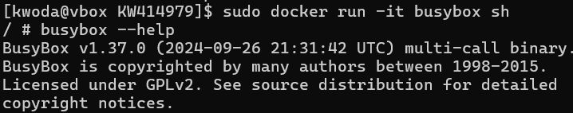
6. Uruchom "system w kontenerze" (czyli kontener z obrazu `fedora` lub `ubuntu`)
   - Zaprezentuj `PID1` w kontenerze i procesy dockera na hoście\
   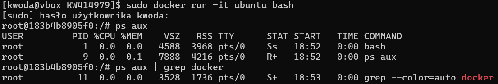
   - Zaktualizuj pakiety\
   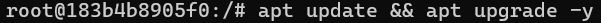
   - Wyjdź\
   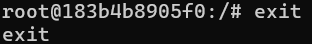
7. Stwórz własnoręcznie, zbuduj i uruchom prosty plik `Dockerfile` bazujący na wybranym systemie i sklonuj nasze repo.
   - Kieruj się [dobrymi praktykami](https://docs.docker.com/develop/develop-images/dockerfile_best-practices/)
   - Upewnij się że obraz będzie miał `git`-a
   - Uruchom w trybie interaktywnym i zweryfikuj że jest tam ściągnięte nasze repozytorium
8. Pokaż uruchomione ( != "działające" ) kontenery, wyczyść je.
9. Wyczyść obrazy
10. Dodaj stworzone pliki `Dockefile` do folderu swojego `Sprawozdanie1` w repozytorium.
11. ~~Wystaw *Pull Request* do gałęzi grupowej jako zgłoszenie wykonanego~~