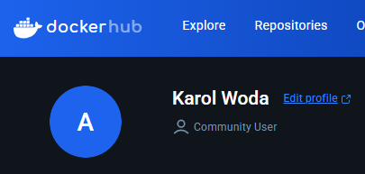

# Sprawozdanie 1
#### Autor:
Imię i nazwisko: Karol Woda\
Nr albumu: 414979\
Wydział: WIMiIP AGH\
Kierunek: ITE\
Rocznik: 2024/2025\
Grupa laboratoryjna: gr. 8 
## Przygotowanie sprzętu:
1. Konfiguracja maszyny wirtualnej w VirtualBox (VB):\
   
    * Typ: Linux
    * Wersja: Fedora (64-bit)
    * RAM: 4GB
    * Pamięć dysku: 36 GB
    * Typ dysku: VDI
2. Sprawdzenie statusu SSH:\
   
3. Otwarcie portu:\
   
4. Instalacja systemu bez środowiska graficznego, wybranym pełnym dostępem do dysku i automatycznym partycjonowaniem. Zezwolenie na użytkownika root, utworzenie hasła root, utworzenie użytkownika: **kwoda**
5. Ustalenie reguły przekierowanie portów w VB:\
   
6. Łączenie się z Fedorą poprzez SSH z hosta:\
   
7. Konfiguracja SFTP (dla transferu plików):\
   \
   
8. Konfiguracja klucza SSH i połączenia z GitHubem:\
   \
   \
   
9. Testowanie połączenia z GitHubem:\
   
## Zajęcia 01: Wprowadzenie, Git, Gałęzie, SSH
1. Zainstaluj klienta Git i obsługę kluczy SSH\
   \
   
2. 2. Sklonuj [repozytorium przedmiotowe](https://github.com/InzynieriaOprogramowaniaAGH/MDO2025_INO) za pomocą HTTPS i [*personal access token*](https://docs.github.com/en/authentication/keeping-your-account-and-data-secure/managing-your-personal-access-tokens)\

3. Upewnij się w kwestii dostępu do repozytorium jako uczestnik i sklonuj je za pomocą utworzonego klucza SSH, zapoznaj się [dokumentacją](https://docs.github.com/en/authentication/connecting-to-github-with-ssh/generating-a-new-ssh-key-and-adding-it-to-the-ssh-agent).
   - Utwórz dwa klucze SSH, inne niż RSA, w tym co najmniej jeden zabezpieczony hasłem\
   \
   
   - Skonfiguruj klucz SSH jako metodę dostępu do GitHuba\
   
   - Sklonuj repozytorium z wykorzystaniem protokołu SSH
   
   - Skonfiguruj 2FA
   
4. Przełącz się na gałąź ```main```, a potem na gałąź swojej grupy (pilnuj gałęzi i katalogu!)\
\

5. Utwórz gałąź o nazwie "inicjały & nr indeksu" np. ```KD232144```. Miej na uwadze, że odgałęziasz się od brancha grupy!\

6. Rozpocznij pracę na nowej gałęzi
   - W katalogu właściwym dla grupy utwórz nowy katalog, także o nazwie "inicjały & nr indeksu" np. ```KD232144```\
   
   - Napisz [Git hooka](https://git-scm.com/book/en/v2/Customizing-Git-Git-Hooks) - skrypt weryfikujący, że każdy Twój "commit message" zaczyna się od "twoje inicjały & nr indexu". (Przykładowe githook'i są w `.git/hooks`.)\
   - Dodaj ten skrypt do stworzonego wcześniej katalogu.\
   
   - Skopiuj go we właściwe miejsce, tak by uruchamiał się za każdym razem kiedy robisz commita.\
   
   - Umieść treść githooka w sprawozdaniu.
              
            #!/bin/bash
            commit_msg=$(cat "$1")
            if [[ ! $commit_msg =~ ^KW414979 ]]; then
                echo "ERROR: Każdy commit musi zaczynać się od 'KW414979'"
                exit 1
            fi

   - W katalogu dodaj plik ze sprawozdaniem
   - Dodaj zrzuty ekranu (jako inline)\
   
   - Wyślij zmiany do zdalnego źródła\
   
   - Spróbuj wciągnąć swoją gałąź do gałęzi grupowej\
   
   - Zaktualizuj sprawozdanie i zrzuty o ten krok i wyślij aktualizację do zdalnego źródła (na swojej gałęzi)
## Zajęcia 02: Git, Docker
1. Zainstaluj Docker w systemie linuksowym
   - użyj repozytorium dystrybucji, jeżeli to możliwe (zamiast Community Edition)
   - rozważ niestosowanie rozwiązania Snap (w Ubuntu)\
   
3. Zarejestruj się w [Docker Hub](https://hub.docker.com/) i zapoznaj z sugerowanymi obrazami\
   
4. Pobierz obrazy `hello-world`, `busybox`, `ubuntu` lub `fedora`, `mysql`\
   \
   
5. Uruchom kontener z obrazu `busybox`
   - Pokaż efekt uruchomienia kontenera\
   
   - Podłącz się do kontenera **interaktywnie** i wywołaj numer wersji\
   
6. Uruchom "system w kontenerze" (czyli kontener z obrazu `fedora` lub `ubuntu`)
   - Zaprezentuj `PID1` w kontenerze i procesy dockera na hoście\
   
   - Zaktualizuj pakiety\
   
   - Wyjdź\
   
7. Stwórz własnoręcznie, zbuduj i uruchom prosty plik `Dockerfile` bazujący na wybranym systemie i sklonuj nasze repo.   
   - Kieruj się [dobrymi praktykami](https://docs.docker.com/develop/develop-images/dockerfile_best-practices/)
   - Upewnij się że obraz będzie miał `git`-a\
      

         FROM ubuntu:latest
         RUN apt update && apt install -y git
         WORKDIR /app
         RUN git clone https://github.com/InzynieriaOprogramowaniaAGH/MDO2025_INO.git
         CMD ["bash"]
      
   - Uruchom w trybie interaktywnym i zweryfikuj że jest tam ściągnięte nasze repozytorium\
      
      
8. Pokaż uruchomione ( != "działające" ) kontenery, wyczyść je.\
   
   
9. Wyczyść obrazy\
   
   Alternatywna komenda:

         docker rmi nazwa_obrazu nazwa_obrazu ...

10. Dodaj stworzone pliki `Dockefile` do folderu swojego `Sprawozdanie1` w repozytorium.
   
## Zajęcia 03: Dockerfiles, kontener jako definicja etapu
### Wybór oprogramowania na zajęcia
* Znajdź repozytorium z kodem dowolnego oprogramowania, które:
	* dysponuje otwartą licencją
	* jest umieszczone wraz ze swoimi narzędziami Makefile tak, aby możliwe był uruchomienie w repozytorium czegoś na kształt ```make build``` oraz ```make test```. Środowisko Makefile jest dowolne. Może to być automake, meson, npm, maven, nuget, dotnet, msbuild...
	* Zawiera zdefiniowane i obecne w repozytorium testy, które można uruchomić np. jako jeden z "targetów" Makefile'a. Testy muszą jednoznacznie formułować swój raport końcowy (gdy są obecne, zazwyczaj taka jest praktyka)
* Sklonuj niniejsze repozytorium, przeprowadź build programu (doinstaluj wymagane zależności)
* Uruchom testy jednostkowe dołączone do repozytorium

### Przeprowadzenie buildu w kontenerze
Ponów ww.  proces w kontenerze, interaktywnie.
1. Wykonaj kroki `build` i `test` wewnątrz wybranego kontenera bazowego. Tj. wybierz "wystarczający" kontener, np ```ubuntu``` dla aplikacji C lub ```node``` dla Node.js
	* uruchom kontener
	* podłącz do niego TTY celem rozpoczęcia interaktywnej pracy
	* zaopatrz kontener w wymagania wstępne (jeżeli proces budowania nie robi tego sam)
	* sklonuj repozytorium
	* Skonfiguruj środowisko i uruchom *build*
	* uruchom testy
2. Stwórz dwa pliki `Dockerfile` automatyzujące kroki powyżej, z uwzględnieniem następujących kwestii:
	* Kontener pierwszy ma przeprowadzać wszystkie kroki aż do *builda*
	* Kontener drugi ma bazować na pierwszym i wykonywać testy (lecz nie robić *builda*!)
3. Wykaż, że kontener wdraża się i pracuje poprawnie. Pamiętaj o różnicy między obrazem a kontenerem. Co pracuje w takim kontenerze?
   
### Zakres rozszerzony tematu sprawozdania
#### Docker Compose
* Zamiast ręcznie wdrażać kontenery, ujmij je w kompozycję
#### Przygotowanie do wdrożenia (deploy): dyskusje
Otrzymany kontener ze zbudowanym programem może, ale nie musi, być już końcowym artefaktem procesu przygotowania nowego wydania. Jednakże, istnieje szereg okoliczności, w których nie ma to sensu. Na przykład gdy chodzi o oprogramowanie interaktywne, które kiepsko działa w kontenerze.

Przeprowadź dyskusję i wykaż:
* czy program nadaje się do wdrażania i publikowania jako kontener, czy taki sposób interakcji nadaje się tylko do builda
* opisz w jaki sposób miałoby zachodzić przygotowanie finalnego artefaktu
	* jeżeli program miałby być publikowany jako kontener - czy trzeba go oczyszczać z pozostałości po buildzie?
	* A może dedykowany *deploy-and-publish* byłby oddzielną ścieżką (inne Dockerfiles)?
	* Czy zbudowany program należałoby dystrybuować jako pakiet, np. JAR, DEB, RPM, EGG?
	* W jaki sposób zapewnić taki format? Dodatkowy krok (trzeci kontener)? Jakiś przykład?