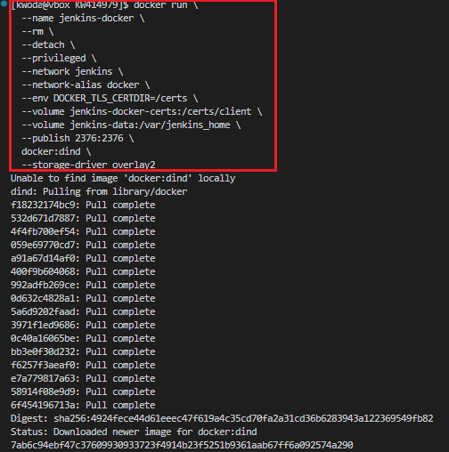
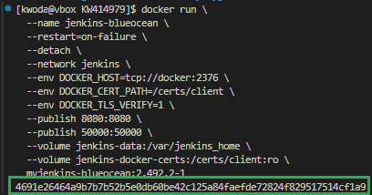

# Sprawozdanie 1
#### Autor:
Imię i nazwisko: Karol Woda\
Nr albumu: 414979\
Wydział: WIMiIP AGH\
Kierunek: ITE\
Rocznik: 2024/2025\
Grupa laboratoryjna: gr. 8 
## Przygotowanie sprzętu:
1. Konfiguracja maszyny wirtualnej w VirtualBox (VB):\
   
    * Typ: Linux
    * Wersja: Fedora (64-bit)
    * RAM: 4GB
    * Pamięć dysku: 36 GB
    * Typ dysku: VDI
2. Sprawdzenie statusu SSH:\
   
3. Otwarcie portu:\
   
4. Instalacja systemu bez środowiska graficznego, wybranym pełnym dostępem do dysku i automatycznym partycjonowaniem. Zezwolenie na użytkownika root, utworzenie hasła root, utworzenie użytkownika: **kwoda**
5. Ustalenie reguły przekierowanie portów w VB:\
   
6. Łączenie się z Fedorą poprzez SSH z hosta:\
   
7. Konfiguracja SFTP (dla transferu plików):\
   \
   
8. Konfiguracja klucza SSH i połączenia z GitHubem:\
   \
   \
   
9. Testowanie połączenia z GitHubem:\
   
## Zajęcia 01: Wprowadzenie, Git, Gałęzie, SSH
1. Zainstaluj klienta Git i obsługę kluczy SSH\
   \
   
2. 2. Sklonuj [repozytorium przedmiotowe](https://github.com/InzynieriaOprogramowaniaAGH/MDO2025_INO) za pomocą HTTPS i [*personal access token*](https://docs.github.com/en/authentication/keeping-your-account-and-data-secure/managing-your-personal-access-tokens)\

3. Upewnij się w kwestii dostępu do repozytorium jako uczestnik i sklonuj je za pomocą utworzonego klucza SSH, zapoznaj się [dokumentacją](https://docs.github.com/en/authentication/connecting-to-github-with-ssh/generating-a-new-ssh-key-and-adding-it-to-the-ssh-agent).
   - Utwórz dwa klucze SSH, inne niż RSA, w tym co najmniej jeden zabezpieczony hasłem\
   \
   
   - Skonfiguruj klucz SSH jako metodę dostępu do GitHuba\
   
   - Sklonuj repozytorium z wykorzystaniem protokołu SSH\
   
   - Skonfiguruj 2FA\
   
4. Przełącz się na gałąź ```main```, a potem na gałąź swojej grupy (pilnuj gałęzi i katalogu!)\
\

5. Utwórz gałąź o nazwie "inicjały & nr indeksu" np. ```KD232144```. Miej na uwadze, że odgałęziasz się od brancha grupy!\

6. Rozpocznij pracę na nowej gałęzi
   - W katalogu właściwym dla grupy utwórz nowy katalog, także o nazwie "inicjały & nr indeksu" np. ```KD232144```\
   
   - Napisz [Git hooka](https://git-scm.com/book/en/v2/Customizing-Git-Git-Hooks) - skrypt weryfikujący, że każdy Twój "commit message" zaczyna się od "twoje inicjały & nr indexu". (Przykładowe githook'i są w `.git/hooks`.)\
   - Dodaj ten skrypt do stworzonego wcześniej katalogu.\
   
   - Skopiuj go we właściwe miejsce, tak by uruchamiał się za każdym razem kiedy robisz commita.\
   
   - Umieść treść githooka w sprawozdaniu.
              
            #!/bin/bash
            commit_msg=$(cat "$1")
            if [[ ! $commit_msg =~ ^KW414979 ]]; then
                echo "ERROR: Każdy commit musi zaczynać się od 'KW414979'"
                exit 1
            fi

   - W katalogu dodaj plik ze sprawozdaniem
   - Dodaj zrzuty ekranu (jako inline)\
   
   - Wyślij zmiany do zdalnego źródła\
   
   - Spróbuj wciągnąć swoją gałąź do gałęzi grupowej\
   
   - Zaktualizuj sprawozdanie i zrzuty o ten krok i wyślij aktualizację do zdalnego źródła (na swojej gałęzi)
## Zajęcia 02: Git, Docker
1. Zainstaluj Docker w systemie linuksowym
   - użyj repozytorium dystrybucji, jeżeli to możliwe (zamiast Community Edition)
   - rozważ niestosowanie rozwiązania Snap (w Ubuntu)\
   
3. Zarejestruj się w [Docker Hub](https://hub.docker.com/) i zapoznaj z sugerowanymi obrazami\
   
4. Pobierz obrazy `hello-world`, `busybox`, `ubuntu` lub `fedora`, `mysql`\
   \
   
5. Uruchom kontener z obrazu `busybox`
   - Pokaż efekt uruchomienia kontenera\
   
   - Podłącz się do kontenera **interaktywnie** i wywołaj numer wersji\
   
6. Uruchom "system w kontenerze" (czyli kontener z obrazu `fedora` lub `ubuntu`)
   - Zaprezentuj `PID1` w kontenerze i procesy dockera na hoście\
   
   - Zaktualizuj pakiety\
   
   - Wyjdź\
   
7. Stwórz własnoręcznie, zbuduj i uruchom prosty plik `Dockerfile` bazujący na wybranym systemie i sklonuj nasze repo.   
   - Kieruj się [dobrymi praktykami](https://docs.docker.com/develop/develop-images/dockerfile_best-practices/)
   - Upewnij się że obraz będzie miał `git`-a\
      

         FROM ubuntu:latest
         RUN apt update && apt install -y git
         WORKDIR /app
         RUN git clone https://github.com/InzynieriaOprogramowaniaAGH/MDO2025_INO.git
         CMD ["bash"]
      
   - Uruchom w trybie interaktywnym i zweryfikuj że jest tam ściągnięte nasze repozytorium\
      \
      
8. Pokaż uruchomione ( != "działające" ) kontenery, wyczyść je.\
   
   
9. Wyczyść obrazy\
   
   Alternatywna komenda:

         docker rmi nazwa_obrazu nazwa_obrazu ...

10. Dodaj stworzone pliki `Dockefile` do folderu swojego `Sprawozdanie1` w repozytorium.
   
## Zajęcia 03: Dockerfiles, kontener jako definicja etapu
### Wybór oprogramowania na zajęcia
* Znajdź repozytorium z kodem dowolnego oprogramowania, które:
	* dysponuje otwartą licencją
	* jest umieszczone wraz ze swoimi narzędziami Makefile tak, aby możliwe był uruchomienie w repozytorium czegoś na kształt ```make build``` oraz ```make test```. Środowisko Makefile jest dowolne. Może to być automake, meson, npm, maven, nuget, dotnet, msbuild...
	* Zawiera zdefiniowane i obecne w repozytorium testy, które można uruchomić np. jako jeden z "targetów" Makefile'a. Testy muszą jednoznacznie formułować swój raport końcowy (gdy są obecne, zazwyczaj taka jest praktyka)
* Sklonuj niniejsze repozytorium, przeprowadź build programu (doinstaluj wymagane zależności)\
   \
   \
   \
   
   
* Uruchom testy jednostkowe dołączone do repozytorium\

### Przeprowadzenie buildu w kontenerze
Ponów ww.  proces w kontenerze, interaktywnie.
1. Wykonaj kroki `build` i `test` wewnątrz wybranego kontenera bazowego. Tj. wybierz "wystarczający" kontener, np ```ubuntu``` dla aplikacji C lub ```node``` dla Node.js
	* uruchom kontener
	* podłącz do niego TTY celem rozpoczęcia interaktywnej pracy
	* zaopatrz kontener w wymagania wstępne (jeżeli proces budowania nie robi tego sam)
	* sklonuj repozytorium\
   
	* Skonfiguruj środowisko i uruchom *build*\
   \
   
	* uruchom testy\
   
2. Stwórz dwa pliki `Dockerfile` automatyzujące kroki powyżej, z uwzględnieniem następujących kwestii:
	* Kontener pierwszy ma przeprowadzać wszystkie kroki aż do *builda*
            
            FROM ubuntu
            RUN apt-get update && apt-get install -y \
               git \
               sudo\
               build-essential \
               meson \
               ninja-build \
               pkg-config \
               libglib2.0-dev \
               libssl-dev \
               perl \
               ncurses-dev

            RUN git clone https://github.com/irssi/irssi
            WORKDIR /irssi
            RUN meson Build
            RUN ninja -C Build && sudo ninja -C Build install

	* Kontener drugi ma bazować na pierwszym i wykonywać testy (lecz nie robić *builda*!)

            FROM irssi-builder
            RUN ninja -C Build test

3. Wykaż, że kontener wdraża się i pracuje poprawnie. Pamiętaj o różnicy między obrazem a kontenerem. Co pracuje w takim kontenerze?\
\
\

## Zajęcia 04: Dodatkowa terminologia w konteneryzacji, instancja Jenkins

### Zachowywanie stanu
* Zapoznaj się z dokumentacją:
  * https://docs.docker.com/storage/volumes/
  * https://docs.docker.com/engine/storage/bind-mounts/
  * https://docs.docker.com/engine/storage/volumes/
  * https://docs.docker.com/reference/dockerfile/#volume
  * https://docs.docker.com/reference/dockerfile/#run---mount
* Przygotuj woluminy wejściowy i wyjściowy, o dowolnych nazwach, i podłącz je do kontenera bazowego (np. tego, z którego rozpoczynano poprzednio pracę). Kontener bazowy to ten, który umie budować nasz projekt (ma zainstalowane wszystkie dependencje, `git` nią nie jest)\

* Uruchom kontener, zainstaluj/upewnij się że istnieją niezbędne wymagania wstępne (jeżeli istnieją), ale *bez gita*\

      FROM ubuntu

      RUN apt-get update && apt-get install -y \
         sudo\
         build-essential \
         meson \
         ninja-build \
         pkg-config \
         libglib2.0-dev \
         libssl-dev \
         perl \
         ncurses-dev

      WORKDIR /irssi
      CMD ["/bin/bash"]

   
* Sklonuj repozytorium na wolumin wejściowy
   
  * Opisz dokładnie, jak zostało to zrobione
    * Wolumin/kontener pomocniczy?
    * *Bind mount* z lokalnym katalogiem?
    * Kopiowanie do katalogu z woluminem na hoście (`/var/lib/docker`)?

<span style="color: lightblue;">Wykorzystałem komendę `sudo git clone https://github.com/irssi/irssi $(docker volume inspect --format '{{ .Mountpoint }}' in)` która została mi zasugerowana przez model językowy po zadaniu pytania: "Jak sklonować repozytorium git na wolumin wejściowy, obraz (Docker) nie posiada zainstalowanego git?". Następnie zweryfikowałem tę informację na stronie [dockerdocs](https://docs.docker.com/reference/cli/docker/volume/inspect/). Działa to gdyż `docker volume inspect in` zwraca informacje o woluminie w formie JSON a dodanie `--format '{{ .Mountpoint }}'`, sprawia że otrzymujemy ścieżkę do naszego woluminu wejściowego. $() pozwala nam uzyskać efekt komendy i wstawić ją inline do komendy `git clone`</span>

* Uruchom build w kontenerze - rozważ skopiowanie repozytorium do wewnątrz kontenera\
\
\

* Zapisz powstałe/zbudowane pliki na woluminie wyjściowym, tak by były dostępne po wyłączniu kontenera.\

* Pamiętaj udokumentować wyniki.
* Ponów operację, ale klonowanie na wolumin wejściowy przeprowadź wewnątrz kontenera (użyj gita w kontenerze)
* Przedyskutuj możliwość wykonania ww. kroków za pomocą `docker build` i pliku `Dockerfile`. (podpowiedź: `RUN --mount`)

      FROM ubuntu

      RUN apt-get update && apt-get install -y \
         git \
         sudo\
         build-essential \
         meson \
         ninja-build \
         pkg-config \
         libglib2.0-dev \
         libssl-dev \
         perl \
         ncurses-dev

      RUN --mount=type=cache,target=/git_cache git clone https://github.com/irssi/irssi
      WORKDIR /irssi
      RUN meson Build
      RUN ninja -C Build && sudo ninja -C Build install
      RUN mkdir -p /output && cp -r Build /output
      CMD ["/bin/bash"]

   \
   

### Eksponowanie portu
* Zapoznaj się z dokumentacją https://iperf.fr/
* Uruchom wewnątrz kontenera serwer iperf (iperf3)\
   \
   
* Połącz się z nim z drugiego kontenera, zbadaj ruch\
   \
   
* Zapoznaj się z dokumentacją `network create` : https://docs.docker.com/engine/reference/commandline/network_create/
* Ponów ten krok, ale wykorzystaj własną dedykowaną sieć mostkową (zamiast domyślnej). Spróbuj użyć rozwiązywania nazw\
   \
   \
   \
   \
   
* Połącz się spoza kontenera (z hosta i spoza hosta)\
   
* Przedstaw przepustowość komunikacji lub problem z jej zmierzeniem (wyciągnij log z kontenera, woluminy mogą pomóc)

Wartość przepustowości wahała się w okolicach 2GB
* Opcjonalnie: odwołuj się do kontenera serwerowego za pomocą nazw, a nie adresów IP

### Instancja Jenkins
* Zapoznaj się z dokumentacją  https://www.jenkins.io/doc/book/installing/docker/
* Przeprowadź instalację skonteneryzowanej instancji Jenkinsa z pomocnikiem DIND

   <span style="color: lightblue;">Instalację przeprowadziłem na podstawie dokumentacji, wykonując zawarte tam kroki:</span>\
   * <span style="color: lightblue;">Stworzyłem sieć Docker o nazwie jenkins:</span>\
      
   * <span style="color: lightblue;">Uruchomiłem kontener wg. dokumentacji</span>\
      
   *  <span style="color: lightblue;">Dockerfile.jenkins:</span>

          FROM jenkins/jenkins:2.492.2-jdk17
          USER root
          RUN apt-get update && apt-get install -y lsb-release ca-certificates curl && \
            install -m 0755 -d /etc/apt/keyrings && \
            curl -fsSL https://download.docker.com/linux/debian/gpg -o /etc/apt/keyrings/docker.asc && \
            chmod a+r /etc/apt/keyrings/docker.asc && \
            echo "deb [arch=$(dpkg --print-architecture) signed-by=/etc/apt/keyrings/docker.asc] \
            https://download.docker.com/linux/debian $(. /etc/os-release && echo \"$VERSION_CODENAME\") stable" \
            | tee /etc/apt/sources.list.d/docker.list > /dev/null && \
            apt-get update && apt-get install -y docker-ce-cli && \
            apt-get clean && rm -rf /var/lib/apt/lists/*
          USER jenkins
          RUN jenkins-plugin-cli --plugins "blueocean docker-workflow"

   *  <span style="color: lightblue;">Zbudowałem obraz na podstawie Dockerfile:</span>\
   
   *  <span style="color: lightblue;">Uruchomiłem następny kontener:</span>\
   

* Zainicjalizuj instację, wykaż działające kontenery, pokaż ekran logowania
   * <span style="color: lightblue;">Sprawdzenie odpowiedzi serwera:</span>\
      
   *  <span style="color: lightblue;">Poprawnie wyświetlany ekran logowania:</span>\
      
