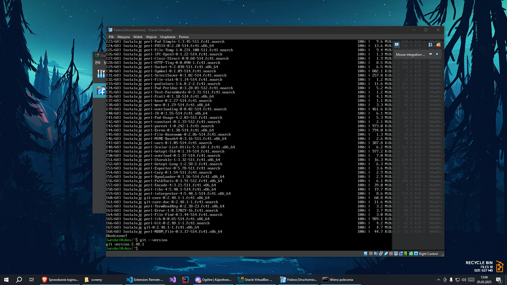
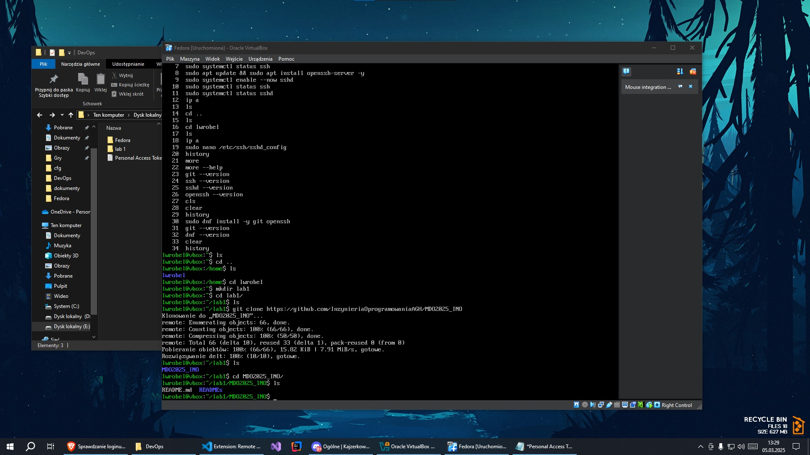
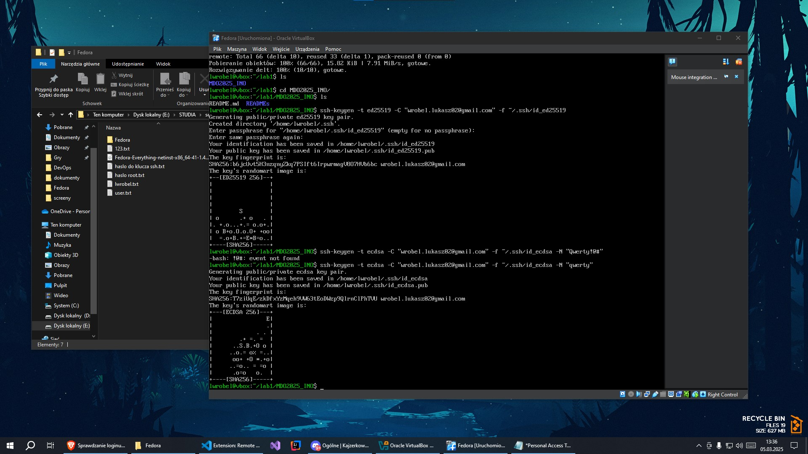
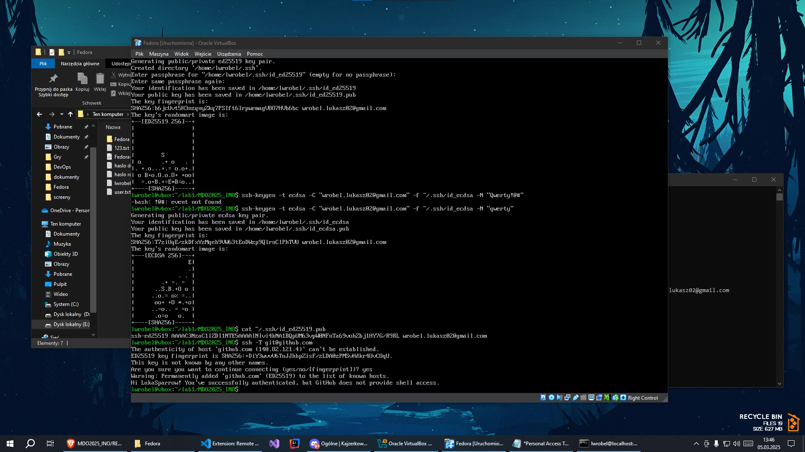
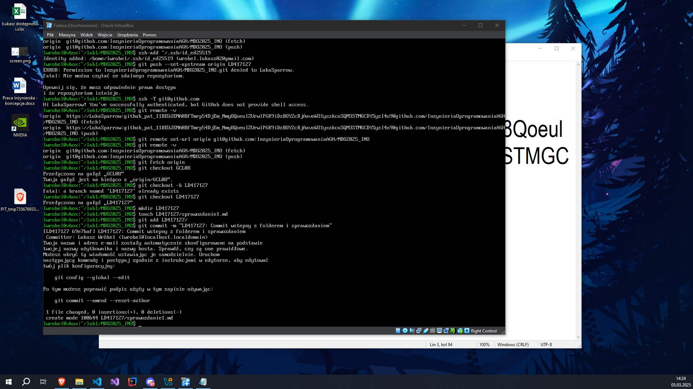
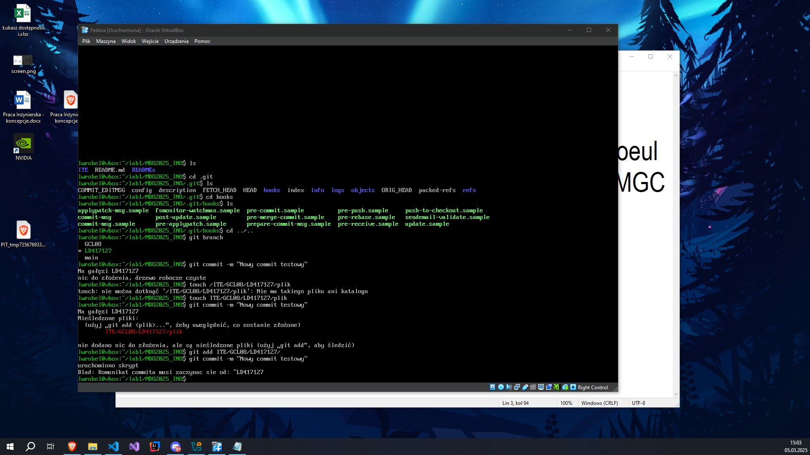
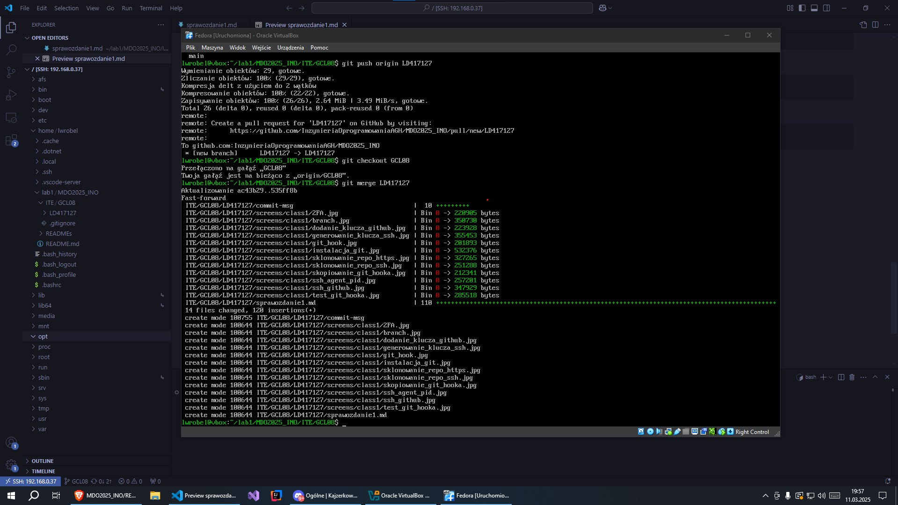

# Sprawozdanie z konfiguracji klienta Git, SSH oraz repozytorium

## 1. Instalacja klienta Git i obsługi kluczy SSH

Na serwerze Fedora instalujemy Git oraz narzędzia do zarządzania kluczami SSH:
```bash
sudo dnf install git openssh -y
```

**Zrzut ekranu:** 

## 2. Klonowanie repozytorium przez HTTPS i Personal Access Token (PAT)

Tworzymy Personal Access Token (PAT) na GitHubie w ustawieniach konta (Developer Settings -> Personal Access Tokens).

Klonujemy repozytorium:
```bash
git clone https://github.com/InzynieriaOprogramowaniaAGH/MDO2025_INO
```
Po podaniu loginu, zamiast hasła wklejamy wygenerowany PAT.

**Zrzut ekranu:** 

## 3. Klonowanie repozytorium za pomocą klucza SSH

### 3.1. Generowanie kluczy SSH (z hasłem i bez RSA)
Generujemy dwa różne klucze SSH:
```bash
ssh-keygen -t ed25519 -C "wrobel.lukasz02@gmail.com"
ssh-keygen -t ecdsa -b 521 -C "wrobel.lukasz02@gmail.com"
```

Dla jednego z kluczy ustawiamy hasło.

**Zrzut ekranu:** 

### 3.2. Konfiguracja klucza SSH na GitHubie
Dodajemy zawartość klucza publicznego (~/.ssh/id_ed25519.pub) do GitHuba (Settings -> SSH and GPG Keys).

Testujemy połączenie:
```bash
ssh -T git@github.com
```

**Zrzut ekranu:** 

### 3.3. Klonowanie repozytorium przez SSH

```bash
git clone git@github.com:InzynieriaOprogramowaniaAGH/MDO2025_INO
```

**Zrzut ekranu:** 

## 4. Konfiguracja 2FA

Włączamy 2FA w ustawieniach GitHub -> Security.

**Zrzut ekranu:** 

## 5. Praca z gałęziami w repozytorium

### 5.1. Przełączenie na odpowiednią gałąź
```bash
git checkout main
git checkout GCL08
```

### 5.2. Tworzenie nowej gałęzi
```bash
git checkout -b LD417127
```

**Zrzut ekranu:** 

### 5.3. Tworzenie katalogu
```bash
mkdir LD417127
```

**Zrzut ekranu:** 

## 6. Tworzenie Git hooka

Tworzymy skrypt weryfikujący poprawność commit message:
```bash
nano GCL08/LD417127/commit-msg
```
Treść skryptu:
```bash
#!/bin/sh
echo "uruchomiono skrypt"
PATTERN="^LD417127"
if ! grep -qE "$PATTERN" "$1"; then
	echo "Blad: Komunikat commita musi zaczynac sie od: $PATTERN"
	exit 1
fi
```

Nadajemy mu uprawnienia wykonania:
```bash
chmod +x grupa/INICJAŁY_NRINDEXU/pre-commit
```

Kopiujemy do katalogu hooks:
```bash
cp GCL08/LD417127/commit-msg .git/hooks/
```

**Zrzut ekranu:** 

## 7. Próba merge z branchem grupowym

Wypchnięcie repozytorium na repo zdalne:

```bash
git push origin LD417127

git checkout GCL08

git merge LD417127

git commit -m "LD417127 Polaczenie galezi LD417127 z GCL08"

git push origin GCL08
```

**Zrzut ekranu:** 
**Zrzut ekranu:** 