# LABORATORIUM 1

## 1. Instalacja klienta Git i obsługi kluczy SSH

W celu zainstalowania klienta git lokalnie należy użyć polecenia
```
sudo dnf install git
```

Aby przeprowadzić weryfikację instalacji można skorzystać z poniższych poleceń:
- Sprawdzenie wersji gita:
 ```
 git --version
 ```
- Sprawdzenie ścieżki do pliku wykonywalnego git: 
```
which git
```
- Sprawdzenie dostawcy gita: 
```
dnf provides /usr/bin/git
```
  


## 2. Sklonuj repozytorium przedmiotowe za pomocą HTTPS i personal access token

W celu pobrania zdalnego repozytorium na maszynę lokalną najpierw skonfigurowano personal access token, który umożliwia klonowanie repozytorium bez konieczności podawania loginu oraz hasła.


W celu sklonowania zdalnego repozytorium z GitHub'a z wykorzystaniem protokołu HTTPS należy użyć polecenia:

```
git clone https://github.com/InzynieriaOprogramowaniaAGH/MDO2025_INO.git
```


## 3. Upewnij się w kwestii dostępu do repozytorium jako uczestnik i sklonuj je za pomocą utworzonego klucza SSH, zapoznaj się z dokumentacją.

- Aby utworzyć klucz SSH na maszynie lokalnej należy wykorzystać poniższe polecenie:
  ```
  ssh-keygen -t ed25519 -C "twoj@mail.com"
  ```
  
  Po użyciu tego polecenia pojawia się komunikat o wpisaniu pliku docelowego (zaleca się nie wpisywać nic i kliknąć klawisz Enter), a następnie zapyta o passphrase. Jeżeli nie chcemy podawać hasła, to klikamy Enter, a gdy chcemy, wprowadzamy je dwukrotnie.
  
  

- Skonfiguruj klucz SSH jako metodę dostępu do GitHuba.
  W celu dodania klucza do konta GitHub wchodzimy w ustawienia -> SSH and GPG keys -> New SSH Key. Podajemy tam nazwę naszego klucza, a w dolnym oknie wklejamy klucz, który wygenerowaliśmy wcześniej na maszynie lokalnej. Aby skopiować klucz, musimy wejść do folderu `.ssh` i znaleźć plik `id_ed25519.pub`. W tym pliku znajduje się klucz, który kopiujemy i wklejamy do okienka na GitHubie.
  
  

- Sklonuj repozytorium z wykorzystaniem protokołu SSH.
  W celu sklonowania repozytorium z wykorzystaniem protokołu SSH należy wykorzystać polecenie:
  
  ```
  git clone git@github.com:InzynieriaOprogramowaniaAGH/MDO2025_INO.git
  ```

  
  
  Jeżeli klucz skonfigurowaliśmy poprawnie, to repozytorium powinno sklonować się bez żadnych problemów. Można również zauważyć, że klucz działa poprawnie na stronie z kluczami w ustawieniach GitHub.
  
  

- Skonfiguruj 2FA.
  
  
  
  

## 4. Przełącz się na gałąź `main`, a potem na gałąź swojej grupy (pilnuj gałęzi i katalogu!)


Polecenie wyświetlające wszystkie istniejące branche (łącznie z tymi w repozytorium zdalnym):

```
git branch --all
```

W celu zmiany gałęzi, na której się znajdujemy, należy wykorzystać polecenie:

```
git checkout nazwa_galezi
```


## 5. Utwórz gałąź o nazwie "inicjały & nr indeksu" np. KD232144. Miej na uwadze, że odgałęziasz się od brancha grupy!

Aby przełączyć się na nieutworzoną jeszcze gałąź, należy użyć polecenia:

```
git checkout -b nazwa_galezi
```

Flaga `-b` tworzy nową gałąź podczas przełączania.


## 6. Rozpocznij pracę od nowej gałęzi

- W katalogu właściwym dla grupy utwórz nowy katalog, także o nazwie "inicjały & nr indeksu" np. KD232144.

  W celu utworzenia katalogu w systemie Linux poprzez terminal należy użyć polecenia:
  
  ```
  mkdir nazwa_katalogu
  ```
  
  

- Napisz Git hooka - skrypt weryfikujący, że każdy Twój "commit message" zaczyna się od "twoje inicjały & nr indeksu". (Przykładowe githook'i są w `.git/hooks`.)
  
  

- Skopiuj go we właściwe miejsce, tak by uruchamiał się za każdym razem, kiedy robisz commita.

  Aby napisany przez nas hook uruchamiał się zawsze, gdy następuje commit, należy umieścić go w katalogu `.git/hooks`.
  
  
  
  

Aby mieć pewność, że hook będzie się wykonywał, nadajemy mu uprawnienia:

```
chmod +x commit-msg
```

Przy próbie commitu bez podania odpowiedniej wiadomosci otrzymujemy błąd

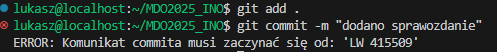

```bash
#!/bin/bash

INITIALS="LW"
INDEX="415509"
COMMIT_MSG_FILE=".git/COMMIT_EDITMSG"
COMMIT_MSG=$(head -n 1 "$COMMIT_MSG_FILE")
EXPECTED_PATTERN="^$INITIALS $INDEX"

if ! [[ "$COMMIT_MSG" =~ $EXPECTED_PATTERN ]]; then
    echo "ERROR: Komunikat commita musi zaczynać się od: '$INITIALS & $INDEX'"
    exit 1
fi

exit 0
```

- Próba spushowania repozytorium lokalnego

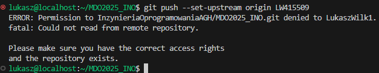

Próba spushowania repozytorium nie powiodła się ponieważ w tym momencie nie zostały jeszcze nadane uprawnienia

- Merge gałęzi LW415509 do gałęzi GCL08

  Aby móc wciągnąć swoją gałąź do innej gałęzi należy:

  - Przełączyć się na gałąź do której chcemy mergować:

    ```
    git checkout GCL08
    ```

  - Wykonać merge poleceniem:

    ```
    git merge LW415509
    ```

    W miejce LW415509 należy wpisać nazwę naszego brancha

  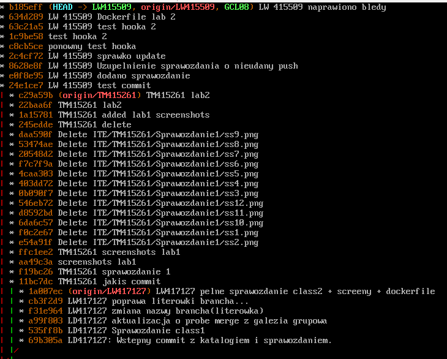

  Na załączanym obrazku widać ze nasza gałąź została wciągnięta do gałęzi grupy

# LABORATORIUM 2

## Instalacja Dockera w systemie linuksowym

- Przed zainstalowaniem dockera w systemie dokonujemy aktualizacji aby upewnić się że wszystko jest aktualne. Polecenie do aktualizacji systemu:

  ```
  sudo dnf update -y
  ```

  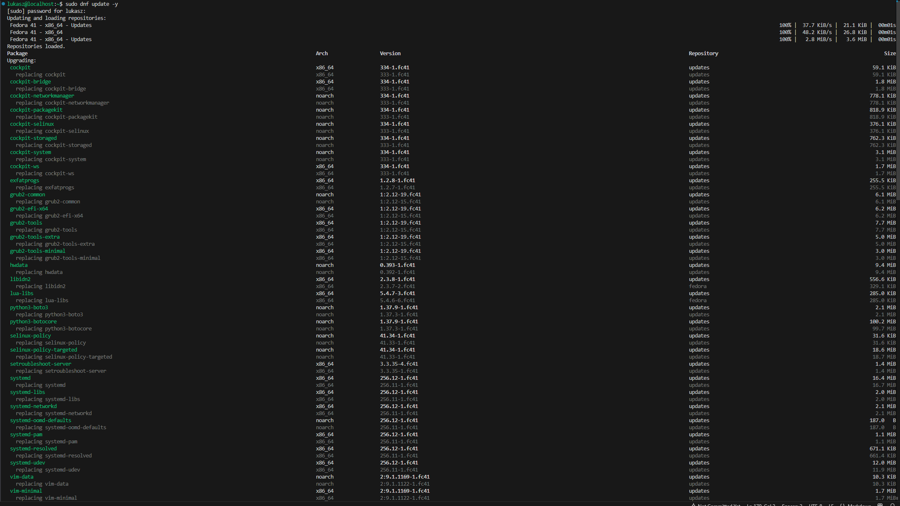

- W celu zainstalowania Dockera wykorzystujemy poniższe polecenie:

  ```
  sudo dnf install -y moby-engine
  ```

  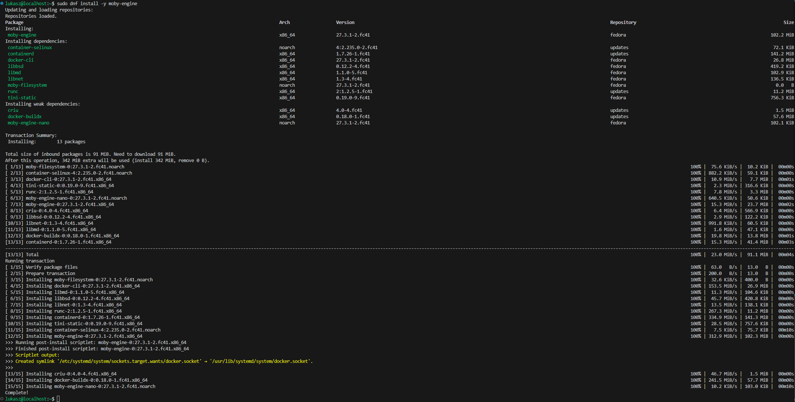

- Uruchamiamy i włączamy dockera przy użyciu poniższego polecenia

  ```
  sudo systemctl enable --now docker
  ```

  Następnie sprawdzamy czy instalacja i uruchomienie przebiegły pomyślnie przy użyciu polecenia:

  ```
  docker version
  ```

  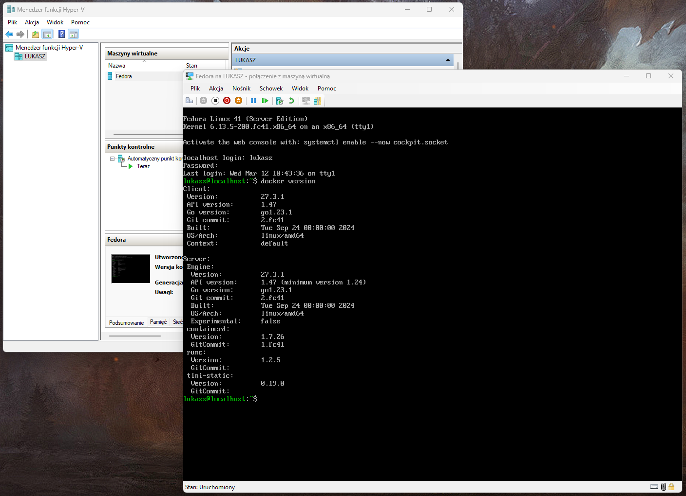

## Utworzenie konta w serwisie Docker Hub


## Pobranie obrazów Docker

- W celu pobrania obrazu z repozytorium DockerHub należy wykorzystać polecenie docker pull. Każde z poniższych poleceń pobiera inny obraz.

```
docker pull hello-world
```
```
docker pull busybox
```
```
docker pull ubuntu
```
```
docker pull fedora
```
```
docker pull mysql
```

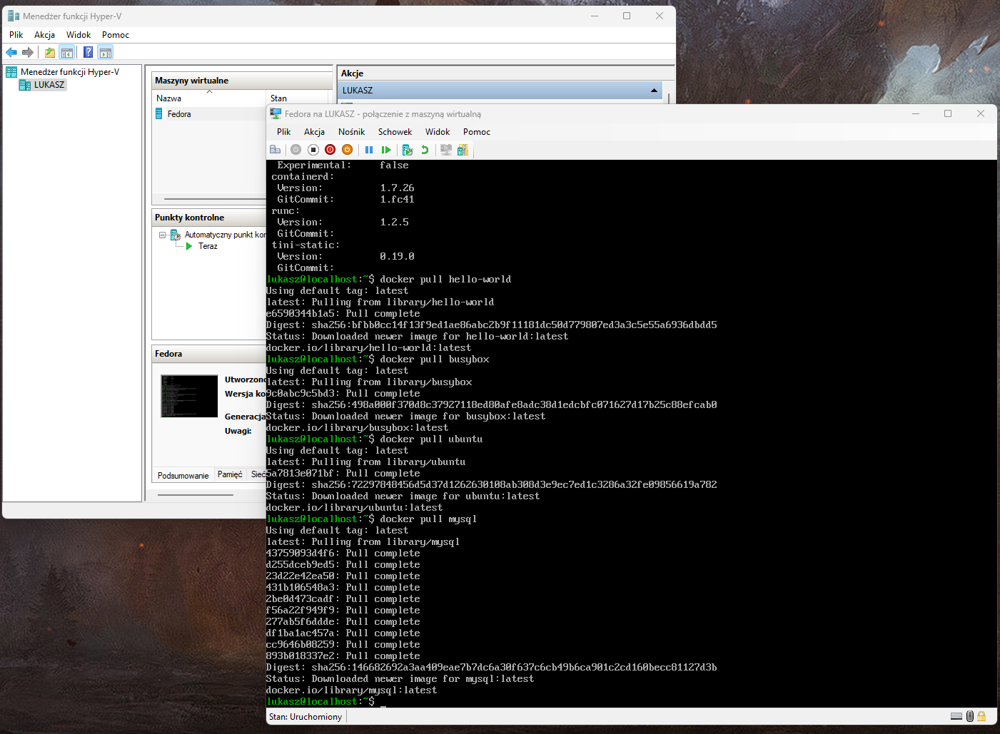

- Aby zweryfikować poprawność pobierania obrazów wykorzytamy poniższe polecenie:

  ```
  docker images
  ```

  Wyświetli ono wszystkie dostępne obrazy.

  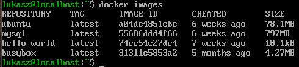

## Uruchomienie kontenera z obrazu busybox

- Aby uruchomić kontener z obrazu busybox należy wykonać nastepujące czynności

  ```
  docker run busybox echo "Pozdrowienia ze srodka kontenera busybox!"
  ```

  Powyższe polecenie pozwala na uruchomienie kontenera i wypisanie podanego przez nas komunikatu.

  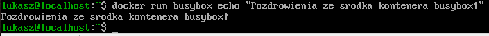

  - W celu interaktywnego podłączenia się do kontenera i wywołania numeru wersji należy użyć polecenia

  ```
  docker run -it busybox sh
  ```

  Następnie będąc wewnątrz aby sprawdzić wersję systemu należy użyć polecenia

  ```
  uname -a
  ```

  a aby opuścić kontener polecenia

  ```
  exit
  ```

  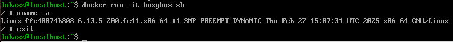

## Uruchomienie systemu ubuntu w kontenerze

- Polecenie umożliwiające uruchomienie kontenera z systemem ubuntu

  ```
  docker run -it ubuntu /bin/bash
  ```

- Sprawdzenie PID wewnątrz kontenera

  ```
  ps aux
  ```

  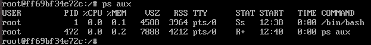

- Sprawdzenie procesów Dockera na hoście

  ```
  ps aux | grep docker
  ```

  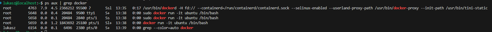

- Aktualizacja pakietów w kontenerze i wyjście z kontenera (dla ubuntu)

  ```
  apt update && apt upgrade -y
  ```
  ```
  exit
  ```

  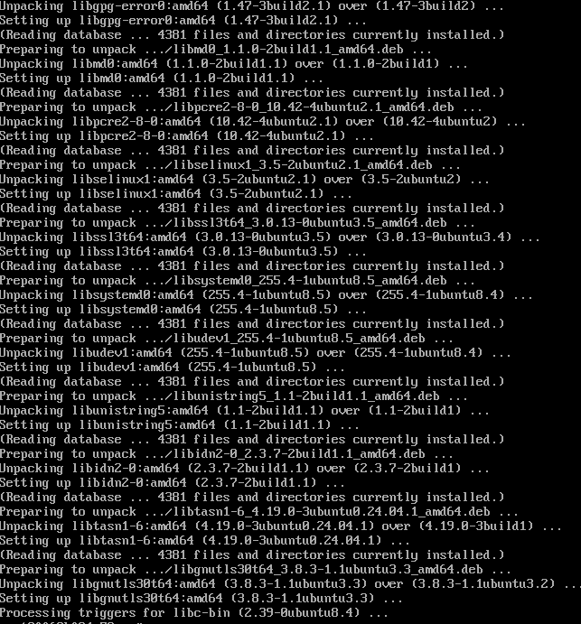

## Utworzenie własnego pliku Dockerfile bazującego na systemie Ubuntu

Tworzymy plik Dockerfile o takiej treści jak poniżej. Dzięki temu będziemy mieli pewność że będzie zainstalowany git i nasze repozytorium zostanie sklonowane.

```
FROM ubuntu:latest
RUN apt update && apt install -y git
WORKDIR /app
RUN git clone https://github.com/InzynieriaOprogramowaniaAGH/MDO2025_INO.git
CMD ["bash"]
```
- Aby zbudować obraz na podstawie pliku Dockerfile należy użyć polecenia

  ```
  docker build -t custom-ubuntu .
  ```

  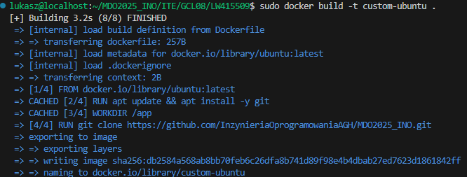

- W celu uruchomienia obrazu, wejścia do niego i sprawdzenia poprawności sklonowania repozytorium użyjemy

  ```
  docker run -it custom-ubuntu /bin/bash
  ```

  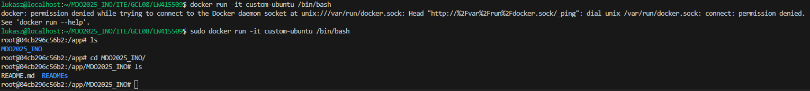

- Aby wyswietlic wszystkie działajace obrazy wraz z tymi zatrzymanymi należy użyć polecenia

  ```
  docker ps -a
  ```

  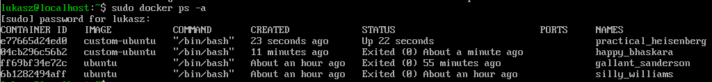

- Czyszczenie obrazów

  ```
  docker rmi hello-world busybox ubuntu fedora mysql custom-ubuntu
  ```

  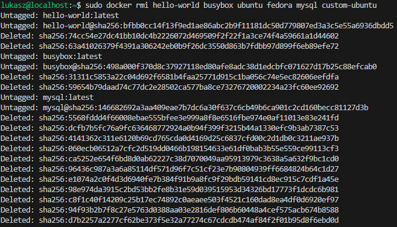

  .