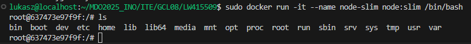
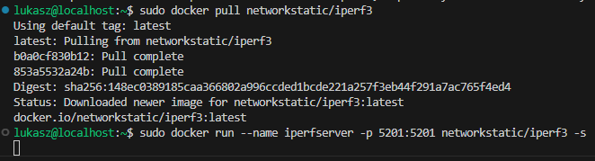

# LABORATORIUM 1

## 1. Instalacja klienta Git i obsługi kluczy SSH

 - W celu zainstalowania klienta git lokalnie należy użyć polecenia
    ```
    sudo dnf install git
    ```

  - Aby przeprowadzić weryfikację instalacji można skorzystać z poniższych poleceń:
    Sprawdzenie wersji gita:
    ```
    git --version
    ```
  - Sprawdzenie ścieżki do pliku wykonywalnego git: 
    ```
    which git
    ```
  - Sprawdzenie dostawcy gita: 
    ```
    dnf provides /usr/bin/git
    ```
  
    

## 2. Sklonuj repozytorium przedmiotowe za pomocą HTTPS i personal access token

  - W celu pobrania zdalnego repozytorium na maszynę lokalną najpierw skonfigurowano personal access token, który umożliwia klonowanie repozytorium bez konieczności podawania loginu oraz hasła.

    

    W celu sklonowania zdalnego repozytorium z GitHub'a z wykorzystaniem protokołu HTTPS należy użyć polecenia:

    ```
    git clone https://github.com/InzynieriaOprogramowaniaAGH/MDO2025_INO.git
    ```

    

## 3. Upewnij się w kwestii dostępu do repozytorium jako uczestnik i sklonuj je za pomocą utworzonego klucza SSH, zapoznaj się z dokumentacją.

  - Aby utworzyć klucz SSH na maszynie lokalnej należy wykorzystać poniższe polecenie:
    ```
    ssh-keygen -t ed25519 -C "twoj@mail.com"
    ```
  
    Po użyciu tego polecenia pojawia się komunikat o wpisaniu pliku docelowego (zaleca się nie wpisywać nic i kliknąć klawisz Enter), a następnie zapyta o passphrase. Jeżeli nie chcemy podawać hasła, to klikamy Enter, a gdy chcemy, wprowadzamy je dwukrotnie.
  
    

  - Skonfiguruj klucz SSH jako metodę dostępu do GitHuba.
    W celu dodania klucza do konta GitHub wchodzimy w ustawienia -> SSH and GPG keys -> New SSH Key. Podajemy tam nazwę naszego klucza, a w dolnym oknie wklejamy klucz, który wygenerowaliśmy wcześniej na maszynie lokalnej. Aby skopiować klucz, musimy wejść do   folderu `.ssh` i znaleźć plik `id_ed25519.pub`. W tym pliku znajduje się klucz, który kopiujemy i wklejamy do okienka na GitHubie.
  
    

  - Sklonuj repozytorium z wykorzystaniem protokołu SSH.
    W celu sklonowania repozytorium z wykorzystaniem protokołu SSH należy wykorzystać polecenie:
  
    ```
    git clone git@github.com:InzynieriaOprogramowaniaAGH/MDO2025_INO.git
    ```

    
  
    Jeżeli klucz skonfigurowaliśmy poprawnie, to repozytorium powinno sklonować się bez żadnych problemów. Można również zauważyć, że klucz działa poprawnie na stronie z kluczami w ustawieniach GitHub.
  
    

  - Skonfiguruj 2FA.
  
    
  
    

## 4. Przełącz się na gałąź `main`, a potem na gałąź swojej grupy (pilnuj gałęzi i katalogu!)


  - Polecenie wyświetlające wszystkie istniejące branche (łącznie z tymi w repozytorium zdalnym):

    ```
    git branch --all
    ```

    W celu zmiany gałęzi, na której się znajdujemy, należy wykorzystać polecenie:

    ```
    git checkout nazwa_galezi
    ```

    

## 5. Utwórz gałąź o nazwie "inicjały & nr indeksu" np. KD232144. Miej na uwadze, że odgałęziasz się od brancha grupy!

 - Aby przełączyć się na nieutworzoną jeszcze gałąź, należy użyć polecenia:

   ```
   git checkout -b nazwa_galezi
   ```

   Flaga `-b` tworzy nową gałąź podczas przełączania.

   

## 6. Rozpocznij pracę od nowej gałęzi

  - W katalogu właściwym dla grupy utwórz nowy katalog, także o nazwie "inicjały & nr indeksu" np. KD232144.

    W celu utworzenia katalogu w systemie Linux poprzez terminal należy użyć polecenia:
  
    ```
    mkdir nazwa_katalogu
    ```
  
    

  - Napisz Git hooka - skrypt weryfikujący, że każdy Twój "commit message" zaczyna się od "twoje inicjały & nr indeksu". (Przykładowe githook'i są w `.git/hooks`.)
  
    

  - Skopiuj go we właściwe miejsce, tak by uruchamiał się za każdym razem, kiedy robisz commita.

    Aby napisany przez nas hook uruchamiał się zawsze, gdy następuje commit, należy umieścić go w katalogu `.git/hooks`.
  
    
  
    

  Aby mieć pewność, że hook będzie się wykonywał, nadajemy mu uprawnienia:

  ```
  chmod +x commit-msg
  ```

  Przy próbie commitu bez podania odpowiedniej wiadomosci otrzymujemy błąd

  

  ```bash
  #!/bin/bash

  INITIALS="LW"
  INDEX="415509"
  COMMIT_MSG_FILE=".git/COMMIT_EDITMSG"
  COMMIT_MSG=$(head -n 1 "$COMMIT_MSG_FILE")
  EXPECTED_PATTERN="^$INITIALS $INDEX"

  if ! [[ "$COMMIT_MSG" =~ $EXPECTED_PATTERN ]]; then
      echo "ERROR: Komunikat commita musi zaczynać się od: '$INITIALS & $INDEX'"
      exit 1
  fi

  exit 0
  ```

  - Próba spushowania repozytorium lokalnego

    

    Próba spushowania repozytorium nie powiodła się ponieważ w tym momencie nie zostały jeszcze nadane uprawnienia

  - Merge gałęzi LW415509 do gałęzi GCL08

    Aby móc wciągnąć swoją gałąź do innej gałęzi należy:

  - Przełączyć się na gałąź do której chcemy mergować:

    ```
    git checkout GCL08
    ```

  - Wykonać merge poleceniem:

    ```
    git merge LW415509
    ```

    W miejce LW415509 należy wpisać nazwę naszego brancha

    

  Na załączanym obrazku widać ze nasza gałąź została wciągnięta do gałęzi grupy

# LABORATORIUM 2

## Instalacja Dockera w systemie linuksowym

- Przed zainstalowaniem dockera w systemie dokonujemy aktualizacji aby upewnić się że wszystko jest aktualne. Polecenie do aktualizacji systemu:

  ```
  sudo dnf update -y
  ```

  

- W celu zainstalowania Dockera wykorzystujemy poniższe polecenie:

  ```
  sudo dnf install -y moby-engine
  ```

  

- Uruchamiamy i włączamy dockera przy użyciu poniższego polecenia

  ```
  sudo systemctl enable --now docker
  ```

  Następnie sprawdzamy czy instalacja i uruchomienie przebiegły pomyślnie przy użyciu polecenia:

  ```
  docker version
  ```

  

## Utworzenie konta w serwisie Docker Hub


## Pobranie obrazów Docker

  - W celu pobrania obrazu z repozytorium DockerHub należy wykorzystać polecenie docker pull. Każde z poniższych poleceń pobiera inny obraz.

    ```
    docker pull hello-world
    ```
    ```
    docker pull busybox
    ```
    ```
    docker pull ubuntu
    ```
    ```
    docker pull fedora
    ```
    ```
    docker pull mysql
    ```

    

  - Aby zweryfikować poprawność pobierania obrazów wykorzytamy poniższe polecenie:

    ```
    docker images
    ```

    Wyświetli ono wszystkie dostępne obrazy.

    

## Uruchomienie kontenera z obrazu busybox

- Aby uruchomić kontener z obrazu busybox należy wykonać nastepujące czynności

  ```
  docker run busybox echo "Pozdrowienia ze srodka kontenera busybox!"
  ```

  Powyższe polecenie pozwala na uruchomienie kontenera i wypisanie podanego przez nas komunikatu.

  

  - W celu interaktywnego podłączenia się do kontenera i wywołania numeru wersji należy użyć polecenia

  ```
  docker run -it busybox sh
  ```

  Następnie będąc wewnątrz aby sprawdzić wersję systemu należy użyć polecenia

  ```
  busybox | head -n 1
  ```

  a aby opuścić kontener polecenia

  ```
  exit
  ```

  

## Uruchomienie systemu ubuntu w kontenerze

  - Polecenie umożliwiające uruchomienie kontenera z systemem ubuntu

    ```
    docker run -it ubuntu /bin/bash
    ```

  - Sprawdzenie PID wewnątrz kontenera

    ```
    ps aux
    ```

    

  - Sprawdzenie procesów Dockera na hoście

    ```
    ps aux | grep docker
    ```

    

  - Aktualizacja pakietów w kontenerze i wyjście z kontenera (dla ubuntu)

    ```
    apt update && apt upgrade -y
    ```
    ```
    exit
    ```

    

## Utworzenie własnego pliku Dockerfile bazującego na systemie Ubuntu

  - Tworzymy plik Dockerfile o takiej treści jak poniżej. Dzięki temu będziemy mieli pewność że będzie zainstalowany git i nasze repozytorium zostanie sklonowane.

    ```
    FROM ubuntu:latest
    RUN apt update && apt install -y git
    WORKDIR /app
    RUN git clone https://github.com/InzynieriaOprogramowaniaAGH/MDO2025_INO.git
    CMD ["bash"]
    ```
  - Aby zbudować obraz na podstawie pliku Dockerfile należy użyć polecenia

    ```
    docker build -t custom-ubuntu .
    ```

    

- W celu uruchomienia obrazu, wejścia do niego i sprawdzenia poprawności sklonowania repozytorium użyjemy

  ```
  docker run -it custom-ubuntu /bin/bash
  ```

  

- Aby wyswietlic wszystkie działajace obrazy wraz z tymi zatrzymanymi należy użyć polecenia

  ```
  docker ps -a
  ```

  

- Czyszczenie obrazów

  ```
  docker rmi hello-world busybox ubuntu fedora mysql custom-ubuntu
  ```

  

# LABORATORIUM 3

W celu wykonania zadania z laboratorium numer 3 rozpoczęto od znalezienia odpowiedniego projektu na licencji open source, ktory spełnia poniższe wymagania:
  - Projekt umieszczony wraz z narzędziami Makefile
  - Umożliwia uruchomienie 'make build' oraz 'make test'
  - Zawiera zdefiniowane testy
  - Jest na licencji Open Source

Znaleziona aplikacja która spełnia wymagania to create-react-app, dostępna pod linkiem: https://github.com/facebook/create-react-app

Jest to aplikacja wykorzystująca npm, więc przed przystąpieniem do zadania należy zainstalować na systemie fedora node.js oraz npm. W tym celu należy wykorzystać poniższe polecenia:

```
sudo dnf install -y nodejs npm
```

Następnie w celu weryfikacji poprawności instalacji należy użyć poleceń:

```
node -v
npm -v
```


## Sklonowanie repozytorium projektu i weryfikacja wymagań

  - Na początku należy sklonować repozytorium i wejść do pobranego folderu poniższym poleceniem

    ```
    git clone https://github.com/facebook/create-react-app.git
    cd create-react-app
    ```

  - Po wejściu do folderu należy doisntalować brakujące zależności poleceniem

    ```
    npm install
    ```

    

    Gdy wszystkie zależności zostną pobrane można przeprowadzić build programu

    ```
    npm run build
    ```

    

    Następnie aby uruchomić testy

    ```
    npm test
    ```

    

    

## Wykonanie powyższych czynności w kontenerze docker

  - W celu wykonania powyższych czynności w kontenerze docker należy rozpocząć od pobrania odpowiedniego obrazu. W naszym przypadku będzie to obraz node.js

    ```
    docker pull node:latest
    ```

    

  - Następnie aby uruchomić kontener interaktywnie wykorzstujemy poniższe polecenie

    ```
    docker run -it --name react-app-container node /bin/bash
    ```

    

  - Po uruchomieniu obrazu musimy upewnić się że kontener zawiera wszystkie wymagane zależności oraz gita

    ```
    apt update && apt install -y git
    ```

    

  - Następnie można przystąpić do klonowania repozytorium

    ```
    git clone https://github.com/facebook/create-react-app.git
    cd create-react-app
    ```

    

  - Instalujemy wymagane zależności i wykonujemy te same kroki co powyżej

    ```
    npm install
    ```

    

    ```
    npm run build
    ```

    

    ```
    npm test
    ```

    

    

  - Aby opuścić kontener używamy polecenia

    ```
    exit
    ```

    

## Automatyzacja powyższych kroków z wykorzystaniem Dockerfile

  - W celu zautomatyzowania powyższych czynności utworzono poniższy plik Dockerfile który jest odpowiedzialny za utworzenie buildu aplikacji

    ```
    FROM node:latest

    RUN git clone https://github.com/facebook/create-react-app.git

    WORKDIR /create-react-app

    RUN npm install
    ```

  - Po utworzeniu pliku Dockerfile tworzymy na jego podstawie obraz

    ```
    sudo docker build -t react-app-build --file Dockerfile.nodeapp .
    ```

  - Uruchamianie kontenera

    ```
    docker run react-app-build
    ```

    

  - Poniższy plik Dockerfile.test jest odpowiedzialn za uruchamianie testów jednostkowych projektu bez tworzenia jego buildu

    ```
    FROM react-app-build
    RUN npm test -- --watchAll=false --ci
    ```

  - Budowanie obrazu z powyższego pliku Dockerfile.test

    ```
    docker build -t react-app-test --file Dockerfile.test .
    ```

    

  - Uruchomienie kontenera

    ```
    docker run react-app-test
    ```

    

  - Przy użyciu poniższego polecenia możemy łatwo zweryfikować że kontener wdrąża się poprawnie

    ```
    docker ps
    ```

    

# LABORATORIUM 4

## Zachowywanie stanu

  - Prompt zastosowany w chacie GPT

    ```
    Przygotuj woluminy wejściowy i wyjściowy, o dowolnych nazwach, i podłącz je do kontenera bazowego (np. tego, z którego rozpoczynano poprzednio pracę). Kontener bazowy to ten, który umie budować nasz projekt (ma zainstalowane wszystkie dependencje, git nią   nie jest)
    Uruchom kontener, zainstaluj/upewnij się że istnieją niezbędne wymagania wstępne (jeżeli istnieją), ale bez gita
    Sklonuj repozytorium na wolumin wejściowy
    Opisz dokładnie, jak zostało to zrobione
    Wolumin/kontener pomocniczy?
    Bind mount z lokalnym katalogiem?
    Kopiowanie do katalogu z woluminem na hoście (/var/lib/docker)?
    Uruchom build w kontenerze - rozważ skopiowanie repozytorium do wewnątrz kontenera
    Zapisz powstałe/zbudowane pliki na woluminie wyjściowym, tak by były dostępne po wyłączniu kontenera.
    Pamiętaj udokumentować wyniki.
    Ponów operację, ale klonowanie na wolumin wejściowy przeprowadź wewnątrz kontenera (użyj gita w kontenerze)
    Przedyskutuj możliwość wykonania ww. kroków za pomocą docker build i pliku Dockerfile. (podpowiedź: RUN --mount)

    Mam do wykonania takie zadanie, jesteś w stanie wyjaśnić mi jak je zrobić? W skrócie musze w jakiś sposób przenieść repozytorium na wolumin (nie da się go sklonować z kontenera) potem w kontenerze zbudować (npm install) a na końcu przenieść do woluminu    drugiego (wyjściowego) wyjaśnij proszę krok po kroku jak to zrobić
    ```

  - Utworzenie woluminów wejściowego i wyjściowego

    ```
    docker volume create wejsciowy
    docker volume create wyjsciowy
    ```

    

  - Wykorzystujemy kontener z obrazu node w wersji slim, który nie ma zainstalowanego gita i ma niezbędne dla budowy zależności.

    ```
    docker pull node:slim
    docker run -it --name node-slim node:slim /bin/bash
    ```

    

  - Gdy mamy już poprawnie działający kontener musimy uruchomić go podpinając do niego utworzone wcześniej woluminy

    ```
    docker run -it --rm -v wejsciowy:/repo -v wyjsciowy:/output --name node-slim node:slim /bin/bash
    ```
  
    Jesteśmy w stanie zweryfikować poprawność podpięcia ponieważ pojawiły się 2 nowe foldery: repo z woluminu wejściowego oraz output z woluminu wyjściowego

    [alt text](images/woluminy_in.png)

  - Kolejnym krokiem będzie sklonowanie repozytorium na hoście bezpośrednio do woluminu
  
    ```
    git clone https://github.com/facebook/create-react-app.git /var/lib/docker/volumes/wejsciowy/_data
    ```

    

  - Następnie ponownie uruchamiamy kontener, przechodzimy do katalogu repo i wyświetlamy zawartość.

    ```
    docker run -it --rm -v wejsciowy:/repo -v wyjsciowy:/output --name node-slim node:slim /bin/bash
    cd repo
    ls
    ```

    

  - Kolejnym krokiem będzie wykonanie buildu i przeniesienie plików do woluminu wyjściowego. Na początku weryfikujemy że folder output będący częścią woluminu wyjściowego jest pusty

    

  - Wracamy do katalogu repo i wykonujemy build projektu

    ```
    npm install
    npm run build
    ```

    
    

  - Po zbudowaniu należy skopiować pliki do woluminu wyjściowego (katalog output)
    ```
    cp -r build /output
    ```

    

  - Na koniec wychodzimy z kontenera i weryfikujemy zawartość woluminów z hosta

    ```
    ls -l /var/lib/docker/volumes/wyjsciowy/_data
    ls -l /var/lib/docker/volumes/wejsciowy/_data
    ```

    

  - Wykonanie tych samych kroków z wykorzystaniem kontenera który posiada git polegałoby na zastosowaniu dokładnie tych samych poleceń, z tą różnicą że klonowanie repozytorium odbywałoby się w uruchomionym kontenerze do folderu znajdującego się w woluminie wejściowym tj. /repo

    ```
    git clone https://github.com/facebook/create-react-app.git /repo
    ```

    Wykonanie pozostałych kroków przebega dokładnie takie samo

## Eksponowanie portów

  Prompt zastosowany w chacie GPT
  ```
  Eksponowanie portu
  Zapoznaj się z dokumentacją https://iperf.fr/
  Uruchom wewnątrz kontenera serwer iperf (iperf3)
  Połącz się z nim z drugiego kontenera, zbadaj ruch
  Zapoznaj się z dokumentacją network create : https://docs.docker.com/engine/reference/commandline/network_create/
  Ponów ten krok, ale wykorzystaj własną dedykowaną sieć mostkową (zamiast domyślnej). Spróbuj użyć rozwiązywania nazw
  Połącz się spoza kontenera (z hosta i spoza hosta)
  Przedstaw przepustowość komunikacji lub problem z jej zmierzeniem (wyciągnij log z kontenera, woluminy mogą pomóc)
  Opcjonalnie: odwołuj się do kontenera serwerowego za pomocą nazw, a nie adresów IP

  To jest kolejne zadanie które mam do wykonania, wyjaśnij mi proszę jak je zrobić kok po kroku
  ```

  - Uruchom wewnątrz kontenera serwer iperf (iperf3)

    Rozpoczynamy od pobrania obrazu iperf3 i uruchomienia kontenera
    ```
    sudo docker pull networkstatic/iperf3
    docker run --name iperfserver -p 5201:5201 networkstatic/iperf3 -s
    ```

    

    Sprawdzamy adres uruchomionego kontenera iperfserver

    ```
    docker inspect -f '{{range.NetworkSettings.Networks}}{{.IPAddress}}{{end}}' iperfserver
    ```

    

    Gdy mamy już poprawny adres kontenera uruchamiamy drugi kontener iperf i nawiązujemy połączenie

    ```
    docker run --rm --name iperf-client networkstatic/iperf3 -c 172.17.0.2
    ```

    W obu kontenerach (2 różne temirnale na screenach) otrzymujemy wyniki połączenia

    
    

  - Ponów ten krok, ale wykorzystaj własną dedykowaną sieć mostkową (zamiast domyślnej). Spróbuj użyć rozwiązywania nazw

    Rozpoczynamy od utworzenia własnej dedykowanej sieci mostkowej (bridge)

    ```
    docker network create --driver bridge moja_siec
    ```
    ```
    docker network ls
    ```

    

    Następnie ponownie uruchamiamy kontenery serverowy i kliencki tym razem w utworzonej sieci, dzięki czemu nie będzie konieczne sprawdzanie adresów ip, a będzie możliwe użycie nazw kontenerów

    Uruchomienie serwera

    ```
    docker run --rm -it --name iperfserver --network moja_siec networkstatic/iperf3 -s
    ```

    Uruchomienie klienta

    ```
    docker run --rm --name iperf-client --network moja_siec networkstatic/iperf3 -c iperfserver
    ```

    

    
  
  - Połącz się spoza kontenera (z hosta i spoza hosta)

    W celu wyeksponowania portu musimy uruchomić kontener servera z dodatkową flagą -p

    ```
    docker run --name iperfserver -p 5201:5201 networkstatic/iperf3 -s
    ```

    Dzieki wyeksponowaniu portu możliwe było nawiązanie połączenia z serverem z hosta

    ```
    iperf3 -c localhost -p 5201
    ```

    

    

    Wyeksponowanie portu umożliwiło także nawiązanie połączenia z kontenerem poza hostem, w tym wypadku jest to komputer prywatny na którym działa maszyna wirtualna. Po zainstalowaniu na niej servera iperf3 w cmd (w miejscu w którym znajdują się pliki iperf3) użyto polecenia

    ```
    iperf3 -c 172.18.129.237 -p 5201
    ```

    Adres IP maszyny sprawdzono używając polecenia ip a na tej maszynie

    ```
    ip a
    ```

    
    

  - Przedstaw przepustowość komunikacji lub problem z jej zmierzeniem (wyciągnij log z kontenera, woluminy mogą pomóc)
    Aby wykonać to zadanie konieczne będzie utworzenie woluminu do którego zostanie zapisany log dzialania serwera

    ```
    sudo docker volume create logi
    ```

    

    Następnie uruchamiamy kontener servera z dołączonym woluminem i wskazujemy gdzie server ma zapisywać logi ze swojego działania

    ```
    docker run --rm -it --name iperf-server -p 5201:5201 -v logi:/logs networkstatic/iperf3 -s --logfile /logs/iperf-server.log
    ```

    Następnie w dowolny sposób z wyżej stosowanych (w tym wypadku połączenie z poza hosta) nawiżujemy połączenie z serwerem, aby zapisał logi.

    

    Można zauważyć że logi nie zostały wypisane tak jak wcześniej, to oznacza że zostały zapisane do pliku, co weryfikujemy poniższym poleceniem

    ```
    sudo nano /var/lib/docker/volumes/logi/_data/iperf-server.log
    ```

    

  
## Instancja Jenkins

  - Przeprowadź instalację skonteneryzowanej instancji Jenkinsa z pomocnikiem DIND

    Instalację rozpoczynamy od pobrania obrazu

    ```
    docker pull docker:dind
    ```

    Tworzymy sieć dla jenkinsa

    ```
    docker network create jenkins
    ```

    Następnie uruchamiamy instancje jenkinsa z pomocnikiem DIND

    ```
    docker run \
    --name jenkins-docker \
    --rm \
    --detach \
    --privileged \
    --network jenkins \
    --network-alias docker \
    --env DOCKER_TLS_CERTDIR=/certs \
    --volume jenkins-docker-certs:/certs/client \
    --volume jenkins-data:/var/jenkins_home \
    --publish 2376:2376 \
    docker:dind \
    --storage-driver overlay2
    ```

    Weryfikujemy poprawność uruchomienia kontenera

    ```
    docker ps
    ```

    

    Tworzymy nowy plik Dockerfile.jenkins na podstawie którego utworzymy obraz jenkins i uruchomimy kontener

    ```
    FROM jenkins/jenkins:2.492.2-jdk17
    USER root
    RUN apt-get update && apt-get install -y lsb-release ca-certificates curl && \
    install -m 0755 -d /etc/apt/keyrings && \
    curl -fsSL https://download.docker.com/linux/debian/gpg -o /etc/apt/keyrings/docker.asc && \
    chmod a+r /etc/apt/keyrings/docker.asc && \
    echo "deb [arch=$(dpkg --print-architecture) signed-by=/etc/apt/keyrings/docker.asc] \
    https://download.docker.com/linux/debian $(. /etc/os-release && echo \"$VERSION_CODENAME\") stable" \
    | tee /etc/apt/sources.list.d/docker.list > /dev/null && \
    apt-get update && apt-get install -y docker-ce-cli && \
    apt-get clean && rm -rf /var/lib/apt/lists/*
    USER jenkins
    RUN jenkins-plugin-cli --plugins "blueocean docker-workflow"    
    ```

    ```
    docker build -t myjenkins-blueocean:2.492.2-1 --file Dockerfile.jenkins .
    ```

    

    Uruchamiamy kontener z jenkinsem

    ```
    docker run \
    --name jenkins-blueocean \
    --restart=on-failure \
    --detach \
    --network jenkins \
    --env DOCKER_HOST=tcp://docker:2376 \
    --env DOCKER_CERT_PATH=/certs/client \
    --env DOCKER_TLS_VERIFY=1 \
    --publish 8080:8080 \
    --publish 50000:50000 \
    --volume jenkins-data:/var/jenkins_home \
    --volume jenkins-docker-certs:/certs/client:ro \
    myjenkins-blueocean:2.492.2-1
    ```

    

    Weryfikujemy także poprawność uruchomienia poprzez uruchomienie jenkinsa w przeglądarce wchodząc pod poniższy adres

    ```
    http://172.18.129.237:8080
    ```

    