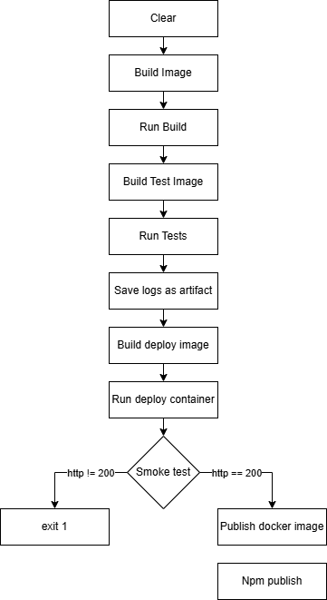

# Pipeline, Jenkins, izolacja etapów

### Przygotowanie
🌵 Utwórz instancję Jenkins
* Utworzenie instancji Jenkins zostało wykonane i udokumentowane w ramach poprzedniego sprawozdania
* Aby rozpocząć pracę z Jenkinsem należy uruchomić 2 kontenery poprzednio utworzone: dind oraz jenkins

```
docker run \
--name jenkins-docker \
--rm \
--detach \
--privileged \
--network jenkins \
--network-alias docker \
--env DOCKER_TLS_CERTDIR=/certs \
--volume jenkins-docker-certs:/certs/client \
--volume jenkins-data:/var/jenkins_home \
--publish 2376:2376 \
docker:dind \
--storage-driver overlay2
```

```
docker run \
--name jenkins-blueocean \
--restart=on-failure \
--detach \
--network jenkins \
--env DOCKER_HOST=tcp://docker:2376 \
--env DOCKER_CERT_PATH=/certs/client \
--env DOCKER_TLS_VERIFY=1 \
--publish 8080:8080 \
--publish 50000:50000 \
--volume jenkins-data:/var/jenkins_home \
--volume jenkins-docker-certs:/certs/client:ro \
myjenkins-blueocean:2.492.2-1
```

- Gdy kontenery są już uruchomione uruchamiamy przeglądarkę i wchodzimy pod adres na którym działa instancja Jenkinsa (w moim wypadku jest to adres maszyny wirtualnej i odpowiednio wyeksponowany podczas uruchamiania kontenera port)
```
http://172.18.129.237:8080
```
- Przy pierwszym uruchomieniu Jenkinsa należało podać hasło znajdujące się w logach kontenera, przeprowadzić instalację i utworzyć konto użytkownika
- 
- 
- 
  
### Zadanie wstępne: uruchomienie
🌵 Zadanie do wykonania na ćwiczeniach
* Konfiguracja wstępna i pierwsze uruchomienie
  * Utwórz projekt, który wyświetla `uname`
	  * W celu utworzenia nowego projektu należy wybrać z menu po lewej stronie opcję + nowy projekt.
	   
	  * Następnie należy wybrać (dla tego konkretnego zadania) projekt ogólny oraz nadać odpowienią nazwę
	  
	- Następnie w opcjach konfiguracji przechodzimy do sekcji kroki budowania, z rozwijanej listy wybieramy uruchom powłokę, a następnie w oknie które wyskoczy wpisujemy nasze polecenie.
	- 
	- 
	- Następnie klikamy zapisz i klikamy uruchom w menu po lewej stronie, jeżeli projekt uruchomi się poprawnie, dostaniemy stosowny komunikat i zieloną ikonkę
	- 
	- 
  * Utwórz projekt, który zwraca błąd, gdy... godzina jest nieparzysta
	  * W celu utworzenia i uruchomienia projektu powtarzamy wszystkie powyższe kroki
	  * 
	  * 
```
#!/bin/bash
HOUR=$(date +%H)
if [ $((HOUR % 2)) -ne 0 ]; then
    echo "❌ Błąd: godzina ($HOUR) jest nieparzysta!"
    exit 1
else
    echo "✅ Godzina ($HOUR) jest parzysta, kontynuujemy..."
fi
```

Widzimy że projekt uruchomiony o godzinie parzystej uruchamia się poprawnie a o godzinie nieparzystej otrzymujemy błąd (exit 1)
  * Pobierz w projekcie obraz kontenera `ubuntu` (stosując `docker pull`)
	  * 
	  * 

### Zadanie wstępne: obiekt typu pipeline
🌵 Ciąg dalszy sprawozdania - zadanie do wykonania po wykazaniu działania Jenkinsa
* Utwórz nowy obiekt typu `pipeline`
* 
* Wpisz treść *pipeline'u* bezpośrednio do obiektu (nie z SCM - jeszcze!)
* Spróbuj sklonować repo przedmiotowe (`MDO2025_INO`)
* Zrób *checkout* do swojego pliku Dockerfile (na osobistej gałęzi) właściwego dla *buildera* wybranego w poprzednim sprawozdaniu programu
* Zbuduj Dockerfile
* Uruchom stworzony *pipeline* drugi raz
* 
* 
```
pipeline {
    agent any
    
    environment {
        REPO_URL = 'https://github.com/InzynieriaOprogramowaniaAGH/MDO2025_INO.git'
        BRANCH = 'LW415509'
        DOCKER_IMAGE = 'my-builder-image'
    }
    
    stages {
        stage('Clone repository') {
            steps {
                script {
                    sh 'rm -rf * && git clone ${REPO_URL}'
                }
            }
        }
        
        stage('Checkout Dockerfile') {
            steps {
                script {
                    sh 'cd MDO2025_INO && git checkout ${BRANCH}'
                }
            }
        }
        
        stage('Build Docker Image') {
            steps {
                script {
                    sh 'cd MDO2025_INO/ITE/GCL08/LW415509 && docker build -t ${DOCKER_IMAGE} -f Dockerfile.nodeapp .'
                }
            }
        }
    }
}
```

# Pipeline aplikacji w node.js

## Diagram UML procesu CI/CD



Utworzenie pipeline'u rozpoczynamy od utworzenia nowego projektu w jenkinsie o typie pipeline.


Przed utworzeniem pipeline'u należy zrobić fork na repozytorium z projektem na którym bedziemy pracować.


Następnie w opcjach configure z lewej strony wybieramy pipeline, a następnie w nim ustawiamy następujące opcje:

- Definition: Pipeline from script SCM - ta opcja pozwoli nam na uruchamianie pipeline'u ze skryptu znajdującego się w repozytorium
- SCM: Git - informujemy Jenkinsa, że będziemy korzystali z repozytorium Git
- Repository URL: https://github.com/LukaszWilk1/node-js-dummy-test.git
- Branch Specifier: \*/master - gałąź z której będzie uruchamiany pipeline
- Script path: Jenkinsfile - ścieżka do pliku Jenkinsfile


Po poprawnej konfiguracji klikamy save.

Kolejnym krokiem będzie utworzenie lokalnego klona repozytorium na maszynie, utworzenie w nim pliku Jenkinsfile i skomitowanie go na sforkowane repozytorium zdalne:

```
git clone https://github.com/LukaszWilk1/node-js-dummy-test.git
```

```
cd node-js-dummy-test
```

Następnie tworzymy w naszym repozytorium plik o nazwie Jenkinsfile i uzupełniamy go poniższą treścią. Poniższy pipeline usunie wszystkie działające kontenery i istniejące obrazy docker w celu zapewnienia że gdy będziemy tworzyli własne kontenery nie będzie dochodziło do kolizji z nazwami.

```
pipeline {
    agent any
    stages {
        stage('Clear') {
            steps {
                script{
                    sh '''
                        if [ "$(docker ps -aq)" ]; then
                          docker rm -f $(docker ps -aq)
                        fi
                        if [ "$(docker images -aq)" ]; then
                          docker rmi -f $(docker images -aq)
                        fi
                    '''
                }
            }
        }
    }
}
```

W powyższym Jenkinsfile znajduje się skrypt który sprawdza czy sitnieją jakieś kontenery i obrazy docker i jeżeli tak, to je usuwa. Gdy utworzymy już Jenskinsfile, komitujemy go na zdalne repozytorium github:

```
git add .
```

```
git commit -m "Add initial Jenkinsfile"
```

```
git push
```


Gdy repozytorium jest spushowane, z okna po lewej stronie uruchamiamy naszego pipeline'a i weryfikujemy poprawność jego utworzenia.


```
pipeline {
    agent any
    environment {
        BUILD_CONTAINER_IMAGE = 'myapp-build:latest'
        TEST_CONTAINER_IMAGE = 'myapp-test:latest'
        DEPLOY_CONTAINER_IMAGE = 'myapp-deploy:latest'
        VERSION = "1.0.${BUILD_NUMBER}"
    }
    
    stages {
        stage('Clear') {
            steps {
                script{
                    sh '''
                        if [ "$(docker ps -aq)" ]; then
                          docker rm -f $(docker ps -aq)
                        fi
                        if [ "$(docker images -aq)" ]; then
                          docker rmi -f $(docker images -aq)
                        fi
                    '''
                }
            }
        }
        
        stage('Build Image') {
            steps {
                sh 'docker build -t $BUILD_CONTAINER_IMAGE -f Dockerfile.build .'
            }
        }

        stage('Run Build') {
            steps {

                sh 'docker run --rm --name build-container $BUILD_CONTAINER_IMAGE | tee build.log'
            }
        }

        stage('Build Test Image') {
            steps {
                sh 'docker build -t $TEST_CONTAINER_IMAGE -f Dockerfile.test .'
            }
        }

        stage('Run Tests') {
            steps {
                sh 'docker run --rm --name test-container $TEST_CONTAINER_IMAGE | tee test.log'
            }
        }

        stage('Save Logs as Artifact') {
            steps {
                archiveArtifacts artifacts: '*.log', fingerprint: true
            }
        }

        stage('Build Deploy Image') {
            steps {
                sh 'docker build -t $DEPLOY_CONTAINER_IMAGE -f Dockerfile.deploy .'
            }
        }

        stage('Run Deploy Container') {
            steps {
                sh 'docker run -d --name deploy-container -p 3000:3000 $DEPLOY_CONTAINER_IMAGE'
                sleep 15
            }
        }

        stage('Smoke Test') {
            steps {
                sh '''
                    echo "[TEST] Weryfikacja działania aplikacji (smoke test)..."

                    docker run --rm --network container:deploy-container appropriate/curl -s -o /dev/null -w "%{http_code}" http://localhost:3000 > status.txt
                    STATUS=$(cat status.txt)
                    if [ "$STATUS" -ne 200 ]; then
                    echo "Smoke test failed! App returned status $STATUS"
                    exit 1
                    else
                    echo "Smoke test passed! App responded with 200 OK"
                    fi
                '''
            }
        }
        stage('Publish Docker Image') {

            steps {

             withCredentials([usernamePassword(credentialsId: 'dockerhub-creds',usernameVariable: 'DOCKERHUB_USER', passwordVariable: 'DOCKERHUB_PASS')]) {
                    sh '''
                        echo "$DOCKERHUB_PASS" | docker login -u "$DOCKERHUB_USER" --password-stdin
                        docker tag $DEPLOY_CONTAINER_IMAGE $DOCKERHUB_USER/myapp:latest
                        docker tag $DEPLOY_CONTAINER_IMAGE $DOCKERHUB_USER/myapp:$VERSION
                        docker push $DOCKERHUB_USER/myapp:latest
                        docker push $DOCKERHUB_USER/myapp:$VERSION
                    '''
                }
            }
        }

        stage('Version & Publish to npm') {
            steps {
                withCredentials([string(credentialsId: 'npm-token', variable: 'NPM_TOKEN')]) {
                    script {
                        def newVersion = "1.0.${env.BUILD_NUMBER}"
                        sh """
                            docker run --rm \
                                -v \$(pwd):/app \
                                -w /app \
                                -e NPM_TOKEN=${env.NPM_TOKEN} \
                                node:18 bash -c '
                                    echo "//registry.npmjs.org/:_authToken=\$NPM_TOKEN" > ~/.npmrc
                                    npm version ${newVersion} --no-git-tag-version
                                    npm install
                                    npm publish
                                '
                        """
                    }
                }
            }
        }
    }

    post {
        always {
            sh 'docker rm -f deploy-container || true'
            sh 'docker logout'
        }
    }
}
```
## Omówienie poszczególnych elementów i kroków w pliku Jenkinsfile:

### Agent Any

Agent w Jenkinsie oznacza węzeł Jenkinsa który będzie wykonywał operacje zamieszczone w pipelinie. Agentów wykorzystuje się do do wykonywania wielu różnych operacji na jednym serwerze Jenkinsa. Agent any oznacza ze do wykonania zadania zostanie wybrany dowolny agent, który je wykona.
### Environment

Określa zmienne które będą wykorzystywane w treści pliku Jenkinsfile, w naszym przypadku są to nazwy obrazów oraz wersja.

### Stages

Zawiera poszczególne kroki pipeline'u, które będą wykonywały się w kolejności w jakiej znajdują się w skrypcie. Każdy stage ma sekcje steps, znajdują się w niej poszczególne kroki (polecenia, skrypty), które mają się w ramach stage'u wykonać.

#### stage('Clear')

Stage odpowiedzialny za wyczyszczenie wszystkich istniejących obrazów i kontenerów docker, w celu zapewnienia że nie dojdzie do konfliktów podczas późniejszego tworzenia kontenerów.  Zawiera skrypt którego zadaniem jest wykonać operacje czyszczenia wtedy, gdy kontenery faktycznie istnieją. Próba usunięcia nieistniejących kontenerów będzie powodowała błąd.

### stage('Build Image')

Stage odpowiedzialny za utworzenie obrazu który będzie budował naszą aplikacje. Obraz budowany jest na podstawie poniższego pliku Dockerfile.build

```
FROM node:18-alpine

WORKDIR /app

COPY . .

RUN npm install
```

### stage('Run Build')

Uruchomienie obrazu buildu i utworzenie pliku z logami z budowania
###  stage('Build Test Image')

Stage odpowiedzialny za utworzenie obrazu który będzie budował naszą aplikacje. Obraz budowany jest na podstawie poniższego pliku Dockerfile.test

```
FROM myapp-build:latest

WORKDIR /app

CMD ["npm", "run", "start"]
```

### stage('Run Tests')

Uruchomienie obrazu testów, który jest oparty na utworzonym wcześniej obrazie build i utworzenie pliku z logami z budowania.

### stage('Save Logs as Artifact')

Zapisanie logów jako artefaktów.

### stage('Build Deploy Image')

Utworzenie obrazu do deploy'u (uruchomienia) naszej aplikacji. Do stworzenia obrazu wykorzystywany jest poniższy plik Dockerfile.deploy

```
FROM myapp-build:latest

WORKDIR /app

CMD ["npm", "test"]
```


### stage('Run Deploy Container')

Uruchomienie kontenera na bazie zbudowanego wcześniej obrazu deploy.

### stage('Smoke Test')

Stage który ma za zadanie zweryfikować poprawność uruchomienia aplikacji. Zawiera skrypt który uruchamia w tej samej sieci, co kontener deploy. Jest to konieczne w celu nawiązania połączenia z aplikacją. Polecenie uruchamiane w kontenerze zapisuje wynik zapytania curl do pliku tekstowego, a następnie skrypt weryfikuje otrzymany status. Jeżeli odpowiedź jest pozytywna (kod http 200) to skrypt kończy działanie i pipeline przechodzi do następnego kroku. Jeżeli wynik jest negatywny, skrypt zwraca kod błędu 1 co powoduje przerwanie działania pipeline'u.

### stage('Publish Docker Image')

Jeżeli smoke test przeszedł prawidłowo rozpoczyna się etap publikacji aplikacji na platformie dockerhub. Aby było to możliwe należy:

- Mieć założone konto na platformie dockerhub
- Utworzyć Credentials w Jenksinsie które będą przechowywały dane logowania. W tym wypadku są to credentials username & password. W celu utworzenia credentials należy kliknąć na nazwę użytkownika, z menu po lewej stronie wybrać Credentials, następnie kliknąć na folder (globals) w zakładce System (bardzo ważne aby był to system, jeżeli dodamy tylko do usera to jenkins może ich nie widzieć!!!). Następnie dodajemy nowe credentials.


Skrypt zawarty w tym kroku loguje nas do konta dockerhub, następnie ustawia dwa tagi dla kontenera aplikacji: latest oraz z aktualną wersją (wersja ma następującą strukturę 1:0:numer uruchomienia pipeline'u). Następnie obrazy są pushowane na repozytorium dockerhub.


### stage('Version & Publish to npm')

W tym stage'u nastepuje publikacja obrazu na platformę npm. Aby było to możliwe należy:

- Mieć założone konto na platformie npm
- Utworzyć Credentials w Jenksinsie które będą przechowywały dane logowania. W tym wypadku są to credentials secret text (specjalny token generowany na stronie npm, który umożliwia publikacje)

Skrypt na początku tworzy odpowiednią wersję, a nastepnie uruchamia kontener z nodem. Jest to konieczne ponieważ Jenkins bazowo nie ma zainstalowanego node'a, a do publikacji jest on niezbędny (możliwość użycia poleceń npm). Następnie w kontenerze następuje przypisanie wersji, zainstalowanie wszystkich niezbędnych zależności, a na koniec publikacja aplikacji.


## POST

Zawiera w sobie akcje które będą wykonywane na końcu działania pipeline'a. W naszym przypadku jest to usunięcie kontenera deploy oraz wylogowanie z dockera.

## Weryfikacja obrazu opublikowanego na Dockerhub

Pobieramy obraz ze zdalnego repozytorium Dockerhub

```
docker pull elwilk/myapp:latest
```

Uruchamiamy kontener

```
docker run -d -p 3000:3000 --name myapp telwilk/myapp:latest
```

Wykonujemy curl w celu weryfikacji odpowiedzi od aplikacji

```
curl http://localhost:3000
```


Na załączonym zrzucie ekranu widać że aplikacja działa poprawnie.

## Weryfikacja działania aplikacji opublikowanej na NPM

Instalujemy paczkę:
```
npm install dummy-nodejs-todo
```

Wchodzimy do katalogu node_modules i odnajdujemy w nim katalog dummy-nodejs-todo

```
cd node_modules
```


Na załączonym zrzucie ekranu widać że aplikacja znajduje się obok wszystkich pozostałych zależności.

Końcowy pipeline udało się zrealizować zgodnie z założonym diagramem UML.

## Przygotowanie do Ansible

### Instalacja maszyny wirtualnej

Utworzono maszynę wirtualna i rozpoczęto proces instalacji.


Instalowanie tylko najbardziej niezbędnych zależności


Po zakończeniu instalacji należy ustawić hostname na ansible-target

```
sudo hostnamectl set-hostname ansible-target
```


Weryfikacja instalacji tar i sshd

```
which tar
```

```
which sshd
```


Uruchomienie serwera SSH

```
sudo systemctl enable sshd
sudo systemctl start sshd
```

Weryfikacja uruchomienia:
```
systemctl status sshd
```


Instalacja Ansible na maszynie głównej

```
sudo dnf install -y ansible
```


Weryfikacja instalacji

```
ansible --version
```


Wymiana kluczy SSH

Jeżeli na maszynie nie ma jeszcze klucza, należy wygenerować go poleceniem:

```
ssh-keygen
```

Jeżeli po wpisaniu tego wyskoczy zapytanie:
override (y/n)?

Oznacza to że klucz już istnieje i lepiej go nie nadpisywać bo może być używany gdzie indziej. W takiej sytuacji kopiujemy klucz na maszynę ansible. Aby było to możliwe musimy dodać jej adres do znanych hostów:

```
sudo nano /etc/hosts
```

Dopisujemy ostatnią linijkę tak jak na poniższym zrzucie ekranu.


Następnie kopiujemy klucz poleceniem:

```
ssh-copy-id -i ~/.ssh/id_ed25519.pub ansible@ansible-target
```

Weryfikujemy poprawność skopiowania poleceniem

```
ssh ansible@ansible-target
```

