# Sprawozdanie z Pipeline, Jenkins, izolacja etapów

## 1. Przygotowanie

### Utworzenie instancji Jenkins

#### Podążając instrukcjami z dokumentacji: https://www.jenkins.io/doc/book/installing/docker/

Utworzenie sieci jenkins

```
docker network create jenkins
```

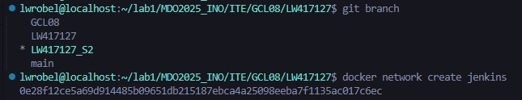

Uruchomienie docker:dind w kontenerze

```
docker run \
  --name jenkins-docker \
  --restart=always \
  --detach \
  --privileged \
  --network jenkins \
  --network-alias docker \
  --env DOCKER_TLS_CERTDIR=/certs \
  --volume jenkins-docker-certs:/certs/client \
  --volume jenkins-data:/var/jenkins_home \
  --publish 2376:2376 \
  docker:dind \
  --storage-driver overlay2
```

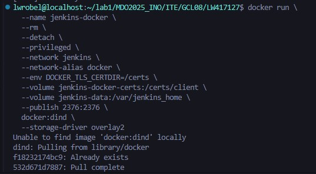

Utworzenie pliku Dockerfile do zbudowania kontenera blueocean

```
FROM jenkins/jenkins:2.492.2-jdk17
USER root
RUN apt-get update && apt-get install -y lsb-release ca-certificates curl && \
    install -m 0755 -d /etc/apt/keyrings && \
    curl -fsSL https://download.docker.com/linux/debian/gpg -o /etc/apt/keyrings/docker.asc && \
    chmod a+r /etc/apt/keyrings/docker.asc && \
    echo "deb [arch=$(dpkg --print-architecture) signed-by=/etc/apt/keyrings/docker.asc] \
    https://download.docker.com/linux/debian $(. /etc/os-release && echo \"$VERSION_CODENAME\") stable" \
    | tee /etc/apt/sources.list.d/docker.list > /dev/null && \
    apt-get update && apt-get install -y docker-ce-cli && \
    apt-get clean && rm -rf /var/lib/apt/lists/*
USER jenkins
RUN jenkins-plugin-cli --plugins "blueocean docker-workflow"
```

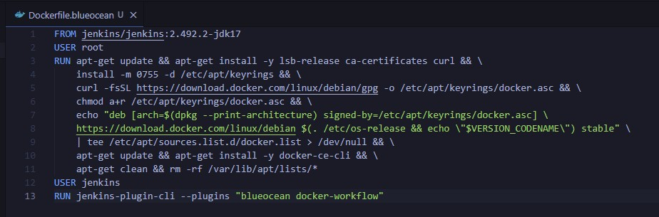

Zbudowanie obrazu z powyższego Dockerfile

```
docker build -t myjenkins-blueocean -f Dockerfile.blueocean .
```

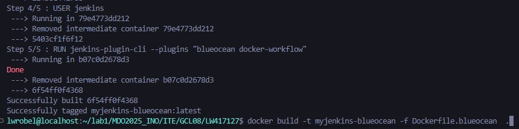

Uruchomienie jenkins:blueocean w kontenerze

```
docker run \
  --name jenkins-blueocean \
  --restart=on-failure \
  --detach \
  --network jenkins \
  --env DOCKER_HOST=tcp://docker:2376 \
  --env DOCKER_CERT_PATH=/certs/client \
  --env DOCKER_TLS_VERIFY=1 \
  --publish 8080:8080 \
  --publish 50000:50000 \
  --volume jenkins-data:/var/jenkins_home \
  --volume jenkins-docker-certs:/certs/client:ro \
  myjenkins-blueocean
```

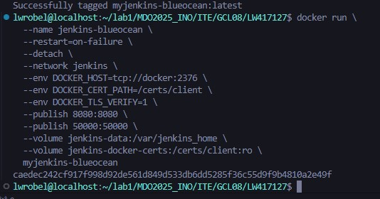

Po uruchomieniu blueocean i dind przechodzimy na stronę konfiguracyjną jenkins na porcie 8080: http://localhost:8080/

### Zadanie wstępne: uruchomienie

#### Przechodzimy do tworzenia projektów na jenkinsie

Po podaniu hasła zapisanego w kontenerze z jenkinsem przenosimy się do panelu konfiguracyjnego jenkins, skąd możemy tworzyć projekty i *pipeline'y*

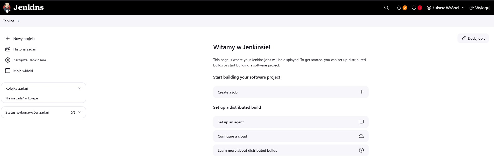

W zakładce *Nowy projekt* tworzymy nowy projekt i w jego konfiguracji w krokach budowania możemy umieścić treść polecenia, które ma się wykonać po uruchomieniu projektu

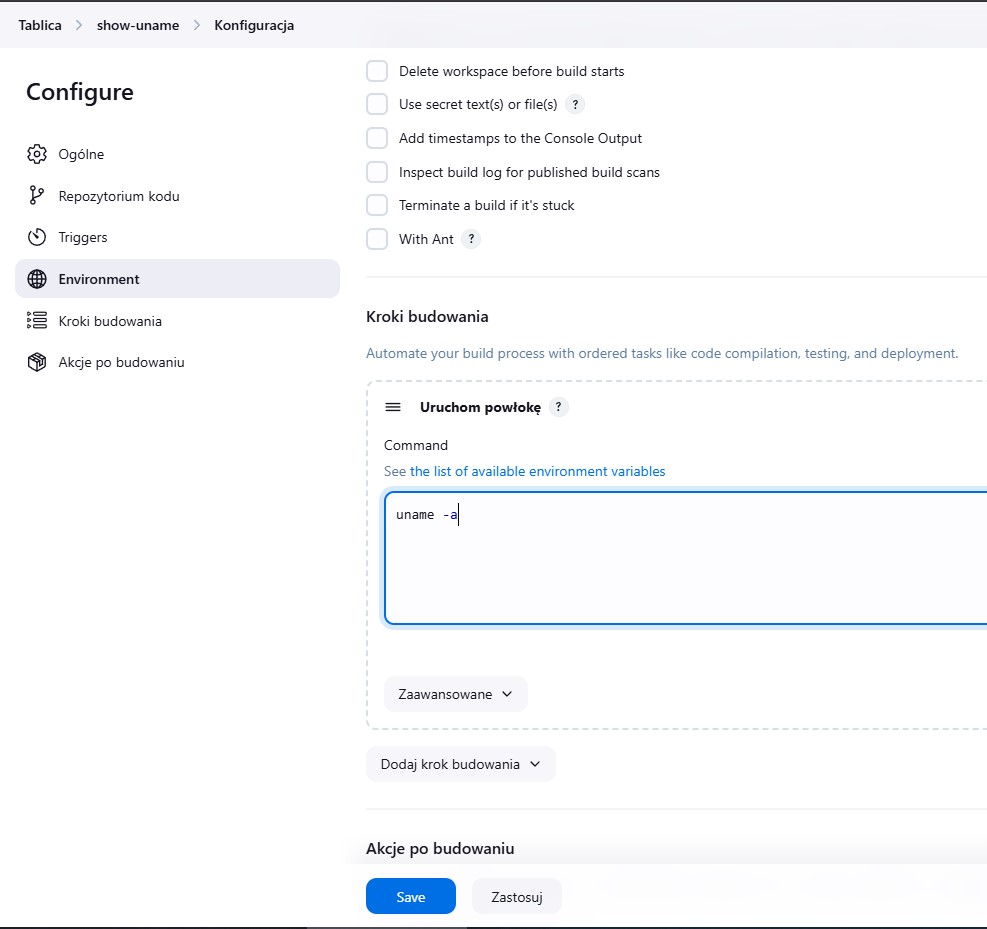

Wynik projektu wyświetlającego ```uname -a```

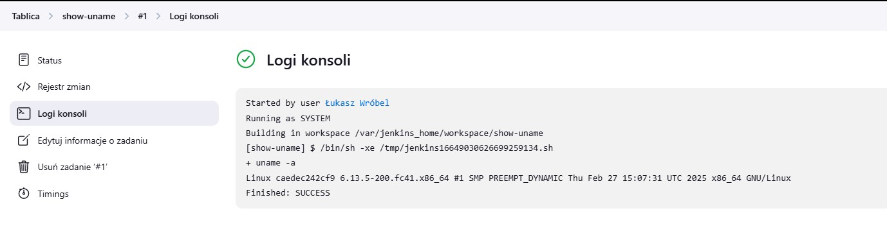

Wynik projektu wyświetlającego błąd jeśli godzina jest nieparzysta

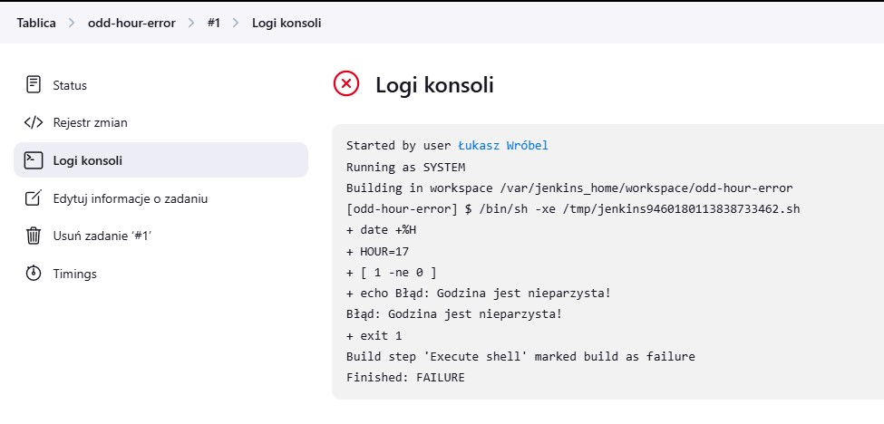

Wynik projektu wykonującego polecenie ```docker pull ubuntu``` wewnątrz DinD

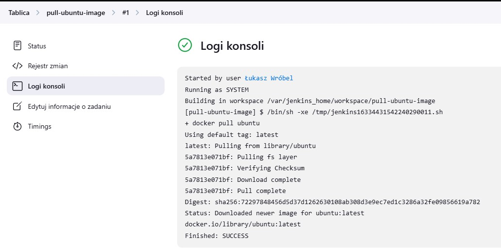

### Zadanie wstępne: obiekt typu pipeline

#### Tworzyny nowy obiekt *pipeline* analogicznie jak tworzyliśmy poprzednie projekty, jednak z menu wybierając typ projektu jako pipeline

Wewnątrz projektu pipeline'u tworzymy skrypt w składni pipeline, który klonuje repozytorium przedmiotowe oraz korzystając z pliku Dockerfile do zbudowania projektu irssi, buduje obraz na podstawie pliku Dockerfile. Aby zabezpieczyć pipeline przed błędami związanymi z ponownym jego uruchomieniem, czyścimy dotychczasowo utworzone pliki i budujemy obraz na nowo.

#### Treść skryptu:

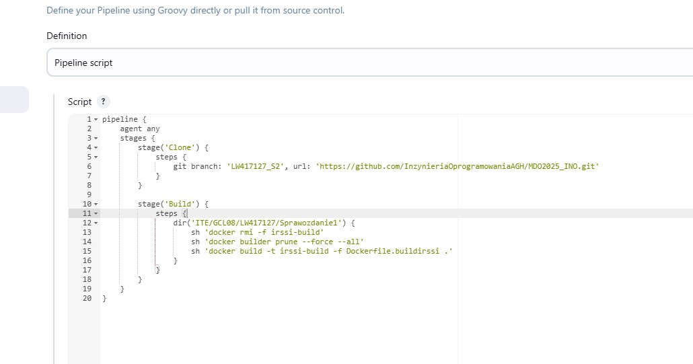

Wyniki dwukrotnego uruchomienia pipeline'u

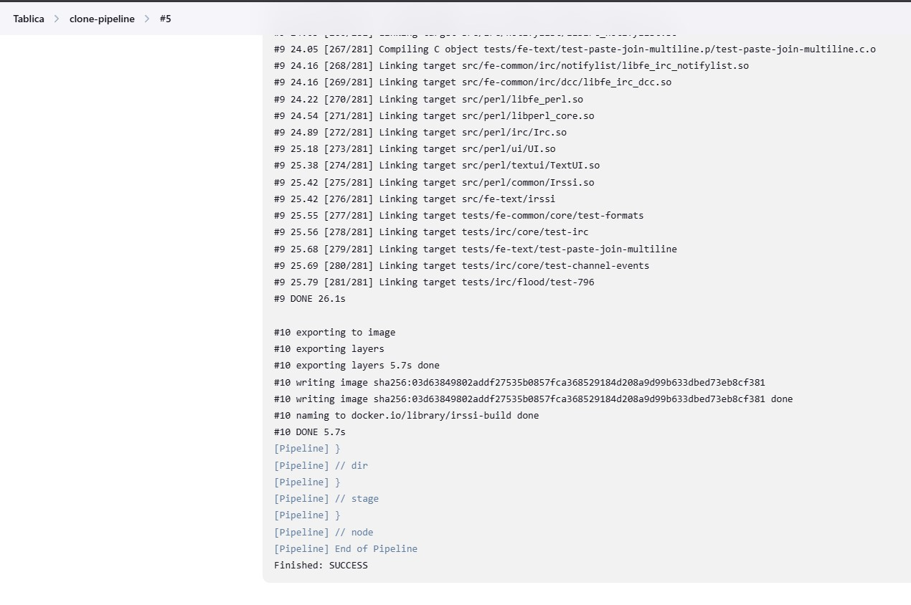

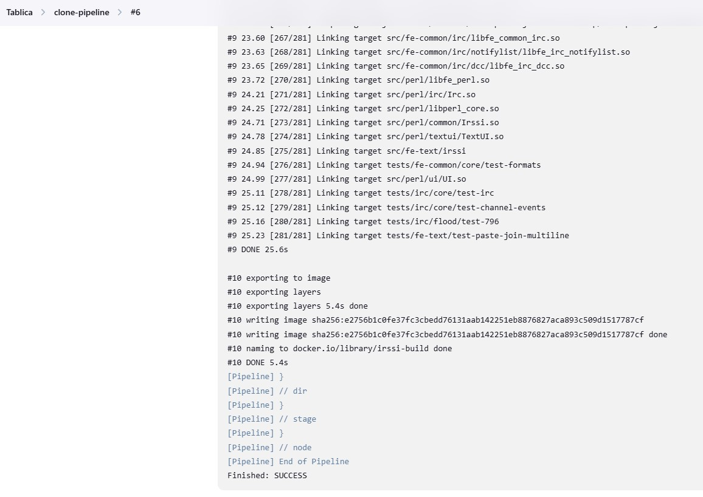

Zestawienie czasów trwania procesów buildowania dla obu uruchomień pipeline'u. Obserwujemy podobne wynki czasowe, co sugeruje, że oba pipeline'y wykonały tę samą pracę i żadne czynności nie zostały pominięte chociażby poprzez cache'owanie

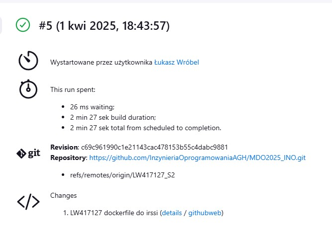

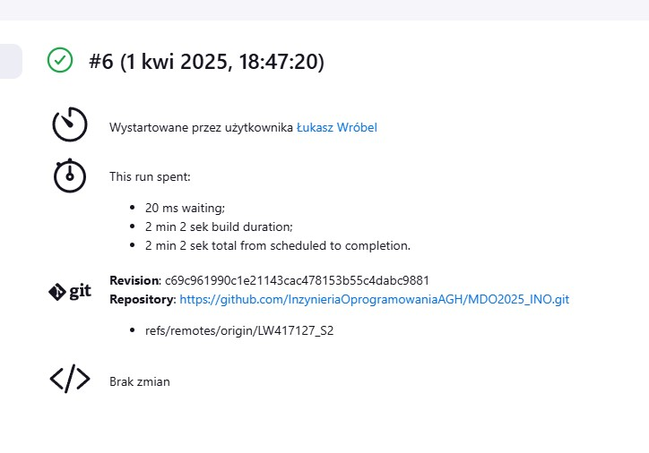

# Sprawozdanie z Publikacji pakietu npm z express.js

Plik Dockerfile przygotowany do buildu aplikacji express

```
  FROM node:16 AS express-build

  RUN npm install -g express-generator@4

  RUN express /tmp/foo

  WORKDIR /tmp/foo

  RUN npm install
```

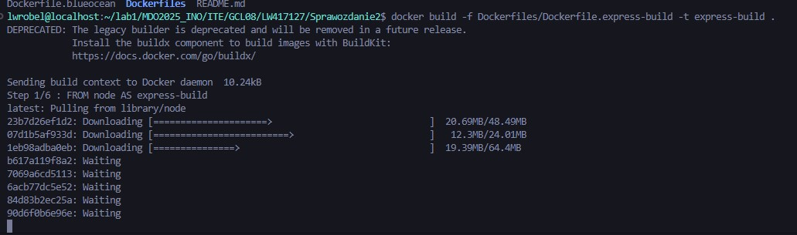

Plik Dockerfile przygotowany do deploymentu aplikacji express

```
  FROM node:18-slim

  COPY --from=express-build /tmp/foo /app

  WORKDIR /app

  CMD ["npm", "start"]
```

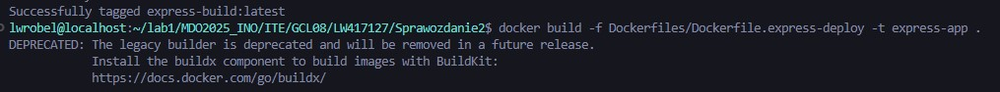

Utworzenie sieci dla CI

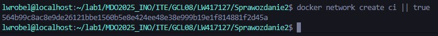

Uruchomienie kontenera deploymentowego w celu weryfikacji działania aplikacji

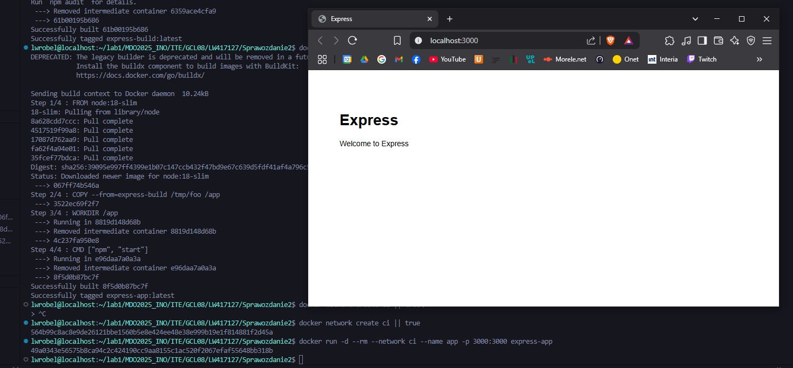

Potwierdzenia prawidłowego działania aplikacji poprzez ```curl```

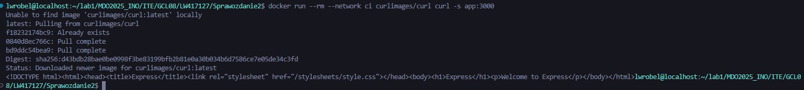

Wygenerowanie tokenu autoryzacyjnego dla NPM

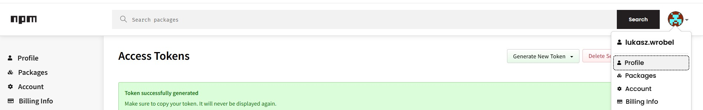

Dodanie tokenu do plików projektu

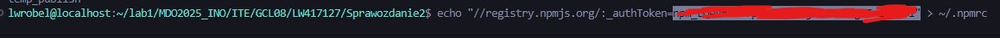

Próba publikacji lokalnie z dopiskiem ```--dry-run``` aby jeszcze nie publikować pakietu

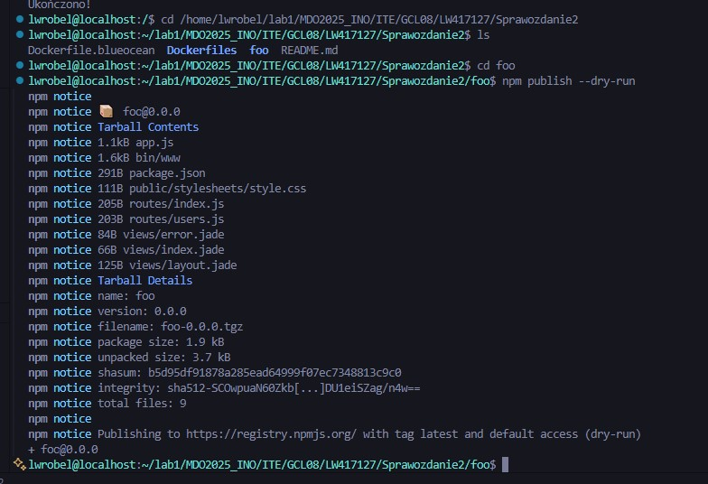

Dodanie tokenu NPM do uprawnień jenkinsa

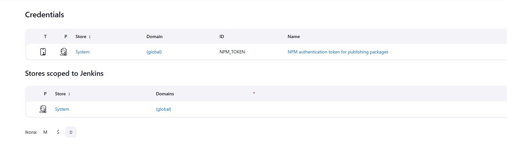

Przeprowadzenie próby całego procesu poprzez pipeline

```
pipeline {
    agent any

    environment {
        APP_DIR = 'ITE/GCL08/LW417127/Sprawozdanie2'
    }

    stages {
        stage('Clone Repository') {
            steps {
                git branch: 'LW417127_S2', url: 'https://github.com/InzynieriaOprogramowaniaAGH/MDO2025_INO.git'
            }
        }

        stage('Cleaning') {
            steps {
                dir("${APP_DIR}") {
                    sh 'docker rmi -f express-build || true'
                    sh 'docker rmi -f express-app || true'
                    sh 'docker builder prune --force --all || true'
                    sh 'docker network inspect ci >/dev/null 2>&1 && docker network rm ci || true'
                    sh 'docker ps -q --filter "name=app" | grep -q . && docker rm -f app || true'
                }
            }
        }

        stage('Build Express App') {
            steps {
                dir("${APP_DIR}") {
                    sh 'docker build -f Dockerfiles/Dockerfile.express-build -t express-build .'
                    sh 'docker run --rm express-build npm --version'

                }
            }
        }

        stage('Build Deploy Container') {
            steps {
                dir("${APP_DIR}") {
                    sh 'docker build -f Dockerfiles/Dockerfile.express-deploy -t express-app .'
                }
            }
        }

        stage('Run and Test App') {
            steps {
                dir("${APP_DIR}") {
                    sh '''
                        docker network create ci || true
                        docker run -d --rm --network ci --name app -p 3000:3000 express-app
                        sleep 5
                        docker run --rm --network ci curlimages/curl curl -s --fail app:3000
                    '''
                }
            }
        }

        stage('Publish to NPM') {
            steps {
                withCredentials([string(credentialsId: 'NPM_TOKEN', variable: 'NPM_TOKEN')]) {
                    dir("${APP_DIR}") {
                        sh '''
                            docker create --name temp_publish express-build
                            docker cp temp_publish:/tmp/foo ./foo
                            docker rm temp_publish
                            
                            docker run --rm -v "$PWD/foo":/app -w /app express-build \
                                sh -c 'npm pkg set name="devops_lukasz_wrobel" && \
                                npm pkg delete private && \
                                cat package.json'
                            
                            docker run --rm -v "$PWD/foo":/app -w /app express-build npm pack
        
                            echo "//registry.npmjs.org/:_authToken=${NPM_TOKEN}" > ./foo/.npmrc
        
                            docker run --rm -v "$PWD/foo":/app -w /app express-build npm publish --access public
                            
                            rm ./foo/.npmrc
                        '''
                        
                        archiveArtifacts artifacts: 'foo/*.tgz', fingerprint: true
                    }
                }
            }
        }
    }
}

```

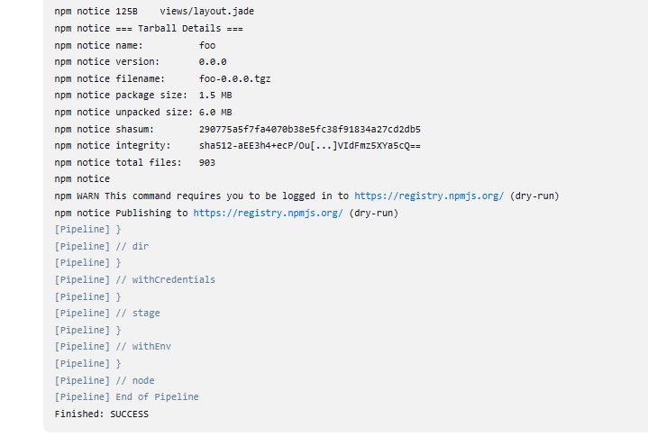

Dodanie zapisu artefaktu dla możliwości jego pobrania z poziomu UI jenkinsa

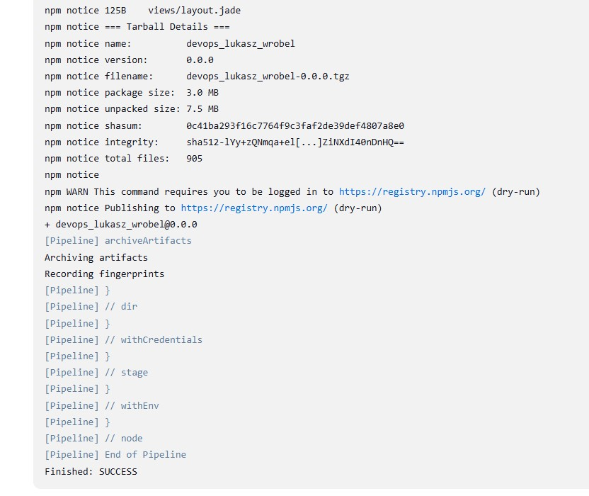

Gotowy do pobrania artefakt pochodzący z procesu próbnej publikacji (--dry-run)

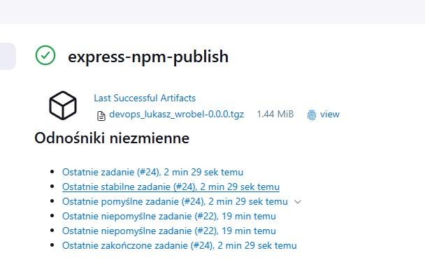

Przeprowadzenie procesu publikacji z publicznym dostępem do paczki npm

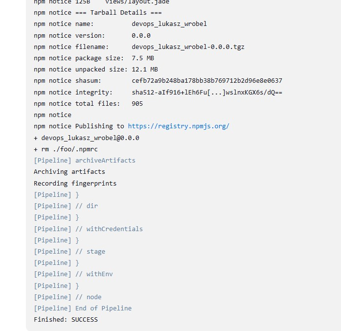

Widok paczki npm na https://registry.npmjs.org/devops_lukasz_wrobel

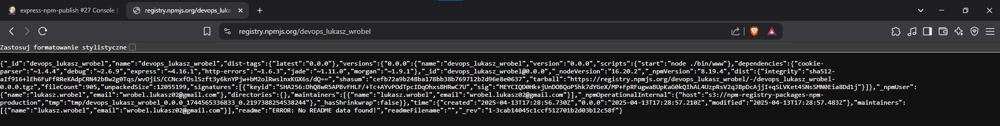

Artefakt do pobrania pochodzący z publicznej wersji publikacji pakietu

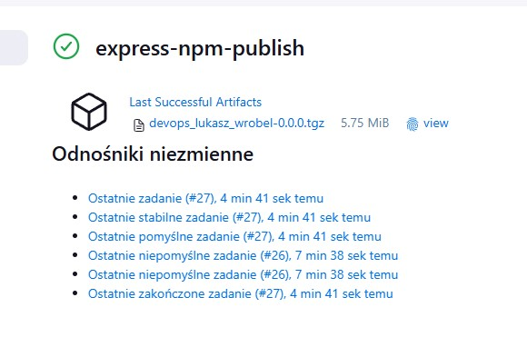