## ANSIBLE

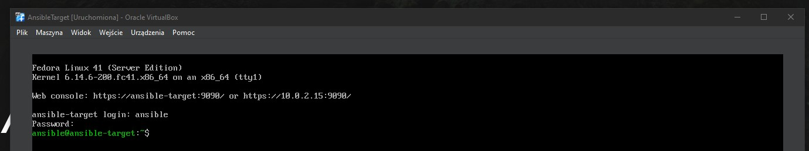

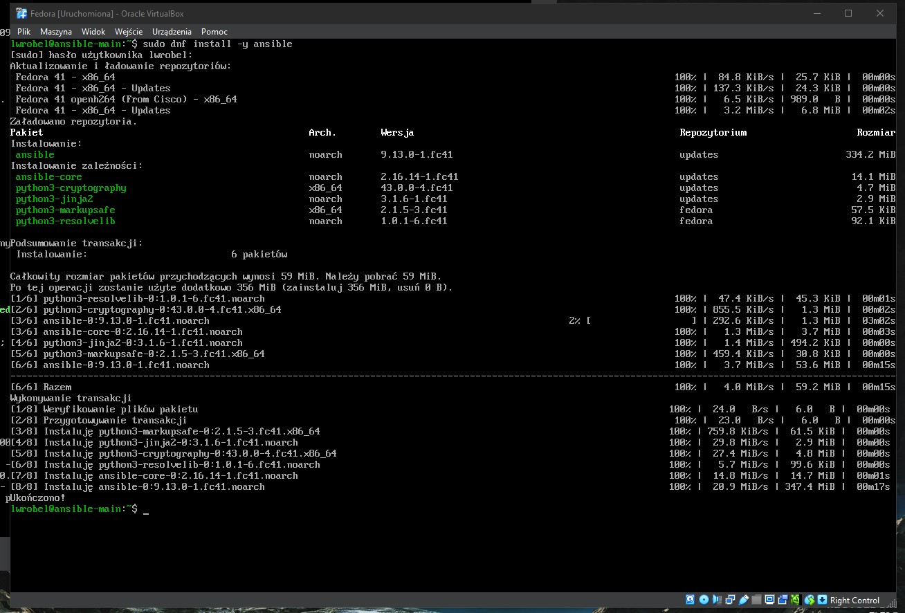

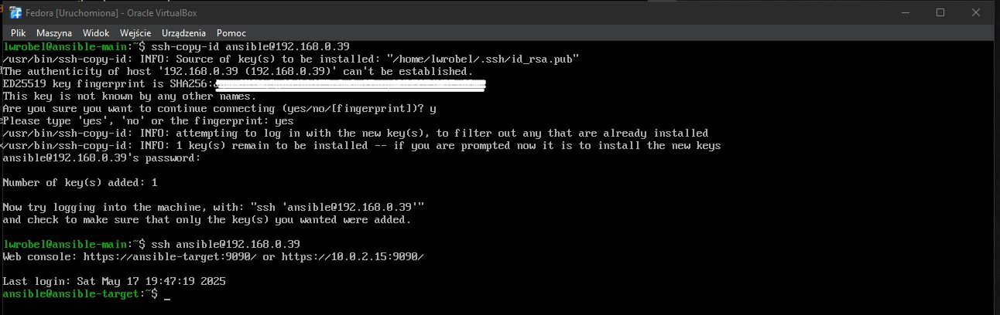

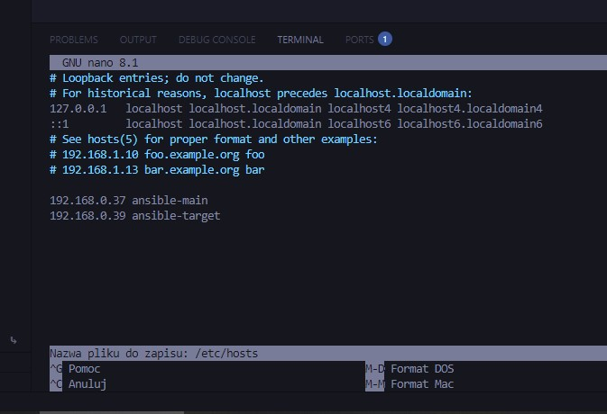

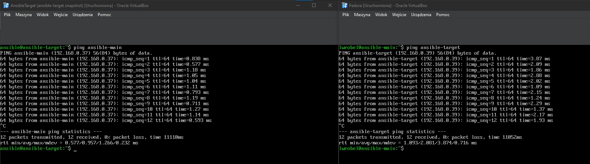

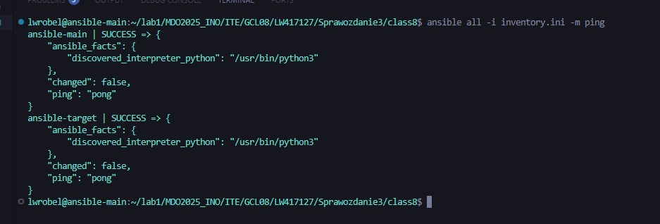

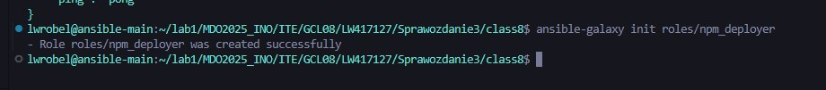

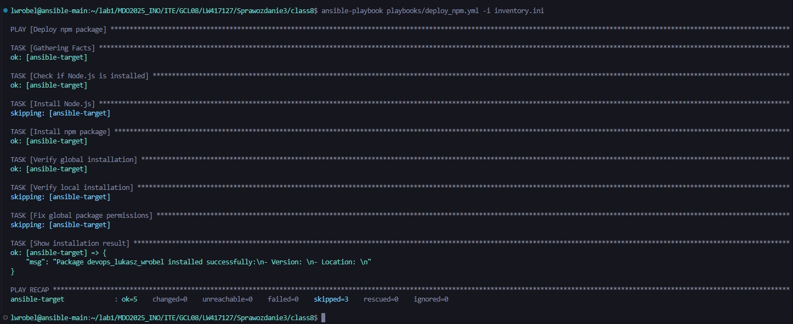

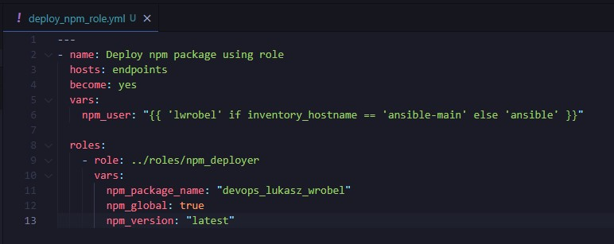

## PLIK ODPOWIEDZI (KICKSTART)

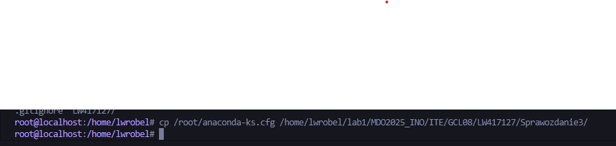

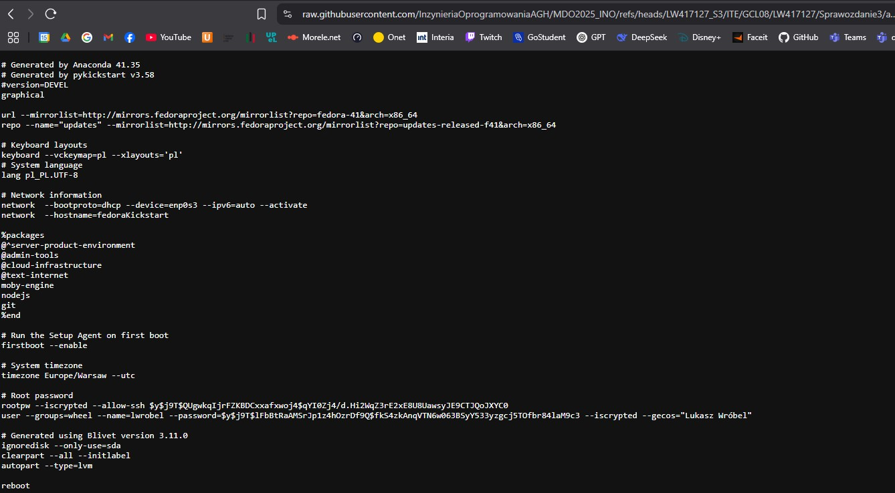

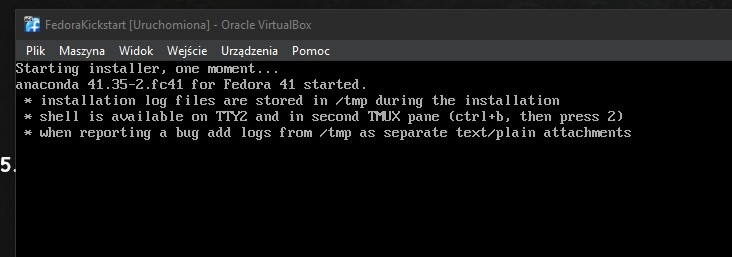

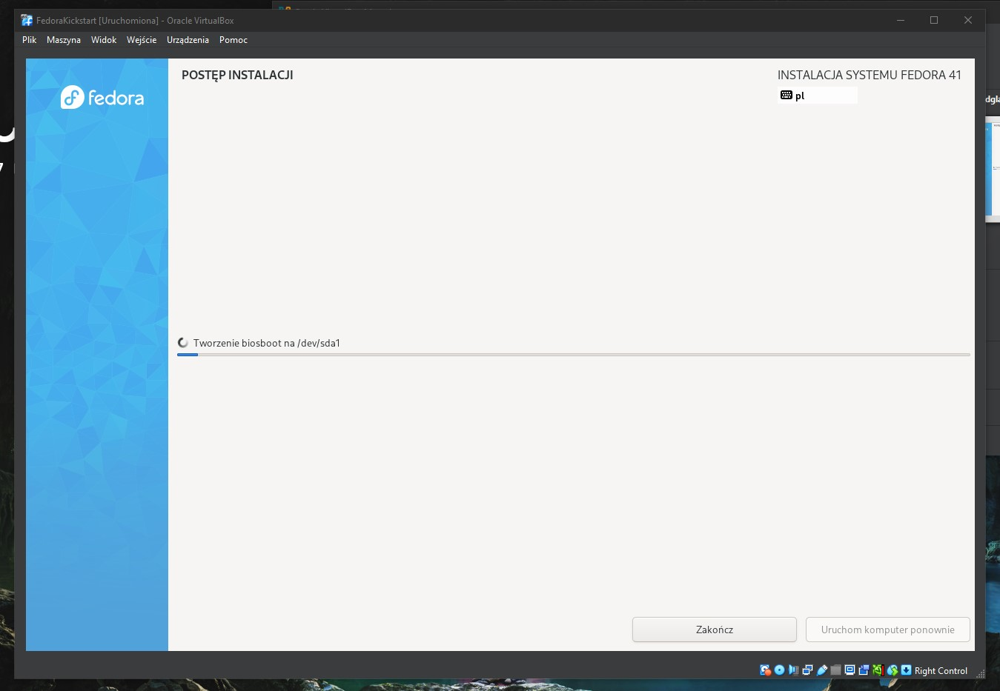

## KUBERNETES PART I

## KUBERNETES PART II

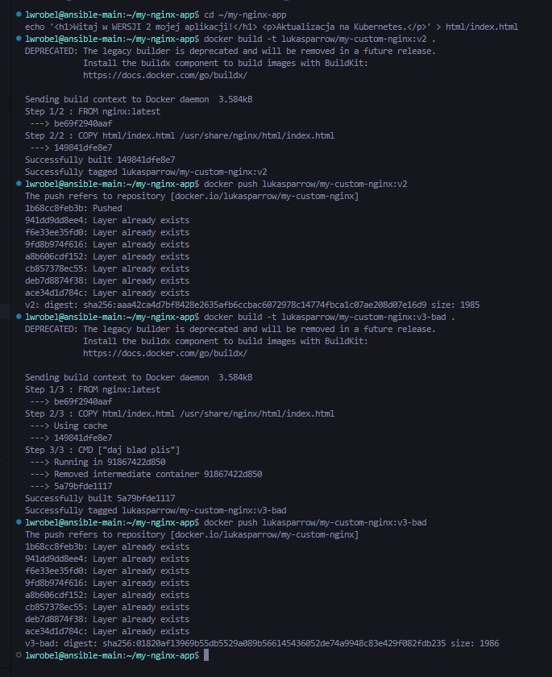

 - Recreate: Gwałtowna zmiana, wszystkie stare pody są usuwane przed utworzeniem nowych. Powoduje przerwę w dostępności usługi. Prosta, ale ryzykowna.

 - Rolling Update: Stopniowa wymiana podów. Aplikacja pozostaje dostępna podczas aktualizacji. maxUnavailable kontroluje, ile podów może być jednocześnie niedostępnych, a maxSurge ile dodatkowych podów może zostać utworzonych. Bezpieczniejsza, domyślna strategia.

 - Canary Deployment: Wypuszczanie nowej wersji dla małego podzbioru użytkowników/żądań. Pozwala na testowanie nowej wersji w produkcji na ograniczoną skalę przed pełnym wdrożeniem. Wymaga bardziej zaawansowanej konfiguracji (dwa deploymenty, odpowiedni routing przez serwis/ingress). Najbezpieczniejsza dla krytycznych zmian, ale najbardziej złożona w implementacji w podstawowym Kubernetes.