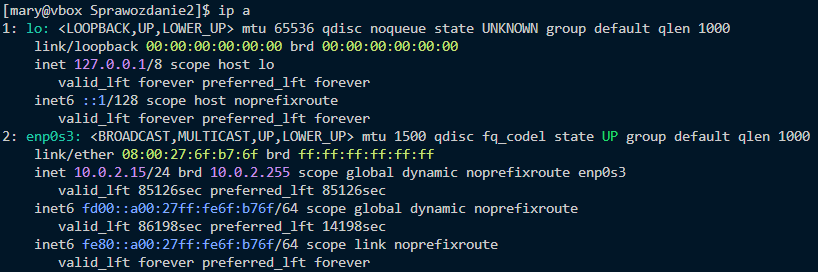
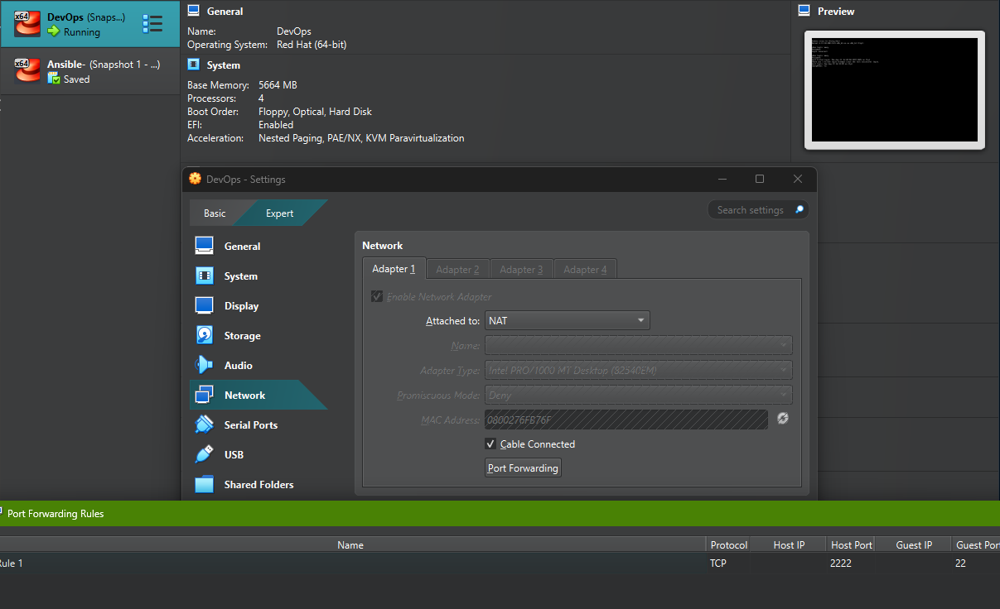
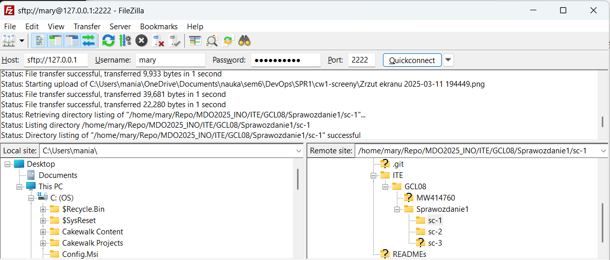
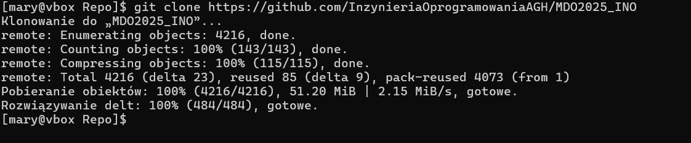
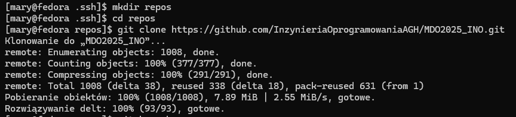
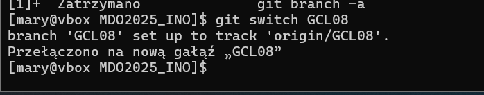
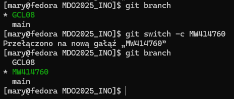
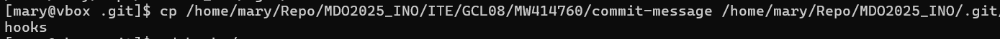
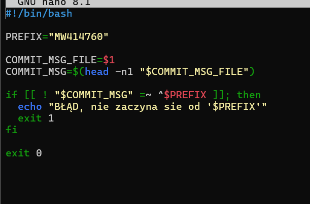
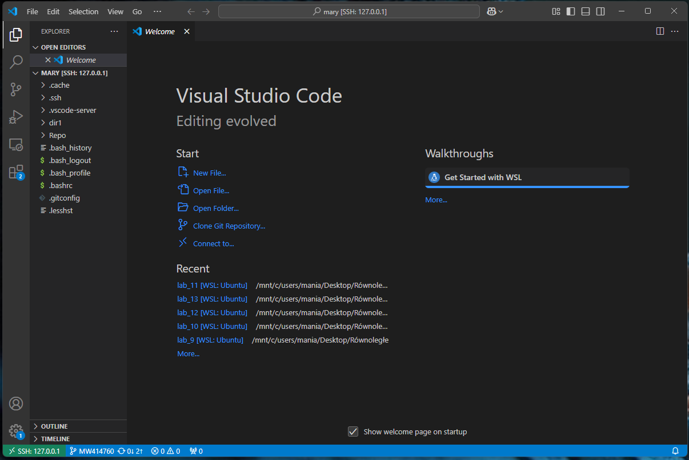

# **Sprawozdanie 1**

# Zajęcia 01

---

### Kroki przygotujące środowisko do pracy:

&nbsp;&nbsp;&nbsp;&nbsp;a. Instacja dystrybucji systemu Linux - **Fedora** bez GUI.

&nbsp;&nbsp;&nbsp;&nbsp;&nbsp;&nbsp;&nbsp;&nbsp;**Przydzielone zasoby :**

&nbsp;&nbsp;&nbsp;&nbsp;&nbsp;&nbsp;&nbsp;&nbsp;VRAM - 51 MB

&nbsp;&nbsp;&nbsp;&nbsp;&nbsp;&nbsp;&nbsp;&nbsp;RAM - 5664 MB

&nbsp;&nbsp;&nbsp;&nbsp;&nbsp;&nbsp;&nbsp;&nbsp;4 CPU

&nbsp;&nbsp;&nbsp;&nbsp;b. Zalogowanie się do maszyny wirtualnej z głównego systemu operacyjnego <em>(Windows 11)</em> przez protokół SSH.

&nbsp;&nbsp;&nbsp;&nbsp;&nbsp;&nbsp;&nbsp;&nbsp; `ip a` <- <em>sprawdzenie adresu ip</em> (w moim przypadku łączę się 127.0.0.1 ((localhost) przez port 2222) czyli <em>lo</em> a nie <em>enp0s3</em>.

&nbsp;&nbsp;&nbsp;&nbsp;&nbsp;&nbsp;&nbsp;&nbsp;Sprawdzenie adresu ip: 

&nbsp;&nbsp;&nbsp;&nbsp;&nbsp;&nbsp;&nbsp;&nbsp;Ustawienia sieciowe maszyny wirtualnej w VirtualBox:

&nbsp;&nbsp;&nbsp;&nbsp;&nbsp;&nbsp;&nbsp;&nbsp;

&nbsp;&nbsp;&nbsp;&nbsp;c. Połączenie się przez port 2222 z maszyną używając programu FileZilla w celu przesłania plików do maszyny wirtualnej

## Kroki zajęć 1 :

1. **Instalacja klienta Git i obsługi kluczy SSH**
   
   `sudo dnf install -y openssh-server` <- <em>instalowanie obsługi SSH</em>

   `sudo dnf install -y git` <- <em>instalowanie obsługi Git</em>

2. **Klonowanie repozytorium przedmiotu:**
   
   Przed kopiowaniem repozytorium przedmiotu potrzebne było wygenerowanie klucza ssh używając polecenia: 

   `ssh-keyygen -t`

   Po czym jego wyświetlenie :

   `cat "/.ssh/id_rsa.pub`

   Następnie skopiowanie wyświetlonego klucza 
   
   Klonowanie repozytorium za pomocą HTTPS i <em>Personal access token</em>:

   

   

3. 

Ustawienie wtyczki remote SSH w Visual Studio Code 

## Zajęcia 2

Instalacja i włączenie dockera

## Zajęcia 3

## Zajęcia 4

