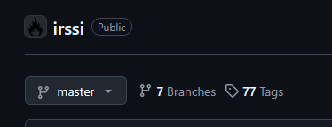
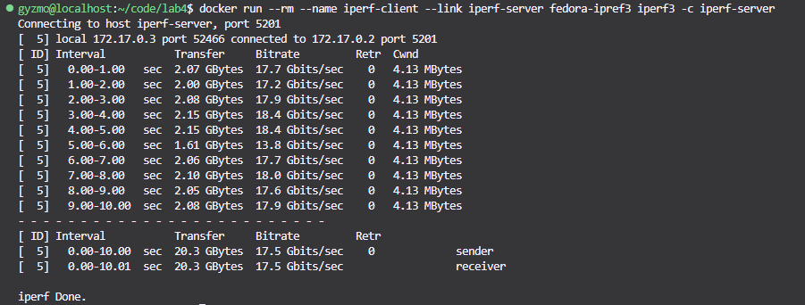

# Sprawozdanie 1
## Lab 1

Celem pierwszego laboratorium było przygotowanie środowiska do pracy. Zaliczało się do tego m.i. przygotowanie maszyny wirtualnej, repozytorium oraz potrzebnego oprogramowania.

### Przebieg laboratorium
- Wpierw zainstalowany został system kontroli wersji Git
    ```
    sudo dnf install git
    git --version
    ```
    
- Następnie zainstalowany został OpenSSH do połączenia zdalnego
    ```
    sudo dnf install openssh
    ssh -V
    ```
    
- Stworzono 2 klucze SSH z czego jeden niezabezpieczony hasłem
    ```
    ssh-keygen -t ed25519
    ```
    
- Dodano klucz SSH do konta Github
    
- Utworzono również PAT
    
- Skonfigurowano również 2FA
    
- Sklonowano repozytorium przedmiotowe na maszyne wirtualną za pomocą HTTP oraz SSH
    ```
    git clone https://github.com/InzynieriaOprogramowaniaAGH/MDO2025_INO
    git clone git@github.com:InzynieriaOprogramowaniaAGH/MDO2025_INO.git
    ```
    ")
- Przełączono się na gałąź grupową, z której utworzono nową gałąź o nazwie MZ412474
    ```
    git checkout GCL08
    git checkout -b MZ412474
    ```
    
    
- Utworzono katalog roboczy o nazwie MZ412474
    ```
    mkdir MZ412474
    ```
- Utworzono Githook'a, który wymaga odpowiedniej struktury wiadomości commita
    ```bash
    #!/bin/bash

    commit_msg_file=$1
    commit_msg=$(head -n1 "$commit_msg_file")
    EXPECTED_PREFIX="MZ412474"
    
    if [[ ! "$commit_msg" =~ ^$EXPECTED_PREFIX ]]; then
        echo "ERR: commit message must begin with '$EXPECTED_PREFIX'!"
        exit 1
    fi
    
    exit 0
    ```
- Wysłano zmiany do zdalnego źródła
    ```
    git push --set-upstream origin MZ412474
    ```

## Lab 2
Celem drugiego laboratorium było zapoznanie się z oprogramowaniem Docker służącym do konteneryzacji.
### Przebieg laboratorium
- Zainstalowano program Docker oraz dodano użytkownika do grupy DOCKER
    ```bash
    sudo dnf install docker-cli containerd
    ```
    
- Utworzono konto na platformie Dockerhub
    
- Pobrano przykładowe obrazy dockerowe
    ```
    docker pull busybox
    docker pull hello-world
    docker pull fedora
    ```
    
- Uruchomiono kontener busybox interaktywnie
    ```
    docker run -it busybox
    ```
    
- Uruchomiono "system w kontenerze", wyświetlono PID1 oraz zaktualizowano pakiety
    ```
    docker run -it fedora bash
    cat /proc/1/status
    sudo dnf update
    ```
    
    
    
- Stworzono prosty plik Dockerfile na podstawie obrazu fedory, który instaluje Gita i klonuje repozytorium
    ```dockerfile
    FROM fedora:latest
    RUN dnf update -y && dnf install -y git
    WORKDIR /app
    RUN git clone https://github.com/InzynieriaOprogramowaniaAGH/MDO2025_INO.git .
    CMD ["/bin/bash"]
    ```
    
    Na podstawie tego pliku zbudowano obraz devops-lab
    ```
    docker build -t devops-lab
    ```
- Wyczyszczono niepotrzebne obrazy
    ```
    docker rmi hello-world busybox mysql 
    ```

## Lab 3
Celem laboratorium było rozwinięcie umiejętności tworzenie plików Dockerfile
### Przebieg laboratorium
- Wybrano irrsi jako program do wykonania zadania oraz sklonowano je do katalogu roboczego
    
- Zbudowano program oraz uruchmiono testy jednostkowe
    ```bash
    meson setup build
    ninja -C build
    meson test -C build --verbose
    ```
    
- Następnie wykonano to samo w interaktywnym kontenerze fedory
    ```bash
    docker run -it --rm fedora bash
    ```
    ```bash
    dnf install -y git meson ninja-build gcc gcc-c++ make
    glib2-devel ncurses-devel perl-devel perl openssl-devel
    pkgconf-pkg-config

    cd home
    git clone https://github.com/irssi/irssi.git .
    meson setup build
    ninja -C build
    meson test -C build
    ```
    
- Stworzono plik Dockerfile.build, który tworzy obraz fedory oraz buduje aplikacje
    ```dockerfile
    FROM fedora:latest

    RUN dnf install -y git meson ninja-build gcc gcc-c++ make \
        glib2-devel ncurses-devel perl-devel perl openssl-devel \
        pkgconf-pkg-config

    WORKDIR /app
    RUN git clone https://github.com/irssi/irssi.git .
    RUN meson setup build && ninja -C build
    ```
- Stworzono plik Dockerfile.test, który bazuje na obrazie zbudowanego programu i uruchamia testy
    ```dockerfile
    FROM irssi-build

    WORKDIR /app
    CMD meson test -C build --verbose
    ```
    

## Lab 4
Celem laboratorium było zapoznanie się z wolumenami oraz eksponowaniem portów
### Przebieg laboratorium
- Przygotowano woluminy wejściowy i wyjściowy
    ```
    docker volume create dyskietka
    docker volume create volume_out
    ```
    ![docker volume create \[name\]](./lab4/create_volume.png "Tworzenie woluminów")
- Na podstawie obrazu fedory z irssi z Lab3 utworzono nowy obraz, z którego usunięto Git'a
    ```dockerfile
    FROM irssi-build

    RUN dnf remove -y git && dnf clean all
    ```
- Uruchomiono kontener wraz z przygotowanymi woluminami
    ```bash
    docker run --rm -it -v dyskietka:/app/dyskietka volume_out:/app/volume_out fedora bash
    ```
    
- Uruchomiono również obraz fedory z poprzednich laboratoriów, również z podpiętym woluminen _dyskietka_ na który sklonowano repozytorium. Po tej operacji zatrzymano ten kontener i praca była kontynuawana wyłącznie na kontenerze bez zainstalowanego Gita
    ```bash
    docker run --rm -it fedora bash
    ```
    ```bash
    git clone https://github.com/irssi/irssi.git ./dyskietka
    ```
- Zbudowano program irssi w kontenerze
    ```bash
    meson setup build && ninja -C build
    ```
    
- Zapisano powstałe pliki na woluminie wyjściowym
    ```bash
    cp -r ./build/ ./../volume_out/
    ```
    
### Eksponowanie portu
- Stworzono plik Dockerfile bazującego na obrazie fedory z zainstalowanym iperf
    ```dockerfile
    FROM fedora:latest

    RUN dnf install -y iperf3 && \
    dnf clean all

    CMD ["bash"]
    ```
- Uruchomiono serwer oraz klienta w kontenerze
    ```
    docker run -d --name iperf-server fedora-ipref3 iperf3 -s
    ```
    
    ```
    docker run --rm --name iperf-client --link iperf-server fedora-ipref3 iperf3 -c iperf-server
    ```
    
- Utworzono własną sieć mostkową
    ```
    docker network create custom_network
    ```
    
- Uruchomiono serwer oraz klienta łącząc ich poprzez stworzoną sieć
    ```
    docker run -d --name iperf-server --network custom_network fedora-ipref3 iperf3 -s
    ```
    
    ```
    docker run --rm --name iperf-client --network custom_network fedora-ipref3 iperf3 -c iperf-server
    ```
    
- Połączono się do serwera z eksponowanym portem z hosta
    ```
    docker run -d --name iperf-server -p 5201:5201 fedora-ipref3 iperf3 -s
    
    iperf3 -c 127.0.0.1
    ```
    
- Wyciągnięto logi z kontenera
    ```log
    -----------------------------------------------------------
    Server listening on 5201 (test #1)
    -----------------------------------------------------------
    Accepted connection from 172.17.0.1, port 41106
    [  5] local 172.17.0.2 port 5201 connected to 172.17.0.1 port 41108
    [ ID] Interval           Transfer     Bitrate
    [  5]   0.00-1.00   sec  1.59 GBytes  13.6 Gbits/sec                  
    [  5]   1.00-2.00   sec  1.49 GBytes  12.8 Gbits/sec                  
    [  5]   2.00-3.00   sec  1.57 GBytes  13.5 Gbits/sec                  
    [  5]   3.00-4.00   sec  1.59 GBytes  13.7 Gbits/sec                  
    [  5]   4.00-5.00   sec  1.61 GBytes  13.9 Gbits/sec                  
    [  5]   5.00-6.00   sec  1.62 GBytes  13.9 Gbits/sec                  
    [  5]   6.00-7.00   sec  1.51 GBytes  12.9 Gbits/sec                  
    [  5]   7.00-8.00   sec  1.59 GBytes  13.7 Gbits/sec                  
    [  5]   8.00-9.00   sec  1.58 GBytes  13.6 Gbits/sec                  
    [  5]   9.00-10.00  sec  1.61 GBytes  13.8 Gbits/sec                  
    [  5]  10.00-10.00  sec  5.50 MBytes  10.1 Gbits/sec                  
    - - - - - - - - - - - - - - - - - - - - - - - - -
    [ ID] Interval           Transfer     Bitrate
    [  5]   0.00-10.00  sec  15.8 GBytes  13.5 Gbits/sec                  receiver

    ```