# Sprawozdanie 2
## Lab 5

Celem tego laboratorium było zapoznanie się z Jenkins oraz utworzenie prostych pipelinów.

### Przebieg laboratorium
- Wpierw przygotowany został Jenkins

    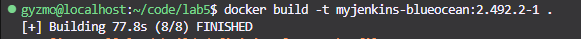
- Następnie uruchomiono kontenery

    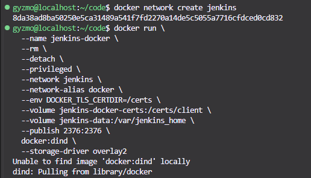
    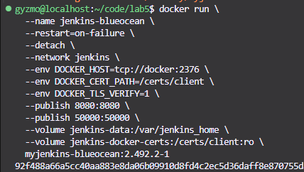
- Po otwarciu programu w przeglądarce utworzono konto administratora (zapomniano udokumentować ten fakt, więc przedstawiono poniżej zrzut ekranu logowania)

    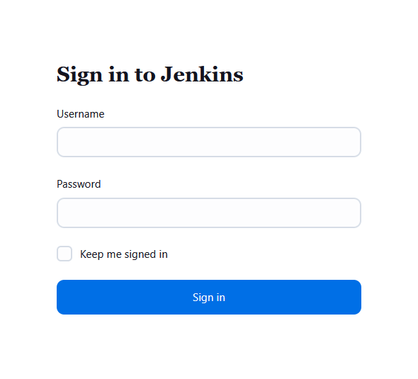
- Utworzono 2 proste projekty sprawdzające parzystość aktualnej godziny oraz uname'a
    ```bash
    HOUR=$(date +%H)
    if [$((HOUR % 2))]; then
    echo "Godzina jest nieparzysta: $HOUR"
    exit 1
    else
    echo "Godzina jest parzysta: $HOUR"
    exit 0
    fi
    ```
    ```bash
    uname -a
    ```

    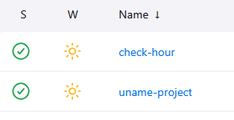
    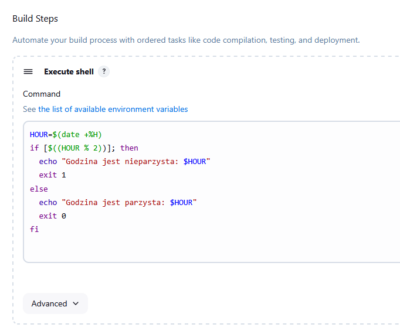
    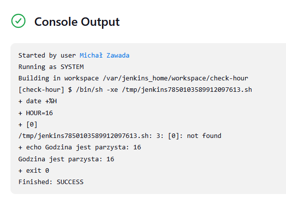

## Lab 6
Celem tego laboratorium było stworzenie pipeline'a do wybranego projektu. Poniżej pokazano kroki potrzebne do wykonania deploya oraz publisha dla aplikacji WeeChat. 
### Przebieg laboratorium
- Otwarto Jenkinsa tak jak w poprzednim laboratorium

- Przygotowano 2 pliki Dockerfile do budowania aplikacji

    Dockerfile.build:
    ```Dockerfile
    FROM fedora:latest

    RUN dnf -y upgrade && dnf install -y \
    git gcc gcc-c++ clang cmake pkgconf-pkg-config \
    ncurses-devel curl-devel gnutls-devel zlib-devel gettext \
    cjson-devel libzstd-devel aspell-devel python3-devel \
    perl-devel perl-ExtUtils-Embed ruby-devel tcl-devel guile-devel \
    nodejs-devel libxml2-devel libargon2-devel libsodium-devel \
    libgcrypt-devel asciidoctor cpputest-devel glibc-langpack-en \
    rpm-build rpmdevtools ncurses-devel make
    
    RUN dnf install -y guile30 guile30-devel

    ENV LANG=en_US.UTF-8
    ENV LANGUAGE=en_US:en
    ENV LC_ALL=en_US.UTF-8

    WORKDIR /app
    RUN git clone https://github.com/weechat/weechat.git

    WORKDIR /app/weechat/build
    RUN cmake .. -DENABLE_PHP=OFF -DENABLE_LUA=OFF -DENABLE_TESTS=ON && \
    make -j$(nproc) && \
    make install
    ```

    Dockerfile.test:
    ```Dockerfile
    FROM weechat_build

    WORKDIR /app/weechat/build/tests

    CMD ctest -V 
    ```


- Utworzono nowy pipeline

    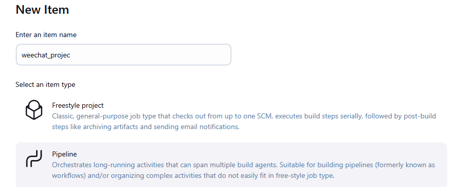
- Wpierw całość została wykonana za pomocą skryptu w programie Jenkins w celu zredukowania koniczności wielokrotnego pushowania nieprzetestowanego Jenkinsfile's na repozytorium.

    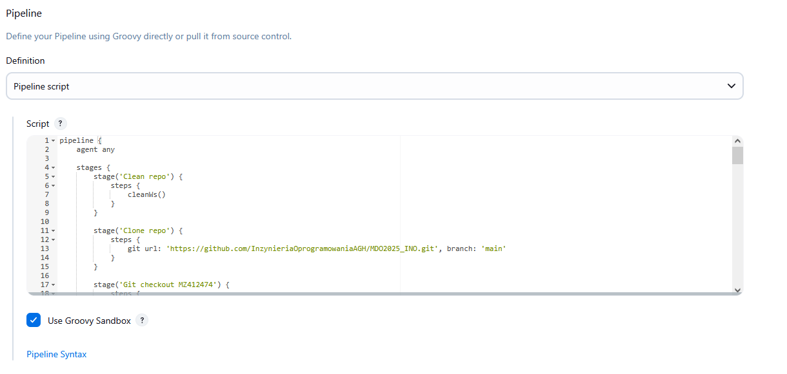
- Po uzyskaniu działającego pipeline skryot został przeniesiony do Jenkinsfile'a w repozytoirum przedmiotu

    
    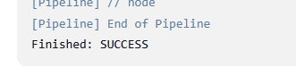
    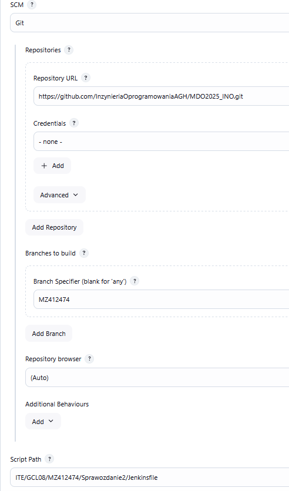

    ```groovy
        pipeline {
        agent any

        stages {
            stage('Clean repo') {
                steps {
                    cleanWs()
                }
            }
            
            stage('Clone repo') {
                steps {
                    git url: 'https://github.com/InzynieriaOprogramowaniaAGH/MDO2025_INO.git', branch: 'main'
                }
            }
            
            stage('Git checkout MZ412474') {
                steps {
                    sh 'git checkout MZ412474'
                }
            }
            
            stage('Delete docker images') {
                steps {
                    sh 'docker rmi -f weechat_build weechat_test'
                }
            }
            
            stage('Clean cache') {
                steps {
                    sh 'docker builder prune -af'
                }
            }
            
            stage('Build Dockerfile.build') {
                steps {
                    dir('ITE/GCL08/MZ412474/Sprawozdanie2') {
                        sh 'docker build -t weechat_build -f Dockerfile.build .'
                    }
                }
            }
            
            stage('Build Dockerfile.test') {
                steps {
                    dir('ITE/GCL08/MZ412474/Sprawozdanie2') {
                        sh 'docker build -t weechat_test -f Dockerfile.test .'
                    }
                }
            }

            stage('Build rpm package') {
                steps {
                    sh '''
                    docker run --rm -v $(pwd)/output:/output weechat_build bash -c "
                    set -e
                    mkdir -p ~/rpmbuild/{BUILD,RPMS,SOURCES,SPECS,SRPMS}
                    cd /app
                    tar --exclude='weechat/build' \
                        --exclude='weechat/.git' \
                        -czf ~/rpmbuild/SOURCES/weechat-1.0.tar.gz \
                        --transform 's,^weechat,weechat-1.0,' \
                        weechat

                    echo 'Name:           weechat' >> ~/rpmbuild/SPECS/weechat.spec &&
                    echo 'Version:        1.0' >> ~/rpmbuild/SPECS/weechat.spec &&
                    echo 'Release:        1%{?dist}' >> ~/rpmbuild/SPECS/weechat.spec &&
                    echo 'Summary:        WeeChat built from source' >> ~/rpmbuild/SPECS/weechat.spec &&
                    echo 'License:        GPLv3+' >> ~/rpmbuild/SPECS/weechat.spec &&
                    echo 'URL:            https://weechat.org/' >> ~/rpmbuild/SPECS/weechat.spec &&
                    echo 'Source0:        weechat-1.0.tar.gz' >> ~/rpmbuild/SPECS/weechat.spec &&
                    echo 'BuildRequires:  ncurses-devel' >> ~/rpmbuild/SPECS/weechat.spec &&
                    echo 'Requires:       ncurses' >> ~/rpmbuild/SPECS/weechat.spec &&
                    echo '%description' >> ~/rpmbuild/SPECS/weechat.spec &&
                    echo 'WeeChat build for devops laboratory calsses' >> ~/rpmbuild/SPECS/weechat.spec &&
                    
                    echo '%prep' >> ~/rpmbuild/SPECS/weechat.spec &&
                    
                    echo '%setup -q' >> ~/rpmbuild/SPECS/weechat.spec &&

                    echo '%build' >>  ~/rpmbuild/SPECS/weechat.spec &&
                    echo 'rm -rf build' >>  ~/rpmbuild/SPECS/weechat.spec &&
                    echo 'mkdir build' >>  ~/rpmbuild/SPECS/weechat.spec &&
                    echo 'cd build' >>  ~/rpmbuild/SPECS/weechat.spec &&
                    echo 'cmake .. -DENABLE_PHP=OFF -DENABLE_LUA=OFF -DENABLE_TESTS=ON' >>  ~/rpmbuild/SPECS/weechat.spec &&
                    echo 'make' >>  ~/rpmbuild/SPECS/weechat.spec &&

                    echo '%install' >> ~/rpmbuild/SPECS/weechat.spec &&
                    echo 'cd build' >> ~/rpmbuild/SPECS/weechat.spec &&
                    echo 'make install DESTDIR=%{buildroot}' >> ~/rpmbuild/SPECS/weechat.spec &&
                    
                    echo '%files' >> ~/rpmbuild/SPECS/weechat.spec &&
                    echo '/usr/local/bin/weechat*' >> ~/rpmbuild/SPECS/weechat.spec &&
                    echo '/usr/local/include/weechat/' >> ~/rpmbuild/SPECS/weechat.spec &&
                    echo '/usr/local/lib/pkgconfig/weechat.pc' >> ~/rpmbuild/SPECS/weechat.spec &&
                    echo '/usr/local/lib/weechat/' >> ~/rpmbuild/SPECS/weechat.spec &&
                    echo '/usr/local/share/applications/weechat.desktop' >> ~/rpmbuild/SPECS/weechat.spec &&
                    echo '/usr/local/share/icons/hicolor/*/apps/weechat.png' >> ~/rpmbuild/SPECS/weechat.spec &&
                    echo '/usr/local/share/locale/*/LC_MESSAGES/weechat.mo' >> ~/rpmbuild/SPECS/weechat.spec &&
                    
                    echo '%changelog' >> ~/rpmbuild/SPECS/weechat.spec &&
                    echo '* Sat May 03 2025 - 1.0-1' >> ~/rpmbuild/SPECS/weechat.spec &&
                    echo '- Initial RPM build' >> ~/rpmbuild/SPECS/weechat.spec

                    rpmbuild -ba ~/rpmbuild/SPECS/weechat.spec

                    cp -v ~/rpmbuild/RPMS/x86_64/*.rpm /output/
                    "
                    '''
                }
            }

            stage('Archive artifacts') {
                steps {
                    archiveArtifacts artifacts: 'output/*.rpm', fingerprint: true
                }
            }

        }
    }
    ```
    Lwią częścią powyższego Jenkinsfile's jest tworzenie pliku weechat.spec który jest konieczny do stworzenia paczki rpm. WYmaga on sprecyzowania wielu szczegółów na temat plików, dependencji oraz sposobu budowania aplikacji. 


- Po pomyślnym przejsciu pipeline'a zarchiwizowano paczki rpm jako artefakty
    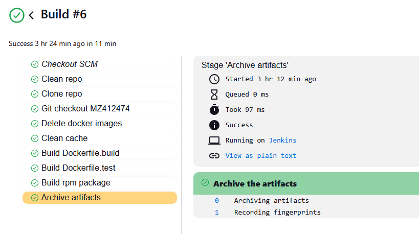
    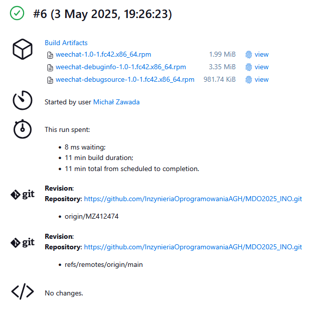

