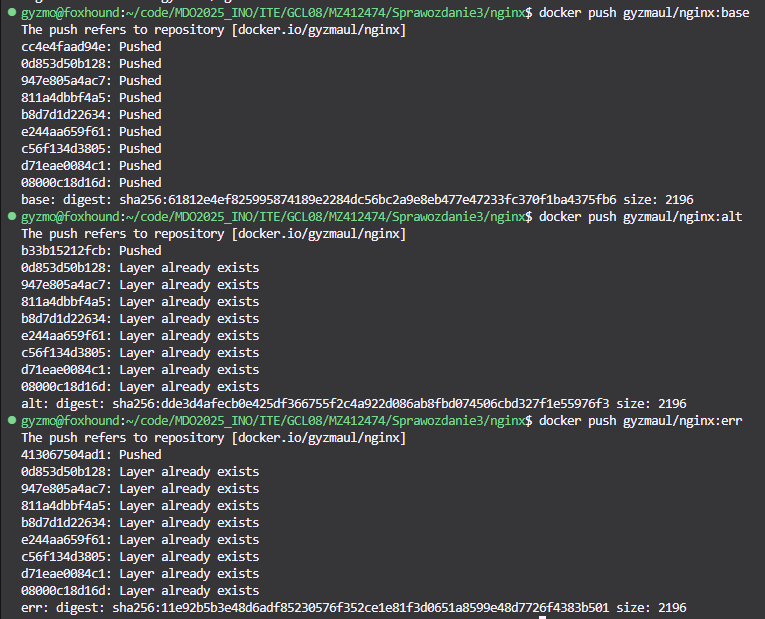

# Sprawozdanie 3
## Automatyzacja i zdalne wykonywanie poleceń za pomocą Ansible 

Celem tego laboratorium było zapoznanie się z Ansible oraz zdalnym zarządzaniem maszynami. 

### Przebieg laboratorium
- Przygotowanie nowej maszyny wirtualnej za pomocą pliku odpowiedzi
    ```bash
    # Generated by Anaconda 41.35
    # Generated by pykickstart v3.58
    #version=DEVEL

    url --mirrorlist=http://mirrors.fedoraproject.org/mirrorlist?repo=fedora-41&arch=x86_64
    repo --name="updates" --mirrorlist=http://mirrors.fedoraproject.org/mirrorlist?repo=updates-released-f41&arch=x86_64

    # Keyboard layouts
    keyboard --vckeymap=us --xlayouts='us'
    # System language
    lang en_US.UTF-8

    # Ustawienie hosta
    network --hostname=ansible-target

    # Run the Setup Agent on first boot
    firstboot --enable

    ignoredisk --only-use=sda
    autopart --type=lvm
    clearpart --all --initlabel

    # System timezone
    timezone Europe/Warsaw --utc

    #Root password
    rootpw --lock

    # Root password
    user --groups=wheel --name=ansible --password=ansible --plaintext --gecos="ansible"

    %packages
    @core
    wget
    tar
    openssh-server
    %end

    %post --log=/root/post-install.log
    systemctl enable sshd
    %end
    ```

-  Przygotowanie Ansible na głównej maszynie
    

- Zmiana nazw hostów\
    
    

- Wprawadzenie nazw DNS dla maszyn\
    

- Stworzenie pliku inwentaryzacji\
    ```ini
    [orchestrators]
    foxhound ansible_connection=local

    [endpoints]
    ansible-target ansible_user=ansible
    ```

- Pingowanie maszyn\
    

- Stwotrzenie playbooka\
    ```yaml
    - name: Ping hosts
      hosts: all
      gather_facts: no
      tasks:
        - name: Ping
          ansible.builtin.ping:

    - name: Copy inventory
      hosts: endpoints
      gather_facts: no
      tasks:
        - name: Copy inventory file
          ansible.builtin.copy:
            src: inventory.ini
            dest: /tmp/inventory.ini

    - name: Ping again to compare output
      hosts: all
      gather_facts: no
      tasks:
        - name: Ping after copy
          ansible.builtin.ping:

    - name: Restart sshd and rngd
      hosts: endpoints
      gather_facts: no
      become: true
      tasks:
        - name: Restart sshd service
          ansible.builtin.service:
            name: sshd
            state: restarted
          ignore_errors: yes

        - name: Restart rngd service
          ansible.builtin.service:
            name: rngd
            state: restarted
          ignore_errors: yes
    ```

- Skopiowanie pliku inwentaryzacji na pozostałe maszyny\
    

- Pingowanie maszyn oraz restart sshd i rngd za pomocą playbooka\
    

- Zarządzanie stworzonym artefaktem\
    ```yaml
    apiVersion: apps/v1
    kind: Deployment
    metadata:
        name: weechat-deployment
    spec:
        replicas: 1
        selector:
            matchLabels:
                app: weechat
        template:
            metadata:
                labels:
                    app: weechat
            spec:
                containers:
                  - name: weechat
                    image: gyzmaul/weechat_rpm:weechat_rpm
                    command: ["/bin/sh", "-c"]
                    args: ["while true; do sleep 3600; done"]
                    ports:
                        - containerPort: 3000

    ```

    

- Utworzono taski dla ról w ansibl-galaxy\
    ```yaml
    - name: Download, install, and run RPM
      hosts: endpoints
      gather_facts: no
      become: true
      roles:
        - install_weechat
    ```

    ```yaml
    - name: Download RPM
      ansible.builtin.get_url:
        url: http://172.19.97.181:8080/job/weechat_project/lastSuccessfulBuild/artifact/output/weechat-1.0-1.fc42.x86_64.rpm
        dest: /tmp/weechat-1.0-1.fc42.x86_64.rpm

    - name: Install RPM
      ansible.builtin.command: dnf install -y /tmp/weechat-1.0-1.fc42.x86_64.rpm
      become: true

    - name: Run weechat
      ansible.builtin.shell: weechat &
      args:
        executable: /bin/bash
    ```


## Pliki odpowiedzi dla wdrożeń nienadzorowanych
Celem tego laboratorium było zapoznania sie z plikaami odpowiedzi do instalacji nienadzorowanych
### Przebieg laboratorium
- Stworzono nową maszyne wirtulaną na potrzeby laboratoruim\
    

- Przygotowano plik ```anaconda-ks.cfg``` wyciągnięty z głównej maszyny wirtualnej\
    ```bash
    # Generated by Anaconda 41.35
    # Generated by pykickstart v3.58
    #version=DEVEL

    url --mirrorlist=http://mirrors.fedoraproject.org/mirrorlist?repo=fedora-41&arch=x86_64
    repo --name="updates" --mirrorlist=http://mirrors.fedoraproject.org/mirrorlist?repo=updates-released-f41&arch=x86_64

    # Keyboard layouts
    keyboard --vckeymap=us --xlayouts='us'
    # System language
    lang en_US.UTF-8

    # Ustawienie hosta
    network --hostname=foxhound

    # Run the Setup Agent on first boot
    firstboot --enable

    # Generated using Blivet version 3.11.0
    ignoredisk --only-use=sda
    autopart --type=lvm
    # Partition clearing information
    clearpart --all --initlabel

    # System timezone
    timezone Europe/Warsaw --utc

    #Root password
    rootpw --lock

    # Root password
    user --groups=wheel --name=gyzmo --password= --plaintext --gecos="Michal"

    %packages
    @core
    wget
    %end

    %post --log=/root/post-install.log
    wget http://172.19.97.181:8080/job/weechat_project/lastSuccessfulBuild/artifact/output/weechat-1.0-1.fc42.x86_64.rpm -O /tmp/weechat-1.0-1.fc42.x86_64.rpm
    dnf install -y /tmp/weechat-1.0-1.fc42.x86_64.rpm
    %end
    ```

- Plik wrzucono na repo przedmiotu\
- Uruchomiono nową maszyne i dodano adres pliku kickstartowego w GRUBie\
    

- Obserwowano jak system instaluje sie wedle instrukcji zawartych w pliku\
    

- Po pomyslnej instalacji zalogowano sie na utworzonego uzytkownika\
    

- Po zalogowaniu sprawdzono logi instalacji\
    

- Sprawdzono działanie programu Weechat, który był artefaktem pipelinu poprzednich zajęć\
    


## Wdrażanie na zarządzalne kontenery: Kubernetes
Celem tego laboratorium było zapoznania sie z Kubernetesem
### Przebieg laboratorium

- Zainstalowano minikube\
    
    

- Zaopatrzono sie w polecenie kubectl\
    

- Uruchomiono dashboard\
    

- Uruchomiono poda z weechatem i sprawdzono jego działanie\
    
    

- port forward\
    

- Zapisano wdrożenie jako yml\
    ```yml
    apiVersion: apps/v1
    kind: Deployment
    metadata:
      name: weechat-deployment
    spec:
      replicas: 1
      selector:
        matchLabels:
          app: weechat
      template:
        metadata:
          labels:
            app: weechat
        spec:
          containers:
            - name: weechat
              image: gyzmaul/weechat_rpm:weechat_rpm
              command: ["/bin/sh", "-c"]
              args: ["while true; do sleep 3600; done"]
              ports:
                - containerPort: 3000
    ```
    

- Sprawdzono działanie\
    
    

## Wdrażanie na zarządzalne kontenery: Kubernetes - the sequel
Celem tego laboratorium było dalsze zapoznania sie z Kubernetesem
### Przebieg laboratorium
- Stworzono 3 obrazy nginx - 2 działające i 1 niedziałający\
    ```Docker
    FROM nginx:alpine

    COPY base-nginx/index.html /usr/share/nginx/html/index.html

    EXPOSE 80
    CMD ["nginx", "-g", "daemon off;"]
    ```
    ```html
    <html>
      <body>
        <h1>Mam tak samo jak ty</h1>
        <h1>Pod moj a w nim</h1>
        <h1>Najpiekniejszy moj kontener</h1>
        <h1>Najpiekniejszy program</h1>
      </body>
    </html>
    ```
    ```Docker
    FROM nginx:alpine

    COPY alt-nginx/index.html /usr/share/nginx/html/index.html

    EXPOSE 80
    CMD ["nginx", "-g", "daemon off;"]
    ```
    ```html
    <html>
      <body>
        <h1>Lubie wracac tam gdzie bylem juz</h1>
        <h1>Pod ten minikube pelen lsniacych podow</h1>
        <h1>Na kontenery te znajome tak</h1>
        <h1>Do znajomych obrazow, pukac myslac czy</h1>
        <h1>Czy nie stanie w nich czasami ten nginx z index.html</h1>
      </body>
    </html>
    ```
    ```Docker
    FROM nginx:alpine

    COPY err-nginx/index.html /usr/share/nginx/html/index.html

    EXPOSE 80
    CMD ["/bin/false"]
    ```
    ```html
    <html>
      <body>
        <h1>Nie dzialam :(</h1>
      </body>
    </html>
    ```

- Push nowych obrazów nginx na Dockerhuba\
    

- Utworzono plik wdrożen\
    ```yaml
    apiVersion: apps/v1
    kind: Deployment
    metadata:
      name: nginx
    spec:
      replicas: 4
      strategy:
        type: Recreate
      selector:
        matchLabels:
          app: nginx
      template:
        metadata:
          labels:
            app: nginx
        spec:
          containers:
            - name: nginx
              image: gyzmaul/nginx:err
              ports:
                - containerPort: 80
    ```

- Uruchomiono kolejno każdy obraz\
    
    
    

- Sprawdzano update-y w dashboardzie\
    
    

- Przygotowano również deploymenty:\
    Canary deploy
    ```yaml
    apiVersion: apps/v1
    kind: Deployment
    metadata:
    name: nginx-canary
    spec:
    replicas: 1
    selector:
        matchLabels:
        app: nginx
        track: canary
    template:
        metadata:
        labels:
            app: nginx
            track: canary
        spec:
        containers:
            - name: nginx
            image: gyzmaul/nginx:base
            ports:
                - containerPort: 80
    ```
    oraz Rolling Update deploy
    ```yaml
    apiVersion: apps/v1
    kind: Deployment
    metadata:
      name: nginx-rollout
    spec:
      replicas: 4
      strategy:
        type: RollingUpdate
        rollingUpdate:
          maxSurge: 20
          maxUnavailable: 1
      selector:
        matchLabels:
          app: nginx-rollout
      template:
        metadata:
          labels:
            app: nginx-rollout
        spec:
          containers:
            - name: nginx
              image: gyzmaul/nginx:base
              ports:
                - containerPort: 80
    ```
