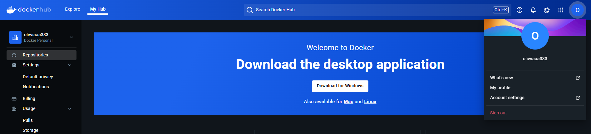
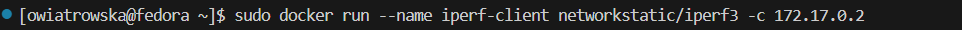
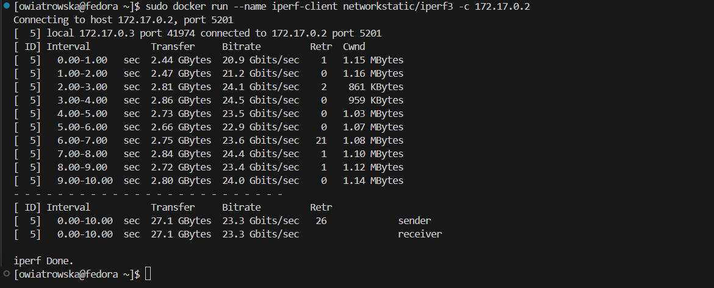
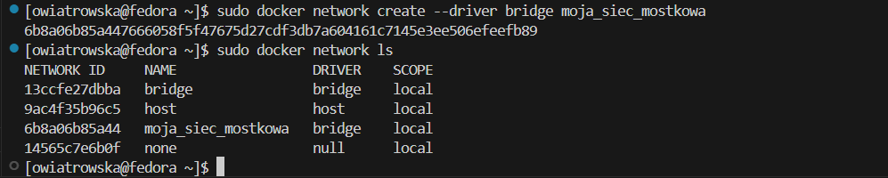
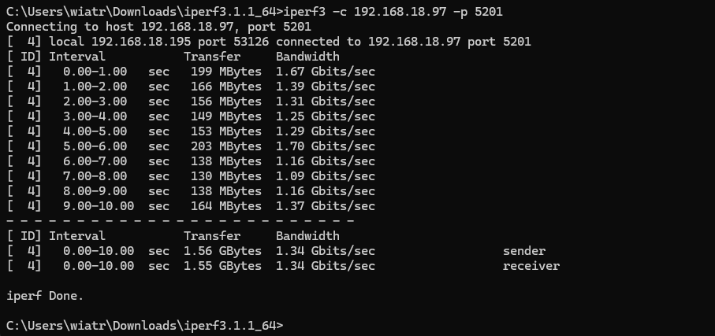
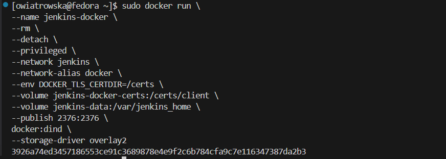

# Sprawozdanie 1

Oliwia Wiatrowska


---


## **Laboratorium 01**

### **Wprowadzenie, Git, Gałęzie, SSH**


---

## **1. Instalacja klienta Git i konfiguracja SSH**
Podczas konfiguracji środowiska na maszynie wirtualnej zainstalowałam system kontroli wersji Git oraz skonfigurowałam dostęp do GitHuba za pomocą klucza SSH. Aby potwierdzić, że Git i obsługa SSH zostały poprawnie skonfigurowane, przedstawiam wyniki kilku komend diagnostycznych:

### Wersja Gita

```bash
git --version
```


### Lokalizacja pliku wykonywalnego Gita

```bash
which git
```


### Sprawdzenie klucza SSH

```bash
ls -la ~/.ssh/
```


### Test połączenia SSH z GitHubem

```bash
ssh -T git@github.com
```


### Konfiguracja użytkownika Git

```bash
git config --list
```


## **2. Klonowanie repozytorium**

### Klonowanie repozytorium przez SSH

Po skonfigurowaniu klucza SSH, sklonowałam repozytorium przy użyciu SSH:

```bash
git clone git@github.com:InzynieriaOprogramowaniaAGH/MDO2025_INO.git
```

Zrzut ekranu przedstawiający poprawnie sklonowane repozytorium:


## **3. Gałęzie**

### Przełączanie się między gałęziami
Na początku przełączyłam się na gałęź main, następnie na gałęź mojej grupy, tj. GCL08


### Utworzenie nowej gałęzi
Następnie uwtorzyłam swoją gałąź o nazwie składającej się z moich inicjałów i numeru indeksu


## **4. Praca na nowej gałęzi**

### Utworzenie nowego katalogu
Utworzyłam katalog, także o nazwie składającej się z moich inicjałów i numeru indeksu:


### Napisanie Git hooka
Napisałam hooka `commit-msg`, weryfikującego to, aby każdy mój "commit message" zaczynał się od moich inicjałów i numeru indeksu.

Plik `commit-msg`:

```bash
#!/bin/bash

EXPECTED_PREFIX="OW416377"
COMMIT_MSG_FILE="$1"
COMMIT_MSG=$(head -n 1 "$COMMIT_MSG_FILE")

if [[ ! "$COMMIT_MSG" =~ ^$EXPECTED_PREFIX ]]; then
  echo "❌ Błąd: Każdy commit message musi zaczynać się od \"$EXPECTED_PREFIX\""
  exit 1
fi

exit 0
```
Utworzony skrypt znajduje się w utworzonym wcześniej katalogu.


Następnie skopiowałam go do katalogu `.git/hooks/`:

```bash
cp commit-msg ../../../.git/hooks/
```

Oraz dodałam uprawnienia do uruchamiania:

```bash
chmod +x ../../../.git/hooks/commit-msg
```


### Sprawdzenie działania hooka


### Wysłanie zmian do zdalnego źródła


### Próba wyciągnięcia swojej gałęzi do gałęzi grupowej

```bash
git checkout GCL08
git merge OW416377
git push origin OW416377
```


---


## **Laboratorium 02**

### **Git, Docker**


---

## **1. Instalacja dockera**

```bash
sudo dnf install -y docker
```


### Uruchomienie Dockera oraz sprawdzenie, czy działa


## **2. Rejestracja w Docker Hub**
Zarejestrowałam się w Docker Hub poprzez konto na Githubie, a następnie zalogowałam się w terminalu.



## **3. Pobranie odpowiednich obrazów**

```bash
sudo docker pull hello-world
sudo docker pull busybox
sudo docker pull ubuntu
sudo docker pull fedora
sudo docker pull mysql
```
Sprawdzenie czy obrazy zostały pobrane:

```bash
sudo docker images
```


## **4. Uruchomienie kontenera z obrazu busybox**

### Uruchomienie kontenera i sprawdzenie czy działa


### Interaktywne podłączenie się do kontenera

```bash
sudo docker exec -it busybox sh
```


### Wywołanie numeru wersji


## **5. Uruchomienie "systemu w kontenerze" (ubuntu)**

### Uruchomienie kontenera Ubuntu i sprawdzenie, czy działa


### Sprawdzenie PID1 w kontenerze


### Sprawdzenie procesów dockera na hoście


### Aktualizacja pakietów

```bash
apt update && apt upgrade -y
```


## **6. Stworzenie własnego Dockerfile**

### Tworzenie pliku Dockerfile


plik `Dockerfile`:

```bash
FROM ubuntu:latest

LABEL maintainer="Oliwia Wiatrowska"

RUN apt update && apt install -y git && rm -rf /var/lib/apt/lists/*

WORKDIR /app

RUN git clone https://github.com/InzynieriaOprogramowaniaAGH/MDO2025_INO

CMD ["bash"]
```

### Budowanie obrazu Dockera

```bash
sudo docker build -t moj_obraz .
```


### Sprawdzenie, czy `moj_obraz` został zbudowany


### Uruchomienie kontenera


### Sprawdzenie, czy repozytorium zostało sklonowane


### Sprawdzenie czy Git działa


## **7. Wyświetlenie uruchomionych (!= "działających") kontenerów i usunięcie ich**

### Wyświetlenie kontenerów


### Usunięcie kontenerów


## **8. Wyczyszczenie obrazów**

### Wyświetlenie obrazów


### Usunięcie obrazów

```bash
sudo docker rmi $(sudo docker images -q)
```


## **9. Dodanie pliku `Dockerfile` do folderu `sprawozdanie1`**

```bash
cp ~/MDO2025_INO/ITE/GCL08/OW416377/moj_kontener/Dockerfile ~/MDO2025_INO/ITE/GCL08/OW416377/sprawozdanie1/
```


---


## **Laboratorium 03**

### **Dockerfiles, kontener jako definicja etapu**


---

## **1. Wybór oprogramowania na zajęcia**

### Wybór repozytorium do sklonowania
Wybrałam: https://github.com/devenes/node-js-dummy-test

### Klonowanie repozytorium i przeprowadzenie buildu programu
Sklonowałam repozytorium i przeszłam do katalogu `node-js-dummy-test`
```bash
git clone https://github.com/devenes/node-js-dummy-test
cd node-js-dummy-test/
```


Nastepnie doinstalowałam wymagane zależności.

```bash
sudo dnf install nodejs
sudo npm install
```


### Uruchomienie testów jednostkowych
Uruchomiłam testy jednostkowe:

```bash
npm test
```


## **2. Przeprowadzenie buildu w kontenerze**

### **2.1. Wykonanie build i test wewnątrz kontenera**

### Uruchomienie kontenera w trybie interaktywnym
Wybrałam obraz `Node.js 22.14.0`, ponieważ aplikacja napisana jest w Node.js i wymaga `npm` do instalacji zależności oraz uruchomienia testów.

```bash
sudo docker run -it --rm node:22.14.0 bash
```


### Sklonowanie repozytorium
Sklonowałam repozytorium w kontenerze i przeszłam do katalogu `node-js-dummy-test`
```bash
git clone https://github.com/devenes/node-js-dummy-test
cd node-js-dummy-test/
```


### Skonfigurowanie środowiska oraz uruchomienie build
W projekcie nie ma osobnego kroku "build", ale konieczna jest instalacja zależności.

```bash
npm install
```
Powyższe polecenie pobrało i zainstalowało wszystkie wymagane biblioteki.
 

### Uruchomienie testów
Testy uruchomiłam za pomocą:
```bash
npm test
```


Wynik testu potwierdza poprawność działania aplikacji.

### **2.2. Stworzenie dwóch plików Dockerfile**
Utworzone pliki mają za zadanie zautomatyzować wyżej wymienione kroki.

### Utworzenie pliku `Dockerfile.build`
Plik `Dockerfile.build` ma za zadanie przeprowadzać wszystkie kroki aż do builda - przygotować środowisko, 
pobrać kod źródłowy, zainstalować zależności i przeprowadzić build aplikacji.

```bash
FROM node:22.14.0
RUN git clone https://github.com/devenes/node-js-dummy-test
WORKDIR /node-js-dummy-test
RUN npm install
```
### Budowanie kontenera buildowego

```bash
sudo docker build -t bld -f ./Dockerfile.build .
```


### Utworzenie pliku `Dockerfile.test`
Plik `Dockerfile.test` bazuje na obrazie `Dockerfile.build` i odpowiada za uruchomienie testów.

```bash
FROM bld
RUN npm test
```

### Budowanie kontenera testowego

```bash
docker build -t test -f ./Dockerfile.test .
```


### **2.3. Wykazanie poprawnego działania kontenera**

### Pokazanie poprawnego zbudowania obrazów - wyświetlenie listy dostępnych obrazów

```bash
sudo docker images
```


### **Sprawdzenie działania kontenerów:**

### Kontener budujący
Do wykazania poprawnej instalacji zależności w kontenerze uruchomiłam go w trybie interaktywnym oraz sprawdziłam, czy katalog `node_modules` został uwtworzony.

```bash
sudo docker run -it --rm bld bash
ls -l node_modules
```


### Kontener testowy
Do zweryfikowania poprawności działania testów w kontenerze, uruchomiłam kontener testowy w trybie interaktywnym i ręcznie wykonałam testy.

```bash
sudo docker run -it --rm test bash
npm test
```


### Kontener a obraz
Obraz `app-build` przechowuje kod źródłowy i skompilowaną aplikację, natomiast kontener `app-build` uruchomiony na bazie tego obrazu
wykonuje build.
Obraz `app-test` dziedziczy wszystko od `app-build`, ale dodaje krok uruchomienia testów, natomiast kontener `app-test` wykonuje testy i kończy pracę.


---


## **Laboratorium 04**

### **Dodatkowa terminologia w konteneryzacji, instancja Jenkins**


---

## **1. Zachowywanie stanu**

### 1.1 Utworzenie woluminu wejściowego i wyjściowego kolejno o nazwach `wejsciowy` i `wyjsciowy`

```bash
sudo docker volume create wejsciowy
```


```bash
sudo docker volume create wyjsciowy
```


Wyświetlenie utworzonych woluminów.


### 1.2 Utworzenie konteneru bazowego `kontenerlab4` oraz podłączenie do niego woluminów
Wykorzystałam obraz node w wersji slim, ponieważ ma zależności potrzebne do budowy projektu i nie ma zainstalowanego gita.

```bash
sudo docker run -it -v wejsciowy:/input -v wyjsciowy:/output --name kontenerlab4 node:slim /bin/bash
```


Dodatkowo sprawdziłam wersję `node`, `npm` i `git`, aby upewnić się czy napewno posiada potrzebne zależności i nie ma gita.

```bash
node -v
npm -v
git -v
```


### 1.3 Sklonowanie repozytorium na wolumin wejściowy
Aby sklonować repozytorium na wolumin wejściowy, najpierw sprawdziłam jego lokalizację na hoście za pomocą polecenia:

```bash
sudo docker volume inspect wejsciowy
```


Następnie aby uzyskać dostęp i przejść do katalogu woluminu, musiałam przełączyć się na użytkownika root przy pomocy
```bash
sudo su
cd /var/lib/docker/volumes/wejsciowy/_data
```
ponieważ `cd` nie działa w połączeniu z `sudo` i polecenie `sudo cd /ścieżka` nie zmieni katalogu w aktualnej sesji. 


Po przejściu do odpowiedniego folderu i użyłam:
```bash
git clone
```
aby sklonować repozytorium bezpośrednio do woluminu.


### 1.4 Uruchomienie buildu w kontenerze
W projekcie nie ma osobnego kroku "build", ale konieczna jest instalacja zależności.
Dlatego po przejściu do katalogu z repozytorium instaluję wymagane biblioteki.

```bash
cd input
cd node-js-dummy-test
npm install
```


### 1.5 Zapisanie plików na woluminie wyjściowym
Dzięki skopiowaniu zawartości woluminu wejściowego na wyjściowy, wynik będzie dostępny poza kontenerem.

```bash
cp -r /input/ /output
```


Weryfikacja zawartości woluminów z poziomu hosta.
Dla woluminu wejściowego:
```bash
ls -l /var/lib/docker/volumes/wejsciowy/_data
```


Dla woluminu wyjściowego:
```bash
ls -l /var/lib/docker/volumes/wyjsciowy/_data
```


### 1.6 Klonowanie na wolumin wejściowy wewnątrz kontenera
Aby sklonować repozytorium na wolumin wejściowy z poziomu kontenera, potrzebny jest zainstalowany `git` wewnątrz kontenera.
Obraz node:slim nie zaweira domyślnie `git`, dlatego musiałabym go wcześniej zainstalować za pomocą:
```bash
sudo apt update && apt install git
```
Kroki wykonania byłyby niemal identyczne jak wcześniej, z taką różnicą, że zamiast wykonywać polecenie `git clone` z poziomu hosta (w osobnym terminalu, po przejściu do katalogu `/var/lib/docker/volumes/wejsciowy/_data`), wykonywałabym je bezpośrednio wewnątrz kontenera `kontenerlab4`, przechodząc do katalogu `/input`.

### 1.7 Dyskusja dotycząca wykonania ww. kroków za pomocą `docker build` i pliku `Dockerfile`
Klonowanie repozytorium i instalacja zależności mogłyby zostać zautomatyzowane z użyciem pliku `Dockerfile`, polecenia `dockerfile build` oraz funkcji `RUN --mount`, która dostępna jest w Docker BuildKit.
Funkcja `RUN --mount` umożliwia tymczasowe montowanie woluminów w czasie budowania obrazu, co pozwala na klonowanie repozytorium, instalację zależności oraz zapisywanie ich do wskazanego katalogu. Zastosowanie jej jest niezbędne, ponieważ w standardowym procesie budowania obrazu Docker nie zapewnia dostępu do woluminów kontenera. 


## **2. Eksponowanie portu**

### 2.1 Uruchomienie serwera iperf wewnątrz kontenera
Na początku pobrałam obraz iperf (iperf3):

```bash
sudo docker pull networkstatic/iperf3
```


Następnie uruchomiłam serwer iperf wewnątrz kontenera:
```bash
sudo docker run --name iperf-serwer -p 5201:5201 networkstatic/iperf3 -s
```


### 2.2 Połącznie się poprzez drugi kontener
Aby połączyć się z serwerem za pomocą drugiego kontenera, najpierw sprawdziłam adres kontenera z serwerem:
```bash
sudo docker inspect -f '{{range.NetworkSettings.Networks}}{{.IPAddress}}{{end}}' iperf-serwer
```


Następnie w osobnym terminalu uruchomiłam drugi kontener iperf i nawiązałam połączenie:
```bash
sudo docker run --name iperf-client networkstatic/iperf3 -c 172.17.0.2
```


Wynik połączenie w kontenerze z serwerem:


Wynik połączenia w drugim kontenerze:


### 2.3 Wykorzystanie własnej dedykowanej sieci mostkowej zamiast domyślnej
Na początku zatrzymałam i usunęłam utworzone wcześniej kontenery:
```bash
sudo docker stop iperf-client
sudo docker stop iperf-serwer
```


```bash
sudo docker rm iperf-client
sudo docker rm iperf-serwer
```


Następnie utworzyłam własną sieć mostkową:
```bash
sudo docker network create --driver bridge moja_siec_mostkowa
```


Ponownie uruchamiam kontener serwerowy i kliencki tylko w `moja_siec_mostkowa`, to umożliwi wykorzystanie nazw kontenerów zamiast adresów IP.

Uruchomienie kontenera serwerowego:
```bash
sudo docker run --rm -it --name iperf-serwer --network moja_siec_mostkowa networkstatic/iperf3 -s
```


Uruchomienie kontenera klienta w osobnym terminalu:
```bash
sudo docker run --rm --name iperf-client --network moja_siec_mostkowa networkstatic/iperf3 -c iperf-serwer
```


### 2.4 Łącznie się spoza kontenera (z hosta i spoza hosta)
* Połączenie się z hosta:

Najpierw uruchomiłam kontener serwerowy z flagą -p, aby wyeksponować port i możliwe było nawiązanie połączenia.

```bash
sudo docker run --name iperf-serwer -p 5201:5201 networkstatic/iperf3 -s
```


Następnie otworzyłam nowy terminal i zainstalowałam iperf3 na hoście:
```bash
sudo dnf install iperf3
```


 i nawiązałam połączenie serwera z hostem:

```bash
iperf3 -c localhost -p 5201
```


* Połączenie się spoza hosta:

Do łączenia spoza hosta wykorzystałam komputer, na którym działa maszyna wirtualna.
Zainstalowałam na komputerze w odpowiednim katalogu serwer iperf3 oraz aby upewnić się, że został zainstalowany sprawdziłam jego wersję.


Następnie sprawdziłam adres IP maszyny za pomocą:
```bash
ip a
```


i nawiązałam połączenie:

```bash
iperf3 -c 192.168.18.97 -p 5201
```
Wynik nawiązania połaczenia spoza hosta - komputer:


Wynik nazwiązania połączenia spoza hosta - kontener serwerowy:


### 2.5 Przedstawienie przepustowości komunikacji lub problemu z jej zmierzeniem (log z kontenera)
Utworzyłam wolumin `logi`, w którym zapisany zostanie log działania serwera.
```bash
sudo docker volume create logi
```


Następnie uruchomiłam kontener serwera i podłączyłam do niego utworzony wolumin `logi`, a także wskazałam miejsce, w którym serwer ma zapisywać logi ze swojego działania.

```bash
sudo docker run --rm -it --name iperf-server -p 5201:5201 -v logi:/logs networkstatic/iperf3 -s --logfile /logs/iperf-serwer.log
```


Następnie nawiązałam połączenie z serwerem spoza hosta, aby zaprezentować przepustowość komunikacji:
```bash
iperf3 -c 192.168.18.97 -p 5201
```
Wynik na komputerze:


Logi zapisane są w pliku, który możemy otworzyć za pomocą:
```bash
sudo nano /var/lib/docker/volumes/logi/_data/iperf-serwer.log
```


## **3. Instancja Jenkins**

### 3.1 Instalacja skonteneryzowanej instancji Jenkinsa z pomocnikiem DIND
Na początku pobrałam obraz dind:
```bash
sudo docker pull docker:dind
```


Następnie utworzyłam sieć dla Jenkinsa:
```bash
sudo docker network create jenkins
```


Uruchomiłam instancję Jenkinsa z pomocnikiem DIND:
```bash
sudo docker run \
--name jenkins-docker \
--rm \
--detach \
--privileged \
--network jenkins \
--network-alias docker \
--env DOCKER_TLS_CERTDIR=/certs \
--volume jenkins-docker-certs:/certs/client \
--volume jenkins-data:/var/jenkins_home \
--publish 2376:2376 \
docker:dind \
--storage-driver overlay2
```


Kontener uruchomił się prawidłowo:
```bash
sudo docker ps
```


Następnie przygotowałam Dockerfile [Dockerfile.jenkins](lab4_pliki/Dockerfile.jenkins).
Utworzyłam katalog lab4_pliki, a w nim plik `Dockerfile.jenkins`.


```bash
FROM jenkins/jenkins:2.492.2-jdk17
USER root
RUN apt-get update && apt-get install -y lsb-release ca-certificates curl && \
    install -m 0755 -d /etc/apt/keyrings && \
    curl -fsSL https://download.docker.com/linux/debian/gpg -o /etc/apt/keyrings/docker.asc && \
    chmod a+r /etc/apt/keyrings/docker.asc && \
    echo "deb [arch=$(dpkg --print-architecture) signed-by=/etc/apt/keyrings/docker.asc] \
    https://download.docker.com/linux/debian $(. /etc/os-release && echo \"$VERSION_CODENAME\") stable" \
    | tee /etc/apt/sources.list.d/docker.list > /dev/null && \
    apt-get update && apt-get install -y docker-ce-cli && \
    apt-get clean && rm -rf /var/lib/apt/lists/*
USER jenkins
RUN jenkins-plugin-cli --plugins "blueocean docker-workflow"
```
Następnie zbudowałam obraz:
```bash
sudo docker build -t myjenkins-blueocean:2.492.2-1 --file Dockerfile.jenkins .
```


Uruchomiłam kontener na podstawie obrazu:
```bash
sudo docker run \
  --name jenkins-blueocean \
  --restart=on-failure \
  --detach \
  --network jenkins \
  --env DOCKER_HOST=tcp://docker:2376 \
  --env DOCKER_CERT_PATH=/certs/client \
  --env DOCKER_TLS_VERIFY=1 \
  --publish 8080:8080 \
  --publish 50000:50000 \
  --volume jenkins-data:/var/jenkins_home \
  --volume jenkins-docker-certs:/certs/client:ro \
  myjenkins-blueocean:2.492.2-1
```


Sprawdziłam stan kontenerów:
```bash
sudo docker ps -a
```


### 3.2 Uruchomienie Jenkinsa w przeglądarce
Aby uruchomić Jenkinsa w przeglądarce weszłam na adres maszyny:
```bash
http://192.168.18.97:8080
```


Następnie przeszłam do konsoli jenkins-docker:
```bash
sudo docker exec -it jenkins-docker /bin/sh
```


Po uruchomieniu konsoli, za pomocą:
```bash 
cat /var/jenkins_home/secrets/initialAdminPassword
```
wyświetliłam hasło:


Po wpisaniu hasła administratora w przeglądarce przeszłam do strony Jenkinsa, pominęłam dostosowywanie Jenkinsa i kontynuowałam jako admin.

Ekran logowania:


Ekran po zalogowaniu:

