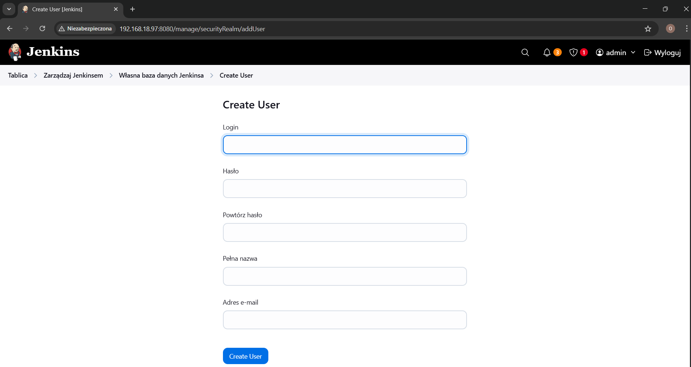
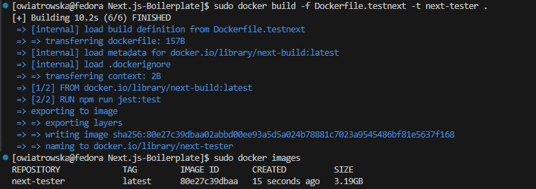

# Sprawozdanie 2

Oliwia Wiatrowska


---


## **Laboratorium 05/06/07**

### **Pipeline, Jenkins, izolacja etapów**
### **Pipeline: lista kontrolna**
### **Jenkinsfile: lista kontrolna**


---

## **1. Przygotowanie**

### 1.1 Utworzenie instancji Jenkins
Instancja Jenkins została utworzona w ramach poprzedniego laboratorium, stąd dokumentacja związana z instalacją Jenkinsa, przygotowaniem i uruchomieniem odpowiednich obrazów oraz logowaniem admina została przedstawiona w [Sprawozdaniu 1](../Sprawozdanie1/README.md).

#### Utworzenie użytkownika
W poprzednim laboratorium admin został nazwany moim imieniem i nazwiskiem, zostało to zmienione ponownie na `admin`. Po naciśnięciu ikony z dzwoneczkiem, przeszłam do zarządzania jenkinsem i tam wybrałam opcję `Create User` i zajęłam się tworzeniem nowego użytkownika `Oliwia Wiatrowska`.



Po utworzeniu widocznych jest dwóch użytkowników:


Następnie wylogowałam się z konta admina i zalogowałam na konto nowo utworzonego użytkownika.

## **2. Zadanie wstępne: uruchomienie**
W ramach wstępnej konfiguracji i pierwszego uruchomienia utworzyłam:

### 2.1 Projekt `Uname`
Aby utworzyć nowy projekt wybrałam opcję `+ Nowy projekt`, `Ogólny projekt`, a następnie w `Krokach budowania` `Dodaj krok budowania` wybrałam `Uruchom powłokę` i wpisałam:
```bash
uname -a
```


Ekran po utworzeniu projektu:


Następnie wybrałam opcję `Uruchom` i uruchomiłam projekt.


Po uruchomieniu projektu możliwe było przejście do logów danego uruchomienia projektu:


Ekran po przejściu do tablicy:


### 2.2 Projekt zwracający błąd, gdy godzina jest nieparzysta
W sposób analogiczny utworzyłam projekt, który zwraca błąd, gdy godzina jest nieparzysta.

Tworzenie projektu `nieparzysta`:
```bash
hour=$(date +%H)

if [ $((hour % 2)) -ne 0 ]; then
  echo "Nieparzysta godzina: ($hour)"
  exit 1
else
  echo "Parzysta godzina ($hour) — kontynuuję"
fi
```
 

Projekt został kilkukrotnie uruchomiony:


Logi konsoli projektu nieparzysta:


Błąd był oczekiwany.

### 2.3 Projekt, w którym pobrany zostanie obraz kontenera ubuntu
Również wykonując te same kroki, co przy tworzeniu projektu `Uname`, utworzyłam projekt `Ubuntu`, w którym pobrany został obraz kontenera ubuntu.

Treść wpisana w `Uruchom powłokę`:
```bash
docker pull ubuntu
```


Logi konsoli projektu `Ubuntu`:


## **3. Zadanie wstępne: obiekt typu pipeline**
### 3.1 Tworzenie pipeline
Tworzenie pipeline jest bardzo podobne do tworzenia wcześniejszych projektów, z taką różnicą, że po naciśnięciu opcji `+ Nowy projekt`, wybieramy `Pipeline`. Swój pipeline nazwałam `RepoPrzedmiotowe`.


Następnie korzystając z dokumentacji uzupełniłam w odpowiedni sposób skrypt pipelinu, pamiętając o tym, aby zrobić checkout na swoją gałąź `OW416377`. W stage'u `Clone repository` sklonowałam także repozytorium przedmiotowe. 
W kolejnym stage'u `Build` podałam ścieżkę do katalogu, w którym znajduje się plik [Dockerfile.build](../Sprawozdanie1/lab3_pliki/Dockerfile.build), budujący wybrany na wcześniejszych laboratoriach program. 

```bash
pipeline {
    agent any

    stages {
        stage('Clone repository') {
            steps {
                git branch: 'OW416377', url: 'https://github.com/InzynieriaOprogramowaniaAGH/MDO2025_INO.git'
            }
        }
        stage('Build'){
            steps {
                dir('ITE/GCL08/OW416377/Sprawozdanie1/lab3_pliki') {
                    sh 'docker build -t bld -f Dockerfile.build .'
                }
            }
        }
    }
}
```


### 3.2 Pierwsze uruchomienie pipeline
Następnie uruchomiłam pipeline, aby zbudować Dockerfile:

Uruchomienie trwało ponad 2 minuty.

Logi z konsoli po pierwszym uruchomieniu:


### 3.3 Ponowne uruchomienie pipeline
Ponownie uruchomiłam pipline, aby zbudować Dockerfile:

Jak widać na załączonym screenie, uruchamianie trwało tylko 4.8 sekundy. Pomimo pozornego poprawnego uruchomienia, tak krótki czas świadczy o tym, że coś jest nietak.

Wobec tego postanowiłam dodać cleanup do pipeline'u, najpierw usuwam potencjalnie istniejący obraz buildera, potem czyszczę build cache, a dopiero na końcu wykonuję build z pliku [Dockerfile.build](../Sprawozdanie1/lab3_pliki/Dockerfile.build). 

```bash
pipeline {
    agent any

    stages {
        stage('Clone repository') {
            steps {
                git branch: 'OW416377', url: 'https://github.com/InzynieriaOprogramowaniaAGH/MDO2025_INO.git'
            }
        }
        stage('Build'){
            steps {
                dir('ITE/GCL08/OW416377/Sprawozdanie1/lab3_pliki') {
                    sh 'docker rmi -f bld'
                    sh 'docker builder prune --force --all'
                    sh 'docker build -t bld -f Dockerfile.build .'
                }
            }
        }
    }
}
```


Ponownie uruchamiam pipeline:

Jak widać uruchomienie trwało ponad minutę, co świadczy o tym, że po dodaniu cleanup'u czas builda wrócił do oczekiwanego, potwierdza to, to że wcześniejszy wynik był wynikiem błędnego użycia cache Dockera.

## ** Część związana z wybranym projektem**

#### Wybrana aplikacja
Wybrałam aplikację dostępną pod adresem , ponieważ posiada gotową strukturę projektu, przykładowe komponenty, integrację z popularnymi bibliotekami (TailwindCSS, NextAuth), a także przykładowe testy jednostkowe.
Umożlwia to realizację wszystkich etapów pipeline'u CI/CD.

#### Licencja
Projekt udostępniony jest na licencji , co oznacza, że kod może być swobodnie kopiowany i modyfikowany.


## ** 1. Opis celu**
Diagram aktywności:


## **2. Pipeline - składnia**

## Konfiguracja 

Na początku sklonowałam repozytorium do katalogu domowego oraz przeszłam do katalogu projektu.

```bash
git clone https://github.com/gdwmw/Next.js-Boilerplate.git
cd Next.js-Boilerplate
```


Po zapoznaniu się z plikiem README.md projektu, przeszłam do utworzenia potrzebnego pliku konfiguracyjnego.
Skopiowałam zawartość pliku .env.example do  pliku .env:

```bash
cp .env.example .env
```


Po czym uzupełniłam swój plik .env odpowiednimi wartościami zmiennych.

```bash
NEXTAUTH_URL=http://localhost:3000
NEXTAUTH_SECRET=wygenerowany_secret

NEXT_PUBLIC_BASE_API_URL=http://localhost:3000/app

# Just Example
NEXT_PUBLIC_EXAMPLE_URL=https://just-example-url
```

Do wygenerowania sekretu, wykorzystałam następujące polecenie:

```bash
openssl rand -base64 32
```


Następnie zainstalowałam potrzebne dependencje i uruchomiłam projekt, aby sprawdzić, czy wszystko zostało odpowiednio skonfigurowane:

```bash
npm install     - instalacja zaleznosci
npm run build - budowanie projektu
npm start      - uruchomienie serwera
```


Uruchomiłam także testy, aby sprawdzić czy wszystko napewno dobrze działa:
```bash
npm run jest:test
```


## Budowanie i testowanie
Po potwierdzeniu budowania sie aplikacji i przechodzenia testów, przeszłam do tworzenia obrazów Docker:

### Utworzenie obrazu Build
Utworzyłam obraz Dockerfile.bldnext:

```bash
FROM node:18 AS next-build
RUN git clone https://github.com/gdwmw/Next.js-Boilerplate.git /Next.js-Boilerplate
WORKDIR /Next.js-Boilerplate
COPY .env .env
RUN npm install
RUN npm run build
```
Na potrzeby lokalnego przetestowania kontenera, wykonałam kopiowanie pliku .env, natomiast w dalszych krokach zostanie to usunięte, 
a zmienne środowiskowe będę przekazywać bezpośrednio w pipeline.

Aby sprawdzic poprawność utworzonego buildera zbudowałam obraz:
```bash
sudo docker build -f Dockerfile.bldnext -t next-build .
```


A następnie uruchomiłam kontener w trybie interaktywnym:
```bash
sudo docker run -it --rm next-build /bin/bash
```
W środku kontenera uruchomiłam testy:


### Utworzenie kontenera do testowania
Utworzyłam obraz Dockerfile.testnext:
```bash
FROM next-build AS next-tester
RUN npm run jest:test
```
Sprawdziłam czy poprawnie działa.
Zbudowałam jego obraz:
```bash
sudo docker build -f Dockerfile.testnext -t next-tester .
```


Uruchomiłam go:
```bash
sudo docker run --rm next-tester
```

Po potwierdzeniu poprawności działania kontenerów przeszłam do Jenkinsa. 
W Jenkinsie utworzyłam nowy projekt i wybrałam 'Pipeline' i skupiłam się na tym, aby zautomatyzować budowanie i testowanie aplikacji.
Projekt nazwałam "Build_i_Test".

Zmodyfikowany :
```bash
FROM node:18 AS next-build

ARG NEXTAUTH_URL
ARG NEXTAUTH_SECRET
ARG NEXT_PUBLIC_BASE_API_URL
ARG NEXT_PUBLIC_EXAMPLE_URL

ENV NEXTAUTH_URL=$NEXTAUTH_URL
ENV NEXTAUTH_SECRET=$NEXTAUTH_SECRET
ENV NEXT_PUBLIC_BASE_API_URL=$NEXT_PUBLIC_BASE_API_URL
ENV NEXT_PUBLIC_EXAMPLE_URL=$NEXT_PUBLIC_EXAMPLE_URL

RUN git clone https://github.com/gdwmw/Next.js-Boilerplate.git /Next.js-Boilerplate
WORKDIR /Next.js-Boilerplate


RUN npm install
RUN npm run build
```

Co istotne, nie podałam jawnie mojego wygenerowanego secretu, tylko ustawiłam go jako credential w Jenkinsie.
Przeszłam do Zarządaj Jenkinsem -> Credentials. 


Kliknęłam w System.


Następnie kliknęłam w Global credentials:


I przeszłam do Add Credentials, a z formularza wybrałam Secret Text:


I odpowiednio wypełniłam pola - pole Secret - wygenerowany klucz, pole ID - nazwa zmiennej.


Treść pipeline:

```bash
pipeline {
    agent any
    
    environment {
        NEXTAUTH_URL = 'http://localhost:3000'
        NEXTAUTH_SECRET = credentials('NEXTAUTH_SECRET')
        NEXT_PUBLIC_BASE_API_URL = 'http://localhost:3000/app'
        NEXT_PUBLIC_EXAMPLE_URL = 'https://just-example-url'
    }
    
    stages {
        stage('Clone Repository') {
            steps {
                git branch: 'OW416377_S2', url: 'https://github.com/InzynieriaOprogramowaniaAGH/MDO2025_INO.git'
            }
        }
        
        stage('Build App (next-build)') {
            steps {
                dir('ITE/GCL08/OW416377/Sprawozdanie2') {
                    sh '''
                        docker build \
                            --build-arg NEXTAUTH_URL=$NEXTAUTH_URL \
                            --build-arg NEXTAUTH_SECRET=$NEXTAUTH_SECRET \
                            --build-arg NEXT_PUBLIC_BASE_API_URL=$NEXT_PUBLIC_BASE_API_URL \
                            --build-arg NEXT_PUBLIC_EXAMPLE_URL=$NEXT_PUBLIC_EXAMPLE_URL \
                            -f Dockerfile.bldnext -t next-build .
                    '''
                }
            }
        }
        
        stage('Run Tests (next-test)') {
            steps {
                dir('ITE/GCL08/OW416377/Sprawozdanie2') {
                    sh 'docker build -f Dockerfile.testnext -t next-test .'
                }
            }
        }
    }
}
```


Pipeline działa z wykorzystaniem dedykowanego kontenera DIND, co zapewnia separacje procesu CI do buildu Dockera,
pozwala na większą kontrolę i bezpieczeństwo, a także jest bardziej zbliżone do produkcyjnych rozwiązań CI/CD.

## Kompletny pipeline
Po sprawdzeniu czy 'podstawowy' pipeline z budowaniem i testami działa poprawnie, przeszłam do rozszerzenia go o krok deploy i publish.
W tym celu utworzyłam nowy projekt o nazwie Boilerplate i przekopiowałam zawartość pipeline "Build_i_Test', to właśnie ten projekt będę rozszerzać.

### Czy program powinien zostać zapakowany do jakiegoś przenośnego pliku-formatu?
W przypadku wybranej aplikacji webowej napisanej w Node.js, używającej frameworka Next.js, najprostszą przenośną formą redystrybucji jest obraz Docker.
Aplikacja wymaga tylko środowiska uruchomieniowego i konfiguracji, dlatego nie ma potrzeby przygotowywania osobnego archiwum.

### Krok deploy
Aby odseparować środowisko uruchomieniowe od środowiska budowania, przygotowałam dodatkowy obraz kontenera dla etapu deploy.
Obraz bazuje na wersji node:18-slim, gdyż potrzebuję go tylko po to, aby uruchomić wcześniej zbudowaną aplikację.

Wersja slim, to taka 'odchudzona' wersja pełnego obrazu node, która zawiera tylko niezbędne składniki środowiska
potrzebne do uruchamiania aplikacji.
Dzięki wersji slim obraz jest lżejszy i bezpieczniejszy, a także pokazane jest, że kontener deployowy,
nie jest tym samym kontenerem, co kontener buildowy.


Plik Dockerfile.deploynext:
```bash
FROM node:18-slim AS deploy

WORKDIR /app

COPY --from=next-build /Next.js-Boilerplate/.next .next
COPY --from=next-build /Next.js-Boilerplate/public public
COPY --from=next-build /Next.js-Boilerplate/package.json .
COPY --from=next-build /Next.js-Boilerplate/node_modules node_modules

ENV PORT=3000

ENTRYPOINT ["npm", "start"]

```
Kolejnym ważnym krokiem było skopiowanie wszystkich niezbędnych plików z obrazu next-build:
* katalog .next - odpowiada za zbudowane strony,
* katalog public - odpowiada za zasoby statyczne,
* package.json i node_modules - instalacje produkcyjne.

Ustawiłam także entrypoint, tak żeby kontener uruchamiał się za pomocą polecenia:
```bash
npm start
```
które startuje serwer Next.js na porcie 3000.

### Dodanie deploy do pipeline

Następnie dodałam w pipeline krok Deploy:

```bash
stage('Deploy App') {
            steps {
                dir('ITE/GCL08/OW416377/Sprawozdanie2') {
                    sh '''
                        docker build -f Dockerfile.deploynext -t next-deploy .

                        docker network create ci || true
                        docker run -d --rm --name app --network ci -p 3000:3000 next-deploy

                        sleep 5

                        curl --fail app:3000 || (echo "App did not respond properly. Failing..."; exit 1)

                        docker stop app || true
                    '''
                }
            }
        }
```
Na początku pipeline zbudował obraz next-deploy i uruchomił kontener z parametrami:
* --detach - aby działał w tle,
* --name app - nazwać kontener jako app,
* --network ci - tworzy sieć, aby pozwolić innym kontenerom lub procesom w pipeline się komunikować,
* -p 3000:3000 - wystawia lokalnie port (po co?)

Następnie za pomocą curl pipeline wykonał żądanie http do aplikacji pod adresem app:3000.
Curl wykonywany był bezpośrednio z pipeline, jednakże spowodowało to błąd: "could not resolve host: app", który związany był z tym,
że kontener nie został podłączony do sieci ci, więc app:3000 z tego punktu widzenia nie istniało.


W tym celu postanowiłam uruchomić curl z osobnego kontenera, który działa w tej samej sieci ci.
Poprawiony krok deploy:

```bash
stage('Deploy App') {
    steps {
        dir('ITE/GCL08/OW416377/Sprawozdanie2') {
            sh '''
                docker build -f Dockerfile.deploynext -t next-deploy .

                docker network inspect ci >/dev/null 2>&1 || docker network create ci

                docker run -d --rm --name app --network ci -p 3000:3000 next-deploy

                sleep 5

                docker run --rm --network ci curlimages/curl curl --fail app:3000 || (echo "App did not respond properly. Failing..."; exit 1)

            '''
        }
    }
}

```

Utworzyłam kontener z curl w środku, który jest w tej samej sieci co app:3000.

Pomimo tego dalej wystąpił błąd, tym razem związany z kontenerem uruchomionym w tle:


W tym celu dodałam czyszczenie po poprzednim kontenerze app:

```bash
docker stop app >/dev/null 2>&1 || true

```

Poprawiony krok deploy:
```bash
stage('Deploy App') {
    steps {
        dir('ITE/GCL08/OW416377/Sprawozdanie2') {
            sh '''
                docker build -f Dockerfile.deploynext -t next-deploy .

                docker network inspect ci >/dev/null 2>&1 || docker network create ci

                docker stop app >/dev/null 2>&1 || true

                docker run -d --rm --name app --network ci -p 3000:3000 next-deploy

                sleep 5

                docker run --rm --network ci curlimages/curl curl --fail app:3000 || (echo "App did not respond properly. Failing..."; exit 1)

            '''
        }
    }
}
```
Po tej zmianie nadal otrzymywałam błąd failure, dlategi zaczęłam szukać problemu w innym miejscu. Okazało się, że w moim pliku `Dockerfile.deploynext` nie kopiowałam wszystkich niezbędnych plików do poprawnego uruchomienia aplikacji. Dodatkowo, z powodu braku pliku .env w kontenerze, aplikacja nie mogła odczytać wymaganych zmiennych środowiskowych. Aby rozwiązać ten problem, zmodyfikowałam plik `Dockerfile.deploynext`, zapewniając kopiowanie wszystkich potrzebnych plików oraz przekazanie odpowiednich zmiennych środowiskowych w trakcie budowania obrazu.

Zaktualizowana treść :
```bash
FROM node:18-slim AS deploy

ARG NEXTAUTH_URL
ARG NEXTAUTH_SECRET
ARG NEXT_PUBLIC_BASE_API_URL
ARG NEXT_PUBLIC_EXAMPLE_URL

ENV NEXTAUTH_URL=$NEXTAUTH_URL
ENV NEXTAUTH_SECRET=$NEXTAUTH_SECRET
ENV NEXT_PUBLIC_BASE_API_URL=$NEXT_PUBLIC_BASE_API_URL
ENV NEXT_PUBLIC_EXAMPLE_URL=$NEXT_PUBLIC_EXAMPLE_URL

WORKDIR /app

COPY --from=next-build /Next.js-Boilerplate/.next .next
COPY --from=next-build /Next.js-Boilerplate/public public
COPY --from=next-build /Next.js-Boilerplate/package.json .
COPY --from=next-build /Next.js-Boilerplate/node_modules node_modules
COPY --from=next-build /Next.js-Boilerplate/next.config.ts .
COPY --from=next-build /Next.js-Boilerplate/tsconfig.json .
COPY --from=next-build /Next.js-Boilerplate/tailwind.config.ts .


ENV PORT=3000

ENTRYPOINT ["npm", "start"]
```
Po tym wprowadziłam także zmiany w :
- dodanie stage'a Clean,
- zmodyfikowanie stage'a Deploy App.

```bash
pipeline {
    agent any
    
    environment {
        NEXTAUTH_URL = 'http://localhost:3000'
        NEXTAUTH_SECRET = credentials('NEXTAUTH_SECRET')
        NEXT_PUBLIC_BASE_API_URL = 'http://localhost:3000/app'
        NEXT_PUBLIC_EXAMPLE_URL = 'https://just-example-url'
    }
    
    stages {
        stage('Clone Repository') {
            steps {
                git branch: 'OW416377_S2', url: 'https://github.com/InzynieriaOprogramowaniaAGH/MDO2025_INO.git'
            }
        }
        
        stage('Clean'){
            steps {
                dir('ITE/GCL08/OW416377/Sprawozdanie2') {
                    sh '''
                        docker rm -f app || true
                        docker ps -a -q --filter "network=ci" | xargs -r docker rm -f || true
                        docker network rm ci || true
                        docker rmi -f next-build || true
                        docker rmi -f next-test || true
                        docker rmi -f next-deploy || true
                        docker builder prune --force --all || true
                    '''
                }
            }
            
        }
        
        stage('Build App (next-build)') {
            steps {
                dir('ITE/GCL08/OW416377/Sprawozdanie2') {
                    sh '''
                        docker build \
                            --build-arg NEXTAUTH_URL=$NEXTAUTH_URL \
                            --build-arg NEXTAUTH_SECRET=$NEXTAUTH_SECRET \
                            --build-arg NEXT_PUBLIC_BASE_API_URL=$NEXT_PUBLIC_BASE_API_URL \
                            --build-arg NEXT_PUBLIC_EXAMPLE_URL=$NEXT_PUBLIC_EXAMPLE_URL \
                            -f Dockerfile.bldnext -t next-build .
                    '''
                }
            }
        }
        
        stage('Run Tests (next-test)') {
            steps {
                dir('ITE/GCL08/OW416377/Sprawozdanie2') {
                    sh 'docker build -f Dockerfile.testnext -t next-test .'
                }
            }
        }
        
        stage('Deploy App') {
            steps {
                dir('ITE/GCL08/OW416377/Sprawozdanie2') {
                    sh '''
                        docker build \
                            --build-arg NEXTAUTH_URL=$NEXTAUTH_URL \
                            --build-arg NEXTAUTH_SECRET=$NEXTAUTH_SECRET \
                            --build-arg NEXT_PUBLIC_BASE_API_URL=$NEXT_PUBLIC_BASE_API_URL \
                            --build-arg NEXT_PUBLIC_EXAMPLE_URL=$NEXT_PUBLIC_EXAMPLE_URL \
                            -f Dockerfile.deploynext -t next-deploy .

                        docker network create ci

                        docker rm -f app >/dev/null 2>&1 || true

                        docker run -d --name app --network ci -p 3000:3000 next-deploy

                        sleep 5
                    
                        docker run --rm --network ci curlimages/curl curl -v app:3000 || (echo "App did not respond properly. Failing..."; exit 1)
                    '''
                }
            }
        }
    }
}
```
Dzięki temu krok deploy zadziałał poprawnie:


### Krok publish
Aby zrealizować krok publish na początku zajęłam się przygotowaniem wersjonowanego artefaktu. W przypadku mojego projektu artefaktem jest
obraz kontenera Docker `next-deploy`, zawierający zbudowaną aplikację Next.js, gotową do uruchomienia w środowisku runtime.
Obraz `next-deploy` przygotowywany jest na stage'u 'Deploy App' i został szczegółowo opisany w ramach wcześniejszego kroku.

#### Uzasadnienie wyboru obrazu kontenera jako artefaktu
Zdecydowałam się na obraz kontenera Docker jako formę artefaktu, ponieważ:
- aplikacja jest serwerową aplikacją webową, dlatego najlepiej jest ją uruchomić w kontenerze,
- Docker zapewnia powtarzalność i niezależność od środowiska, bo ten sam obraz można uruchomić na każdej maszynie z Dockerem,
- obraz może być z łatwością wersjonowany i publikowany do zewnetrznych rejestrów lub przechowywany lokalnie.

#### Redystrybucja
Na potrzeby redystrybucji przygotowałam archiwum .tar z tym obrazem. Może być pobrane z poziomu Jenkinsa jako artefakt, więc spełnia postawione
wymagania.

#### Wersjonowanie artefaktu
Do wersjonowania zastosowałam automatyczny schemat vYYYYMMDD.BUILD_NUMBER, który w prosty sposób pozwala:
- zapewnić unikalność i czytelność,
- odróżnić kolejne buildy w tym samym dniu,
- zidentyfikować datę wygenerowania obrazu.

#### Proces tworzenia artefaktu
Artefakt tworzony jest w stage('Publish'). W tym etapie:
1. Tworzony jest plik .tar z obrazem next-deploy za pomocą docker save.
2. Plik jest wersjonowany.
3. Artefakt .tar zostaje zarchiwizowany w Jenkinsie jako część wyników danego pipeline'u - jest widoczny do pobrania.

#### Weryfikacja działania artefaktu
W ramach stage 'Deploy App':
- Obraz `next-deploy` jest uruchamiany jako kontener,
- Pipeline wykonuje prosty smoke test - za pomocą curl sprawdza, czy aplikacja odpowiada na porcie 3000.
- W przypadku błędu kontener nie przechodzi testu, a pipeline zostaje przerwany.

### Dodanie publish do pipeline
Stage 'Publish' w pipeline:

```bash
        stage('Publish') {
            steps {
                script {
                    def version = new Date().format("yyyyMMdd") + "-${env.BUILD_NUMBER}"
                    def imageName = "next-deploy"
                    def fullImageName = "${imageName}:${version}"

                    dir('ITE/GCL08/OW416377/Sprawozdanie2') {
                        sh """
                            echo ">> Tagowanie obrazu jako ${fullImageName}"
                            docker tag ${imageName} ${fullImageName}

                            echo ">> Tworzenie pliku .tar"
                            docker save ${fullImageName} -o ${imageName}-${version}.tar
                        """

                        archiveArtifacts artifacts: "${imageName}-${version}.tar", fingerprint: true
                    }
                }
            }
        }

```

Wszystko wykonało się poprawnie:


## **3. Automatyczne pobieranie pipeline - Pipeline script from SCM**
W ranmach dobrych praktyk CI/CD, utworzyłam drugi projekt w Jenkinsie, korzystając z opcji Pipeline script from SCM.
Dzięki temu jenkinsfile jest automatycznie pobierany z repozytorium Git, co umożliwia wersjonowanie konfiguracji pipeline'a
razem z kodem źródłowym projektu oraz ułatwia zarządzanie zmianami.

W tym celu utworzyłam nowy projekt pipeline `Boilerplate-scm`:


W Definition wybrałam `Pipeline script from SCM`


a następnie odpowiednio go skonfigurowałam:


Treść :
```bash
pipeline {
    agent any
    
    environment {
        NEXTAUTH_URL = 'http://localhost:3000'
        NEXTAUTH_SECRET = credentials('NEXTAUTH_SECRET')
        NEXT_PUBLIC_BASE_API_URL = 'http://localhost:3000/app'
        NEXT_PUBLIC_EXAMPLE_URL = 'https://just-example-url'
    }
    
    stages {
        stage('Clone Repository') {
            steps {
                git branch: 'OW416377_S2', url: 'https://github.com/InzynieriaOprogramowaniaAGH/MDO2025_INO.git'
            }
        }
        
        stage('Clean'){
            steps {
                dir('ITE/GCL08/OW416377/Sprawozdanie2') {
                    sh '''
                        docker rm -f app || true
                        docker ps -a -q --filter "network=ci" | xargs -r docker rm -f || true
                        docker network rm ci || true
                        docker rmi -f next-build || true
                        docker rmi -f next-test || true
                        docker rmi -f next-deploy || true
                        docker builder prune --force --all || true
                    '''
                }
            }
            
        }
        
        stage('Build App (next-build)') {
            steps {
                dir('ITE/GCL08/OW416377/Sprawozdanie2') {
                    sh '''
                        docker build \
                            --build-arg NEXTAUTH_URL=$NEXTAUTH_URL \
                            --build-arg NEXTAUTH_SECRET=$NEXTAUTH_SECRET \
                            --build-arg NEXT_PUBLIC_BASE_API_URL=$NEXT_PUBLIC_BASE_API_URL \
                            --build-arg NEXT_PUBLIC_EXAMPLE_URL=$NEXT_PUBLIC_EXAMPLE_URL \
                            -f Dockerfile.bldnext -t next-build .
                    '''
                }
            }
        }
        
        stage('Run Tests (next-test)') {
            steps {
                dir('ITE/GCL08/OW416377/Sprawozdanie2') {
                    sh 'docker build -f Dockerfile.testnext -t next-test .'
                }
            }
        }
        
        stage('Deploy App') {
            steps {
                dir('ITE/GCL08/OW416377/Sprawozdanie2') {
                    sh '''
                        docker build \
                            --build-arg NEXTAUTH_URL=$NEXTAUTH_URL \
                            --build-arg NEXTAUTH_SECRET=$NEXTAUTH_SECRET \
                            --build-arg NEXT_PUBLIC_BASE_API_URL=$NEXT_PUBLIC_BASE_API_URL \
                            --build-arg NEXT_PUBLIC_EXAMPLE_URL=$NEXT_PUBLIC_EXAMPLE_URL \
                            -f Dockerfile.deploynext -t next-deploy .

                        docker network create ci

                        docker rm -f app >/dev/null 2>&1 || true

                        docker run -d --name app --network ci -p 3000:3000 next-deploy

                        sleep 5
                    
                        docker run --rm --network ci curlimages/curl curl -v app:3000 || (echo "App did not respond properly. Failing..."; exit 1)
                    '''
                }
            }
        }

        stage('Publish') {
            steps {
                script {
                    def version = new Date().format("yyyyMMdd") + "-${env.BUILD_NUMBER}"
                    def imageName = "next-deploy"
                    def fullImageName = "${imageName}:${version}"

                    dir('ITE/GCL08/OW416377/Sprawozdanie2') {
                        sh """
                            echo ">> Tagowanie obrazu jako ${fullImageName}"
                            docker tag ${imageName} ${fullImageName}

                            echo ">> Tworzenie pliku .tar"
                            docker save ${fullImageName} -o ${imageName}-${version}.tar
                        """

                        archiveArtifacts artifacts: "${imageName}-${version}.tar", fingerprint: true
                    }
                }
            }
        }
    }
}
```

Po konfiguracji uruchomiłam Pipeline:
Logi z konsoli:


Po pierwszym uruchomieniu - widoczna wersja artefaktu:


Drugie uruchomienie - potwierdza poprawne działanie + widoczna jest kolejna wersha artefaktu:
