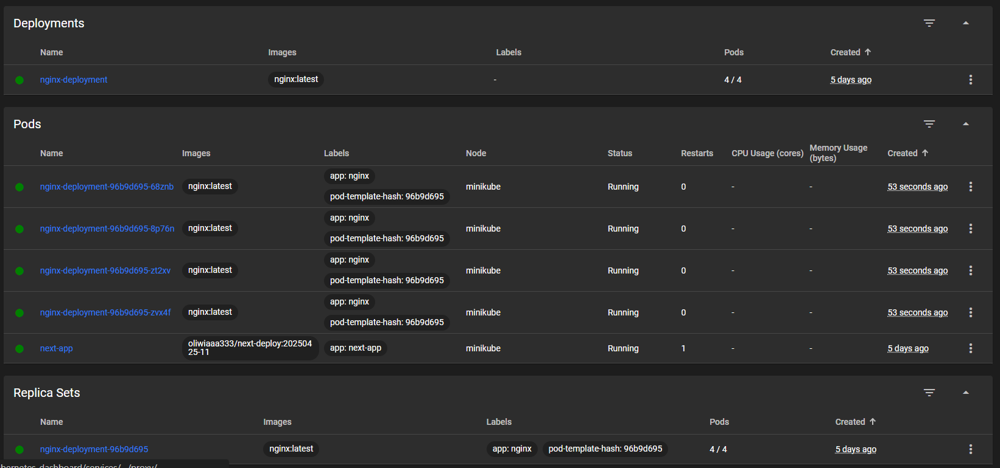
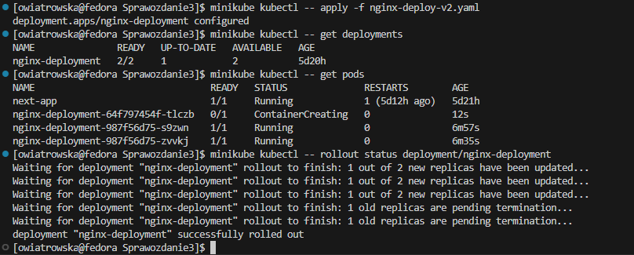

# Sprawozdanie 3

Oliwia Wiatrowska


---


## **Laboratorium 08**

### **Automatyzacja i zdalne wykonywanie poleceń za pomocą Ansible**


---

## **1.Instalacja zarządcy Ansible**
Na początku zajęłam się utworzeniem drugiej maszyny wirtualnej o jak najmniejszym zbiorze zainstalowanego oprogramowania.
Zastosowałam ten sam system operacyjny w tej samej wersji, co główna maszyna.
Nadałam maszynie hostname ansible-target:


A także, jeszcze podczas instalacji utworzyłam w systemie użytkownika ansible:


Następnie sprawdziłam czy na maszynie znajduje się program `tar` i serwer `OpenSSH`:


I sprawdziłam status `sshd`, aby mieć pewność, że jest aktywny:


Zrobiłam migawkę maszynie klikając na pasku na `Maszyna`, a następnie wybierając opcję `Zrób migawkę`:


### Oprogramowanie Ansible
Następnie na głównej maszynie zainstalowałam oprogramowanie Ansible:


### Komunikacja maszyn
Najpierw sprawdziłam adres ip maszyny ansiblowej:


Następnie na głównej maszynie wygenerowałam klucz:


I skopiowałam go na maszynę ansible, lecz wystąpiły tu problemy, cały czas "mieliło":


Konfigurując maszynę ansible, nie zwróciłam uwagi na to, że zostawiłam NAT jako tryb sieci, który izoluje maszyne, a to najprawdopodobniej wpłynęło na występujący problem.
Dlatego wyłączyłam maszynę ansible i w ustawieniach zmieniłam jej sieć z NAT na Mostkowaną kartę sieciową (tak jak jest to ustawione na głównej maszynie), dzięki czemu maszyny mogą się łatwiej ze sobą skomunikować.

Ponownie sprawdziłam adres ip maszyny ansible:


I spróbowałam skopiować wygenerowany wcześniej klucz:


A następnie przetestowałam łącznosć bez podawania hasła:


## **2.Inwentaryzacja**
### Wprowadzenie nazw DNS dla maszyn
Nazwa głównej maszyny:


Nazwa drugiej maszyny:


Zmiana nazwy głównej maszyny na ansible-master:


Następnie przeszłam do `/etc/hosts` na głównej maszynie i dodałam wpisy z odpowiednimi IP i nazwami:
```bash
sudo nano /etc/hosts
```


Utworzyłam plik `inventory.ini`:
```bash
nano inventory.ini
```


Przetestowałam ping:


## **3.Zdalne wywoływanie procedur**
Utworzyłam plik [ping.yml](ping.yml):
```bash
---
- name: 1. Ping all hosts
  hosts: Endpoints
  gather_facts: no
  tasks:
    - name: Ping test
      ansible.builtin.ping:

- name: 2. Copy inventory to endpoints
  hosts: Endpoints
  gather_facts: no
  tasks:
    - name: Copy inventory.ini to /tmp
      ansible.builtin.copy:
        src: ./inventory.ini
        dest: /tmp/inventory.ini

- name: 3. Update system packages
  hosts: Endpoints
  become: yes
  tasks:
    - name: Update all packages
      ansible.builtin.dnf:
        name: "*"
        state: latest

- name: 4. Restart services
  hosts: Endpoints
  become: true
  tasks:
    - name: Restart sshd
      ansible.builtin.service:
        name: sshd
        state: restarted

    - name: Restart rngd (ignore if not installed)
      ansible.builtin.service:
        name: rngd
        state: restarted
        enabled: true
      ignore_errors: yes
```
A następnie uruchomiłam go:


## **4.Zarządzanie stworzonym artefaktem**
Artefaktem z mojego pipline'u wybranego projektu jest plik `.tar`. Na potrzeby innego ćwiczenia pobierałam go z Jenkinsa, umieszczałam w plikach głównej maszyny wirtualnej, a następnie publikowałam w publicznym rejestrze Docker Hub. Dzięki temu mogę teraz wykorzystać gotowy obraz kontenera z Docker Hub.

Rozpoczęłam od stworzenia nowego playbooka [install-docker.yml](install-docker.yml), którego zadaniem jest instalacja Dockera na zdalnej maszynie ansible-target:
```bash
---
- name: Install Docker on endpoint
  hosts: Endpoints
  become: yes
  tasks:
    - name: Install required packages
      ansible.builtin.dnf:
        name:
          - dnf-plugins-core
          - device-mapper
          - lvm2
          - yum-utils
        state: present

    - name: Add Docker repo
      ansible.builtin.command:
        cmd: yum-config-manager --add-repo=https://download.docker.com/linux/fedora/docker-ce.repo
      args:
        creates: /etc/yum.repos.d/docker-ce.repo

    - name: Install Docker
      ansible.builtin.dnf:
        name:
          - docker-ce
          - docker-ce-cli
          - containerd.io
        state: latest

    - name: Enable and start Docker
      ansible.builtin.service:
        name: docker
        state: started
        enabled: yes
```
I uruchomienia go:
```bash
ansible-playbook -i inventory.ini install-docker.yml
```


### Uruchomienie aplikacji w kontenerze
Po zainstalowaniu Dockera przygotowałam playbook [deploy-container.yml](deploy-container.yml), którego zadaniem jest pobranie obrazu z publicznego rejestru Docker Hub oraz uruchomienie kontenera na porcie 300.
```bash
---
- name: Deploy container from Docker Hub
  hosts: Endpoints
  become: yes
  tasks:
    - name: Pull image from Docker Hub
      community.docker.docker_image:
        name: oliwiaaa333/next-deploy
        tag: 20250425-11
        source: pull

    - name: Run container
      community.docker.docker_container:
        name: next-deploy
        image: oliwiaaa333/next-deploy:20250425-11
        state: started
        restart_policy: always
        ports:
          - "3000:3000"
```
Uruchomiłam go poleceniem:
```bash
ansible-playbook -i inventory.ini deploy-container.yml
```


Na maszynie ansible-target sprawdziłam czy kontener działa:
```bash
sudo docker ps
```


### Weryfikacja działania aplikacji w kontenerze
Po uruchomieniu kontenera na maszynie postanowiłam upewnić się, że aplikacja działa poprawnie i odpowiada na żądania HTTP.
W tym celu przygotowałam osobny playbook [verify-container.yml](verify-container.yml), który wysyła zapytanie do kontenerowej aplikacji działającej na porcie 3000 i ścieżce /app.

```bash
---
- name: Verify container application response
  hosts: Endpoints
  become: false
  tasks:
    - name: Send HTTP request to container app
      ansible.builtin.uri:
        url: http://localhost:3000
        return_content: yes
      register: response

    - name: Print HTTP response content
      ansible.builtin.debug:
        var: response.content
```
Następnie uruchomiłam playbook:
```bash
ansible-playbook -i inventory.ini verify-container.yml
```


### Zatrzymanie i usunięcie kontenera
Po zakończeniu weryfikacji działania aplikacji, przygotowałam playbook [remove-container.yml](remove-container.yml), którego zadaniem jest zatrzymanie oraz usunięcie kontenera `next-deploy` z maszyny ansible-target.

```bash
---
- name: Stop and remove deployed container
  hosts: Endpoints
  become: yes
  tasks:
    - name: Stop container
      community.docker.docker_container:
        name: next-deploy
        state: stopped

    - name: Remove container
      community.docker.docker_container:
        name: next-deploy
        state: absent
```
Uruchomiłam playbook:
```bash
ansible-playbook -i inventory.ini remove-container.yml
```
Po jego wykonaniu kontener został poprawnie usunięty z maszyny ansible-target, co kończy cały proces zarządzania opublikowanym artefaktem.


### Automatyzacja z użyciem roli Ansible
Aby uporządkować oraz zautomatyzować cały proces wdrożenia aplikacji kontenerowej, wykorzystałam mechanizm ról dostępny w Ansible.
Za pomocą polecenia:
```bash
ansible-galaxy init docker-deploy
```


utworzyłam strukturę roli o nazwie `docker_deploy`.
W pliku `tasks/main.yml` umieściłam wszystkie zadania:
* instalacje Dockera,
* pobranie obrazu kontenera,
* uruchomienie aplikacji,
* weryfikację odpowiedzi HTTP,
* a także zatrzymanie i usunięcie kontenera po zakończeniu testu.

```bash
---
# Install Docker
- name: Install required packages
  ansible.builtin.dnf:
    name:
      - dnf-plugins-core
      - device-mapper
      - lvm2
      - yum-utils
    state: present

- name: Add Docker repo
  ansible.builtin.command:
    cmd: yum-config-manager --add-repo=https://download.docker.com/linux/fedora/docker-ce.repo
  args:
    creates: /etc/yum.repos.d/docker-ce.repo

- name: Install Docker
  ansible.builtin.dnf:
    name:
      - docker-ce
      - docker-ce-cli
      - containerd.io
    state: latest

- name: Enable and start Docker
  ansible.builtin.service:
    name: docker
    state: started
    enabled: yes

# Deploy container
- name: Pull image from Docker Hub
  community.docker.docker_image:
    name: oliwiaaa333/next-deploy
    tag: 20250425-11
    source: pull

- name: Run container
  community.docker.docker_container:
    name: next-deploy
    image: oliwiaaa333/next-deploy:20250425-11
    state: started
    restart_policy: always
    ports:
      - "3000:3000"

#  Wait before verifying
- name: Wait for containerized app to be ready
  ansible.builtin.pause:
    seconds: 30

# Verify application
- name: Send HTTP request to container app
  ansible.builtin.uri:
    url: http://localhost:3000/
    return_content: yes
  register: response

- name: Print HTTP response content
  ansible.builtin.debug:
    var: response.content

# Optionally remove container
- name: Stop container
  community.docker.docker_container:
    name: next-deploy
    state: stopped

- name: Remove container
  community.docker.docker_container:
    name: next-deploy
    state: absent
```

Wszystko uruchomiłam za pomocą głównego playbooka [site.yml](site.yml):
```bash
---
- name: Run full Docker deploy and cleanup role
  hosts: Endpoints
  become: yes
  roles:
    - docker_deploy
```

Polecenie wykonujące całość:
```bash
ansible-playbook -i inventory.ini site.yml
```


---


## **Laboratorium 09**

### **Pliki odpowiedzi dla wdrożeń nienadzorowanych**


---

## **1. Przeprowadzenie instalacji nienadzorowanej systemu fedora z pliku odpowiedzi z naszego repozytorium**

### Plik odpowiedzi

Na początku uruchomiłam swoją 'pierwotną' maszynę wirtualną z systemem Fedora i za pomocą polecenia:

```bash
sudo cat /root/anaconda-ks.cfg
```
otworzyłam plik odpowiedzi:

[!alt title](znalezienie_pliku_confg_ana)

```bash
# Generated by Anaconda 41.35
# Generated by pykickstart v3.58
#version=DEVEL

# Keyboard layouts
keyboard --vckeymap=pl --xlayouts='pl'
# System language
lang pl_PL.UTF-8

# Network information
network  --bootproto=dhcp --device=enp0s3 --ipv6=auto --activate

%packages
@^custom-environment

%end

# Run the Setup Agent on first boot
firstboot --enable

# Generated using Blivet version 3.11.0
ignoredisk --only-use=sda
autopart
# Partition clearing information
clearpart --none --initlabel

# System timezone
timezone Europe/Warsaw --utc

#Root password
rootpw --lock
user --groups=wheel --name=owiatrowska --password=$y$j9T$iqumCc0TgyHLXBRSV6UgyA7B$WpEDkvm5hs41NGicPAwO7CeZtOfZZsqWsCU7X5hwNk5 --iscrypted --gecos="Oliwia Wiatrowska"
```

który następnie skopiowałam jako plik `kickstart` i przeniosłam do katalogu Sprawozdania.


Następnie chciałam wypchnąć plik odpowiedzi do repozytorium, ale nie udało się to za pierwszym razem, ponieważ właścicielem pliku był root.
Wobec tego zmieniłam właściciela pliku za pomocą:

```bash
sudo chown owiatrowska:owiatrowska Sprawozdanie3/kickstart
```
[!alt title](zmiana_wlasciciela_pliku_zeb)

Po zapoznaniu się z dokumentacją pliku odpowiedzi, zauważyłam, że mój plik nie zawiera wzmianki na temat potrzebnych repozytoriów, dlatego odpowiednio go zmodyfikowałam, dodając:

```bash
# Repos
url --mirrorlist=http://mirrors.fedoraproject.org/mirrorlist?repo=fedora-41&arch=x86_64
repo --name=update --mirrorlist=http://mirrors.fedoraproject.org/mirrorlist?repo=updates-released-f41&arch=x86_64
```

pomiędzy uruchamianiem setup agenta, a generowaniem z użyciem Blivet.

### Instalacja nienadzorowana

Aby przeprowadzić instalację nienadzorowaną z wykorzystaniem pliku odpowiedzi, rozpoczęłam od utworzenia maszyny wirtualnej. Nazwałam ją `fedora2`.
[!alt title](tworzenie_maszyny_cz1)

Nazwę hosta ustawiłam również na `fedora2`.
[!alt title](tworzenie_maszyny_cz2)

Następnie skonfigurowałam pozostałe ustawienia:
[!alt title](tworzenie_maszyny_cz3)

[!alt title](tworzenie_maszyny_cz4)

Po konfiguracji uruchomiłam maszynę.

Na etapie pojawienia się ekranu GRUB boot menu, nacisnęłam klawisz `e`, co umożliwiło edycję parametrów uruchamiania instalatora.
[!alt title](ekran_po_wcisnieciu_e)

W edytowanym widoku na końcu linii uruchamiania instalatora dodałam dyrektywę:
```bash
inst.ks=https://tinyurl.com/OW416377
```
[!alt title](dodanie_url'a)

Dyrektywa `inst.ks=` informuje instalator Anaconda, aby podczas uruchamiania systemu zainstalował go w sposoób zautymatyzowany, zgodnie z instrukcjami zawartymi w pliku kickstart.
Podałam skrócony adres do mojego pliku (wykorzystałam stronę tinyurl) znajdującego się w repozytorium przedmiotowym, na moje gałęzi w odpowiednim katalogu. Co istotne - do pliku RAW.


Dzięki zautomatyzowaniu procesu wszystko "wyklikało się" samo i system pomyślnie został zainstalowany.
[!alt text](postep_instalacji)

## ***2.Rozszerzenie pliku odpowiedzi o repozytoria i oprogramowanie potrzebne do uruchomienia programu, zbudowanego w ramach projektu pipeline'u*
Wykorzystałam projekt, którego budowa i etapy tworzenia pipeline'u szczegółowo opisane są w [Sprawozdaniu 2](../Sprawozdanie2/README.md).
Efektem działania pipeline'u jest obraz kontenera Dockera zawierający aplikację zbudowaną w oparciu o Next.js Boilerplate

W tym celu zmodyfikowałam plik kickstart. Rozszerzyłam konfigurację o dodatkowe repozytoria oraz pakiety potrzebne do działania aplikacji, między innymi:
* docker - jako środowisko uruchomieniowe kontenera,
* wget, tar, curl - do pobrania i załadowania obrazu kontenera.

W sekcji %post pliku odpowiedzi zrealizowałam następujące kroki:
* pobrałam zbudowany artefakt z serwera Jenkins w postaci obrazu Dockera `.tar`,
* jawnie wpisałam wartości `NEXTAUTH_SECRET` do pliku `.env`, wymaganego przez aplikację,
* załadowałam obraz do lokalnego `Dockera`,
* utworzyłam i włączyłam jednostkę `systemd`, odpowiedzialną za uruchomienie kontenera przy starcie systemu.

Aby zapewnić automatyczne uruchomienie aplikacji:
* na końcu instalacji systemu użyłam dyrektywy `reboot`,
* utworzyłam jednostkę `next-app.service`, która startuje razem z systemem i uruchamia kontener z aplikacją.
Dzięki temu aplikacja jest dostępna od razu po uruchomieniu systemu pod adresem `http://localhost:3000`

Treść zmodyfikowanego pliku odpowiedzi:

```bash
# Generated by Anaconda 41.35
# Generated by pykickstart v3.58
#version=DEVEL

# Keyboard layouts
keyboard --vckeymap=pl --xlayouts='pl'
# System language
lang pl_PL.UTF-8

# Network information
network  --bootproto=dhcp --device=enp0s3 --ipv6=auto --activate

# Repos
url --mirrorlist=http://mirrors.fedoraproject.org/mirrorlist?repo=fedora-41&arch=x86_64
repo --name=update --mirrorlist=http://mirrors.fedoraproject.org/mirrorlist?repo=updates-released-f41&arch=x86_64

# Generated using Blivet version 3.11.0
ignoredisk --only-use=sda
autopart
# Partition clearing information
clearpart --none --initlabel

# System timezone
timezone Europe/Warsaw --utc

#Root password
rootpw --lock
user --groups=wheel --name=owiatrowska --password=$y$j9T$iqumCc0TgyHLXBRSV6UgyA7B$WpEDkvm5hs41NGicPAwO7CeZtOfZZsqWsCU7X5hwNk5 --iscrypted --gecos="Oliwia Wiatrowska"

%packages
@^custom-environment
docker
wget
tar
curl
%end

# Run the Setup Agent on first boot
firstboot --enable

# post-install confg
%post --log=/root/ks-post.log

# run docker
systemctl enable docker

# download docker image from Jenkins
wget -O /root/next-deploy.tar http://192.168.18.97:8080/job/Boilerplate/lastSuccessfulBuild/artifact/next-deploy-20250425-11.tar

# load the Docker image
docker load -i /root/next-deploy.tar

# write env variables to .env file
cat > /root/app.env << EOF
NEXTAUTH_SECRET=LfKOOb9SXtIvngnXWBo9D7WjzJraPbpAxtmzZiT98SU=
EOF

# create a systemd unit file to start the container
cat > /etc/systemd/system/next-app.service << 'EOF'
[Unit]
Description=Next.js App Container
Requires=docker.service
After=docker.service

[Service]
Restart=always
ExecStart=/usr/bin/docker run --rm --name next-app --env-file /root/app.env -p 3000:3000 next-deploy:20250425-11
ExecStartPost=/usr/bin/rm -f /root/app.env
ExecStop=/usr/bin/docker stop next-app

[Install]
WantedBy=multi-user.target
EOF

# enable the app service
systemctl enable next-app

%end

# automatically reboot the system after installation
reboot
```

Po zmodyfikowaniu pliku `kickstart` i wypchnięciu go do repozytorium uruchomiłam maszynę wirtualną `fedora2`.
Gdy pojawił się ekran GRUB, nacisnęłam klawisz `e` i w edytowanym widoku na końcu linii uruchamiania instalatora dodałam dyrektywę:

```bash
inst.ks=https://tinyurl.com/OW416377
```
[!alt title](dodanie_dyrektywy_grub_wybranego)

Podczas instalacji zauważyłam, że pomimo poprawnej struktury pliku kickstart, fedora wymagała potwierdzenia partycjonowania ręcznie z poziomu GUI.
[!alt title](problemz_miejscem)

Kliknęłam miejsce docelowe instalacji i zobaczyłam komunikat dotyczący błędu podczas sprawdzania konfiguracji urządzeń do przechowywania danych - może to świadczyć o tym, że przydzielony przeze mnie wcześniej rozmiar dysku jest za mały.
W tym celu wyłączyłam maszynę i zwiększyłam jej rozmiar dysku do około 50 GB.
Przeszłam do 'Narzędzia', następnie kliknęłam w zakładce 'Dyski twarde' na nazwę `fedora2.vdi` i za pomocą suwaka zwiększyłam rozmiar maszyny. Na koniec kliknęłam 'Zastosuj'.


Następnie ponownie uruchomiłam maszynę i postępowałam dokładnie w ten sam sposób co wcześniej. Po pojawieniu się ekranu GRUB kliknęłam `e` i w odpowiednim miejscu dodałam taką samą dyrektywę jak wyżej.

Niestety pomimo wielokrotnych prób, dalej występowały błędy z instalacją. Albo (dalej) za mało miejsca na dysku, albo można powiedzieć instalacja całkowicie się "wywalała",
bo trzeba było wybierać język lub konfigurować użytkownika/roota. Wszystko robiłam za każdym razem tak samo - upewniałam się co do poprawności dyrektywy oraz tego czy link napewno przekierowuje do pliku raw z repozytorium - a efekty i tak były różne i mam wrażenie, że momentami losowe.


---


## **Laboratorium 10**

### **Wdrażanie na zarządzalne kontenery: Kubernetes (1)**


---

## **1.Instalacja klastra Kubernetes**

Na początku rozpoczęłam od instalacji `minikube` na podstawie [dokumentacji](https://minikube.sigs.k8s.io/docs/start/?arch=%2Flinux%2Fx86-64%2Fstable%2Frpm+package):

```bash
curl -LO https://storage.googleapis.com/minikube/releases/latest/minikube-latest.x86_64.rpm
sudo rpm -Uvh minikube-latest.x86_64.rpm
```


Następnie, aby wykazać bezpieczeństwo instalacji sprawdziłam podpis cyfrowy:

```bash
rpm --checksig minikube-latest.x86_64.rpm
```


Nadałam alias:

```bash
alias minikubctl="minikube kubectl --
```


W przypadku nadania aliasu w taki sposób, po otwarciu innego terminala nie mamy dostępu do tego aliasu i musimy go nadać jeszcze raz.
Dlatego, gdy potrzebny był mi drugi terminal wykorzystałam następujące polecenie, aby zapisać alias na stałe:
```bash
echo 'alias minikubctl="minikube kubectl --"' >> ~/.bashrc
source ~/.bashrc
```


Następnie uruchomiłam Kubernetesa:
```bash
minikube start
```


Działający kontener:


Uruchomiłam dashboard:
```bash
minikube dashboard
```


Otworzyłam dashboard w przeglądarce i przeszłam do `Services`, aby pokazać łączność:


## **2.Analiza posiadanego kontenera**
Wykonałam plan optimum - wykorzystałam artefakt powstały w ramach wcześniejszego zadania z użyciem Jenkinsa. Artefakt zawierał zbudowany obraz kontenera aplikacji i został wygenerowany w formacie .tar jako wynik etapu "Publish" w pipeline.
Pobrałam plik `next-deploy-20250425-11.tar` z Jenkinsa i umieściłam go w plikach na maszynie wirtualnej.

Na początku uruchomiłam minikube:
```bash
minikube start
```


Następnie załadowałam obraz do lokalnego Dockera:
```bash
docker load -i next-deploy-20250425-11.tar
```


I sprawdziłam, czy został poprawnie załadowany:
```bash
docker images | grep next-deploy
```


Na końcu załadowałam obraz do środowiska Minikube:
```bash
minikube image load next-deploy:20250425-11
```
Niestety to nie zadziałało i proces został unicestwiony, prawdopodobnie przez to, że artefakt dużo waży.


Dlatego postanowiłam wgrać obraz do publicznego rejestru Docker Hub. 

Najpierw zalogowałam się, zmieniłam nazwę obrazu i wypchnęłam go do Docker Hub:

```bash
docker login
docker tag next-deploy:20250425-11 oliwiaaa333/next-deploy:20250425-11
docker push oliwiaaa333/next-deploy:20250425-11
```
 


Następnie uruchomiłam pod:
```bash
minikube kubectl -- run next-app \
  --image=oliwiaaa333/next-deploy:20250425-11 \
  --port=3000 \
  --labels app=next-app
```


I sprawdziłam jego status:
```bash
minikube kubectl -- get pods
```


oraz w dashboardzie:


Wyprowadzenie portu:
```bash
minikube kubectl -- port-forward pod/next-app 8081:3000
```


Początkowo strona `http://localhost:8081` nie otwierała się (cały czas się ładowała), ale po użyciu:
```bash
curl http://localhost:8081
```
nastąpiło nawiązanie połączenia, a aplikacja była widoczna również w przeglądarce.


Działająca strona:


## **3. Przekucie wdrożenia manualnego w plik wdrożenia**
### Utworzenie pliku
Na początku utworzyłam plik [nginx-deployment.yaml](nginx-deployment.yaml):
```bash
touch nginx-deployment.yaml
```


Treść pliku:

```bash
apiVersion: apps/v1
kind: Deployment
metadata:
  name: nginx-deployment
spec:
  replicas: 4
  selector:
    matchLabels:
      app: nginx
  template:
    metadata:
      labels:
        app: nginx
    spec:
      containers:
      - name: nginx
        image: nginx:latest
        ports:
        - containerPort: 80

```

### Wdrożenie i weryfikacja
Następnie wdrożyłam plik za pomocą: 
```bash
minikube kubectl -- apply -f nginx-deployment.yaml
```


Sprawdziłam status replik i podów:
```bash
minikube kubectl -- get deployments
```
```bash
minikube kubectl -- get pods
```


A także zbadałam stan za pomocą:

```bash
minikube kubectl -- rollout status deployment/nginx-deployment
```


Widok w dashboardzie:


### Eksponowanie jako serwis
Następnie wyeksponowałam wdrożenie jako serwis typu `NodePort`:
```bash
minikube kubectl -- expose deployment nginx-deployment \
  --type=NodePort \
  --port=80 \
  --target-port=80
```


### Udostępnienie funkcjonalności przez port-forward
Aby uzyskać dostęp lokalnie, w drugim terminalu uruchomilam port-forward:
```bash
minikube kubectl -- port-forward service/nginx-deployment 8082:80
```
Początkowo strona `http://localhost:8082` nie otwierała się (analogiczny problem, jak wyżej), ale po użyciu:
```bash
curl http://localhost:8082
```
nastąpiło nawiązanie połączenia, a aplikacja była widoczna również w przeglądarce.


---


## **Laboratorium 11**

### **Wdrażanie na zarządzalne kontenery: Kubernetes (2)**


---

## **1.Przygotowanie nowego obrazu**
Rozpoczęłam od zarejestrowania dwóch nowych wersji obrazu deploy. W tym celu uruchomiłam Jenkinsa i dwukrotnie uruchomiłam pipeline, żeby otrzymać potrzebne artefakty.


Następnie każdą paczkę `.tar` pobrałam lokalnie na swój komputer i umieściłam w plikach na maszynie wirtualnej, a następnie zalogowałam się do Docker Hub, żeby wgrać obrazy do publicznego rejestru. Załadowałam je, zmieniłam kolejno ich nazwy i wypchnęłam je na Docker Hub.

```bash
docker login
docker load -i next-deploy-20250604-12.tar
docker tag next-deploy:20250604-12 oliwiaaa333/next-deploy:v1
docker push oliwiaaa333/next-deploy:v1

docker load -i next-deploy-20250604-13.tar
docker tag next-deploy:20250604-13 oliwiaaa333/next-deploy:v2
docker push oliwiaaa333/next-deploy:v2
```


### Wersja kończąca się błędem 
Aby nie modyfikować istniejących Dockerfiles oraz uruchamiać kolejny raz pipeline (zbyt długi czas uruchamiania się) postanowiłam utworzyć plik [Dockerfile.broken](Dockerfile.broken), który bazuje na istniejącym już (i działającym) obrazie aplikacji, dostępnym publicznie na Docker Hub, ale z podanym złym entrypointem.

```bash
FROM oliwiaaa333/next-deploy:v1
ENTRYPOINT ["/bin/false"]
```
Następnie zbudowałam obraz lokalnie:
```bash
docker build -t oliwiaaa333/next-deploy:broken -f Dockerfile.broken .
```


i wypchnęłam go na Docker Huba:
```bash
docker push oliwiaaa333/next-deploy:broken
```


Aby potwierdzić, że wersja `broken` nie działa wykonałam lokalnie test:


## **2.Zmiany w deploymencie**
### Zwiększenie replik do 8
Zmiana w pliku nginx-deployment.yaml:
```bash
spec:
  replicas: 8
```
Wdrożyłam plik:
```bash
minikube kubectl -- apply -f nginx-deployment.yaml
```


Sprawdziłam status replik i podów:
```bash
minikube kubectl -- get deployments
```
```bash
minikube kubectl -- get pods
```


A także zbadałam stan za pomocą:

```bash
minikube kubectl -- rollout status deployment/nginx-deployment
```


Widok w dashboardzie:


### Zmniejszenie liczby replik do 1
Zmiana w pliku nginx-deployment.yaml:
```bash
spec:
  replicas: 1
```
Wdrożyłam plik:
```bash
minikube kubectl -- apply -f nginx-deployment.yaml
```

Sprawdziłam status replik i podów:
```bash
minikube kubectl -- get deployments
```
```bash
minikube kubectl -- get pods
```
A także zbadałam stan za pomocą:

```bash
minikube kubectl -- rollout status deployment/nginx-deployment
```


Widok w dashboardzie:


### Zmniejszenie liczby replik do 0
Zmiana w pliku nginx-deployment.yaml:
```bash
spec:
  replicas: 0
```
Wdrożyłam plik:
```bash
minikube kubectl -- apply -f nginx-deployment.yaml
```

Sprawdziłam status replik i podów:
```bash
minikube kubectl -- get deployments
```
```bash
minikube kubectl -- get pods
```
A także zbadałam stan za pomocą:

```bash
minikube kubectl -- rollout status deployment/nginx-deployment
```


Widok w dashboardzie:


## Przeskalowanie w górę do 4 replik
Zmiana w pliku nginx-deployment.yaml:
```bash
spec:
  replicas: 4
```
Wdrożyłam plik:
```bash
minikube kubectl -- apply -f nginx-deployment.yaml
```

Sprawdziłam status replik i podów:
```bash
minikube kubectl -- get deployments
```
```bash
minikube kubectl -- get pods
```
A także zbadałam stan za pomocą:

```bash
minikube kubectl -- rollout status deployment/nginx-deployment
```


Widok w dashboardzie:


### Przywracanie poprzednich wersji
Historia:
```bash
minikube kubectl -- rollout history deployment/nginx-deployment
```
Niestety zapomniałam, że przy samych zmianach w replikach kubernetes nie zapisze historii zmian, dlatego jeszcze raz przeszłam przez wyżej wspomniane kroki i dla każdej wersji dodałam odpowiednią nazwę w sekcji template w version:
```bash
template:
    metadata:
      labels:
        app: nginx
        version: 
```
* początkowa wersja - basic,
* 8 replik - 8_replicas,
* 1 replika - 1_replica,
* 0 replik - 0_replica,
* 4 repliki - scale_to_4_replicas

Po tej zmianie wersje są widoczne:


### Zastosowanie nowej i starej wersji obrazu
Na początku utworzyłam pliki [nginx-deploy-v1.yaml](nginx-deploy-v1.yaml) i [nginx-deploy-v2.yaml](nginx-deploy-v2.yaml).
Wdrożyłam plik v1:
```bash
minikube kubectl -- apply -f nginx-deploy-v1.yaml
minikube kubectl -- get deployments
minikube kubectl -- get pods
minikube kubectl -- rollout status deployment/nginx-deployment
```


a następnie v2:
```bash
minikube kubectl -- apply -f nginx-deploy-v2.yaml
minikube kubectl -- get deployments
minikube kubectl -- get pods
minikube kubectl -- rollout status deployment/nginx-deployment
```



Sprawdziłam historię i zrobiłam rollback:
```bash
minikube kubectl -- rollout history deployment/nginx-deployment
minikube kubectl -- rollout undo deployment/nginx-deployment
minikube kubectl -- rollout undo deployment nginx-deployment --to-revision=1
minikube kubectl -- get pods
```


### Zastosowanie "wadliwego" obrazu
Utworzyłam plik Dockerfile.broken:

```bash
FROM nginx:1.21.6
ENTRYPOINT ["/bin/false"]
```
Zbudowałam go lokalnie:
```bash
docker build -t nginx:broken -f Dockerfile.broken .
```


Załadowałam go do minikube:
```bash
minikube image load nginx:broken
```
Utworzyłam plik nginx-broken.yaml:
```bash
apiVersion: apps/v1
kind: Deployment
metadata:
  name: nginx-broken
spec:
  replicas: 2
  selector:
    matchLabels:
      app: nginx-broken
  template:
    metadata:
      labels:
        app: nginx-broken
        version: broken
    spec:
      containers:
      - name: nginx-broken
        image: nginx:broken
        ports:
        - containerPort: 80
```

Wdrożyłam plik i sprawdzilam stan:
```bash
minikube kubectl -- apply -f nginx-broken.yaml
minikube kubectl -- get deployments
minikube kubectl -- get pods
minikube kubectl -- rollout status deployment/nginx-broken
```


## **3.Kontrola wdrożenia**
Aby przeprowadzić kontrolę wdrożenia, wykonałam polecenie `rollout history`, które pokazało, że deployment był wielokrotnie aktualizowany. Każda z rewizji odzwierciedlała zmiany w konfiguracji - np. liczby replik czy wersji obrazu. Dodatkowo, za pomocą flagi `--revision=` mogłam podejrzeć szczegóły konkretnej rewizji i przeanalizować wprowadzone modyfikacje.
```bash
minikube kubectl --rollout history deployment/nginx-deployment
minikube kubectl --rollout history deployment/nginx-deployment --revision=3
```


Następnie utworzyłam nowy plik [check-deployment.sh](check-deployment.sh), w którym umieściłam skrypt weryfikujący wdrożenie: 
```bash
#!/bin/bash
DEPLOYMENT=nginx-deployment
TIMEOUT=60
INTERVAL=5
ELAPSED=0

echo "Sprawdzam status wdrożenia dla $DEPLOYMENT..."

while [ $ELAPSED -lt $TIMEOUT ]; do
  STATUS=$(minikube kubectl -- rollout status deployment/$DEPLOYMENT 2>&1)
  echo "$STATUS"
  if echo "$STATUS" | grep -q "successfully rolled out"; then
    echo "Wdrożenie zakończone sukcesem."
    exit 0
  fi
  sleep $INTERVAL
  ELAPSED=$((ELAPSED + INTERVAL))
done

echo "Przekroczono czas oczekiwania. Wdrożenie się nie zakończyło."
exit 1
```
i nadałam mu odpowiednie uprawnienia:
```bash
chmod +x check-deployment.sh
```
Wynik dla "wadliwego" obrazu:


Wynik dla innego obrazu:


## **4.Strategie wdrożenia**
### Recreate
Wdrożenie z Recreate usuwa stare pody przed uruchomieniem nowych.

```bash
apiVersion: apps/v1
kind: Deployment
metadata:
  name: nginx-recreate
spec:
  replicas: 3
  strategy:
    type: Recreate
  selector:
    matchLabels:
      app: nginx-recreate
  template:
    metadata:
      labels:
        app: nginx-recreate
        strategy: recreate
    spec:
      containers:
      - name: nginx
        image: nginx:latest
        ports:
        - containerPort: 80
```

### Rolling Update
Rolling Update umożliwia stopniowe wdrażanie zmian - nowe pody są tworzone obok starych, a następnie stare są usuwane. Pozwala to zminimalizować czas niedostępności usługi.

```bash
apiVersion: apps/v1
kind: Deployment
metadata:
  name: nginx-rolling
spec:
  replicas: 4
  strategy:
    type: RollingUpdate
    rollingUpdate:
      maxSurge: 50%
      maxUnavailable: 2
  selector:
    matchLabels:
      app: nginx-rolling
  template:
    metadata:
      labels:
        app: nginx-rolling
        strategy: rolling
    spec:
      containers:
      - name: nginx
        image: nginx:latest
        ports:
        - containerPort: 80
```
Dodatkowa sekcja rollingUpdate:
```bash
    rollingUpdate:
      maxSurge: 50%
      maxUnavailable: 2
```
określa szczegóły strategii - `maxSurge: 50%` pozwala na utworzenie do 50% więcej podów niż zadeklarowano w replikach, a `maxUnavailable: 2` dopuszcza tymczasową niedostępność maksymalnie dwóch podów podczas aktualizacji.

### Canary Deployment workload
Canary deployment polega na równoczesnym działaniu dwóch wersji aplikacji - głównej i testowej (canary), obsługujących ruch użytkowników w proporcji. Pozwala to bezpiecznie przetestować nową wersję bez ryzyka awarii całej usługi.
Zrealizowałam go z pomocą dwóch wcześniej utworzonych wdrożeń [nginx-deploy-v1.yaml](nginx-deploy-v1.yaml) i [nginx-deploy-v2.yaml](nginx-deploy-v2.yaml). Oba deploymenty mają wspólną etykietę `app: nginx`, co pozwala serwisowi [nginx-service.yaml](nginx-service.yaml) kierować ruch do obu wersji. Dodatkowa etykieta `version` umożliwia ich rozróżnienie i obserwację zachowania każdej z wersji.

Plik serwisu [nginx-service.yaml](nginx-service.yaml):
```bash
apiVersion: v1
kind: Service
metadata:
  name: nginx-service
spec:
  selector:
    app: nginx
  ports:
    - protocol: TCP
      port: 80
      targetPort: 80
```