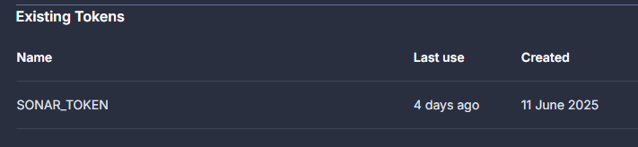

# Sprawozdanie 4

Oliwia Wiatrowska


---


## **Laboratorium 13**

### **Shift-left: Github Actions**


---

W ramach warsztatów realizowanych przez PEGA miałam okazję zapoznać się z praktycznym wykorzystaniem Github Actions w procesie CI/CD. Pracowałam na bazie przygotowanego wcześniej repozytorium z prostą aplikacją webową. Celem warsztatów było zrozumienie procesu automatyzacji buildów, analiz i deploymentu. 

### Czym zajmowałam się krok po kroku:
1. Sforkowałam repozytorium warsztatowe.
2. Uruchomiłam środowisko pracy w Codespaces i pracowałam w nim zgodnie ze wskazówkami z instrukcji.
3. Na potrzeby ćwiczeń:
* tworzyłam odpowiednie gałęzie robocze,

* pushowałam zmiany,
* otwierałam pull requesty.
4. Workflowy `.yaml` były częściowo przygotowane, jednak to ode mnie zależało ich poprawne uruchomienie i działanie.
* Uruchamiały one build i testy,
* przeprowadzały analizę SonarCloud,
* wykonywały deploy do Vercel.

Poza tym, moim zadaniem było:
* utworzenie katalogu .github/workflows, gdzie umieściłam plik ci-cd.yaml oraz production.yaml.

* uzupełnienie wymaganych zmiennych środowiskowych i sekretów (VERCEL_TOKEN, SONAR_TOKEN, VERCEL_PROJECT_ID, itd.),

* połączenie projektu z SonarCloud i Vercel,
* dopilnowanie, aby workflow działał poprawnie po każdym commicie i PR, a w przypadku błędów - rozwiązywanie ich.

### Workflowy
Pierwszy workflow definiował pipeline, który:
* uruchamiał się na push do main i pull_request,
* budował aplikację,
* uruchamiał testy (Jest + coverage),
* uruchamiał skanowanie kodu przez SonarCloud.

Treść pełnego [ci-cd.yaml](ci-cd.yaml) (już z krokiem dotyczącym testów i sonara omówionych niżej):
```bash
name: CI/CD Pipeline

# Trigger the workflow on push to main and develop branches, and on pull requests
on:
  push:
    tags:
      - '*'
    branches:
      - main
  pull_request:
    branches:
      - main

# Global environment variables
env:
  NODE_VERSION: '18.x'

jobs:
  # Lint & Test Job - Runs on all triggers
  build-and-test:
    name: Build & Test
    runs-on: ubuntu-latest

    steps:
    - name: Checkout code
      uses: actions/checkout@v4

    - name: Set up Node.js ${{ env.NODE_VERSION }}
      uses: actions/setup-node@v3
      with:
        node-version: ${{ env.NODE_VERSION }}
        cache: 'npm'

    - name: Install Dependencies
      run: |
        npm ci

    - name: Build
      run: |
        DISABLE_DB_CONNECTION=true npm run build
    
    - name: Run tests with coverage
        run: npx jest

     - name: Sonar Scan
      uses: SonarSource/sonarqube-scan-action@v5.0.0
      env:
        SONAR_TOKEN: ${{ secrets.SONAR_TOKEN }}
```

Dzięki temu nauczyłam się, jak działa standardowy workflow i jak dodawać kolejne kroki.


### SonarCloud i analiza kodu
Korzystając z sonarqube-scan-action, zintegrowałam projekt z SonarCloud.
Wymagało to:
* utworzenia konta,
* wygenerowania SONAR_TOKEN,

* dodania go jako secret w repozytorium.

Wyłączyłam automatyczną analizę, aby:
* ręcznie kontrolować moment skanowania,
* uwzględniać pokrycie testowe z Jest,
* lepiej zarządzać procesem.

Utworzyłam też plik sonar-project.properties, w którym skonfigurowałam ścieżki do raportu pokrycia kodu oraz wykluczenia. Dzięki temu po wykonaniu workflowu mogłam przeglądać metryki pokrycia kodu i jakość kodu w panelu SonarCloud.


### CodeQL i analiza bezpieczeństwa (SAST)
Wykonałam również analizę SAST za pomocą domyślnej konfiguracji CodeQL. Na potrzeby testu wprowadziłam świadomie podatny fargment kodu (fetch() bez walidacji), utworzyłam PR i pozwoliłam workflow CodeQL wykryć problem. PR został odrzucony zgodnie z założeniem.


### Dependabot i analiza zależności (SCA)
W zakładce "Security" w GitHubie włączyłam Dependabot Alerts i Security Updates, co pozwoliło mi na bieżąco monitorować podatności w zależnościach oraz automatycznie otzrymywać PR z aktualizacjami.


### Test coverage
Dodałam do jest.config.js konfigurację:
```bash
  collectCoverage: true,
  coverageDirectory: 'coverage',
  coverageReporters: ['lcov', 'text']
```
Dzięki temu testy generowały raport, który był wykorzystywany przez SonarCloud.

### Wersje release
Utworzyłam oznaczoną wersję release w repozytorium, co pozwala na kontrolę wersji i ewentualne przywracanie stanu projektu.


### Deployment i drugi workflow
W ramach drugiego workflowu zajęłam się automatycznym deployem aplikacji do Vercel.
1. Założyłam konto w Vercel, utworzyłam nowy projekt i podpięłam repozytorium.
2. Skonfigurowałam bazę danych Postgres przez Vercel POstgres oraz połączyłam ją z projektem.
3. Zainstalowałam Prismę i stworzyłam schema dla bazy danych.
4. Skonfigurowałam aplikację OAuth na GitHubie i dodałam odpowiednie sekrety do projektu (Client ID, Secret, redirect URL itd.).


5. Utworzyłam plik workflow do deploymentu [production.yaml](production.yaml), który:
    * instalował Vercel CLI,
    * dodawał zmienne środowiskowe,
    * budował projekt,
    * deployował go do Vercel.

Treść production.yaml:
```bash
name: Vercel Production Deployment
env:
  VERCEL_ORG_ID: ${{ secrets.VERCEL_ORG_ID }}
  VERCEL_PROJECT_ID: ${{ secrets.VERCEL_PROJECT_ID }}
  GITHUB_ID: ${{ secrets.OAUTH_GITHUB_ID }}
  GITHUB_SECRET: ${{ secrets.OAUTH_GITHUB_SECRET }}
  NEXTAUTH_SECRET: ${{ secrets.OAUTH_SECRET }}
  NEXTAUTH_URL: ${{ secrets.NEXTAUTH_URL }}

on:
  push:
    tags:
      - '*'
jobs:
  Deploy-Production:
    runs-on: ubuntu-latest
    steps:
      - uses: actions/checkout@v2
      - name: Install Vercel CLI
        run: npm i -g vercel
      - name: Set Environment Variables
        run: |
            echo -n $GITHUB_ID | vercel env add GITHUB_ID production --token=${{ secrets.VERCEL_TOKEN }}
            echo -n $GITHUB_SECRET | vercel env add GITHUB_SECRET production --token=${{ secrets.VERCEL_TOKEN }}
            echo -n $NEXTAUTH_SECRET | vercel env add NEXTAUTH_SECRET production --token=${{ secrets.VERCEL_TOKEN }}
            echo -n $NEXTAUTH_URL | vercel env add NEXTAUTH_URL production --token=${{ secrets.VERCEL_TOKEN }} 
      - name: Pull Vercel Environment Information
        run: vercel pull --yes --environment=production --token=${{ secrets.VERCEL_TOKEN }}
      - name: Build Project Artifacts
        run: vercel build --prod --token=${{ secrets.VERCEL_TOKEN }}
      - name: Deploy Project Artifacts to Vercel
        run: vercel deploy --prebuilt --prod --token=${{ secrets.VERCEL_TOKEN }}
```


Po wykonaniu PR i jego zatwierdzeniu workflow zadziałał poprawnie, a aplikacja została zdeployowana. Jest dostępna pod publicznym adresem `https://vercel-sample-app.vercel.app/`, a w Dashboardzie widoczna jest historia deploymentu.


