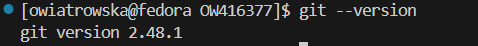
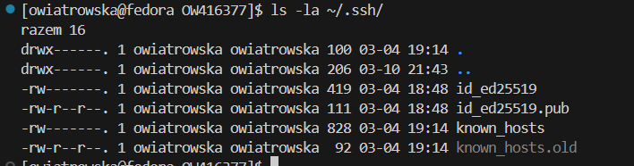
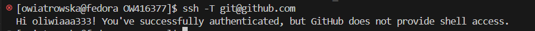
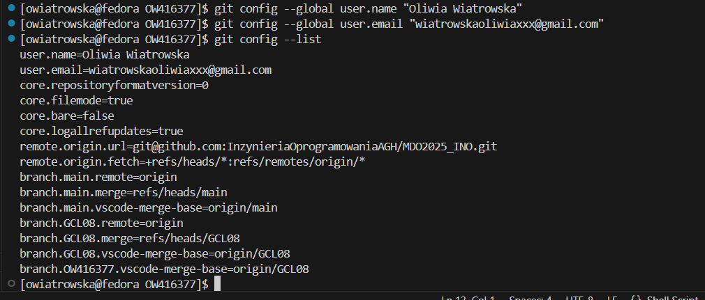
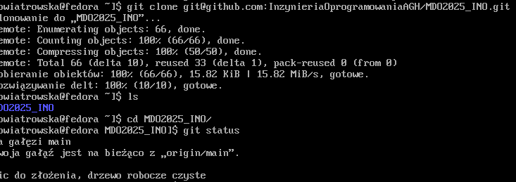
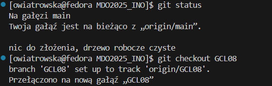
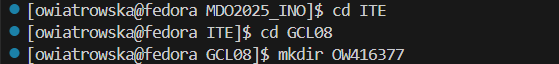
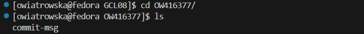

# Sprawozdanie 1


---


## **Laboratorium 01**

### **Wprowadzenie, Git, Gałęzie, SSH**


---

## **1. Instalacja klienta Git i konfiguracja SSH**
Podczas konfiguracji środowiska na maszynie wirtualnej zainstalowałam system kontroli wersji Git oraz skonfigurowałam dostęp do GitHuba za pomocą klucza SSH. Aby potwierdzić, że Git i obsługa SSH zostały poprawnie skonfigurowane, przedstawiam wyniki kilku komend diagnostycznych:

### Wersja Gita

```bash
git --version
```


### Sprawdzenie klucza SSH

```bash
ls -la ~/.ssh/
```


### Test połączenia SSH z GitHubem

```bash
ssh -T git@github.com
```


### Konfiguracja użytkownika Git
to jest juz zescreenowane, ale screen pod inna nazwa i do przyciecia

```bash
git config --list
```



może pokazać coś z tym, że utworzyłam te klucze, np. napisac za pomoca jakiej komendy ale nie dawac screena z terminala, tylko dac screena z githuba

## **2. Klonowanie repozytorium**

### Klonowanie repozytorium przez SSH

Po skonfigurowaniu klucza SSH, sklonowałam repozytorium przy użyciu SSH:

```bash
git clone git@github.com:InzynieriaOprogramowaniaAGH/MDO2025_INO.git
```
(ten zrzut mam ale pod inna nazwa)
Zrzut ekranu przedstawiający poprawnie sklonowane repozytorium:



## **3. Gałęzie**

### Przełączanie się między gałęziami
Na początku przełączyłam się na gałęź main, następnie na gałęź mojej grupy, tj. GCL08

(te screeny tez mam ale pod inna nazwa i do przyciecia)


### Utworzenie nowej gałęzi
Następnie uwtorzyłam swoją gałąź o nazwie składającej się z moich inicjałów i numeru indeksu



## **4. Praca na nowej gałęzi**

### Utworzenie nowego katalogu
Utworzyłam katalog, także o nazwie składającej się z moich inicjałów i numeru indeksu:


### Napisanie Git hooka
Napisałam hooka `commit-msg`, weryfikującego to, aby każdy mój "commit message" zaczynał się od moich inicjałów i numeru indeksu.

Plik `commit-msg`:

```bash
#!/bin/bash

EXPECTED_PREFIX="OW416377"
COMMIT_MSG_FILE="$1"
COMMIT_MSG=$(head -n 1 "$COMMIT_MSG_FILE")

if [[ ! "$COMMIT_MSG" =~ ^$EXPECTED_PREFIX ]]; then
  echo "❌ Błąd: Każdy commit message musi zaczynać się od \"$EXPECTED_PREFIX\""
  exit 1
fi

exit 0
```
Utworzony skrypt znajduje się w utworzonym wcześniej katalogu.

Następnie skopiowałam go do katalogu `.git/hooks/`:

```bash
cp commit-msg ../../../.git/hooks/
```



Oraz dodałam uprawnienia do uruchamiania:

```bash
chmod +x ../../../.git/hooks/commit-msg
```



