# Sprawozdanie 1


---


## **Laboratorium 01**

### **Wprowadzenie, Git, Gałęzie, SSH**


---

## **1. Instalacja klienta Git i konfiguracja SSH**
Podczas konfiguracji środowiska na maszynie wirtualnej zainstalowałam system kontroli wersji Git oraz skonfigurowałam dostęp do GitHuba za pomocą klucza SSH. Aby potwierdzić, że Git i obsługa SSH zostały poprawnie skonfigurowane, przedstawiam wyniki kilku komend diagnostycznych:

### Wersja Gita

```bash
git --version
```


### Lokalizacja pliku wykonywalnego Gita

```bash
which git
```


### Sprawdzenie klucza SSH

```bash
ls -la ~/.ssh/
```


### Test połączenia SSH z GitHubem

```bash
ssh -T git@github.com
```


### Konfiguracja użytkownika Git

```bash
git config --list
```


## **2. Klonowanie repozytorium**

### Klonowanie repozytorium przez SSH

Po skonfigurowaniu klucza SSH, sklonowałam repozytorium przy użyciu SSH:

```bash
git clone git@github.com:InzynieriaOprogramowaniaAGH/MDO2025_INO.git
```

Zrzut ekranu przedstawiający poprawnie sklonowane repozytorium:


## **3. Gałęzie**

### Przełączanie się między gałęziami
Na początku przełączyłam się na gałęź main, następnie na gałęź mojej grupy, tj. GCL08

(te screeny tez mam ale pod inna nazwa i do przyciecia)


### Utworzenie nowej gałęzi
Następnie uwtorzyłam swoją gałąź o nazwie składającej się z moich inicjałów i numeru indeksu

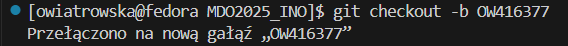

## **4. Praca na nowej gałęzi**

### Utworzenie nowego katalogu
Utworzyłam katalog, także o nazwie składającej się z moich inicjałów i numeru indeksu:


### Napisanie Git hooka
Napisałam hooka `commit-msg`, weryfikującego to, aby każdy mój "commit message" zaczynał się od moich inicjałów i numeru indeksu.

Plik `commit-msg`:

```bash
#!/bin/bash

EXPECTED_PREFIX="OW416377"
COMMIT_MSG_FILE="$1"
COMMIT_MSG=$(head -n 1 "$COMMIT_MSG_FILE")

if [[ ! "$COMMIT_MSG" =~ ^$EXPECTED_PREFIX ]]; then
  echo "❌ Błąd: Każdy commit message musi zaczynać się od \"$EXPECTED_PREFIX\""
  exit 1
fi

exit 0
```
Utworzony skrypt znajduje się w utworzonym wcześniej katalogu.


Następnie skopiowałam go do katalogu `.git/hooks/`:

```bash
cp commit-msg ../../../.git/hooks/
```

Oraz dodałam uprawnienia do uruchamiania:

```bash
chmod +x ../../../.git/hooks/commit-msg
```

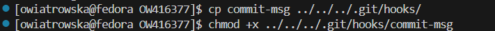

### Sprawdzenie działania hooka

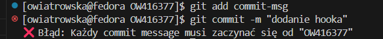

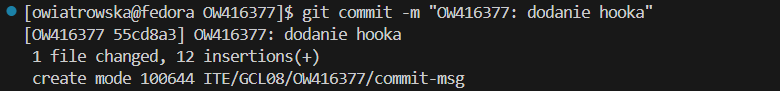

### Wysłanie zmian do zdalnego źródła

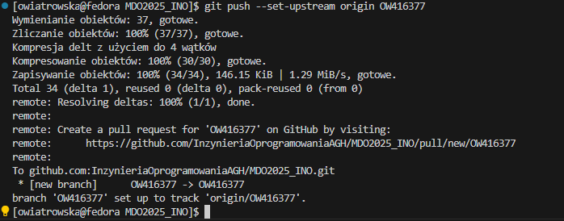

### Próba wyciągnięcia swojej gałęzi do gałęzi grupowej

```bash
git checkout GCL08
git merge OW416377
git push origin OW416377
```
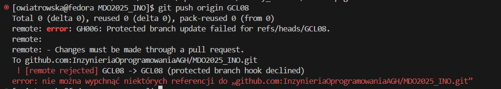

---


## **Laboratorium 02**

### **Git, Docker**


---

## **1. Instalacja dockera**

```bash
sudo dnf install -y docker
```

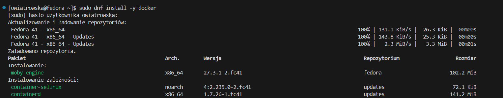
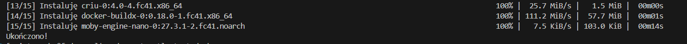

### Uruchomienie Dockera oraz sprawdzenie, czy działa

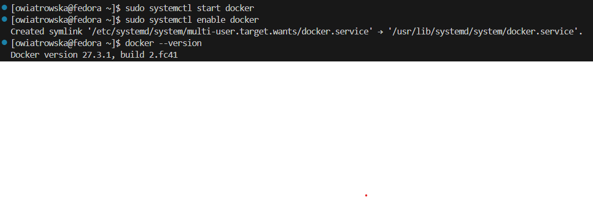


## **2. Rejestracja w Docker Hub **
Zarejestrowałam się w Docker Hub poprzez konto na Githubie, a następnie zalogowałam się w terminalu.

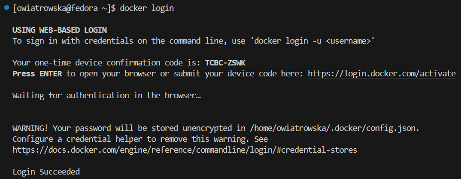


## **3. Pobranie odpowiednich obrazów**

```bash
sudo docker pull hello-world
sudo docker pull busybox
sudo docker pull ubuntu
sudo docker pull fedora
sudo docker pull mysql
```
Sprawdzenie czy obrazy zostały pobrane:

```bash
sudo docker images
```

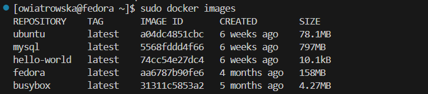

## **4. Uruchomienie kontenera z obrazu busybox**

### Uruchomienie kontenera i sprawdzenie czy działa

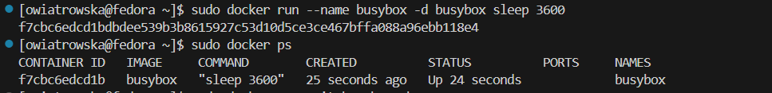

### Interaktywne podłączenie się do kontenera

```bash
sudo docker exec -it busybox sh
```
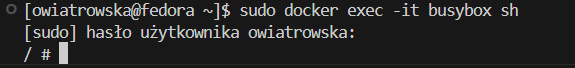

### Wywołanie numeru wersji

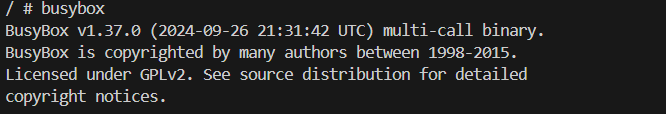

## **5. Uruchomienie "systemu w kontenerze" (ubuntu)**

### Uruchomienie kontenera Ubuntu i sprawdzenie, czy działa

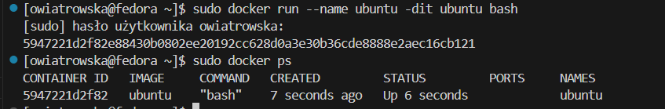

### Sprawdzenie PID1 w kontenerze

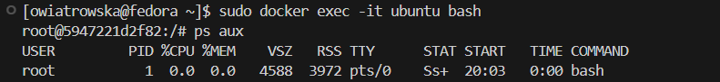

### Sprawdzenie procesów dockera na hoście

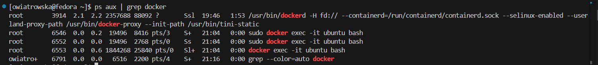

### Aktualizacja pakietów

```bash
apt update && apt upgrade -y
```

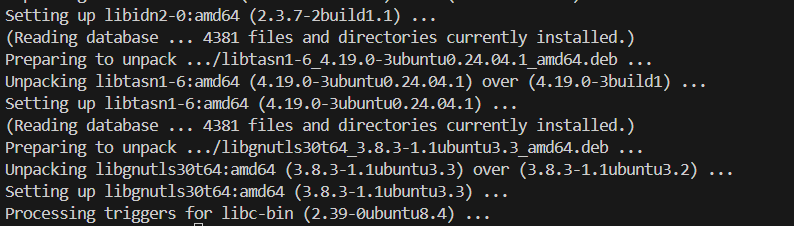

## **6. Stworzenie własnego Dockerfile**

### Tworzenie pliku Dockerfile

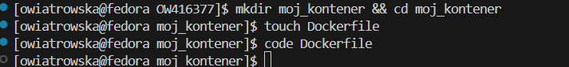

plik `Dockerfile`:

```bash
FROM ubuntu:latest

LABEL maintainer="Oliwia Wiatrowska"

RUN apt update && apt install -y git && rm -rf /var/lib/apt/lists/*

WORKDIR /app

RUN git clone https://github.com/InzynieriaOprogramowaniaAGH/MDO2025_INO

CMD ["bash"]
```

### Budowanie obrazu Dockera

```bash
sudo docker build -t moj_obraz .
```
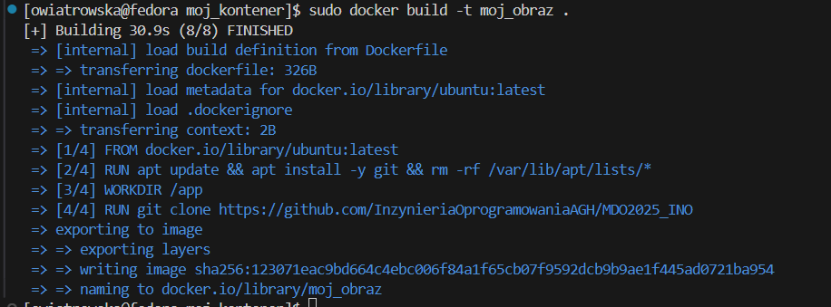

### Sprawdzenie, czy `moj_obraz` został zbudowany

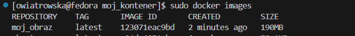

### Uruchomienie kontenera

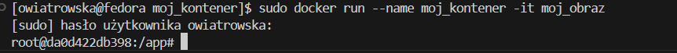

### Sprawdzenie, czy repozytorium zostało sklonowane

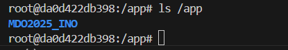

### Sprawdzenie czy Git działa

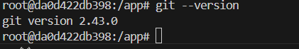

## **7. Wyświetlenie uruchomionych (!= "działających") kontenerów i usunięcie ich**

### Wyświetlenie kontenerów

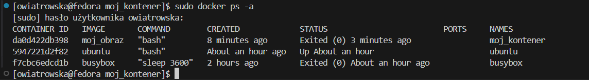

### Usunięcie kontenerów

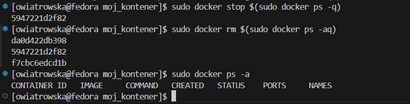

## **8. Wyczyszczenie obrazów**

### Wyświetlenie obrazów

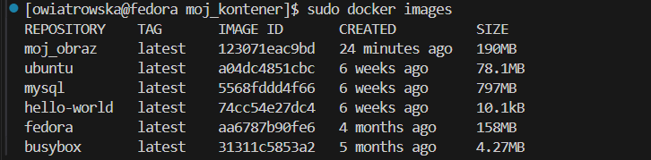

### Usunięcie obrazów

```bash
sudo docker rmi $(sudo docker images -q)
```
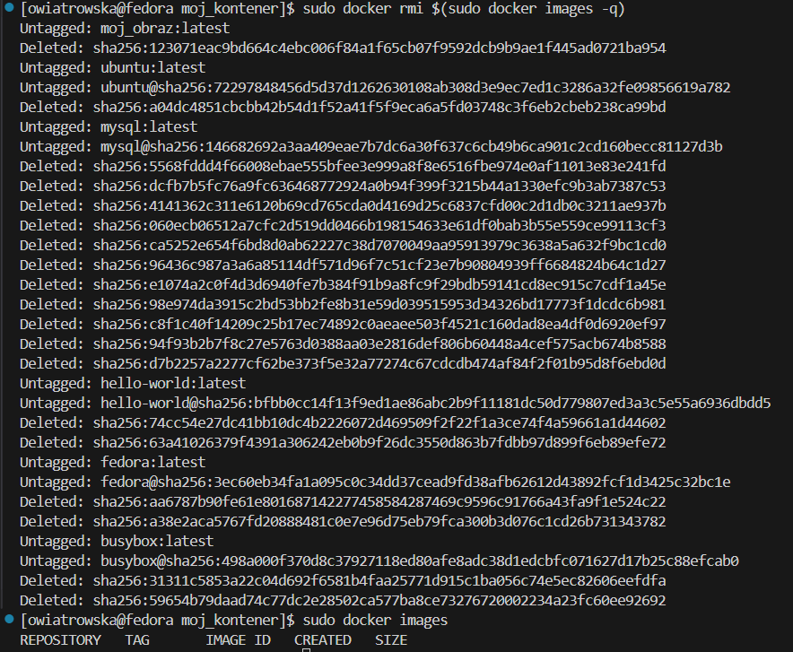

## **9. Dodanie pliku `Dockerfile` do folderu `sprawozdanie1`**

```bash
cp ~/MDO2025_INO/ITE/GCL08/OW416377/moj_kontener/Dockerfile ~/MDO2025_INO/ITE/GCL08/OW416377/sprawozdanie1/
```
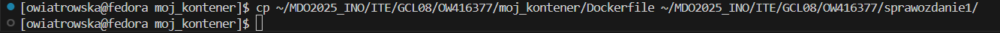

---


## **Laboratorium 03**

### **Dockerfiles, kontener jako definicja etapu**


---

## **1. Wybór oprogramowania na zajęcia**

### Wybór repozytorium do sklonowania
Wybrałam: https://github.com/devenes/node-js-dummy-test

### Klonowanie repozytorium i przeprowadzenie buildu programu
Sklonowałam repozytorium i przeszłam do katalogu `node-js-dummy-test`
```bash
git clone https://github.com/devenes/node-js-dummy-test
cd node-js-dummy-test/
```
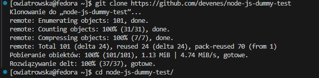

Nastepnie doinstalowałam wymagane zależności.

```bash
sudo dnf install nodejs
sudo npm install
```


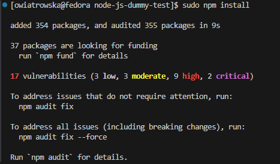

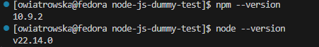

### Uruchomienie testów jednostkowych
Uruchomiłam testy jednostkowe:

```bash
npm test
```
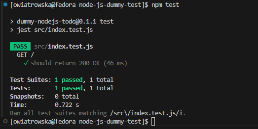


## **2. Przeprowadzenie buildu w kontenerze **

### **2.1. Wykonanie build i test wewnątrz kontenera **

### Uruchomienie kontenera w trybie interaktywnym
Wybrałam obraz `Node.js 22.14.0`, ponieważ aplikacja napisana jest w Node.js i wymaga `npm` do instalacji zależności oraz uruchomienia testów.

```bash
sudo docker run -it --rm node:22.14.0 bash
```
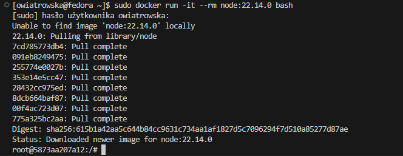

### Sklonowanie repozytorium
Sklonowałam repozytorium w kontenerze i przeszłam do katalogu `node-js-dummy-test`
```bash
git clone https://github.com/devenes/node-js-dummy-test
cd node-js-dummy-test/
```
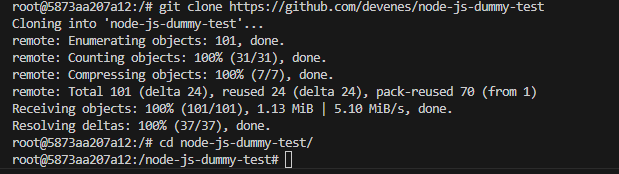

### Skonfigurowanie środowiska oraz uruchomienie build
W projekcie nie ma osobnego kroku "build", ale konieczna jest instalacja zależności.

```bash
npm install
```
Powyższe polecenie pobrało i zainstalowało wszystkie wymagane biblioteki.
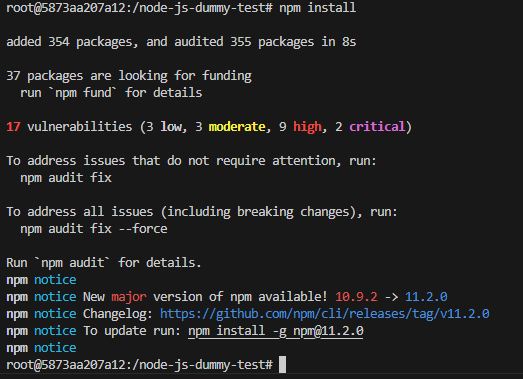 

### Uruchomienie testów
Testy uruchomiłam za pomocą:
```bash
npm test
```
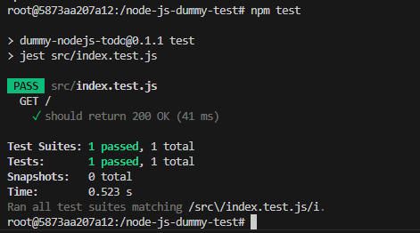

Wynik testu potwierdza poprawność działania aplikacji.

### **2.2. Stworzenie dwóch plików Dockerfile - **
Utworzone pliki mają za zadanie zautomatyzować wyżej wymienione kroki.

### Utworzenie pliku `Dockerfile.build`
Plik `Dockerfile.build` ma za zadanie przeprowadzać wszystkie kroki aż do builda - przygotować środowisko, 
pobrać kod źródłowy, zainstalować zależności i przeprowadzić build aplikacji.

```bash
FROM node:22.14.0
RUN git clone https://github.com/devenes/node-js-dummy-test
WORKDIR /node-js-dummy-test
RUN npm install
```
### Budowanie kontenera buildowego

```bash
sudo docker build -t bld -f ./Dockerfile.build .
```
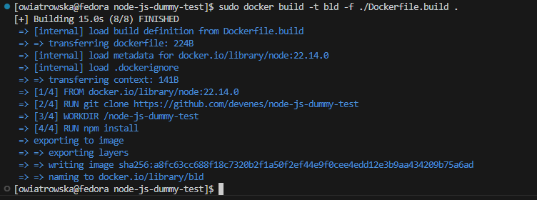


### Utworzenie pliku `Dockerfile.test`
Plik `Dockerfile.test` bazuje na obrazie `Dockerfile.build` i odpowiada za uruchomienie testów.

```bash
FROM bld
RUN npm test
```

### Budowanie kontenera testowego

```bash
docker build -t test -f ./Dockerfile.test .
```
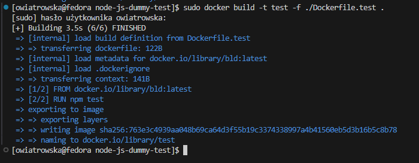

### **2.3. Wykazanie poprawnego działania kontenera **

### Pokazanie poprawnego zbudowania obrazów - wyświetlenie listy dostępnych obrazów

```bash
sudo docker images
```


### **Sprawdzenie działania kontenerów**

### Kontener budujący
Do wykazania poprawnej instalacji zależności w kontenerze uruchomiłam go w trybie interaktywnym oraz sprawdziłam, czy katalog `node_modules` został uwtworzony.

```bash
sudo docker run -it --rm bld bash
ls -l node_modules
```

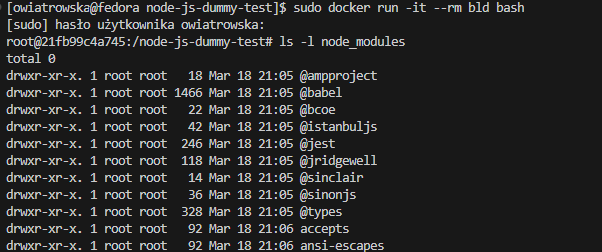

### Kontener testowy
Do zweryfikowania poprawności działania testów w kontenerze, uruchomiłam kontener testowy w trybie interaktywnym i ręcznie wykonałam testy.

```bash
sudo docker run -it --rm test bash
npm test
```


### Kontener a obraz
Obraz `app-build` przechowuje kod źródłowy i skompilowaną aplikację, natomiast kontener `app-build` uruchomiony na bazie tego obrazu
wykonuje build.
Obraz `app-test` dziedziczy wszystko od `app-build`, ale dodaje krok uruchomienia testów, natomiast kontener `app-test` wykonuje testy i kończy pracę.