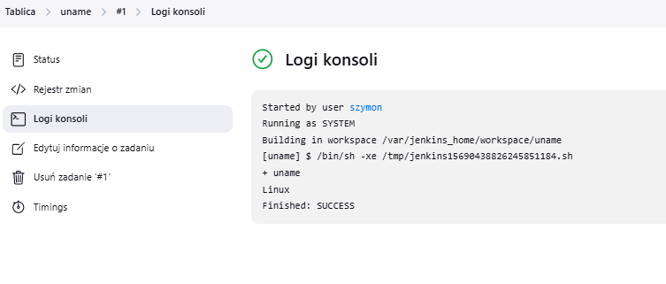

# LAB05

## Kontenery z poprzednich zajęć

## Kontener docker dind


## Dockerfile jenkinsa
```
FROM jenkins/jenkins:2.492.2-jdk17
USER root
RUN apt-get update && apt-get install -y lsb-release ca-certificates curl && \
    install -m 0755 -d /etc/apt/keyrings && \
    curl -fsSL https://download.docker.com/linux/debian/gpg -o /etc/apt/keyrings/docker.asc && \
    chmod a+r /etc/apt/keyrings/docker.asc && \
    echo "deb [arch=$(dpkg --print-architecture) signed-by=/etc/apt/keyrings/docker.asc] \
    https://download.docker.com/linux/debian $(. /etc/os-release && echo \"$VERSION_CODENAME\") stable" \
    | tee /etc/apt/sources.list.d/docker.list > /dev/null && \
    apt-get update && apt-get install -y docker-ce-cli && \
    apt-get clean && rm -rf /var/lib/apt/lists/*
USER jenkins
RUN jenkins-plugin-cli --plugins "blueocean docker-workflow"
```
## Build z dockerfile'a


## Odpalenie kontenera myjenkins


## Uruchomienie jenkinsa w przeglądarce


Należy wprowadzić hasło z podanego pliku, zapisane na kontenerze

## Instalacja wtyczek


## Tworzenie konta administratora 


## Jenkins działa


## Stworz projekt, dodaj krok do budowania


## Uruchomienie projektu 

  
Linux - prawidłowy print

## Skrypt do sprawdzania godziny
```bash
#!/bin/bash
current_hour=$(date +"%H")
if (( current_hour % 2 != 0 )); then
  echo "Błąd: Aktualna godzina ($current_hour) jest nieparzysta."
  exit 1
else
  echo "Sukces: Aktualna godzina ($current_hour) jest parzysta."
fi
```


## Skrypt do docker pull
```bash
#!/bin/bash
docker pull ubuntu

if [ $? -eq 0 ]; then
  echo "Sukces: Obraz kontenera 'ubuntu' został pobrany."
else
  echo "Błąd: Nie udało się pobrać obrazu kontenera 'ubuntu'."
  exit 1
fi
```


## pipeline
```bash
pipeline {
    agent any

    stages {
        stage('Wyszyść repo') {
            steps {
                cleanWs()
            }
        }
        
        stage('Zklonuj repo') {
            steps {
                git url: 'https://github.com/InzynieriaOprogramowaniaAGH/MDO2025_INO.git', branch: 'main'
            }
        }
        
        stage('Checkout Brancha SN415513') {
            steps {
                sh 'git checkout SN415513'
            }
        }
        
        stage('usun obrazy dockerowe') {
            steps {
                sh 'docker rmi -f weechat-build weechat-test'
            }
        }
        
        stage('Wyszysc cache') {
            steps {
                sh 'docker builder prune -a -f'
            }
        }
        
        stage('Budowanie obrazu do budowania') {
            steps {
                dir('ITE/GCL08/SN415513/Sprawozdanie1/lab3') {
                    sh 'docker build -t weechat-build -f Dockerfile.build .'
                }
            }
        }
        
        stage('Budowanie obrazu do testowania') {
            steps {
                dir('ITE/GCL08/SN415513/Sprawozdanie1/lab3') {
                    sh 'docker build -t weechat-test -f Dockerfile.test .'
                }
            }
        }
    }
}
```
## Budowanie obrazu


## Końcowy sukces


## Deploy

## Pipeline from SCM

## Jenkinsfile

Jenkinsfile - tak samo jak powyżej  
Ścieżka: ITE/GCL08/SN415513/Sprawozdanie2/Jenkinsfile

## Dokcerfile test

Aktualizacja o wypisanie wersji
```
FROM weechat-build

WORKDIR /app/weechat/build

RUN ctest -V

RUN weechat -version
```

## Pomyślne przejście pipeline-u i wyświetlenie wersji


## Publish

## Uzyskanie runtime deps komendą ldd


## Utworzenie pliku .deb


## Archive artifacts