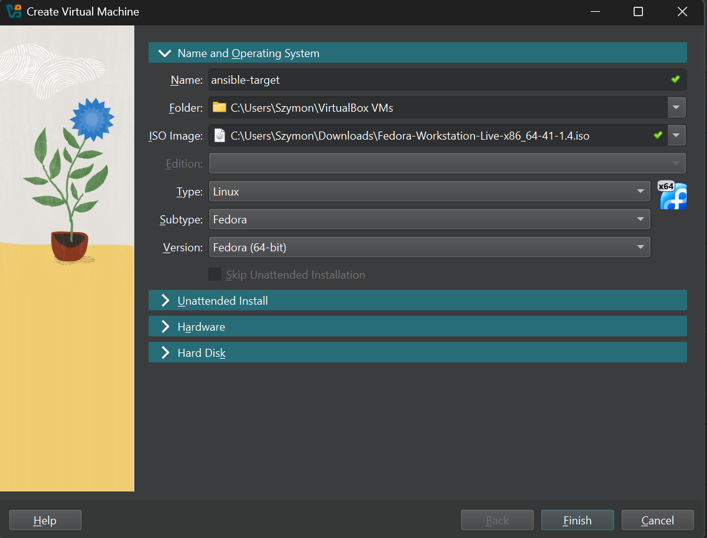
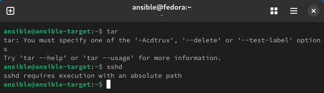
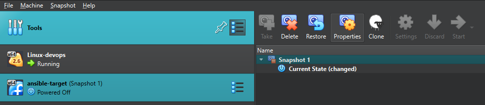
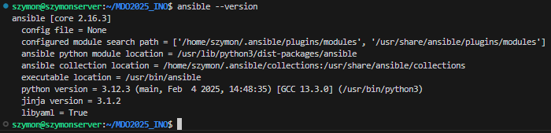
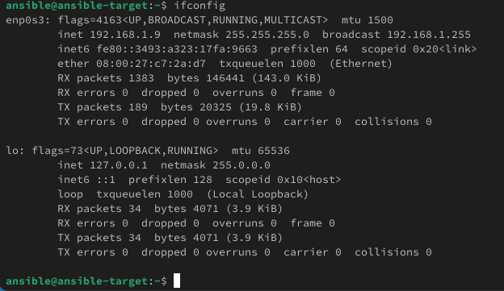
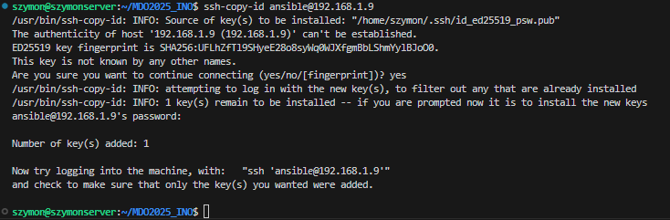
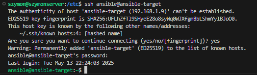

# LAB08

## Utworzenie maszyny

## Nadanie nazwy użytkownika, hosta, oraz sprawdzenie działania sshd i tar

## Migawka maszyny i eksport

## Instalacja ansible a gównej maszynie

## Postawienie polaczenia ssh

### Sprawdzenie adresu ip

### Skopiowanie (już istniejących kluczy) na ansible-target

### Połączenie się z głównej maszyny do targetu

### Zezwolenie na logowanie bez hasła na configu fedory 

  
### Inwentaryzacja
* 🌵 Dokonaj inwentaryzacji systemów
  * Ustal przewidywalne nazwy komputerów (maszyn wirtualnych) stosując `hostnamectl`, Unikaj `localhost`.
  * Wprowadź nazwy DNS dla maszyn wirtualnych, stosując `systemd-resolved` lub `resolv.conf` i `/etc/hosts` - tak, aby możliwe było wywoływanie komputerów za pomocą nazw, a nie tylko adresów IP
  * Zweryfikuj łączność
  * Stwórz [plik inwentaryzacji](https://docs.ansible.com/ansible/latest/getting_started/get_started_inventory.html)
  * Umieść w nim sekcje `Orchestrators` oraz `Endpoints`. Umieść nazwy maszyn wirtualnych w odpowiednich sekcjach
  * 🌵 Wyślij żądanie `ping` do wszystkich maszyn
* Zapewnij łączność między maszynami
  * Użyj co najmniej dwóch maszyn wirtualnych (optymalnie: trzech)
  * Dokonaj wymiany kluczy między maszyną-dyrygentem, a końcówkami (`ssh-copy-id`)
  * Upewnij się, że łączność SSH między maszynami jest możliwa i nie potrzebuje haseł
  
### Zdalne wywoływanie procedur
Za pomocą [*playbooka*](https://docs.ansible.com/ansible/latest/getting_started/get_started_playbook.html) Ansible:
  * 🌵 Wyślij żądanie `ping` do wszystkich maszyn
  * Skopiuj plik inwentaryzacji na maszyny/ę `Endpoints`
  * Ponów operację, porównaj różnice w wyjściu
  * Zaktualizuj pakiety w systemie (⚠️ [uwaga!](https://github.com/ansible/ansible/issues/84634) )
  * Zrestartuj usługi `sshd` i `rngd`
  * Przeprowadź operacje względem maszyny z wyłączonym serwerem SSH, odpiętą kartą sieciową
  
### Zarządzanie stworzonym artefaktem
Za pomocą [*playbooka*](https://docs.ansible.com/ansible/latest/getting_started/get_started_playbook.html) Ansible:

* Jeżeli artefaktem z Twojego *pipeline'u* był kontener:
  * Zbuduj i uruchom kontener sekcji `Deploy` z poprzednich zajęć
  * Pobierz z Docker Hub aplikację "opublikowaną" w ramach kroku `Publish`
  * Na maszynie docelowej, **Dockera zainstaluj Ansiblem!**
  * Zweryfikuj łączność z kontenerem
  * Zatrzymaj i usuń kontener

* Jeżeli artefaktem z Twojego *pipeline'u* był plik binarny (lub ich zestaw):
  * Wyślij plik aplikacji na zdalną maszynę
  * Stwórz kontener przeznaczony do uruchomienia aplikacji (zaopatrzony w zależności)
  * Umieść/udostępnij plik w kontenerze, uruchom w nim aplikację
  * Zweryfikuj poprawne uruchomienie (a nie tylko wykonanie *playbooka*)
    
Ubierz powyższe kroki w [*rolę*](https://docs.ansible.com/ansible/latest/playbook_guide/playbooks_reuse_roles.html), za pomocą szkieletowania `ansible-galaxy`