# LAB08

## Utworzenie maszyny


## Nadanie nazwy użytkownika, hosta, oraz sprawdzenie działania sshd i tar


## Migawka maszyny i eksport


## Instalacja ansible a gównej maszynie


## Postawienie polaczenia ssh (ubuntu main -> ansible_target)

### Sprawdzenie adresu ip


### Skopiowanie (już istniejących kluczy) na ansible-target


### Połączenie się z głównej maszyny do targetu


### Zezwolenie na logowanie bez hasła na configu fedory 

  
## ustalenie nazw za pomocą hostnamectl


## Postawienie polaczenia ssh (ansible_target -> ubuntu_main)

### #Zapisanie ubuntu_main w /etc/hosts na ansible target


### Zmiana configu ssh (/etc/ssh/sshd_config - na ubuntu_main)


### Usunięcie hasła


### Testowe połączenie niewymahgające wspisywania hasła


## Utworzenie pliku .ini, uzupełnienie i ping

```
[Orchestrators]
ubuntu_main  ansible_user=szymon

[Endpoints]
ansible-target ansible_user=ansible
```
## Playbook - procedury

### plik .yml
```
- name: Ping all hosts
  hosts: all
  gather_facts: no
  tasks:
    - name: Ping
      ansible.builtin.ping:

- name: Copy inventory file to Endpoints
  hosts: Endpoints
  gather_facts: no
  tasks:
    - name: Copy inventory file
      ansible.builtin.copy:
        src: inventory.ini
        dest: /tmp/inventory.ini

- name: Ping again to compare output
  hosts: all
  gather_facts: no
  tasks:
    - name: Ping after copy
      ansible.builtin.ping:

- name: Restart services on Fedora Endpoints
  hosts: Endpoints
  gather_facts: no
  tasks:
    - name: Restart sshd service
      ansible.builtin.service:
        name: sshd
        state: restarted
      ignore_errors: yes

    - name: Restart rngd service
      ansible.builtin.service:
        name: rngd
        state: restarted
      ignore_errors: yes
```
### 

  
## Zarządzanie stworzonym artefaktem
 
Plik deploy_deb.yml definiujący instrukcje:
```
---
- name: Deploy binary in Docker container
  hosts: Endpoints
  become: yes
  vars:
    binary_file: "mypkg/usr/local/bin/weechat"
    deb_file: "weechat.deb"
    dest_dir: "/opt/weechat"        
    image_name: "ubuntu:22.04"
    container_name: "weechat_container"

  tasks:
    - name: Ensure Docker is installed
      become: true
      command: dnf install -y docker
      args:
        creates: /usr/bin/docker

    - name: Start Docker service
      ansible.builtin.service:
        name: docker
        state: started
        enabled: yes

    - name: Create directory on target host
      ansible.builtin.file:
        path: "{{ dest_dir }}"
        state: directory
        mode: '0755'

    - name: Copy binary to target host
      ansible.builtin.copy:
        src: "{{ binary_file }}"
        dest: "{{ dest_dir }}/weechat"
        mode: '0755'

    - name: Copy .deb file to target host
      ansible.builtin.copy:
        src: "{{ deb_file }}"
        dest: "{{ dest_dir }}/weechat.deb"
        mode: '0644'

    - name: Run container with mounted binary and install dependencies
      community.docker.docker_container:
        name: "{{ container_name }}"
        image: "{{ image_name }}"
        state: started
        volumes:
          - "{{ dest_dir }}:/weechat"
        command: >
          bash -c "apt update && apt install -y /weechat/weechat.deb && /weechat/weechat"
        command: sleep infinity
        tty: true
        detach: true
```

### Pomyśle wykonanie wszystkich kroków:
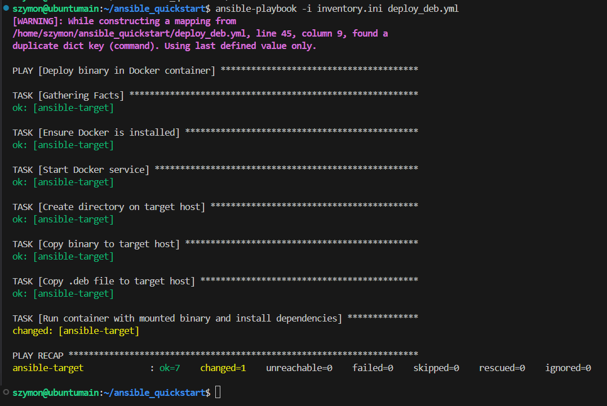

### Weryfikacja poprawności załączenia voluminu na kontener i działania aplikacji
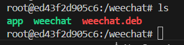
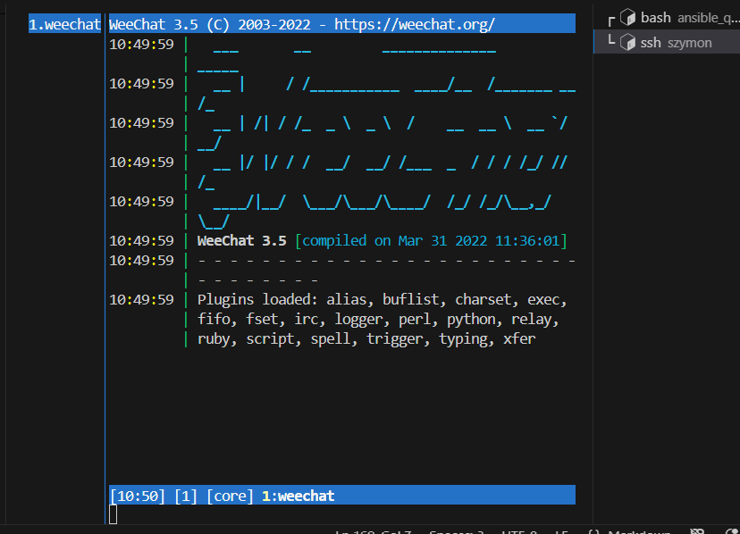

# Zajęcia 09

## Plik odpowiedzi z systemu fedora
```
# Generated by Anaconda 41.35
# Generated by pykickstart v3.58
#version=DEVEL

# Keyboard layouts
keyboard --vckeymap=us --xlayouts='us'
# System language
lang en_US.UTF-8

# Run the Setup Agent on first boot
firstboot --enable

# Generated using Blivet version 3.11.0
ignoredisk --only-use=sda
autopart
# Partition clearing information
clearpart --none --initlabel

# System timezone
timezone Europe/Warsaw --utc

#Root password
rootpw --lock

# Ustawienie hosta
network --hostname=fedora41-host
```
## Instalacja systemu z użyciem pliku odpowiedzi
Zmodyfikowano plik odpowiedzi:
```
# Generated by Anaconda 41.35
# Generated by pykickstart v3.58
#version=DEVEL

url --mirrorlist=http://mirrors.fedoraproject.org/mirrorlist?repo=fedora-41&arch=x86_64
repo --name="updates" --mirrorlist=http://mirrors.fedoraproject.org/mirrorlist?repo=updates-released-f41&arch=x86_64

# Keyboard layouts
keyboard --vckeymap=us --xlayouts='us'
# System language
lang en_US.UTF-8

# Ustawienie hosta
network --hostname=fedora41-host

# Run the Setup Agent on first boot
firstboot --enable

# Generated using Blivet version 3.11.0
ignoredisk --only-use=sda
autopart --type=lvm
# Partition clearing information
clearpart --all --initlabel

# System timezone
timezone Europe/Warsaw --utc

#Root password
rootpw --lock

user --groups=wheel --name=szymon --password=szymon --plaintext --gecos="Szymon Nowak"

reboot

```

### Podczas instalacji podano link do pliku w wersji raw umieszczonego na przedmiotowym repozytorium
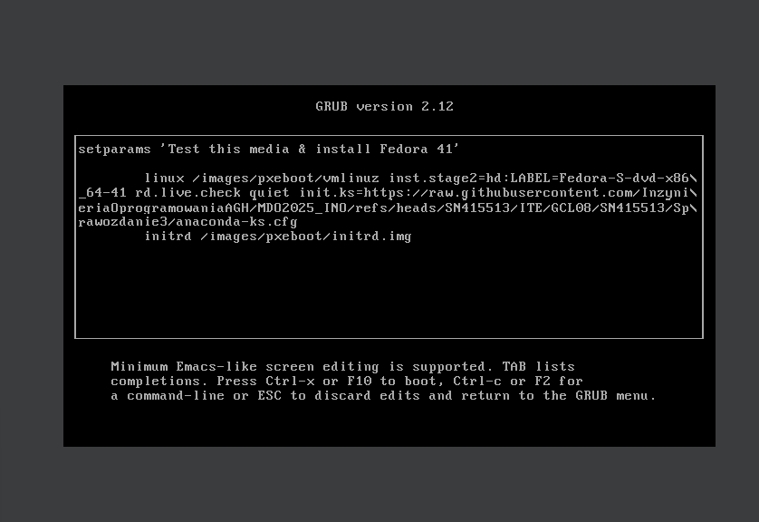

### Terminal po instalacji - operacje z pliku odpowiedzi zostały wdrożone
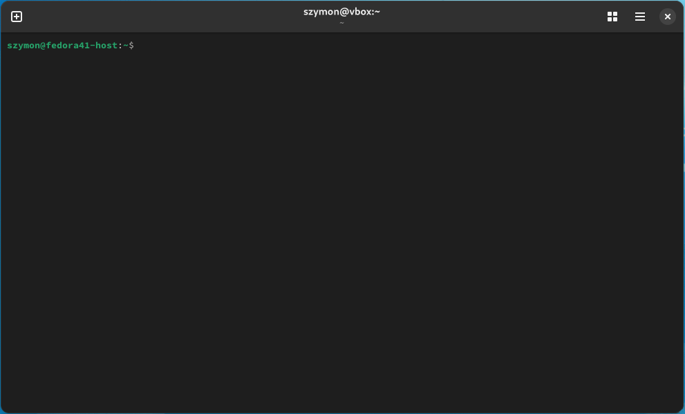


## Plik odpowiedzi rozszerzono o sekcje:
```
%packages
@core
wget
curl
docker
%end

%post --log=/root/ks-post.log

systemctl enable docker.service

cat << 'EOF' > /usr/local/sbin/run-my-app-container.sh
#!/bin/bash

IMAGE="szymonnowaq/weechat:latest"
CONTAINER="weechat"

sleep 5

if ! docker pull $IMAGE; then
    exit 1
fi

if ! docker run -d --name $CONTAINER --restart=unless-stopped $IMAGE; then
    exit 1
fi

EOF

chmod +x /usr/local/sbin/run-my-app-container.sh

cat << 'EOF' > /etc/systemd/system/run-my-app-container.service
[Unit]
Description=Pull and run my application container
Requires=docker.service
After=network-online.target docker.service

[Service]
Type=oneshot
RemainAfterExit=yes
ExecStart=/usr/local/sbin/run-my-app-container.sh

[Install]
WantedBy=multi-user.target
EOF

systemctl daemon-reload
systemctl enable run-my-app-container.service

# --- Koniec konfiguracji Docker ---

%end
```
- Pobrano odpowiednie paczki (np docker)
- pobrano obraz z aplikacją wrzucony na docker hub-a
- uruchomiono kontener

### Po ponownej instalacji systemu z nowego pliku odpowiedzi uzyskano działający kontener
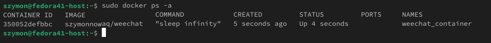

### Podłączenie się do kontenera
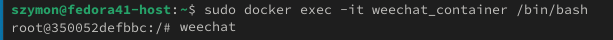

### Uruchomienie aplikacji w kontenerze
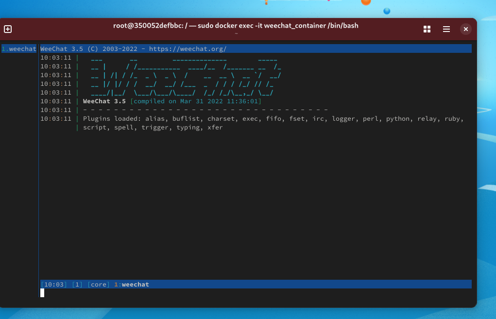


# Kubernetes

## Instalacje minikube
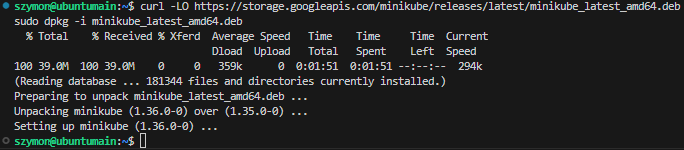

## Uruchomienie klastra
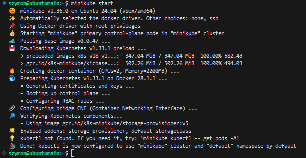
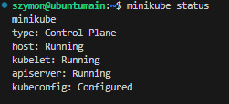

## Zaopatrzenie sie w polecenie kubectl
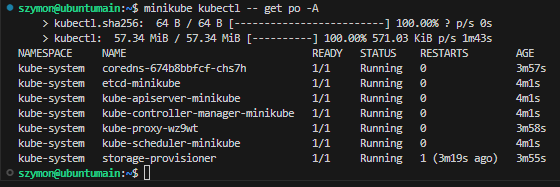
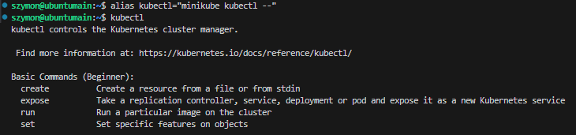

## Dashboard
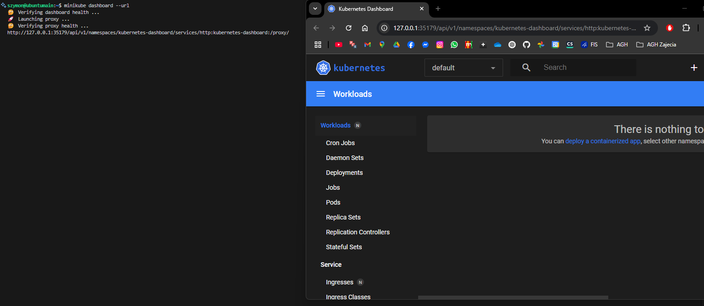

## Zpullowanie kontenera z poprzednich zajęć
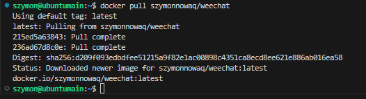

## Utworzenie pod-a
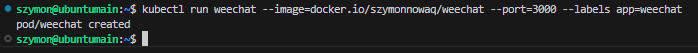

## Status poda
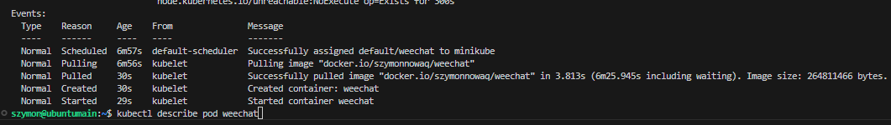
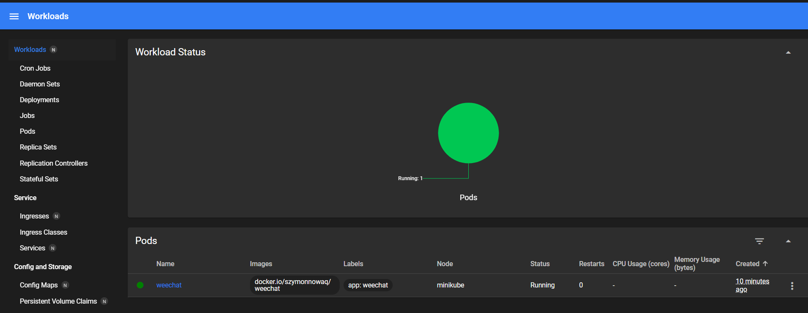

## Zhostowanie czegokoliwek na port 3000 w kontenerze
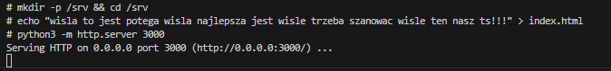

## Port forwarding kontenera
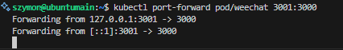

## Działa
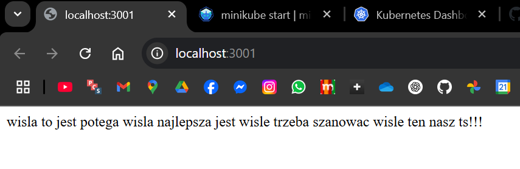
 
## Stworzenie deploymentu
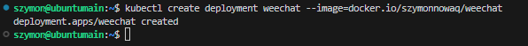
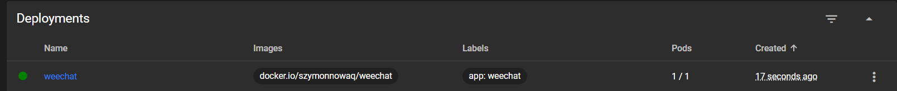

## Forwarding, sprawdzenie dzialania
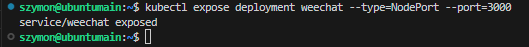
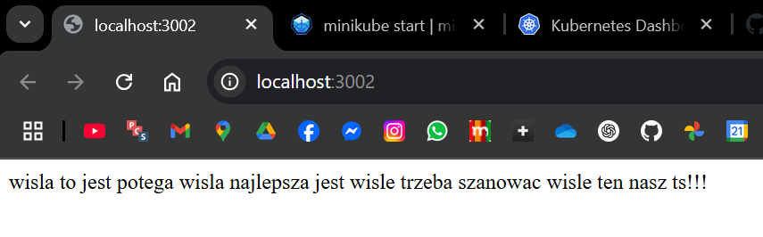

## Skalowanie 
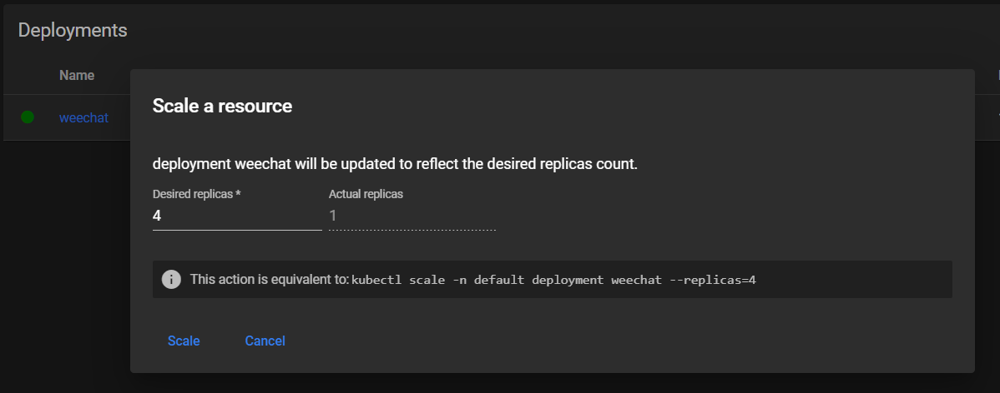
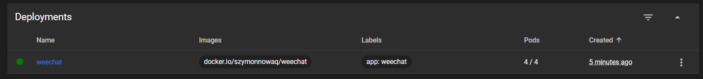

## yaml
```
kind: Deployment
apiVersion: apps/v1
metadata:
  name: weechat
  namespace: default
  uid: 569dcc86-e57c-4712-91d1-ef534bc0c9df
  resourceVersion: '4316'
  generation: 2
  creationTimestamp: '2025-05-27T10:15:59Z'
  labels:
    app: weechat
  annotations:
    deployment.kubernetes.io/revision: '1'
  managedFields:
    - manager: dashboard
      operation: Update
      apiVersion: apps/v1
      fieldsType: FieldsV1
      fieldsV1:
        f:spec:
          f:replicas: {}
      subresource: scale
    - manager: kubectl-create
      operation: Update
      apiVersion: apps/v1
      time: '2025-05-27T10:15:59Z'
      fieldsType: FieldsV1
      fieldsV1:
        f:metadata:
          f:labels:
            .: {}
            f:app: {}
        f:spec:
          f:progressDeadlineSeconds: {}
          f:revisionHistoryLimit: {}
          f:selector: {}
          f:strategy:
            f:rollingUpdate:
              .: {}
              f:maxSurge: {}
              f:maxUnavailable: {}
            f:type: {}
          f:template:
            f:metadata:
              f:labels:
                .: {}
                f:app: {}
            f:spec:
              f:containers:
                k:{"name":"weechat"}:
                  .: {}
                  f:image: {}
                  f:imagePullPolicy: {}
                  f:name: {}
                  f:resources: {}
                  f:terminationMessagePath: {}
                  f:terminationMessagePolicy: {}
              f:dnsPolicy: {}
              f:restartPolicy: {}
              f:schedulerName: {}
              f:securityContext: {}
              f:terminationGracePeriodSeconds: {}
    - manager: kube-controller-manager
      operation: Update
      apiVersion: apps/v1
      time: '2025-05-27T10:21:05Z'
      fieldsType: FieldsV1
      fieldsV1:
        f:metadata:
          f:annotations:
            .: {}
            f:deployment.kubernetes.io/revision: {}
        f:status:
          f:availableReplicas: {}
          f:conditions:
            .: {}
            k:{"type":"Available"}:
              .: {}
              f:lastTransitionTime: {}
              f:lastUpdateTime: {}
              f:message: {}
              f:reason: {}
              f:status: {}
              f:type: {}
            k:{"type":"Progressing"}:
              .: {}
              f:lastTransitionTime: {}
              f:lastUpdateTime: {}
              f:message: {}
              f:reason: {}
              f:status: {}
              f:type: {}
          f:observedGeneration: {}
          f:readyReplicas: {}
          f:replicas: {}
          f:updatedReplicas: {}
      subresource: status
spec:
  replicas: 4
  selector:
    matchLabels:
      app: weechat
  template:
    metadata:
      creationTimestamp: null
      labels:
        app: weechat
    spec:
      containers:
        - name: weechat
          image: docker.io/szymonnowaq/weechat
          resources: {}
          terminationMessagePath: /dev/termination-log
          terminationMessagePolicy: File
          imagePullPolicy: Always
      restartPolicy: Always
      terminationGracePeriodSeconds: 30
      dnsPolicy: ClusterFirst
      securityContext: {}
      schedulerName: default-scheduler
  strategy:
    type: RollingUpdate
    rollingUpdate:
      maxUnavailable: 25%
      maxSurge: 25%
  revisionHistoryLimit: 10
  progressDeadlineSeconds: 600
status:
  observedGeneration: 2
  replicas: 4
  updatedReplicas: 4
  readyReplicas: 4
  availableReplicas: 4
  conditions:
    - type: Progressing
      status: 'True'
      lastUpdateTime: '2025-05-27T10:16:06Z'
      lastTransitionTime: '2025-05-27T10:15:59Z'
      reason: NewReplicaSetAvailable
      message: ReplicaSet "weechat-6ff99d47db" has successfully progressed.
    - type: Available
      status: 'True'
      lastUpdateTime: '2025-05-27T10:21:02Z'
      lastTransitionTime: '2025-05-27T10:21:02Z'
      reason: MinimumReplicasAvailable
      message: Deployment has minimum availability.

```
## Apply
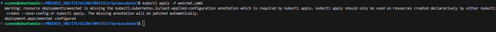

## Rollout
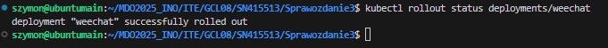


# Zajęcia 11

# Wdrażanie na zarządzalne kontenery: Kubernetes (2)

## Zadania do wykonania

### Przygotowanie nowego obrazu
 * Zarejestruj nową wersję swojego obrazu `Deploy` (w Docker Hub lub lokalnie+przeniesienie)
 * Upewnij się, że dostępne są dwie co najmniej wersje obrazu z wybranym programem
 * Jeżeli potrzebny jest "gotowiec" z powodu problemów z `Deploy`, można użyć np `httpd`, ale powinien to być **własny** kontener: zmodyfikowany względem oryginału i opublikowany na własnym koncie Docker Hub.
 * Będzie to wymagać 
   * przejścia przez *pipeline* dwukrotnie, lub
   * ręcznego zbudowania dwóch wersji, lub
   * przepakowania wybranego obrazu samodzielnie np przez ```commit```
 * Przygotuj kolejną wersję obrazu, którego uruchomienie kończy się błędem
  
### Zmiany w deploymencie
 * 🌵 Aktualizuj plik YAML z wdrożeniem i przeprowadzaj je ponownie po zastosowaniu następujących zmian:
   * zwiększenie replik np. do 8
   * zmniejszenie liczby replik do 1
   * zmniejszenie liczby replik do 0
   * ponowne przeskalowanie w górę do 4 replik (co najmniej)
   * Zastosowanie nowej wersji obrazu
   * Zastosowanie starszej wersji obrazu
   * Zastosowanie "wadliwego" obrazu
 * Przywracaj poprzednie wersje wdrożeń za pomocą poleceń
   * ```kubectl rollout history```
   * ```kubectl rollout undo```

### Kontrola wdrożenia
 * Zidentyfikuj historię wdrożenia i zapisane w niej problemy, skoreluj je z wykonywanymi czynnościami
 * Napisz skrypt weryfikujący, czy wdrożenie "zdążyło" się wdrożyć (60 sekund)
 * Zakres rozszerzony: Ujmij skrypt w pipeline Jenkins (o ile `minikube` jest dostępny z zewnątrz)
 
### Strategie wdrożenia
 * Przygotuj wersje [wdrożeń](https://kubernetes.io/docs/concepts/workloads/controllers/deployment/) stosujące następujące strategie wdrożeń
   * Recreate
   * Rolling Update (z parametrami `maxUnavailable` > 1, `maxSurge` > 20%)
   * Canary Deployment workload
 * Zaobserwuj i opisz różnice
 * Uzyj etykiet
 * Dla wdrożeń z wieloma replikami, używaj [serwisów](https://kubernetes.io/docs/concepts/services-networking/service/)
 