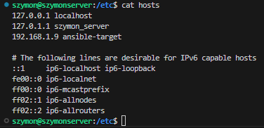

# LAB08

## Utworzenie maszyny


## Nadanie nazwy użytkownika, hosta, oraz sprawdzenie działania sshd i tar


## Migawka maszyny i eksport


## Instalacja ansible a gównej maszynie


## Postawienie polaczenia ssh (ubuntu main -> ansible_target)

### Sprawdzenie adresu ip


### Skopiowanie (już istniejących kluczy) na ansible-target


### Połączenie się z głównej maszyny do targetu


### Zezwolenie na logowanie bez hasła na configu fedory 

  
## ustalenie nazw za pomocą hostnamectl


## Postawienie polaczenia ssh (ansible_target -> ubuntu_main)

### #Zapisanie ubuntu_main w /etc/hosts na ansible target


### Zmiana configu ssh (/etc/ssh/sshd_config - na ubuntu_main)


### Usunięcie hasła


### Testowe połączenie niewymahgające wspisywania hasła


## Utworzenie pliku .ini, uzupełnienie i ping

```
[Orchestrators]
ubuntu_main  ansible_user=szymon

[Endpoints]
ansible-target ansible_user=ansible
```
## Playbook - procedury

### plik .yml
```
- name: Ping all hosts
  hosts: all
  gather_facts: no
  tasks:
    - name: Ping
      ansible.builtin.ping:

- name: Copy inventory file to Endpoints
  hosts: Endpoints
  gather_facts: no
  tasks:
    - name: Copy inventory file
      ansible.builtin.copy:
        src: inventory.ini
        dest: /tmp/inventory.ini

- name: Ping again to compare output
  hosts: all
  gather_facts: no
  tasks:
    - name: Ping after copy
      ansible.builtin.ping:

- name: Restart services on Fedora Endpoints
  hosts: Endpoints
  gather_facts: no
  tasks:
    - name: Restart sshd service
      ansible.builtin.service:
        name: sshd
        state: restarted
      ignore_errors: yes

    - name: Restart rngd service
      ansible.builtin.service:
        name: rngd
        state: restarted
      ignore_errors: yes
```
### 

  
### Zarządzanie stworzonym artefaktem
Za pomocą [*playbooka*](https://docs.ansible.com/ansible/latest/getting_started/get_started_playbook.html) Ansible:

* Jeżeli artefaktem z Twojego *pipeline'u* był plik binarny (lub ich zestaw):
  * Wyślij plik aplikacji na zdalną maszynę
  * Stwórz kontener przeznaczony do uruchomienia aplikacji (zaopatrzony w zależności)
  * Umieść/udostępnij plik w kontenerze, uruchom w nim aplikację
  * Zweryfikuj poprawne uruchomienie (a nie tylko wykonanie *playbooka*)

