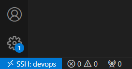
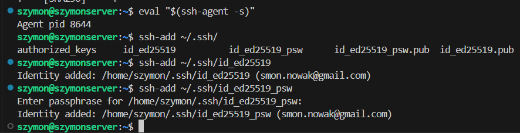
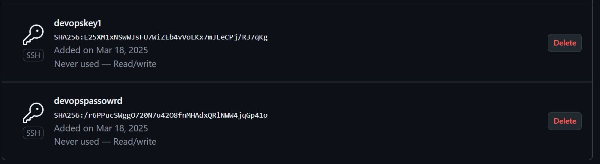
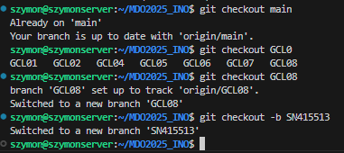

# Sprawozdanie 01

## Instalacja git i ssh
  
ssh również było zainstalowane.

## Sprawdzenie adersu ip, połączenie przez ssh
  
Na komputerze klienckim w ~/.ssh/config, dodano:
```
Host devops
  HostName 192.168.1.58
  User szymon
```
Udane połączenie przez ssh z użyciem VSC:  
  

## Sklonowanie repozytorium przez https
  
Repozytorium sklonowane przez https przeniesiono do folderu ~/https.

## Wygenerowanie dwóch kluczy, 1 bez hasła, drugi zahaślony.
  

Podczas generowania 2 klucza należy wskazać inny plik niż domyślny.


## Dodanie agenta i wygenerowanych kluczy


## Dodanie kluczy do githuba


## Sklonowanie z uzyciem ssh:


## historia
```
history:
szymon@szymonserver:~$ history
    1  ls
    2  git login
    3  ls -al
    4  cd .ssh
    5  ls
    6  touch gh
    7  nano gh
    8  ssh -T git@github.com
    9  ssh-keygen -t rsa -b 4096 -C "smon.nowak@gmail.com"
   10  eval "$(ssh-agent -s)"
   11  ssh-add ~/.ssh/gh
   12  sudo ssh-add ~/.ssh/gh
   13  chmod 600 ~/.ssh/gh
   14  ssh-add ~/.ssh/gh
   15  eval "$(ssh-agent -s)"
   16  ssh -T git@github.com
   17  sudo ssh -T git@github.com
   18  ssh-keygen -t ed25519 -C "smon.nowak@gmail.com"
   19  ssh-add ~/.ssh/id_ed25519
   20  ssh -T git@github.com
   21  cd ..
   22  git clone git@github.com:InzynieriaOprogramowaniaAGH/MDO2025_INO.git
   23  cd MDO2025_INO/
   24  ls
   25  git branch SN415513
   26  git branch -a
   27  git checkout SN415513 
   28  git clone https://github.com/InzynieriaOprogramowaniaAGH/MDO2025_INO.git
   29  ssh key-gen -t ed25519 -C "smon.nowak@gmail.com"
   30  ssh-keygen -t ed25519 -C "smon.nowak@gmail.com"
   31  eval "$(ssh-agent -s)"
   32  ssh-add ~/.ssh/id_ed25519
   33  ssh-add ~/.ssh/id_ed25519_psw
   34  ls
   35  mkdir http
   36  mv MDO2025_INO/ http/
   37  git clone git@github.com:InzynieriaOprogramowaniaAGH/MDO2025_INO.git
```

## Przełączenie się na gałąź ```main```, i utworzenie własnej gałęźi


## Rozpoczęcie pracy


## Git hook
```sh
#!/bin/bash

FILE=$1
MSG=$(cat "$FILE")

if [[ ! "$MSG" =~ ^SN415513 ]]; then
    echo "ERROR: Invalid commit message. It has to begin with 'SN415513'."
    exit 1
fi
```
## Nadanie uprawnień, konfiguracja:


## Commit, sprawdzenie dzialania hooka


## Push
