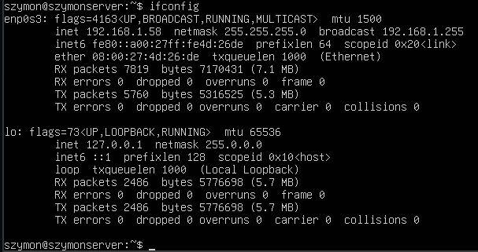
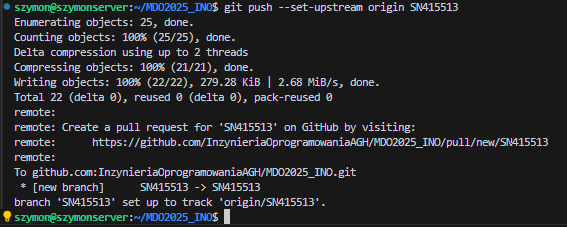

# LAB 01

## Instalacja git i ssh
  
ssh również było zainstalowane.

## Sprawdzenie adersu ip, połączenie przez ssh
  
Na komputerze klienckim w ~/.ssh/config, dodano:
```
Host devops
  HostName 192.168.1.58
  User szymon
```
Udane połączenie przez ssh z użyciem VSC:  
  

## Sklonowanie repozytorium przez https
  
Repozytorium sklonowane przez https przeniesiono do folderu ~/https.

## Wygenerowanie dwóch kluczy, 1 bez hasła, drugi zahaślony.
  

Podczas generowania 2 klucza należy wskazać inny plik niż domyślny.


## Dodanie agenta i wygenerowanych kluczy


## Dodanie kluczy do githuba


## Sklonowanie z uzyciem ssh:


## historia
```
history:
szymon@szymonserver:~$ history
    1  ls
    2  git login
    3  ls -al
    4  cd .ssh
    5  ls
    6  touch gh
    7  nano gh
    8  ssh -T git@github.com
    9  ssh-keygen -t rsa -b 4096 -C "smon.nowak@gmail.com"
   10  eval "$(ssh-agent -s)"
   11  ssh-add ~/.ssh/gh
   12  sudo ssh-add ~/.ssh/gh
   13  chmod 600 ~/.ssh/gh
   14  ssh-add ~/.ssh/gh
   15  eval "$(ssh-agent -s)"
   16  ssh -T git@github.com
   17  sudo ssh -T git@github.com
   18  ssh-keygen -t ed25519 -C "smon.nowak@gmail.com"
   19  ssh-add ~/.ssh/id_ed25519
   20  ssh -T git@github.com
   21  cd ..
   22  git clone git@github.com:InzynieriaOprogramowaniaAGH/MDO2025_INO.git
   23  cd MDO2025_INO/
   24  ls
   25  git branch SN415513
   26  git branch -a
   27  git checkout SN415513 
   28  git clone https://github.com/InzynieriaOprogramowaniaAGH/MDO2025_INO.git
   29  ssh key-gen -t ed25519 -C "smon.nowak@gmail.com"
   30  ssh-keygen -t ed25519 -C "smon.nowak@gmail.com"
   31  eval "$(ssh-agent -s)"
   32  ssh-add ~/.ssh/id_ed25519
   33  ssh-add ~/.ssh/id_ed25519_psw
   34  ls
   35  mkdir http
   36  mv MDO2025_INO/ http/
   37  git clone git@github.com:InzynieriaOprogramowaniaAGH/MDO2025_INO.git
```

## Przełączenie się na gałąź ```main```, i utworzenie własnej gałęźi


## Rozpoczęcie pracy


## Git hook
```sh
#!/bin/bash

FILE=$1
MSG=$(cat "$FILE")

if [[ ! "$MSG" =~ ^SN415513 ]]; then
    echo "ERROR: Invalid commit message. It has to begin with 'SN415513'."
    exit 1
fi
```
## Nadanie uprawnień, konfiguracja:


## Commit, sprawdzenie dzialania hooka


## Push


# LAB 02

## Instalacja Dockera

```
# Add Docker's official GPG key:
sudo apt-get update
sudo apt-get install ca-certificates curl
sudo install -m 0755 -d /etc/apt/keyrings
sudo curl -fsSL https://download.docker.com/linux/ubuntu/gpg -o /etc/apt/keyrings/docker.asc
sudo chmod a+r /etc/apt/keyrings/docker.asc

# Add the repository to Apt sources:
echo \
  "deb [arch=$(dpkg --print-architecture) signed-by=/etc/apt/keyrings/docker.asc] https://download.docker.com/linux/ubuntu \
  $(. /etc/os-release && echo "${UBUNTU_CODENAME:-$VERSION_CODENAME}") stable" | \
  sudo tee /etc/apt/sources.list.d/docker.list > /dev/null
sudo apt-get update
sudo apt-get install docker-ce docker-ce-cli containerd.io docker-buildx-plugin docker-compose-plugin
```

## Pobranie obrazów `hello-world`, `busybox`, `ubuntu`, `mysql`
```
sudo docker pull hello-world
sudo docker pull busybox
sudo docker pull ubuntu
sudo docker pull mysql
sudo docker images
```


## Uruchomienie kontenera z obrazu `busybox` i podłączenie interaktywne

```
sudo docker run -d --name busybox busybox
sudo docker run -it --name busybox_it busybox
sudo docker ps -a
```


## Uruchomienie ubuntu w kontenerze
```
sudo docker run -it --name ubuntu ubuntu /bin/bash
```
w kontenerze:
```
ps -p 1
apt update && apt upgrade -y
exit
```


procesy:
```
ps aux | grep docker
```


## Stworzenie dockerfile'a klonującego repo, uruchomienie

```
FROM ubuntu:latest

RUN apt-get update && apt-get install -y git

WORKDIR /app

RUN git clone https://github.com/InzynieriaOprogramowaniaAGH/MDO2025_INO.git
```

```
sudo docker build . -t ubuntu_image
sudo docker run -it ubuntu_image
```


## Kontenery
```
sudo docker ps -a
```


## Czyszczenie
```
sudo docker stop [nazwy obrazow]
sudo docker rm [nazwy obrazow]
```


history
160  sudo apt update
  161  # Add Docker's official GPG key:
  162  sudo apt-get update
  163  sudo apt-get install ca-certificates curl
  164  sudo install -m 0755 -d /etc/apt/keyrings
  165  sudo curl -fsSL https://download.docker.com/linux/ubuntu/gpg -o /etc/apt/keyrings/docker.asc
  166  sudo chmod a+r /etc/apt/keyrings/docker.asc
  167  # Add the repository to Apt sources:
  168  echo   "deb [arch=$(dpkg --print-architecture) signed-by=/etc/apt/keyrings/docker.asc] https://download.docker.com/linux/ubuntu \
  $(. /etc/os-release && echo "${UBUNTU_CODENAME:-$VERSION_CODENAME}") stable" |   sudo tee /etc/apt/sources.list.d/docker.list > /dev/null
  170  sudo docker pull hello-world
  171  sudo docker pull busybox
  172  sudo docker pull ubuntu
  173  sudo docker pull mysql
  174  sudo docker images
  175  docker
  176  sudo apt-get install docker-ce docker-ce-cli containerd.io docker-buildx-plugin docker-compose-plugin
  177  sudo docker run hello-world
  178  sudo docker pull hello-world
  179  sudo docker pull busybox
  180  sudo docker pull ubuntu
  181  sudo docker pull mysql
  182  sudo docker images
  183  systemctl status docker
  184  docker login
  185  docker run -d --name busy busybox
  186  sudo docker run -d --name busy busybox
  187  docker ps -a
  188  sudo docker ps -a
  189  sudo usermod -aG docker $USER
  190  docker kill 2cee522a01ab
  191  sudo docker kill 2cee522a01ab
  192  docker stop busy
  193  sudo docker stop busy
  194  sudo docker ps -a
  195  sudo docker rm busy
  196  sudo docker ps -a
  197  sudo docker rm loving_blackwell
  198  sudo docker ps -a
  199  sudo docker run busybox
  200  sudo docker ps -a
  201  sudo docker rm stoic_neumann
  202  docker ps -a
  203  sudo docker ps -a
  204  docker run -d --name busybox busybox
  205  sudo docker run -d --name busybox busybox
  206  sudo docker run -it --name busybox_it busybox
  207  docker ps -a
  208  sudo docker ps -a
  209  history | tail 10
  210  history | tail -10
  211  docker run -it --name ubuntu ubuntu /bin/bash
  212  sudo docker run -it --name ubuntu ubuntu /bin/bash
  213  ps aux | grep docker
  214  sudo docker run -it --name ubuntu ubuntu /bin/bash
  215  duso docker ps -a
  216  sudo docker ps -a
  217  docker exec ubuntu
  218  sudo docker exec -it ubuntu /bin/bash
  219  sudo docker run -it --name ubuntu ubuntu /bin/bash
  220  ls
  221  sudo docker build . -t ubuntu_image
  222  docker run -it ubuntu_image
  223  sudo docker run -it ubuntu_image
  224  docker ps -a
  225  sudo docker ps -a
  226  sudo docker stop $(sudo docker ps -q)
  227  docker stop unruffled_mclean ubuntu busybox_it busybox
  228  sudo docker stop unruffled_mclean ubuntu busybox_it busybox
  229  sudo rm stop unruffled_mclean ubuntu busybox_it busybox
  230  sudo docker rm stop unruffled_mclean ubuntu busybox_it busybox
  231  docker ps -a
  232  sudo docker ps -a
  233  history

# LAB 03

## Wybór oprogramowania na zajęcia

Wybrano repozytorium:
https://github.com/weechat/weechat  
Korzystano z instrukcji dostarczonych przez developera
https://weechat.org/files/doc/weechat/stable/weechat_user.en.html#introduction

```
git clone https://github.com/weechat/weechat.git
```


## zależoności, build programu
```
sudo apt update
sudo apt install -y gcc g++ clang cmake pkgconf libncurses-dev libcurl4-gnutls-dev libgcrypt20-dev libgnutls28-dev zlib1g-dev gettext ca-certificates libcjson-dev libzstd-dev libaspell-dev python3-dev libperl-dev ruby-dev tcl-dev guile-3.0-dev libnode-dev libxml2-dev libargon2-dev libsodium-dev asciidoctor libcpputest-dev
```


build:
```
mkdir build
cd build
cmake .. -DENABLE_PHP=OFF -DENABLE_LUA=OFF -DENABLE_TESTS=ON
make
sudo make install
```


## testy:
```
ctest -V
```


## uruchomienie alpikacji


### Build w kontenerze
```
docker run -it --name ubuntu ubuntu:latest /bin/bash
```

w kontenerze:
```
apt update
apt install -y git gcc g++ clang cmake pkgconf libncurses-dev libcurl4-gnutls-dev libgcrypt20-dev libgnutls28-dev zlib1g-dev gettext ca-certificates libcjson-dev libzstd-dev libaspell-dev python3-dev libperl-dev ruby-dev tcl-dev guile-3.0-dev libnode-dev libxml2-dev libargon2-dev libsodium-dev asciidoctor libcpputest-dev locales
```

podczas apt-installl należy wskazać strefę czasową. 
konfiguracja:
```
sudo locale-gen en_US.UTF-8

export LC_ALL=en_US.UTF-8
export LANG=en_US.UTF-8
export LANGUAGE=en_US.UTF-8
```

```
git clone https://github.com/weechat/weechat.git
cd weechat
mkdir build
cd build
cmake .. -DENABLE_PHP=OFF -DENABLE_LUA=OFF -DENABLE_TESTS=ON
make
make install
ctest -V
```


aplikacja:


	

## Dockergile do builda
```
FROM ubuntu:latest

RUN apt-get update && apt install -y git gcc g++ clang cmake pkgconf libncurses-dev libcurl4-gnutls-dev libgcrypt20-dev libgnutls28-dev zlib1g-dev gettext ca-certificates libcjson-dev libzstd-dev libaspell-dev python3-dev libperl-dev ruby-dev tcl-dev guile-3.0-dev libnode-dev libxml2-dev libargon2-dev libsodium-dev asciidoctor libcpputest-dev

WORKDIR /app
RUN git clone https://github.com/weechat/weechat.git

WORKDIR /app/weechat
RUN mkdir build
WORKDIR /app/weechat/build

RUN cmake .. -DENABLE_PHP=OFF -DENABLE_LUA=OFF -DENABLE_TESTS=ON && make && make install

```


```
docker build -t weechat-build -f Dockerfile.build .
```

## Kontener tyko do testu (bazuje na pierwszym z buildem)
```
FROM weechat-build

WORKDIR /app/weechat/build

RUN ctest -V
```

```
docker build -t weechat-test -f Dockerfile.test .
```


## Rzeczy które się działy w obu kontenerach


   

