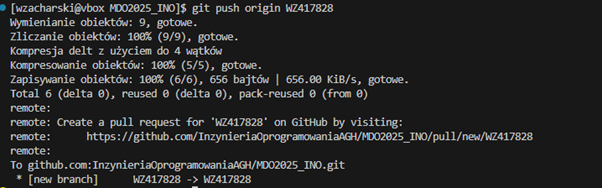
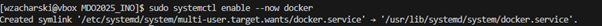
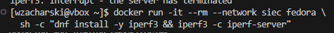

# Sprawozdanie 1
#### Wojciech Zacharski ITE gr. 8
<br>

## Laboratorium nr 1

**1. Instalacja klienta Git i obługi kluczy SSH**

Bez hasła
<br>


Z hasłem
<br>


Potwierdzenie sprarowania kluczy z gitem
<br>


Konfiguracja klucza SSH na GitHubie
<br>


Konfiguracja 2FA
<br>


**2. Sklonowanie repozytorium za pomocą HTTPS**


**3. Przełączenie na gałąź main**


**4. Utworzenie lokalnej gałęzi**


Utworzenie katalogu
<br>
<br>


**5. Praca na lokalnej gałęzi**

Utworzenie nowego git hooka
<br>


Treść git hooka
<br>
```bash
#!/bin/sh
if ! grep -q "WZ417828" "$1"; then
  echo "Commit message must start with WZ417828"
  exit 1
fi
```
Sprawdzenie poprawności działania
<br>


**6. Wypchnięcie gałęzi**



<br>

## Laboratorium nr 2

**1. Instalacja Dockera**



Dodanie użytkownika do grupy (żeby nie musieć urochamiać za pomocą sudo)
<br>


Weryfikacja czy docker jest poprwanie zainstalowany i czy działa 
```bash
[wzacharski@vbox MDO2025_INO]$ docker --version
Docker version 27.3.1, build 2.fc41
[wzacharski@vbox MDO2025_INO]$ docker run hello-world
Unable to find image 'hello-world:latest' locally
latest: Pulling from library/hello-world
e6590344b1a5: Pull complete 
Digest: sha256:bfbb0cc14f13f9ed1ae86abc2b9f11181dc50d779807ed3a3c5e55a6936dbdd5
Status: Downloaded newer image for hello-world:latest

Hello from Docker!
This message shows that your installation appears to be working correctly.

To generate this message, Docker took the following steps:
 1. The Docker client contacted the Docker daemon.
 2. The Docker daemon pulled the "hello-world" image from the Docker Hub.
    (amd64)
 3. The Docker daemon created a new container from that image which runs the
    executable that produces the output you are currently reading.
 4. The Docker daemon streamed that output to the Docker client, which sent it
    to your terminal.

To try something more ambitious, you can run an Ubuntu container with:
 $ docker run -it ubuntu bash

Share images, automate workflows, and more with a free Docker ID:
 https://hub.docker.com/

For more examples and ideas, visit:
 https://docs.docker.com/get-started/
```

Zalogowanie się do dockera
<br>
<br>


**2. Pobieranie obrazów**

Hello-world
<br>


busybox
<br>


ubuntu
<br>


fedora
<br>


mysql
<br>


**3. Odpalenie busybox**


Wywołaenie rumeru wersji
<br>


**4. Urochomienie obrazu systemu operacyjnego**

Procesy wewnątrz kontenera
<br>


Procesy hosta
<br>


Aktualizacja pakietów w konenerze
<br>


**5. Stworzenie Dockerfile**

Treść Dockerfile
<br>


Zbudowanie obrazu
```bash
$ docker build -t fedora_git .
```


Urochomienie obrazu w konenerze i sprawdzenie, czy zostało pobrane repozytorium
<br>


**6. Działające konenery**


<br>
Można również wykorzystać polecenie 
```$ sudo docker ps -a```

## Laboratorium nr 3

**1. Przygotowanie plików, na którym będzie odbywać się praca**

Sklonowanie repozytorium
<br>


Zbudowanie projektu
<br>


Uruchomienie testów
<br>


**2. Zbudwanie programu w kontenerze**

Uruchomienie kontenera
<br>


Sklonowanie repozytorium za pomocą HTTPS
<br>


Zbudowanie plików
<br>


Uruchomienie testów
<br>


**3. Utworzenie plików Dockerfile**

Plik Dockerfile_build zawierający i budujący repozytorium
<br>


Plik Dockerfile_test uruchuchamiający tesy
<br>


Zbudowanie obrazu Dockerfile_build
<br>


Zbudowanie obrazu Dockerfile_test
<br>


Uruchomienie kontenera zawierającego testy
<br>


## Laboratorium nr 4

### Zachowywanie stanu

### Zachowywanie stanu

**1. Przygotowanie woluminu wejściowego i wyjściowego**


**2. Uruchomienie kontenera**


Zainstalowanie niezbędnych narzędzi w kontenerze (bez gita)
<br>


**3. Sklonowanie repozytorium do tymczasowego kontenera i przeniesienie do woluminu wejściowego**


<br>
Ze względu na tymczasowe przeznaczenie kontenera i mały rozmiar zadania wykorzystałem obraz alpine.

**4. Zbudowanie projektu w kontenerze**

Skopiowanie plików repozytorium z woluminu wejściowego 
<br>


Zbudowanie projektu wewnątrz kontenera za pomocą make
<br>


**5. Skopiowanie zbudowanych plików do woluminu wyjściowego**


**6. Klonowanie repozytorium wewnątrz konenera**

Instalacja gita
<br>


Sklonowanie repozytorium za pomocą HTTPS do woluminu
<br>


### Eksponowanie portu

**1. Uruchomienie serwera wewnątrz kontenera**

Uruchomienie kontenera i pobranie potrzebnych narzędzi
<br>


Efekt uruchomienia kontenera
<br>


**2. Połączenie z innego kontenera**

Uruchomienie kontenera wraz z niezbędnymi zależnościami
<br>


Potwierdzenie połączenia 
<br>


**3. Połączenie za pomocą sieci ```network create```**

Utworzenie sieci
</br>


Uruchomienie kontenera serwerowego
<br>


Uruchomienie kontenera służącego do połączenia z serwerem
<br>


**4. Połączenie z hosta**


<br>
Wystąpił problem z widocznością portu. Rozwiązaniem było uruchomienie kontenera z widocznym portem
<br>


Wynik połączenia na hoście
<br>


Wynik połączenia w konenerze
<br>


**5. Instalacja Jenkinsa**

Utworzenie sieci
<br>


Uruchomienie kontener DIND (Docker in Docker)
<br>


Makefile z jenkinsem
<br>


Zbudowanie obrazu
<br>


Uruchomienie kontenera
<br>


Dodanie portu do NAT w VirtualBox
<br>


Strona logowania
<br>
