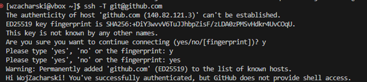
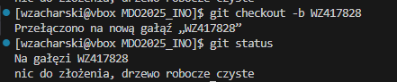

# Sprawozdanie 1
#### Wojciech Zacharski ITE gr. 10

<br>

## Laboratorium nr 1

**1. Instalacja klienta Git i obługi kluczy SSH**

Bez hasła


Z hasłem


Potwierdzenie sprarowania kluczy z gitem


Konfiguracja klucza SSH na GitHubie


Konfiguracja 2FA


**Sklonowanie repozytorium za pomocą HTTPS**


**Przełączenie na gałąź main**


**Utworzenie lokalnej gałęzi**



Utworzenie katalogu


**Praca na lokalnej gałęzi**
Utworzenie nowego git hooka


Treść git hooka
```bash
#!/bin/sh
if ! grep -q "WZ417828" "$1"; then
  echo "Commit message must start with WZ417828"
  exit 1
fi
```

