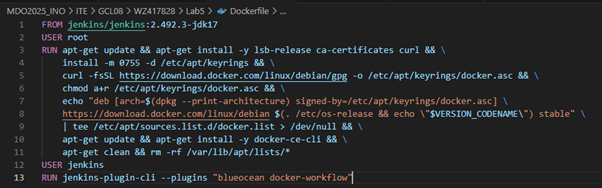
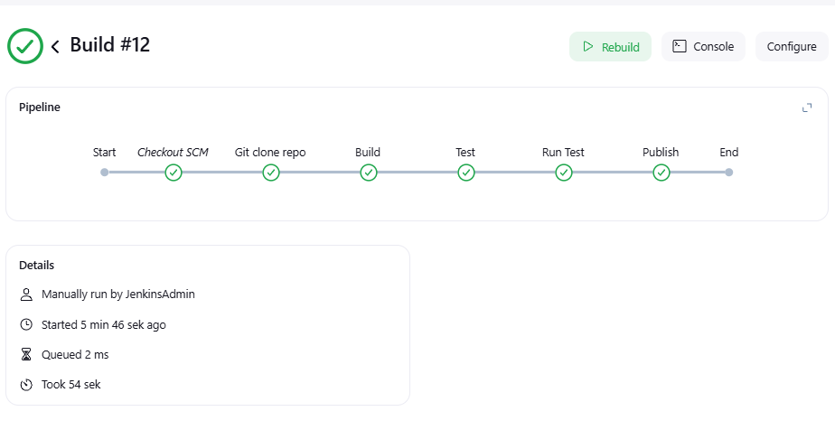

# Sprawozdanie 2
#### Wojciech Zacharski ITE gr. 8
<br>

## Laboratorium nr 5

### 1. Przygotowanie Jenkins'a

Uruchomiłem obraz dockera docekr:dind zgodnie z zaleceniami dokumentacji.<br>


Utworzyłem plik Dockerfile bluocean według dokumentacji.<br>
Posiada on rozbudowany zestaw pluginów oraz jest bardziej przystosowany do tworzenia rozwiązań pipeline.<br>
<br>

Oraz uruchomiłem kontener<br>
<br>
<br>
Ze względu na uruchamianie Jenkins'a przy okazji poprzenich zajęć miałem już skonfigurowane przekierowywanie portów NAT na VirtualBox.

Po wpisaniu w przeglądarke adresu hosta wyświetliło się pożądane UI.<br>


Wyświetlając logi kontenera za pomocą ```$ docker ps jenkins-bluocean``` natrafiłem na auomatycznie wygenerowane hasło. <br>
 <br>
<br>
To samo hasło można znaleźć pod ścieżką ```/var/jenkins_home/secrets/inititialAdminPassword``` wewnątrz kontenera z Jenkinsem.<br>


Natępnie utworzyłem konto administratora według wyświetlanych poleceń.

### 2. Zadanie wstępne: Uruchomienie 

Po zalogowaniu się na konto utworzyłem pierwszy projekt, którego zadaniem było wyświetlanie informacji o systemie operacyjnym przy użyciu polecenia ```$ uname-a```. <br>
<br>


Następny projekt zwracał błąd, gdy godzina w systemie była nieparzysta. <br>
 <br>


Kolejnym zadaniem było pobranie obrazu kontenera ubuntu za pomocą ```$ docker pull```.<br>
 <br>


### 3. Zadanie wstępne: Obiekt typu pipeline

Zadanie miało na celu utworzenie pipeline'u, który będzie kolować repozytorium oraz budować wcześniej zamieszczony plik Dockerfile. <br>

Utworzyłem pipelinie składający się z kroku ```Clone``` klonującym repozytorium oraz kroku ```Build``` budującym obraz kontenera. <br> 
```bash
pipeline {
    agent any

    stages {
        stage('Clone') {    
            steps {
                git branch: 'WZ417828', url: 'https://github.com/InzynieriaOprogramowaniaAGH/MDO2025_INO.git'
            }
        }
        stage('Build') {
            steps {
                dir("ITE/GCL08/WZ417828/Sprawozdanie1") {
                    script {
                        docker.build('bldr', '-f Dockerfile_build .')
                    }
                }
            }
        }
    }
}
```
Pierwsze uruchomienie. <br>


Drugie uruchomienie. <br>


Jak łatwo zauważyć drugie uruchomienie zajęło o wiele mniej czasu niż pierwsze. Wynika to z mechanizmu cache, który zanczanie zmniejsza czas oraz zasoby podczas wykonywania zadania. <br>


### 4. Kompletny pipeline

Zadanie polegało na utworzeniu kompletego piplinu z krokami ```build``` i ```test```. Do jego wykonania wykorzystałem repozytorium cJSON, z którego korzystałem na poprzednich zajęciach.

Z pomocą prowadzącego utworzyłem forkflow pipeline'u.<br>


Z jakiegoś powodu podcza wykonywania pipeline'u nie pobierał mi się obraz ```gcc:12```. Z informacji, które udało mi się znaleźć może wynikać, że potrzebne jest uwieżytelnianie DockerHub. <br>
<br>
Rozwiązałem ten problem korzystając z ```$ docker pull gcc:12``` na kontenerze z uruchomionym Jenkinsem.

## Etapy

**Clone**<br>
Sklonowanie mojej gałęzi ```WZ717828``` z repozytorium zajęć.

**Build** <br>
Zbudowanie obrazu kontenera z ```Dockerfile.build```, którego zadaniem jest sklonowanie plików służących do utworzenia biblioteki cJSON oraz ich kompilacja przy użyciu polecenia ```$ make all```

**Test** <br>
Zbudowanie  brazu kontenera odpowiedzialnego za pobranie z repozytoriu cJSON plików potrzebnych do testów, skopiowanie plików bibliotecznych powstałych na etapie Build i kompilację testów.

**Run Test** <br>
Uruchomienie obrazu kontenera zawierającego testy i ich wykonanie.

**Publish**<br>
Zbudowanie obrazu kontenera na podstawie pliku ```Dockerfile.rpm```, którego zadaniem jest utworzenie paczki RPM biblioteki libcjson. W tym celu do obrazu kopiowane są nagłówki i biblioteki z etapu Build oraz plik specyfikacji libcjson.spec. Następnie wewnątrz kontenera wykonywane jest polecenie ```$ rpmbuild```, które generuje paczkę .rpm. Gotowy plik zostaje skopiowany do katalogu rpm_artifacts i zarchiwizowany jako artefakt budowania w Jenkinsie.

Początkowo chciałem żeby plik libcjson.spec był tworzony dynamicznie za pomocą Dockerfile. Po wielu próbach i przy pomocy ChatGPT niestety nie udało mi się zaimplementować takiego rozwiązania. Postanowiłem więc utworzyć plik "na sztywno". <br>


Poprosiłem AI by wygenerował mi ```libcjson.spec``` oraz zmodyfikował krok 'Publish', tak żeby paczka tworzyła się bezproblemowo.<br>
**Zapytanie**: "Wygeneruj plik libcjson.spec potrzbny do utworzenia paczki RPM oraz zmodyfikuj pipeline, tak by możliwe było bezproblemowe utworzenie paczki .rpm". Oraz załączyłem treść potrzebnych plików.
W odpowiedzi dostałem plik .spec z zawartymi komentarzami, krótki opis jego dzialania i podpowiedzi dotyczących zmian w pipelinie.<br>
**Weryfikacja**: Plik .spec porównałem z przykładami dostępnymi w internecie (np. https://docs.redhat.com/fr/documentation/red_hat_enterprise_linux/9/html/packaging_and_distributing_software/an-example-spec-file-for-cello_packaging-software#an-example-spec-file-for-cello_packaging-software), a treść pipline'u za pomocą testowego uruchomienia w Jenkinsie.<br>
**Uwagi**: Odpowiedź nie uwzględniała struktury plików w repozytorium, więc konieczne było sprawdzenie i odpowiednie dopasowanie ścieżek.

```bash
pipeline {
    agent any

    environment {
        REPO_PATH = 'ITE/GCL08/WZ417828/Sprawozdanie2'
        DOCKER_IMAGE_BUILD = 'cjson-build'
        DOCKER_IMAGE_TEST = 'cjson-test'
        DOCKER_IMAGE_RPM = 'cjson-rpm'
        RPM_PACKAGE_NAME = 'libcjson'
        RPM_PACKAGE_VERSION = '1.7.18' 
        RPM_PACKAGE_RELEASE = '1'
        RPM_ARCH = 'x86_64' 
    }

    stages {
        stage('Clone'){
            steps{
                git branch: 'WZ417828', url: 'https://github.com/InzynieriaOprogramowaniaAGH/MDO2025_INO.git'
            }
        }

        stage('Build') {
            steps {
                script {
                    docker.build("${DOCKER_IMAGE_BUILD}", "-f ${REPO_PATH}/Dockerfile.build .")
                }
            }
        }

        stage('Test') {
            steps {
                script {
                    docker.build("${DOCKER_IMAGE_TEST}", "-f ${REPO_PATH}/Dockerfile.test .")
                }
            }
        }

        stage('Run Test') {
            steps {
                script {
                   sh "docker run --rm ${DOCKER_IMAGE_TEST}"
                }
            }
        }
        stage('Publish') {
            steps {
                script {
            docker.build("${DOCKER_IMAGE_RPM}", 
                "-f ${REPO_PATH}/Dockerfile.rpm ${REPO_PATH}")

            sh "mkdir -p rpm_artifacts"
            sh "docker run --rm -v \$PWD/rpm_artifacts:/out ${DOCKER_IMAGE_RPM} bash -c 'cp /root/rpmbuild/RPMS/${RPM_ARCH}/*.rpm /out/'"

            archiveArtifacts "rpm_artifacts/${RPM_PACKAGE_NAME}-${RPM_PACKAGE_VERSION}-${RPM_PACKAGE_RELEASE}.${RPM_ARCH}.rpm"
                }
            }
        }
    }
}
```


Wynikiem końcowym jest gotowa do pobrania paczka ```libcjson-1.7.18-1.x86_64.rpm```.

