# Sprawozdanie 3
#### Wojciech Zacharski ITE gr. 8
<br>

## Laboratorium nr 8

### 1. Przygotowanie maszyn i środowiska

Utworzyłem nową pomocniczą maszynę wirtualną za pomocą VirtualBox. Zainstalowałem OS płytki zawierającej system Fedora 41. 

Zainstalowanie potrzebnych programów
````bash 
$sudo dnf -y install openssh-server 
$sudo dnf -y install tar
````

Uruchomienie SSH
````bash
$sudo systemctl enable sshd
$sudo systemctl restart sshd
````

Nadanie hostname maszynie głównej i jego sprawdzenie<br>
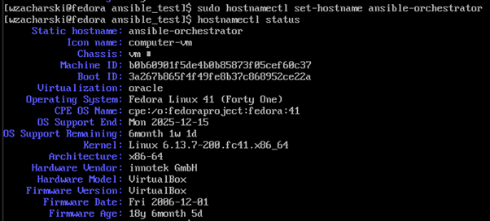

Nadanie hostname maszynie pomocniczej i jego sprawdzenie<br>
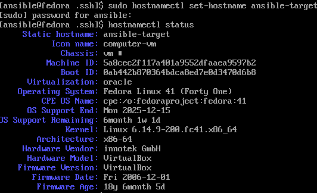

Instalacja oprogramowania ansible na głównej maszynie
````bash
$sudo dnf -y install ansible
````

Tu pojawiły się problemy, gdyż do tej pory korzystałem z usługi NAT oferowanej przez VirtualBox, ale o ile pozwalała ona na sprawne łączenie się maszyny z VSCode, to w tym przypadku uniemożliwiała połączenie między dwoma maszynami wirtualnymi.<br>
Finalnie postanowiłem skorzystać z rozwiązania Sieć NAT.

Skopiowanie klucza ssh na główną maszynę<br>
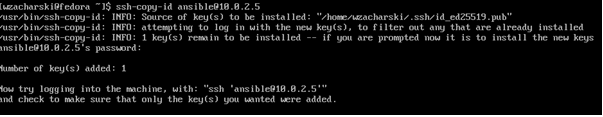

Dodanie adresów maszyn do ``/etc/hosts`` na obu maszynach.<br> 
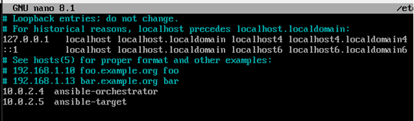

Testowy ping, by zobaczyć, czy maszyny się "widzą"<br>
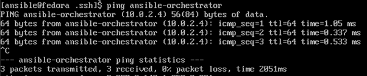
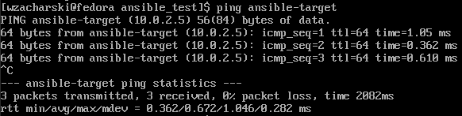

Sprawdzenie połączenia za pomocą ``ssh ansible@ansible-target``<br>
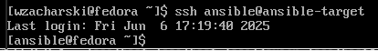<br>
Połączenie przebiegło pomyślie, a ``ansible-target`` nie prosił o hasło

### 2. Inwentaryzacja

Utworzenie pliku inventory.ini<br>
[orchestrators] - maszyny zarządzające<br>
[endpoints] - maszyny wykonujące<br>
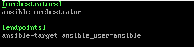

Ping wszystkich maszyn <br>
````bash
ansible all -i inventory.ini -m ping
````
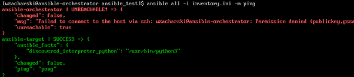<br>
Niestety próba pingowania ansible-orchestrator została zakończona niepowodzeniam.

Problem rozwiązała dyrektywa ``ansible_user=local`` pozwalająca na lokalne połącznie z maszyną<br>
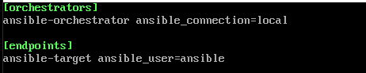<br>
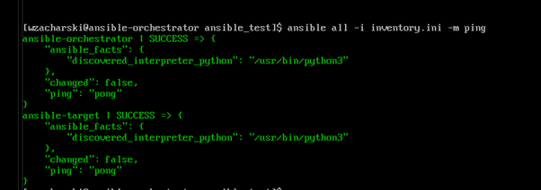

### 3. Zdalne wywoływanie procedur

Utworzenie ``playbook1.yam`` pozwalający na pingowanie wszystkich maszyn oraz lepsze zarządzanie procesem <br>
````bash
- name: Ping all hosts
  hosts: all
  gather_facts: no
  tasks:
    - name: Ping
      ansible.builtin.ping:

- name: Copy inventory.ini file to Endpoints
  hosts: endpoints
  gather_facts: no
  tasks:
    - name: Copy inventory.ini file
      ansible.builtin.copy:
        src: inventory.ini
        dest: inventory.ini

- name: Ping all hosts v2
  hosts: all
  gather_facts: no
  tasks:
    - name: Ping to compare
      ansible.builtin.ping:

- name: Update system packages on Fedora
  hosts: ansible-target
  become: yes
  tasks:
    - name: Update all packages (Fedora)
      ansible.builtin.yum:
        name: "*"
        state: latest
        update_cache: yes

- name: Restart sshd and rngd services
  hosts: all
  become: yes
  tasks:
    - name: Restart sshd
      ansible.builtin.service:
        name: sshd
        state: restarted
      ignore_errors: yes 

    - name: Restart rngd
      ansible.builtin.service:
        name: rngd
        state: restarted
      ignore_errors: yes  
````
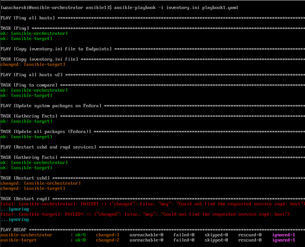<br>

Utworzenie ``playbook2.yam`` pobierającego obraz z DockerHub oraz budującego i uruchamiającego kontener z aplikacją<br>
````bash
- name: Konfiguracja dockera i nginx
  hosts: endpoints
  become: true
  tasks:
    - name: Sprawdzenie, czy python3-dnf jest zainstalwoany
      ansible.builtin.dnf:
        name: python3-dnf
        state: present

    - name: Instalacja zależności Python
      ansible.builtin.dnf:
        name: python3-requests 
        state: present

    - name: Instalacja silnika Docker
      ansible.builtin.dnf:
        name: moby-engine
        state: latest

    - name: Włączenie i uruchomienie usługi docker
      ansible.builtin.service:
        name: docker
        enabled: yes
        state: started

    - name: Pobranie obrazu Docker
      community.docker.docker_image:
        name: wojzacharski/nginx-app:1.0
        source: pull

    - name: Utworzenie kontenera Docker
      community.docker.docker_container:
        name: nginx-app
        image: wojzacharski/nginx-app:1.0
        state: started

    - name: Usunięcie kontenera Docker
      community.docker.docker_container:
        name: nginx-app
        state: absent
````

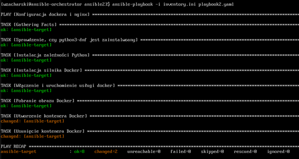

### Problemy:<br>
Podczas uruchamiania playbooków występował błąd połączenia SSH (``ansibla_playbook.log``)<br>
Problem sprowadzał się do niemożlwiości uwierzytelniena połączenia, mimo możliwości bezpośredniego połącznia się za pomocą polecenia ``ssh``. <br>
Mimo możlwiości połączenia się bez potrzeby hasła ansible nadal wymagał jego wprowadzenia. Rozwiązaniem było zastosowanie dyrektywy ansible_become_pass i wpisania hasła maszyny "na sztywno" w plik ``inventory.ini``.<br>
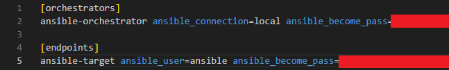

## Laboratorium nr 9

### 1. Przygotowanie pliku kickstart

Skopiowanie i umieszczenie pliku ``/root/anaconda-ks.cfg`` do repozytorium przedmiotowego na GitHubie<br>

Pierwotny plik ``anaconda-ks.cfg:``<br>
````bash
# Generated by Anaconda 41.35
# Generated by pykickstart v3.58
#version=DEVEL

# Keyboard layouts
keyboard --vckeymap=pl --xlayouts='pl'
# System language
lang en_US.UTF-8

network --bootproto=dhcp --device=link --activate --hostname=kickstart.example.com

timezone Europe/Warsaw --utc

ignoredisk --only-use=sda
clearpart --all --initlabel
autopart

# Root password
rootpw --iscrypted --allow-ssh $y$j9T$mc3CY06QdMt84pAvZsEO7w/.$wT/WvSzxVUc.Hfak8IBT4iMyCt21G99KP7mTJdrD/1/
user --groups=wheel --name=wzacharski --password=$y$j9T$wqyDOD3nPVMl0165gU78XuKS$QC1LG8PVFetDyiJWLOO/lM6q5Q2WOHBLb1Aknc1C2a3 --iscrypted --gecos="Wojciach Zacharski"

%packages
@^custom-environment
%end

firstboot --enable

````

Zmiany w pliku<br>
- dodanie linków do repozytoriów Fedora 41<br>
````bash
url --mirrorlist=http://mirrors.fedoraproject.org/mirrorlist?repo=fedora-41&arch=x86_64
repo --name=updates --mirrorlist=http://mirrors.fedoraproject.org/mirrorlist?repo=updates-released-f41&arch=x86_64
````
- dodanie dyrektyw formatowania dysku<br>
````bash
ignoredisk --only-use=sda
autopart
clearpart --all --initlabel```bash
````

- zainstalowanie potrzebnych pakieów<br>
````bash
%packages 
@^server-product-environment
wget
curl
git
gcc
make
cmake
%end
````

- rozszerzenie pliku o sekcję ``%post``<br>
````bash
# Skrypty post-installacyjne (%post)
%post --log=/root/ks-post.log

mkdir -p /home/wzacharski/cjson
cd /home/wzacharski/cjson
wget https://raw.githubusercontent.com/InzynieriaOprogramowaniaAGH/MDO2025_INO/WZ417828/ITE/GCL08/WZ417828/Sprawozdanie2/libcjson-1.7.18-1.x86_64.rpm -O cjson-1.7.18-1.x86_64.rpm
dnf install -y /home/wzacharski/cjson/cjson-1.7.18-1.x86_64.rpm

# Klonowanie repozytorium z testami
git clone https://github.com/DaveGamble/cJSON /home/wzacharski/cjson/cJSON

# Kompilacja i uruchomienie testów
cd /home/wzacharski/cjson/cJSON
make test

# Wypisanie wyników
echo "Wyniki testów cJSON:" >> /home/wzacharski/test_results.log
cat /home/wzacharski/test_results.log
````
Ponieważ w poprzednich labolatoriach korzystałem z cJSON postanowiłem umieścić w sekcji ``%post`` polecenia instalujące skompilowane pliki biblioteczne (plik .rpm jest artefaktem zbudowanym przez Jenkinsa).<br>
 Ze względu na problem z połączeniem między maszynami (występujący w Lab 8) umieściłem plik .rpm w repozytorium GitHub. <br>

Finalny plik anaconda-ks.cfg<br>
````bash
#version=DEVEL
# Generated by Anaconda

# Keyboard layouts and system language
keyboard --vckeymap=us --xlayouts='us'
lang en_US.UTF-8

# Repozytoria Fedora 41
url --mirrorlist=http://mirrors.fedoraproject.org/mirrorlist?repo=fedora-41&arch=x86_64
repo --name=updates --mirrorlist=http://mirrors.fedoraproject.org/mirrorlist?repo=updates-released-f41&arch=x86_64

# Strefa czasowa
timezone Europe/Warsaw --utc

# Ustawienia sieci
network --bootproto=dhcp --device=link --activate --hostname=kickstart.example.com

# Hasła
rootpw --iscrypted --allow-ssh $y$j9T$mc3CY06QdMt84pAvZsEO7w/.$wT/WvSzxVUc.Hfak8IBT4iMyCt21G99KP7mTJdrD/1/
user --groups=wheel --name=wzacharski --password=$y$j9T$wqyDOD3nPVMl0165gU78XuKS$QC1LG8PVFetDyiJWLOO/lM6q5Q2WOHBLb1Aknc1C2a3 --iscrypted --gecos="Wojciach Zacharski"

# Inne
firewall --enabled --service=ssh
selinux --enforcing
firstboot --disable
reboot

# Partycjonowanie
ignoredisk --only-use=sda
autopart
clearpart --all --initlabel


# Instalacja podstawowych pakietów
%packages 
@^server-product-environment
wget
curl
git
gcc
make
cmake
%end

# Skrypty post-installacyjne (%post)
%post --log=/root/ks-post.log

mkdir -p /home/wzacharski/cjson
cd /home/wzacharski/cjson
wget https://raw.githubusercontent.com/InzynieriaOprogramowaniaAGH/MDO2025_INO/WZ417828/ITE/GCL08/WZ417828/Sprawozdanie2/libcjson-1.7.18-1.x86_64.rpm -O cjson-1.7.18-1.x86_64.rpm
dnf install -y /home/wzacharski/cjson/cjson-1.7.18-1.x86_64.rpm

# Klonowanie repozytorium z testami
git clone https://github.com/DaveGamble/cJSON /home/wzacharski/cjson/cJSON

# Kompilacja i uruchomienie testów
cd /home/wzacharski/cjson/cJSON
make test

# Wypisanie wyników
echo "Wyniki testów cJSON:" >> /home/wzacharski/test_results.log
cat /home/wzacharski/test_results.log
%end
````
### 2. Instalacja nienadzorowana

Utworzenie nowej maszyny wirtualnej<br>
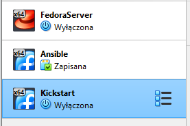

Dodanie ``inst.ks=`` do dyrektyw startowych instalatora<br> 
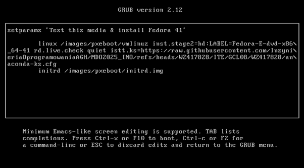

Sprawdznie logów instalatora w celu zweryfikowania działanaia i potwierdzenia wykonania testów bibliotecznych<br>
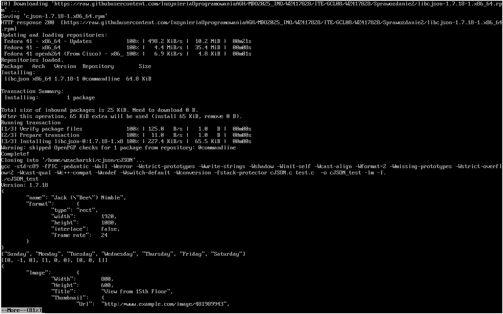


## Laboratorium nr 10

### 1. Przygotowanie kontenera z nginx


Utworznie pliku ``nginx.conf``
````bash
user  nginx;
worker_processes  auto;
error_log  /var/log/nginx/error.log warn;
pid        /var/run/nginx.pid;

events {
    worker_connections  1024;
}

http {
    include       /etc/nginx/mime.types;
    default_type  application/octet-stream;

    sendfile        on;
    keepalive_timeout  65;

    server {
        listen       80;
        server_name  localhost;

        location / {
            root   /usr/share/nginx/html;
            index  index.html;
        }

        error_page   500 502 503 504  /50x.html;
        location = /50x.html {
            root   /usr/share/nginx/html;

        }
    }
}

````

Zbudowanie obrazu<br>
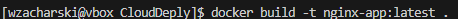

Lokalne ruchomienie kontenera z aplikacją <br>
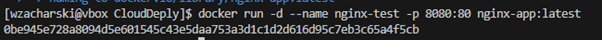

Sprawdzenie działania kontenera<br>
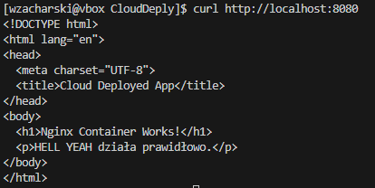


### 2. Instalacja klastra Kubernetes

Instalacja ``minicube``<br>
````bash
curl -LO https://github.com/kubernetes/minikube/releases/latest/download/minikube-linux-amd64
sudo install minikube-linux-amd64 /usr/local/bin/minikube && rm minikube-linux-amd64
````

Dodanie alisau w ``/.bashrc``<br>
````bash
alias minikubectl="minikube kubectl --"
````

### 3. Uruchomienie poda z kontenerem

Push obrazu do DockerHuba<br>
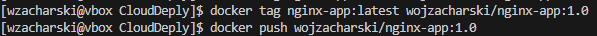

Uruchomienie poda z obrazem<br>
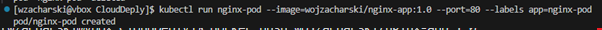

Sprawdzenie, czy pod jest uruchomiony<br>
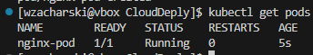

Portforwarding i sprawdzenie apliakcji w kontenerze <br>
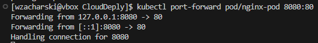<br>
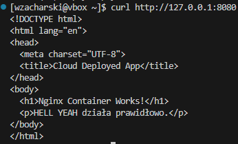

Sprawdzenie z poziomu przeglądarki <br>
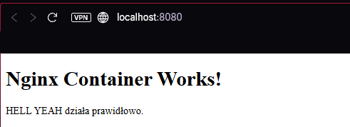

Pod widoczy jest również w dashboardzie<br>
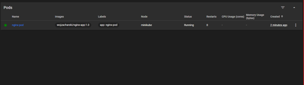


### 4. Deployment

Utworzenie deploymentu z obrazem z DockerHuba<br>
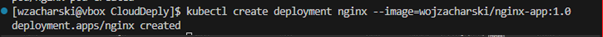

Utworzenie pliku ``nginx.yaml``<br> 
W Dashboard -> Deployments -> Nginx -> Edit i skopiowanie zawartości na lokalną maszynę<br>
ustawienie spec: -> replicas: na 5

Utworzenie deploymentu z pliku ``nginx.yaml``<br>
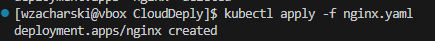

Sprawdzenie statusu deploymenty<br>
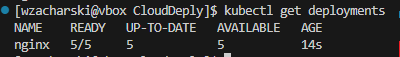
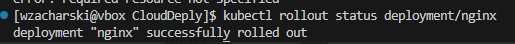
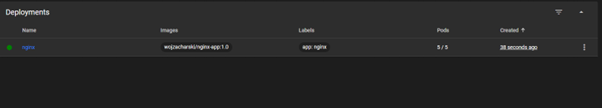


## Laboratorium nr 11

### 1. Przygotowanie różnych wersji nginx

Wersja 1.1 z niewielkimi zmianami<br>
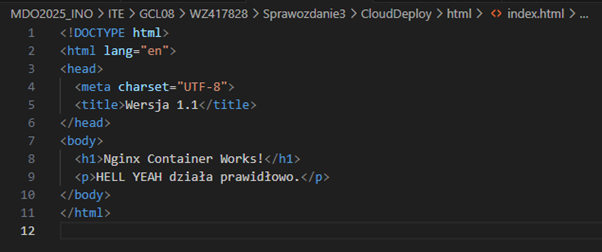

Wersja 1.2 z błędem w skłądni<br>
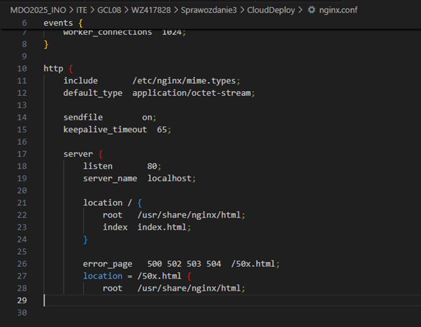

Umieszczenie obrazów na DockerHubie ``$docker push``<br>
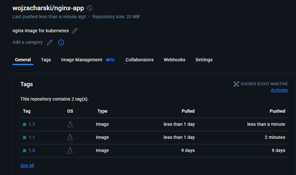

Sprawdzenie dostępności wersji<br>
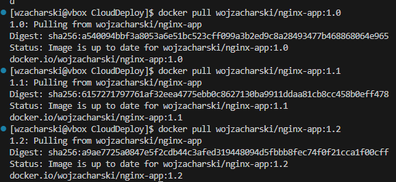

### 2. Skalowanie

(proszę nie zwracać uwagi na starego wiszącego poda)<br>

Zwiększenie ilości replik do 8<br>
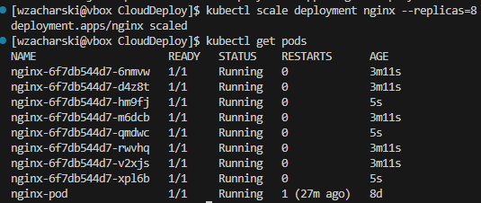

Zmniejszenie ilości replik do 1<br>
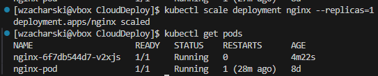

Zmniejszenie ilości replik do 0<br>
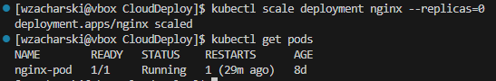

Zmniejszenie ilości replik do 4<br>
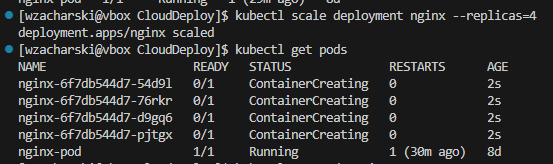

Zmiana obrazu na wersję 1.1<br>
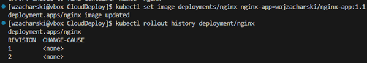
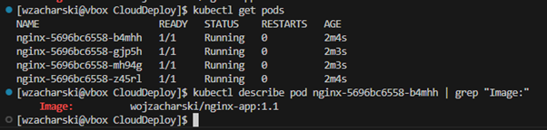

Powrót do wersji 1.0<br>
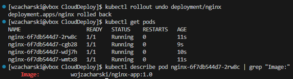

Aktualizacja do błędnej wersji 1.2<br>
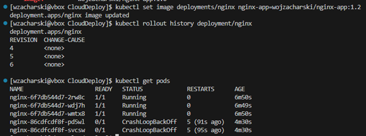<br>
Jak można zauważyć, 3 pody są uruchomione, a pozostałe 2 nie działają

Sprawdzenie wersji<br>
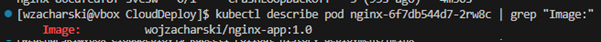<br>
<br>
Pody, które nie działają mają wersję 1.2, a te których działanie jest poprawne 1.0

Przechodząc do wersji 1.1, tworzą się nowe, działjące pody
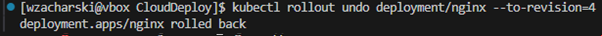<br>
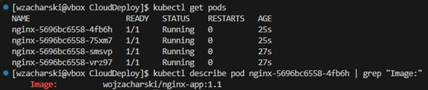

### 3. Rollout check

Skrypt sprawdzający status deploymentu<br>
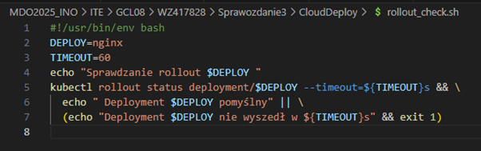

Wynik działania<br>
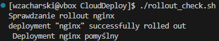

### 3. Zmiana strategii wdrożeń 

Przygotowanie pliku ``canary-nginx.yaml``<br>
````bash
apiVersion: apps/v1
kind: Deployment
metadata:
  name: nginx-canary
  labels:
    app: nginx
    version: canary
spec:
  replicas: 2  
  selector:
    matchLabels:
      app: nginx
      version: canary
  template:
    metadata:
      labels:
        app: nginx
        version: canary
    spec:
      containers:
      - name: nginx
        image: wojzacharski/nginx-app:1.0  
        ports:
        - containerPort: 80
  strategy:
    type: RollingUpdate  
    rollingUpdate:
      maxSurge: 25%    
      maxUnavailable: 25%  
---
apiVersion: v1
kind: Service
metadata:
  name: nginx-canary-service
spec:
  selector:
    app: nginx
    version: canary
  ports:
  - protocol: TCP
    port: 80
    targetPort: 80
  type: NodePort

````
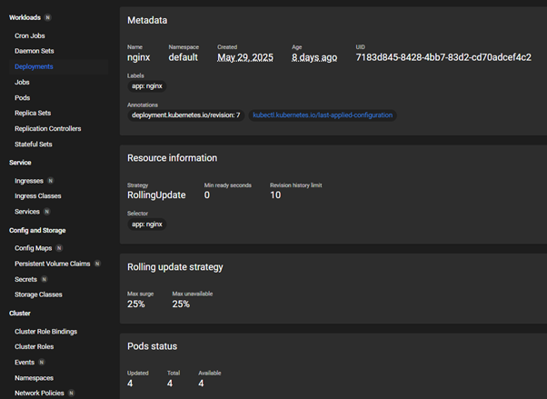

Przygotowanie pliku ``recreate-nginx.yaml``<br>
````bash
apiVersion: apps/v1
kind: Deployment
metadata:
  name: nginx-recreate
  labels:
    app: nginx
    version: stable
spec:
  replicas: 5 
  selector:
    matchLabels:
      app: nginx
      version: stable
  template:
    metadata:
      labels:
        app: nginx
        version: stable
    spec:
      containers:
      - name: nginx
        image: wojzacharski/nginx-app:0.1  
        ports:
        - containerPort: 80
  strategy:
    type: Recreate  
  revisionHistoryLimit: 10  
---
apiVersion: v1
kind: Service
metadata:
  name: nginx-recreate-service
spec:
  selector:
    app: nginx
    version: stable
  ports:
  - protocol: TCP
    port: 80
    targetPort: 80
  type: NodePort

````
Sprawdzenie wdrożenia<br>


Przygotowanie pliku ``rolling-nginx.yaml``<br>
````bash
apiVersion: apps/v1
kind: Deployment
metadata:
  name: nginx-rolling-update
  labels:
    app: nginx
    version: stable
spec:
  replicas: 5  
  selector:
    matchLabels:
      app: nginx
      version: stable
  template:
    metadata:
      labels:
        app: nginx
        version: stable
    spec:
      containers:
      - name: nginx
        image: wojzacharski/nginx-app:1.0  
        ports:
        - containerPort: 80
  strategy:
    type: RollingUpdate  
    rollingUpdate:
      maxSurge: 30%     
      maxUnavailable: 2  
  revisionHistoryLimit: 10  
---
apiVersion: v1
kind: Service
metadata:
  name: nginx-rolling-update-service
spec:
  selector:
    app: nginx
    version: stable
  ports:
  - protocol: TCP
    port: 80
    targetPort: 80
  type: NodePort

````

Sprawdzenie wdrożenia<br>

