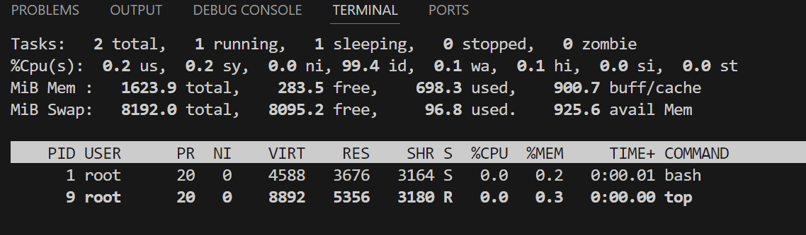

# Zajęcia 01

# Wprowadzenie, Git, Gałęzie, SSH

## Zadania do wykonania

1. Zainstaluj klienta Git i obsługę kluczy SSH

```bash
sudo dnf install git
```

2. Sklonuj [repozytorium przedmiotowe](https://github.com/InzynieriaOprogramowaniaAGH/MDO2025_INO) za pomocą HTTPS i [_personal access token_](https://docs.github.com/en/authentication/keeping-your-account-and-data-secure/managing-your-personal-access-tokens)

3. Upewnij się w kwestii dostępu do repozytorium jako uczestnik i sklonuj je za pomocą utworzonego klucza SSH, zapoznaj się [dokumentacją](https://docs.github.com/en/authentication/connecting-to-github-with-ssh/generating-a-new-ssh-key-and-adding-it-to-the-ssh-agent).
   - Utwórz dwa klucze SSH, inne niż RSA, w tym co najmniej jeden zabezpieczony hasłem
   - Skonfiguruj klucz SSH jako metodę dostępu do GitHuba
   - Sklonuj repozytorium z wykorzystaniem protokołu SSH
4. Przełącz się na gałąź `main`, a potem na gałąź swojej grupy (pilnuj gałęzi i katalogu!)
5. Utwórz gałąź o nazwie "inicjały & nr indeksu" np. `KD232144`. Miej na uwadze, że odgałęziasz się od brancha grupy!
6. Rozpocznij pracę na nowej gałęzi
   - W katalogu właściwym dla grupy utwórz nowy katalog, także o nazwie "inicjały & nr indeksu" np. `KD232144`
   - Napisz [Git hooka](https://git-scm.com/book/en/v2/Customizing-Git-Git-Hooks) - skrypt weryfikujący, że każdy Twój "commit message" zaczyna się od "twoje inicjały & nr indexu". (Przykładowe githook'i są w `.git/hooks`.)
   - Dodaj ten skrypt do stworzonego wcześniej katalogu.
   - Skopiuj go we właściwe miejsce, tak by uruchamiał się za każdym razem kiedy robisz commita.
   - Umieść treść githooka w sprawozdaniu.
   - W katalogu dodaj plik ze sprawozdaniem
   - Dodaj zrzuty ekranu (jako inline)
   - Wyślij zmiany do zdalnego źródła
   - Spróbuj wciągnąć swoją gałąź do gałęzi grupowej
   - Zaktualizuj sprawozdanie i zrzuty o ten krok i wyślij aktualizację do zdalnego źródła (na swojej gałęzi)

---

# Zajęcia 02

# Git, Docker

## Zadania do wykonania

## Zestawienie środowiska

1. Zainstaluj Docker w systemie linuksowym

```bash
sudo dnf install docker
```

2. Zarejestruj się w [Docker Hub](https://hub.docker.com/) i zapoznaj z sugerowanymi obrazami

3. Pobierz obrazy `hello-world`, `busybox`, `ubuntu` lub `fedora`, `mysql`

```bash
sudo docker pull hello-world
sudo docker pull busybox
sudo docker pull ubuntu
sudo docker pull mysql
```

4. Uruchom kontener z obrazu `busybox`
   - Pokaż efekt uruchomienia kontenera
   - Podłącz się do kontenera **interaktywnie** i wywołaj numer wersji

```bash
sudo docker run -it busybox
```

5. Uruchom "system w kontenerze" (czyli kontener z obrazu `fedora` lub `ubuntu`)
   - Zaprezentuj `PID1` w kontenerze i procesy dockera na hoście
   - Zaktualizuj pakiety
   - Wyjdź

```bash
sudo docker run -it ubuntu
```



6. Stwórz własnoręcznie, zbuduj i uruchom prosty plik `Dockerfile` bazujący na wybranym systemie i sklonuj nasze repo.
   - Kieruj się [dobrymi praktykami](https://docs.docker.com/develop/develop-images/dockerfile_best-practices/)
   - Upewnij się że obraz będzie miał `git`-a
   - Uruchom w trybie interaktywnym i zweryfikuj że jest tam ściągnięte nasze repozytorium
7. Pokaż uruchomione ( != "działające" ) kontenery, wyczyść je.
8. Wyczyść obrazy
9. Dodaj stworzone pliki `Dockefile` do folderu swojego `Sprawozdanie1` w repozytorium.

---

# Zajęcia 03

# Dockerfiles, kontener jako definicja etapu

## Zadania do wykonania

### Wybór oprogramowania na zajęcia

- Znajdź repozytorium z kodem dowolnego oprogramowania, które:
  - dysponuje otwartą licencją
  - jest umieszczone wraz ze swoimi narzędziami Makefile tak, aby możliwe był uruchomienie w repozytorium czegoś na kształt `make build` oraz `make test`. Środowisko Makefile jest dowolne. Może to być automake, meson, npm, maven, nuget, dotnet, msbuild...
  - Zawiera zdefiniowane i obecne w repozytorium testy, które można uruchomić np. jako jeden z "targetów" Makefile'a. Testy muszą jednoznacznie formułować swój raport końcowy (gdy są obecne, zazwyczaj taka jest praktyka)
- Sklonuj niniejsze repozytorium, przeprowadź build programu (doinstaluj wymagane zależności)
- Uruchom testy jednostkowe dołączone do repozytorium

### Przeprowadzenie buildu w kontenerze

Ponów ww. proces w kontenerze, interaktywnie.

1. Wykonaj kroki `build` i `test` wewnątrz wybranego kontenera bazowego. Tj. wybierz "wystarczający" kontener, np `ubuntu` dla aplikacji C lub `node` dla Node.js
   - uruchom kontener
   - podłącz do niego TTY celem rozpoczęcia interaktywnej pracy
   - zaopatrz kontener w wymagania wstępne (jeżeli proces budowania nie robi tego sam)
   - sklonuj repozytorium
   - Skonfiguruj środowisko i uruchom _build_
   - uruchom testy
2. Stwórz dwa pliki `Dockerfile` automatyzujące kroki powyżej, z uwzględnieniem następujących kwestii:
   - Kontener pierwszy ma przeprowadzać wszystkie kroki aż do _builda_
   - Kontener drugi ma bazować na pierwszym i wykonywać testy (lecz nie robić _builda_!)
3. Wykaż, że kontener wdraża się i pracuje poprawnie. Pamiętaj o różnicy między obrazem a kontenerem. Co pracuje w takim kontenerze?

### Zakres rozszerzony tematu sprawozdania

#### Docker Compose

- Zamiast ręcznie wdrażać kontenery, ujmij je w kompozycję

#### Przygotowanie do wdrożenia (deploy): dyskusje

Otrzymany kontener ze zbudowanym programem może, ale nie musi, być już końcowym artefaktem procesu przygotowania nowego wydania. Jednakże, istnieje szereg okoliczności, w których nie ma to sensu. Na przykład gdy chodzi o oprogramowanie interaktywne, które kiepsko działa w kontenerze.

Przeprowadź dyskusję i wykaż:

- czy program nadaje się do wdrażania i publikowania jako kontener, czy taki sposób interakcji nadaje się tylko do builda
- opisz w jaki sposób miałoby zachodzić przygotowanie finalnego artefaktu
  - jeżeli program miałby być publikowany jako kontener - czy trzeba go oczyszczać z pozostałości po buildzie?
  - A może dedykowany _deploy-and-publish_ byłby oddzielną ścieżką (inne Dockerfiles)?
  - Czy zbudowany program należałoby dystrybuować jako pakiet, np. JAR, DEB, RPM, EGG?
  - W jaki sposób zapewnić taki format? Dodatkowy krok (trzeci kontener)? Jakiś przykład?

---

# Zajęcia 04

# Dodatkowa terminologia w konteneryzacji, instancja Jenkins

## Zadania do wykonania

### Zachowywanie stanu

- Zapoznaj się z dokumentacją https://docs.docker.com/storage/volumes/
- Przygotuj woluminy wejściowy i wyjściowy, o dowolnych nazwach, i podłącz je do kontenera bazowego, z którego rozpoczynano poprzednio pracę
- Uruchom kontener, zainstaluj niezbędne wymagania wstępne (jeżeli istnieją), ale _bez gita_
- Sklonuj repozytorium na wolumin wejściowy (opisz dokładnie, jak zostało to zrobione)
- Uruchom build w kontenerze - rozważ skopiowanie repozytorium do wewnątrz kontenera
- Zapisz powstałe/zbudowane pliki na woluminie wyjściowym, tak by były dostępne po wyłączniu kontenera.
- Pamiętaj udokumentować wyniki.
- Ponów operację, ale klonowanie na wolumin wejściowy przeprowadź wewnątrz kontenera (użyj gita w kontenerze)
- Przedyskutuj możliwość wykonania ww. kroków za pomocą `docker build` i pliku `Dockerfile`. (podpowiedź: `RUN --mount`)

### Eksponowanie portu

- Zapoznaj się z dokumentacją https://iperf.fr/
- Uruchom wewnątrz kontenera serwer iperf (iperf3)
- Połącz się z nim z drugiego kontenera, zbadaj ruch
- Zapoznaj się z dokumentacją `network create` : https://docs.docker.com/engine/reference/commandline/network_create/
- Ponów ten krok, ale wykorzystaj własną dedykowaną sieć mostkową. Spróbuj użyć rozwiązywania nazw
- Połącz się spoza kontenera (z hosta i spoza hosta)
- Przedstaw przepustowość komunikacji lub problem z jej zmierzeniem (wyciągnij log z kontenera, woluminy mogą pomóc)
- Opcjonalnie: odwołuj się do kontenera serwerowego za pomocą nazw, a nie adresów IP

### Instancja Jenkins

- Zapoznaj się z dokumentacją https://www.jenkins.io/doc/book/installing/docker/
- Przeprowadź instalację skonteneryzowanej instancji Jenkinsa z pomocnikiem DIND
- Zainicjalizuj instację, wykaż działające kontenery, pokaż ekran logowania

## Zakres rozszerzony

### Komunikacja

- Stwórz kontener czysto do budowania (bez narzędzi do klonowania/kopiowania, bez sklonowanego repozytorium)
- Stwórz na jego bazie kontener przejściowy, który tylko buduje, wyciągnij z niego pliki po skutecznym buildzie

### Usługi w rozumieniu systemu, kontenera i klastra

- Zestaw w kontenerze ubuntu/fedora usługę SSHD, połącz się z nią, opisz zalety i wady (przypadki użycia...?) komunikacji z kontenerem z wykorzystaniem SSH

### Jenkins: zależności

- Co jest potrzebne by w naszym Jenkinsie uruchomić Dockerfile dla buildera?
- Co jest potrzebne w Jenkinsie by uruchomić Docker Compose?
