#Sprawozdanie 3

## Automatyzacja i zdalne wykonywanie poleceń za pomocą Ansible

### Instalacja zarządcy Ansible
Utworzenie nowej maszyny wirtualnej nazwanej `ansible` (w Hyper-V) oraz hostname `ansible-target`
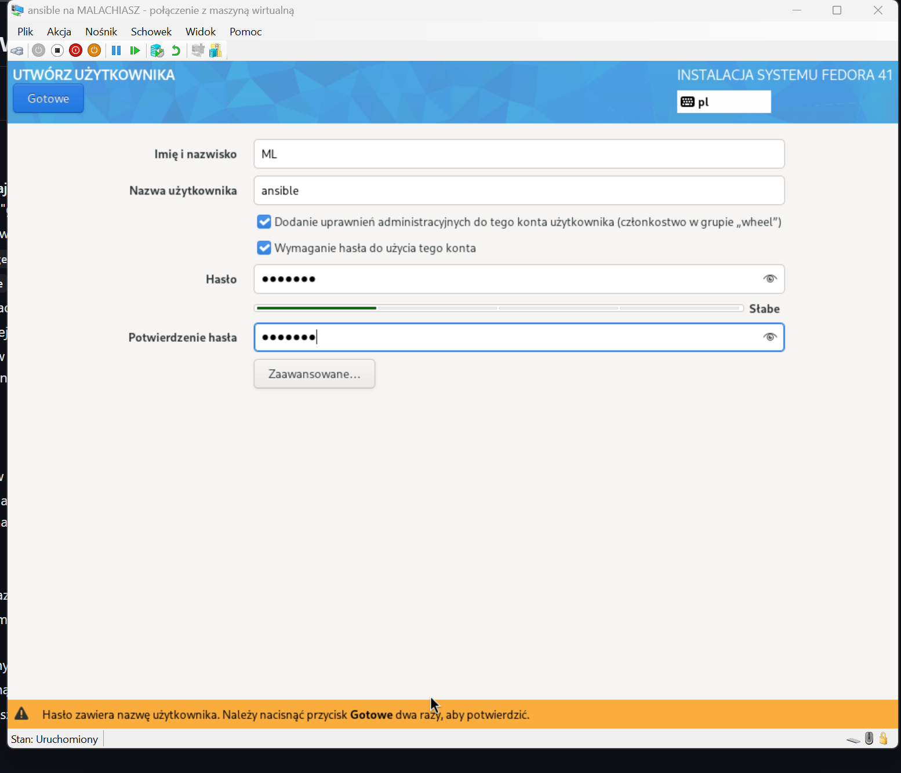
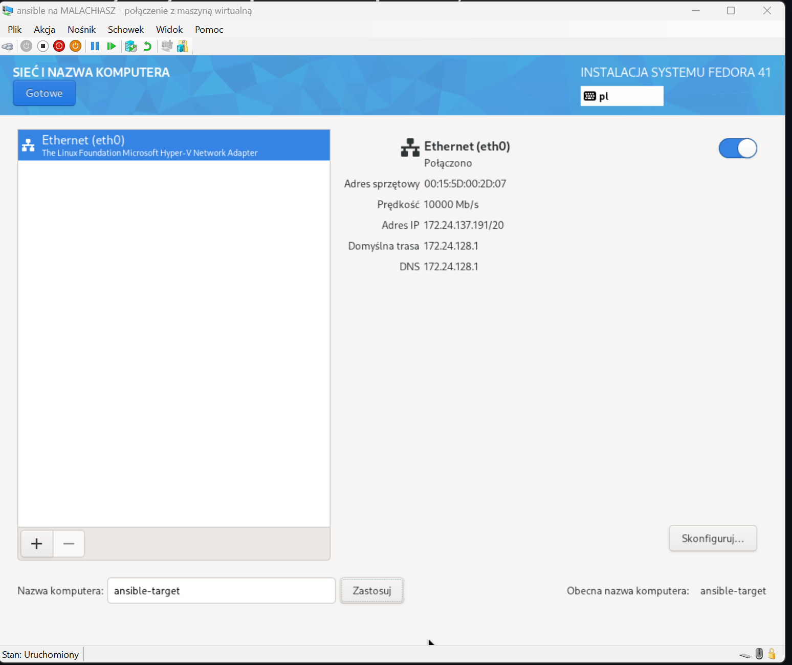


Instalacja programu `tar` oraz `openssh-server` na maszynie `ansible`:
```
sudo dnf install tar openssh-server -y
```
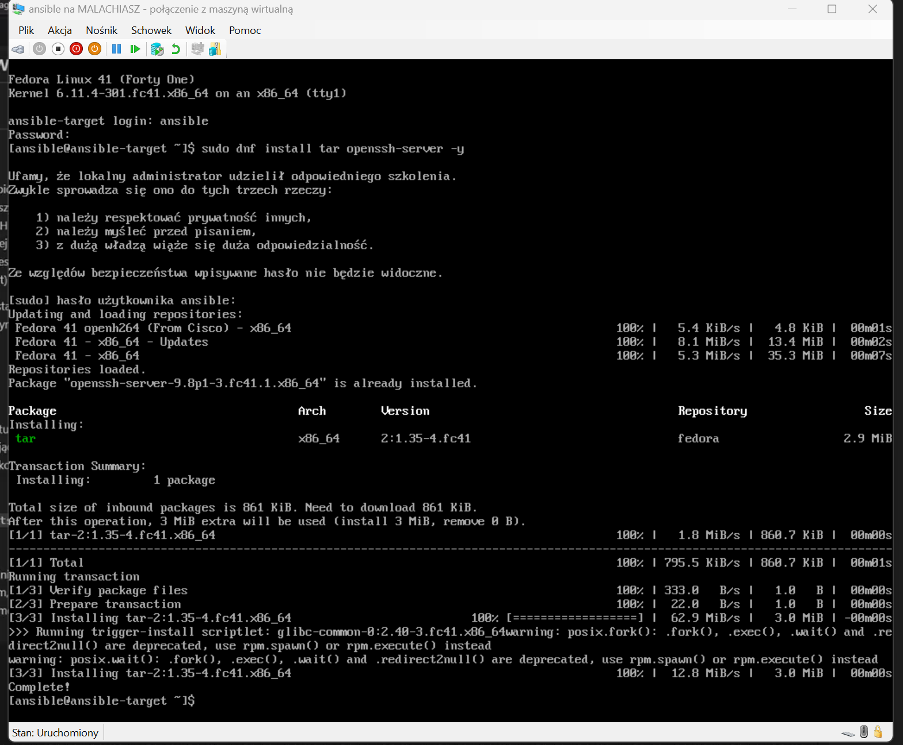

Instalacja programu `Ansible` na maszynie hoście:
```
sudo dnf install ansible -y
```
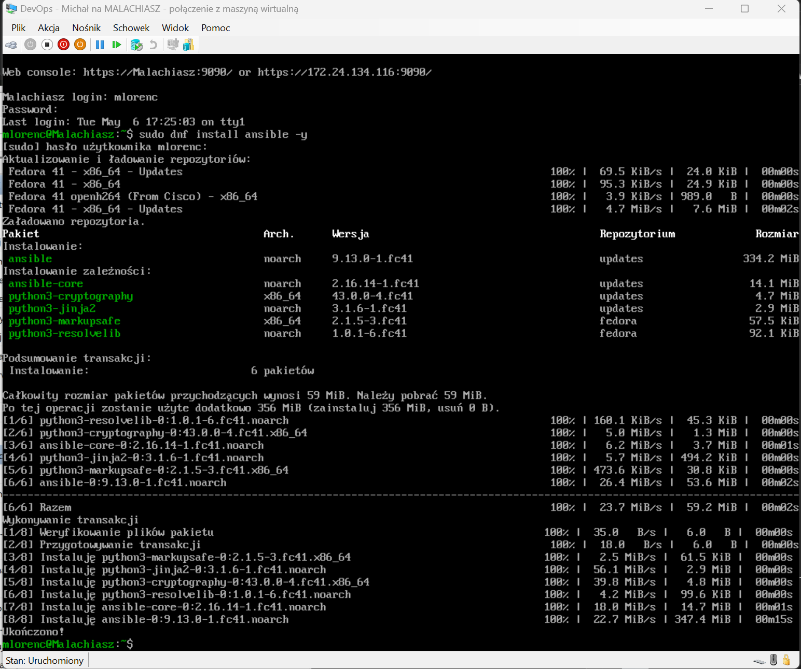


Wymiana kluczy SSH między użytkownikiem na głównej maszynie a użytkownikiem ansible, w celu wyeliminowania konieczności podawania hasła podczas logowania przez SSH. Ponieważ klucz publiczny został już utworzony wcześniej, przeprowadzono wymianę kluczy za pomocą odpowiedniego polecenia. Powstał jednak problem, gdyż system nie rozpoznawał domyślnej lokalizacji pliku z kluczem SSH. W związku z tym konieczne okazało się ręczne wskazanie ścieżki do pliku z kluczem w parametrze komendy służącej do wymiany kluczy.
```
ssh-copy-id -i ~/GitHub/sshklucz.txt.pub ansible@ansible-target
```
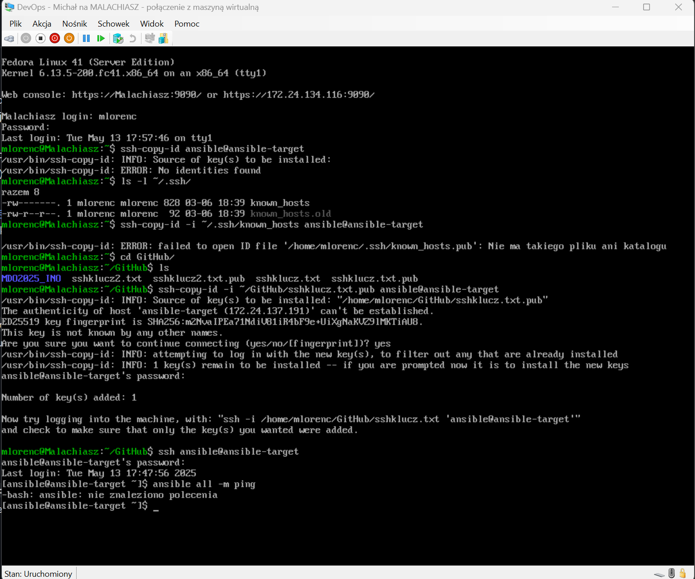
### Inwentaryzacja

Sprawdzenie połączenia pomiędzy maszynami za pomocą polecenia `ping`:
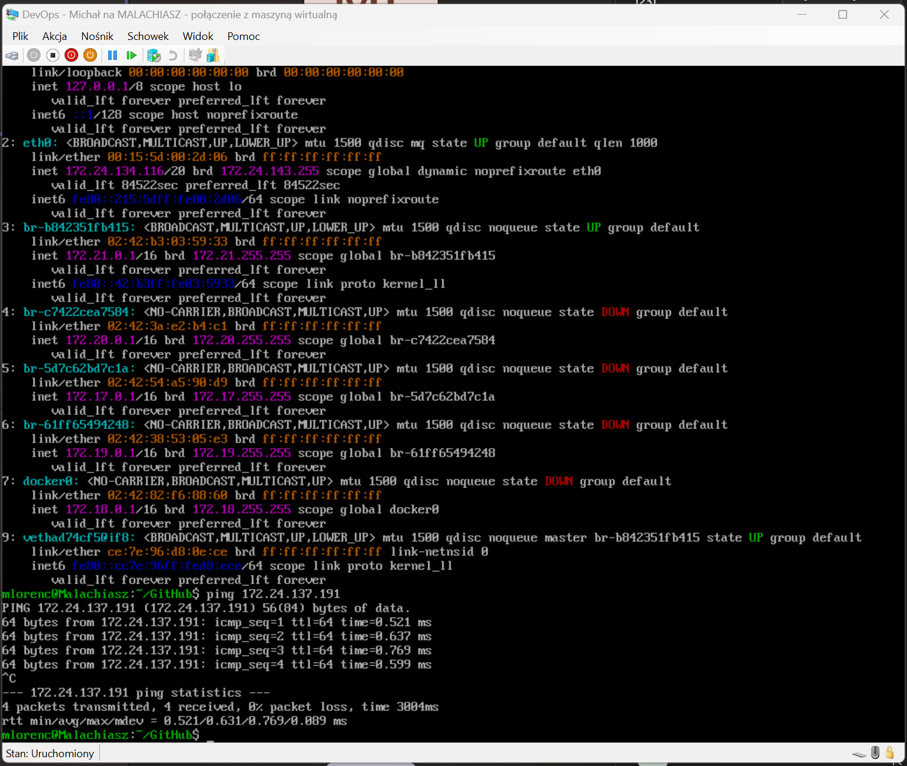
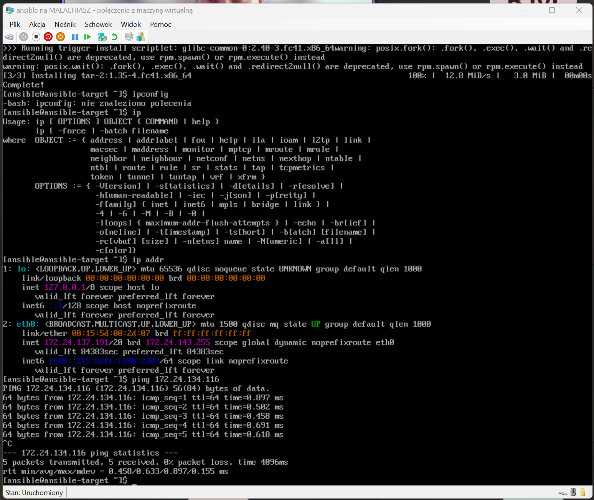

Ustawienie nazw dla maszyn wirtualnych:
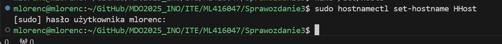
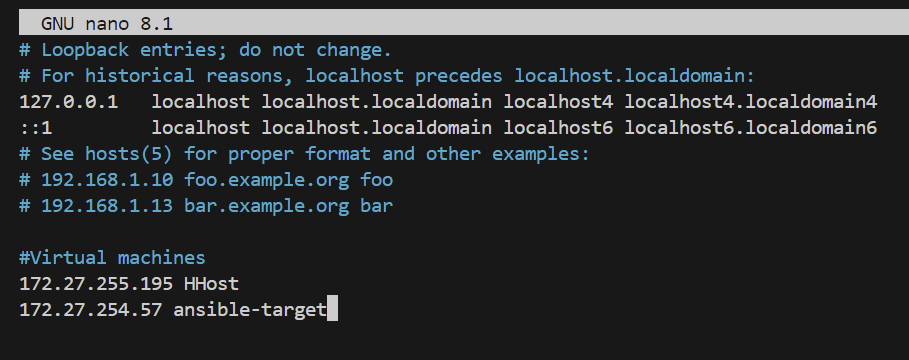
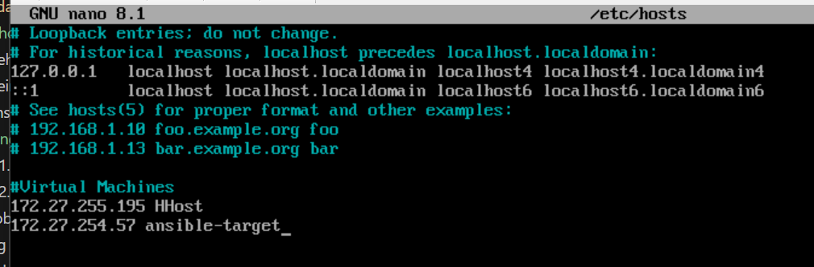

Utworzenie pliku inwentaryzacji zawierającego sekcje Orchestrators (maszyny zarządzające innymi) oraz Endpoints (maszyny docelowe). Dodano w odpowiednich sekcjach nazwy maszyn, ich adresy IP oraz nazwy użytkowników:
```
[Orchestrators]
HHost ansible_host=172.27.255.195 ansible_user=mlorenc

[Endpoints]
ansible-target ansible_host=172.27.254.57 ansible_user=ansible
```
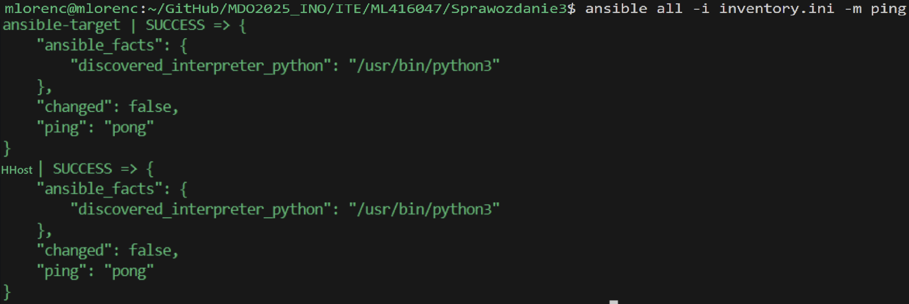


### Zdalne wywoływanie procedur
Utworzenie `playbooka`
```
- hosts: all
  become: yes
  tasks:
    - name: Ping machines
      ansible.builtin.ping:

    - name: Copy inventory file
      ansible.builtin.copy:
        src: ./inventory.ini
        dest: /tmp/inventory.ini

    - name: Update all packages
      ansible.builtin.dnf:
        name: '*'
        state: latest
        update_cache: yes

    - name: Restart sshd and rngd
      ansible.builtin.systemd:
        name: "{{ item }}"
        state: restarted
      loop:
        - sshd
        - rngd
```

Wykonanie komendy `ansible-playbook` wymagało opcji `--ask-become-pass` proszącej o hasło roota, by przeprowadzić niektóre z operacji. Z powodu różnicy w hasłach między maszynami, komendę uruchomiono dwa razy z różnymi podanymi hasłami.
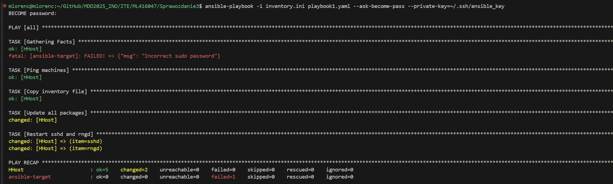
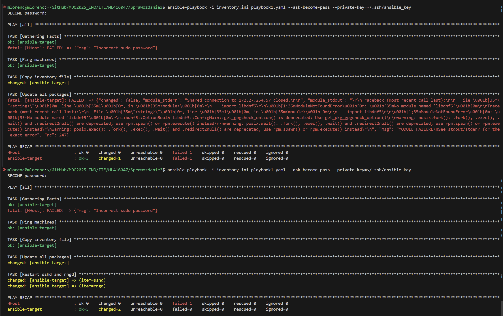

Pierwsze wywołanie dla `ansible-target` nie powiodło się w pełni z powodu braku `rngd` w systemie, doinstalowałem je za pomocą komendy:
```
sudo dnf install rng-tools
```
Pozwoliło to również na pokazanie różnicy w wynikach wywołanej komendy, gdyż pole `Copy inventory file` zmieniło status z `changed` na `ok`.

Wyłączenie serwera `ssh`:
```
sudo systemctl stop sshd
```
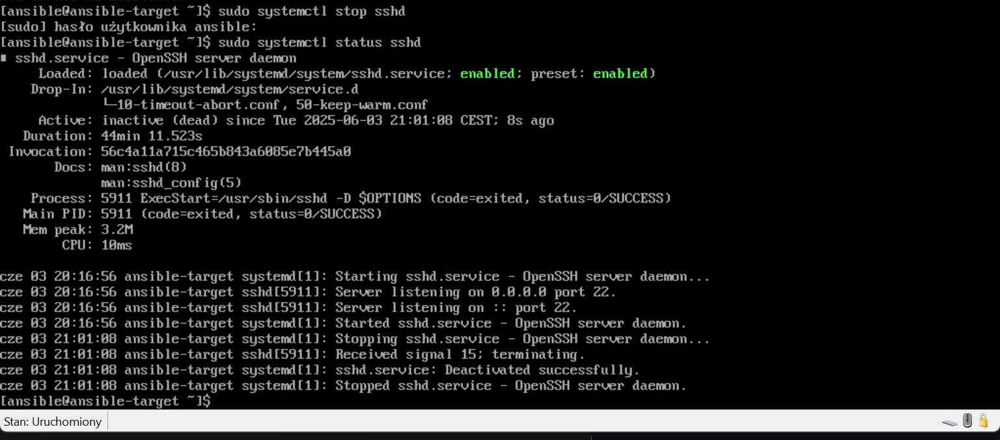


### Zarządzanie stworzonym artefaktem


Playbook:
```
---
- hosts: Endpoints
  become: yes
  tasks:
    - name: Install required system packages
      ansible.builtin.dnf:
        name:
          - python3-packaging
          - python3-pip
          - docker
          - redis
        state: present
        update_cache: yes

    - name: Install Python 'requests'
      ansible.builtin.pip:
        name: requests
        executable: pip3

    - name: Start and enable Docker service
      ansible.builtin.service:
        name: docker
        state: started
        enabled: yes

    - name: Download Docker image from DockerHub
      ansible.builtin.docker_image:
        name: mlorenc4/pipeline-redis:latest
        source: pull

    - name: Run Docker container
      ansible.builtin.docker_container:
        name: pipeline-redis
        image: mlorenc4/pipeline-redis:latest
        state: started
        ports:
          - "6379:6379"

    - name: Wait for the container to be ready
      ansible.builtin.wait_for:
        host: "ansible-target"
        port: 6379
        state: started
        delay: 10
        timeout: 60
        msg: "Redis is not available on port 6379"

    - name: Test connection to container
      command: redis-cli -h ansible-target -p 6379 ping
      register: redis_ping

    - name: Show Redis response
      debug:
        msg: "{{ redis_ping.stdout }}"

    - name: Stop and remove Docker container
      ansible.builtin.docker_container:
        name: pipeline-redis
        state: absent
        force_kill: yes
```


## Pliki odpowiedzi dla wdrożeń nienadzorowanych

Plik konfiguracyjny skopiowany z `/root/anaconda-ks.cfg`, formatuje całość swojego dysku, nazwa hosta jest ustawiona na `Malachiasz` oraz zawiera odnośniki do potrzebnych repozytoriów:
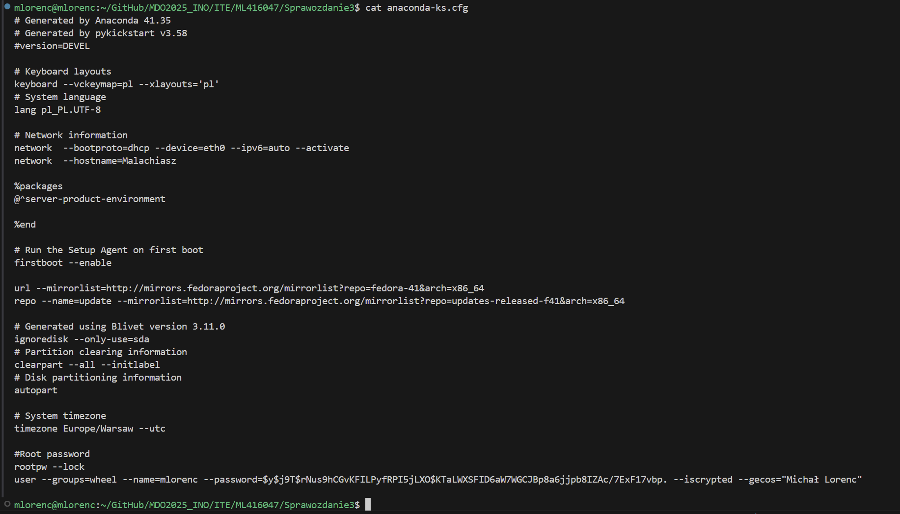


## Kubernetes

### Instalacja klastra Kubernetes

Instalacja `minikube` jako paczka RPM dzięki komendom (pobranie oraz instalacja):
```
curl -LO https://storage.googleapis.com/minikube/releases/latest/minikube-latest.x86_64.rpm
sudo rpm -Uvh minikube-latest.x86_64.rpm
```

### Analiza posiadanego kontenera


### Uruchamianie oprogramowania


### Przekucie wdrożenia manualnego w plik wdrożenia


### Przygotowanie nowego obrazu


### Zmiany w deploymencie


### Kontrola wdrożenia


### Strategie wdrożenia